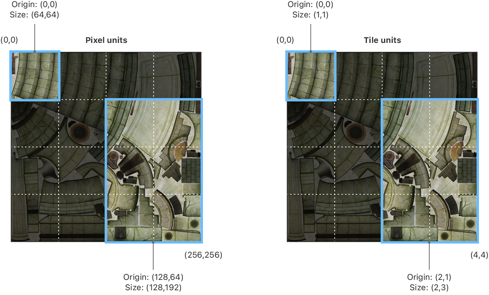

> Navigation: [Technologies](../technologies.md) · [Metal](../metal.md) · [Textures](textures.md)

# Converting between pixel regions and sparse tile regions

<sub>Article</sub>

Learn how a sparse texture’s contents are organized in memory.

## Overview

In Metal, when you create textures or copy data into or out of them, you specify sizes and regions in pixels. (Usually, this means creating [MTLSize](mtlsize.md) and [MTLRegion](mtlregion.md) structures that specify sizes and offsets in pixel units.) You still use [MTLSize](mtlsize.md) and [MTLRegion](mtlregion.md) when working with sparse textures. However, some new actions, such as mapping and unmapping of memory in sparse textures, require you to specify sizes in tile-sized units instead. Metal provides utility methods that convert between pixel measurements and tile-sized measurements.

### Determine the dimensions of a sparse tile

All sparse tiles created by a given device object have the same size in bytes. However, the number of pixels in a sparse tile varies for each texture, depending on pixel size. To get the dimensions, in pixels, of a sparse tile for a specific texture format, call the [- sparseTileSizeWithTextureType:pixelFormat:sampleCount:](<mtldevice/sparsetilesize(with_pixelformat_samplecount_).md>) method on the device object, passing in the texture format and sample count:

```swift
MTLSize tileSize = [_device sparseTileSizeWithTextureType:MTLTextureType2D
                        pixelFormat:MTLPixelFormatBGRA8Unorm
                        sampleCount:1];
```

All tiles in a texture have the same dimensions, and the texture is laid out as a grid of sparse tiles. For example, the following texture image is `256 x 256` pixels.



<sub>A figure showing tiles in a texture, specified in both pixel units and tile units. Pixel units are calculated by multiplying the dimensions in tile units by the tile dimensions. </sub>

If the tile size is `64 x 64`, to cover the texture, you need a `4 x 4` grid of sparse tiles. An [MTLRegion](mtlregion.md) in tile coordinates with an origin of `(0,0)` and a size of `(1,1)` corresponds to a pixel region with an origin of `(0,0)` and a size of `(64,64)`. Similarly, a tile region with an origin of `(2,1)` and a size of `(2,3)` corresponds to a pixel region with an origin of `(128,64)` and a size of `(128,196)`.

### Convert from pixels to tiles

To convert from a pixel region to a tile region, call the [- convertSparsePixelRegions:toTileRegions:withTileSize:alignmentMode:numRegions:](<mtldevice/convertsparsepixelregions(__totileregions_withtilesize_alignmentmode_numregions_).md>) method on a device object, as shown in the code below:

```objective-c
MTLRegion pixelRegion[1] = { MTLRegionMake2D(64, 64, 128, 128)};
MTLRegion tileRegion[1];

[_device convertSparsePixelRegions:pixelRegion
                     toTileRegions:tileRegion
                      withTileSize:tileSize
                     alignmentMode:MTLSparseTextureRegionAlignmentModeOutward
                        numRegions:1];
```

If the pixel region doesn’t precisely align to the tile size, the alignment mode parameter determines whether the tile region expands outward to encompass any partially covered tiles ([MTLSparseTextureRegionAlignmentModeOutward](mtlsparsetextureregionalignmentmode/outward.md)) or whether those partially covered regions are ignored ([MTLSparseTextureRegionAlignmentModeInward](mtlsparsetextureregionalignmentmode/inward.md)).

### Convert from tiles to pixels

Similarly, you can convert from tile units into pixel units. The resulting pixel region is always aligned to tile boundaries, so you don’t need to specify an alignment parameter.

```objective-c
[_device convertSparseTileRegions:&tileRegion
                   toPixelRegions:&pixelRegion
                     withTileSize:tileSize
                       numRegions:1];
```

## See Also

### Sparse textures

- [Managing sparse texture memory](managing-sparse-texture-memory.md) — Take direct control of memory allocation for texture data by using sparse textures.
- [Creating sparse heaps and sparse textures](creating-sparse-heaps-and-sparse-textures.md) — Allocate memory for sparse textures by creating a sparse heap.
- [Assigning memory to sparse textures](assigning-memory-to-sparse-textures.md) — Use a resource state encoder to allocate and deallocate sparse tiles for a sparse texture.
- [Reading and writing to sparse textures](reading-and-writing-to-sparse-textures.md) — Decide how to handle access to unmapped texture regions.
- [Estimating how often a texture region is accessed](estimating-how-often-a-texture-region-is-accessed.md) — Use texture access patterns to determine when you need to map a texture region.
- [MTLResourceStatePassDescriptor](mtlresourcestatepassdescriptor.md) — A configuration for a resource state pass, used to create a resource state command encoder.
- [MTLResourceStatePassSampleBufferAttachmentDescriptor](mtlresourcestatepasssamplebufferattachmentdescriptor.md) — A description of where to store GPU counter information at the start and end of a resource state pass.
- [MTLResourceStatePassSampleBufferAttachmentDescriptorArray](mtlresourcestatepasssamplebufferattachmentdescriptorarray.md) — An array of sample buffer attachments for a resource state pass.
- [MTLResourceStateCommandEncoder](mtlresourcestatecommandencoder.md) — An encoder that encodes commands that modify resource configurations.
- [MTLMapIndirectArguments](mtlmapindirectarguments.md) — The data layout for mapping sparse texture regions when using indirect commands.
