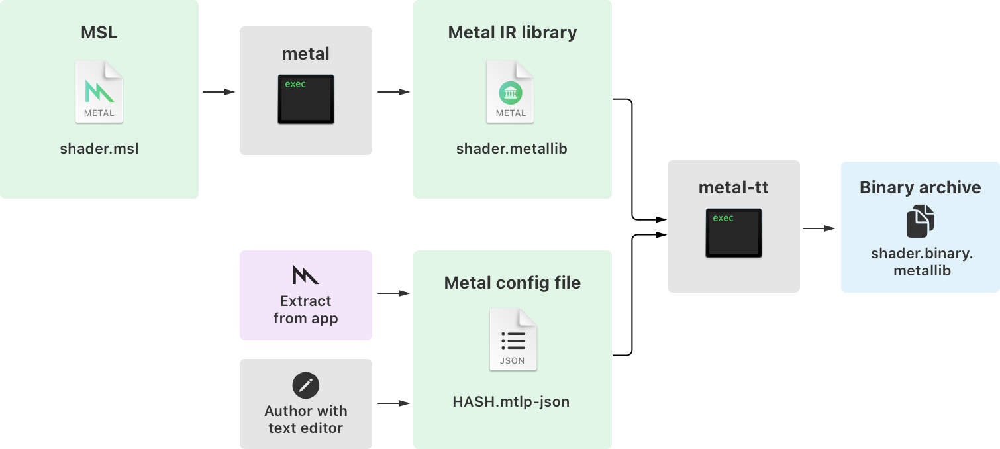
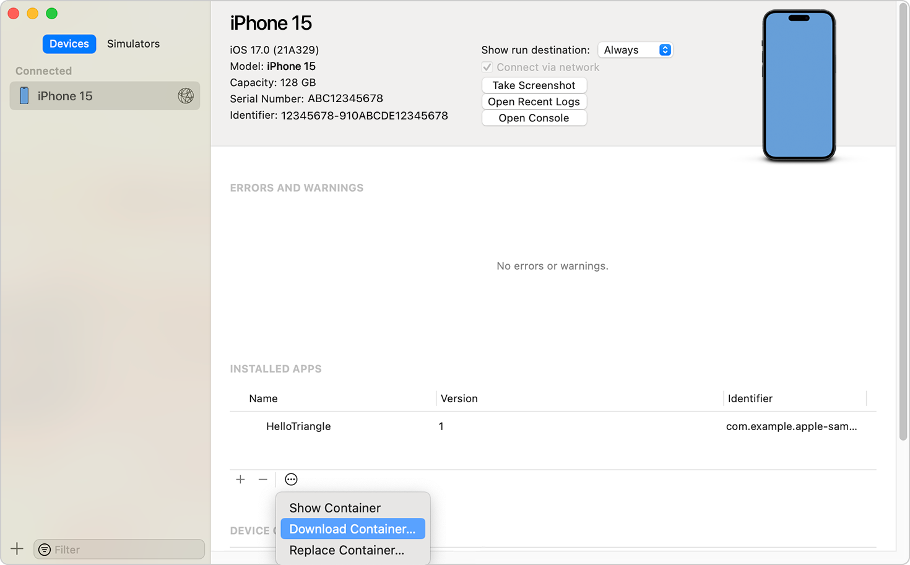

> Navigation: [Technologies](../technologies.md) · [Metal](../metal.md) · [Shader libraries](shader-libraries.md) · [Metal binary archives](metal-binary-archives.md)

# Creating binary archives from device-built pipeline state objects

<sub>Article</sub>

Write your Metal pipeline states to a binary archive at app runtime, and build binaries for any supported GPU.

## Overview

When building your shaders at runtime, Metal uses pipeline state descriptors in addition to the Metal intermediate representation (IR) it compiles from your shader functions. To build binary archives for distribution, the compiler needs some information about your app’s Metal pipelines, and a way to interpret them. When serializing a binary archive to device storage from your app, Metal includes a pipeline configuration script with it. The Metal translator is the part of the compiler that reads these configurations, and enables GPU-specific compilation for platforms other than the host GPU. Invoke the translator with the `metal-tt` command in Terminal or from a build script.



<sub>A block flow diagram of the workflow for creating Metal binary archives. At the upper left, the process starts with a shader.msl source file that flows to the metal command-line tool and the resulting Metal IR library, shader.metallib. At the bottom middle, an independent workflow shows two boxes labeled Extract from app and Author with text editor. These combine to a final configuration script named HASH.mtlp-json. At the right, the Metal IR library and Metal config boxes flow together into the metal-tt command-line tool and produce the final product of a binary archive named shader.binary.metallib.</sub>

This article explains how to serialize an [MTLBinaryArchive](mtlbinaryarchive.md) instance, extract the binary archive from an app you deploy to a device in Xcode, and provide it to the Metal translator to create GPU binaries for your project. You can use the code examples in this article with the app and shaders from the [Drawing a triangle with Metal 4](drawing-a-triangle-with-metal-4.md) sample. Another common approach is to create a small command-line tool that loads and compiles your shaders to an initial binary archive in macOS, which you can integrate as part your app’s build scripts.

> [!note] Note
> Support of specialized functions in [MTLBinaryArchive](mtlbinaryarchive.md) serialization on device requires macOS 15.0 or iOS 18.0 or later. If you’re supporting earlier OS versions, you need to manually edit the configuration script. For instructions, see [Compiling binary archives from a custom configuration script](compiling-binary-archives-from-a-custom-configuration-script.md).

### Create a Metal binary archive in your app

Create an instance of [MTLBinaryArchive](mtlbinaryarchive.md) from an [MTLBinaryArchiveDescriptor](mtlbinaryarchivedescriptor.md) with a `nil` [url](mtlbinaryarchivedescriptor/url.md) property. This instructs Metal to create, rather than load, a binary archive. After creating the archive, add all pipeline descriptors you use in your encoder to the binary archive. The following code example performs these steps for an [MTLDevice](mtldevice.md) instance named `device` and an [MTLRenderPipelineDescriptor](mtlrenderpipelinedescriptor.md) instance named `pipelineStateDescriptor`:

**Swift**

```swift
do {
    let archiveDescriptor = MTLBinaryArchiveDescriptor()
    let archive = device.makeBinaryArchive(descriptor: archiveDescriptor)
    try archive.addRenderPipelineFunctions(descriptor: pipelineStateDescriptor)
}
catch {
    print("Failed to create binary archive: \(error)")
}
```

**Objective-C**

```objective-c
MTLBinaryArchiveDescriptor *archiveDescriptor = [[MTLBinaryArchiveDescriptor alloc] init];
id<MTLBinaryArchive> archive = [_device newBinaryArchiveWithDescriptor:archiveDescriptor error:&error];
NSAssert(archive, @"Failed to create binary archive: %@", error);

BOOL success = [archive addRenderPipelineFunctionsWithDescriptor:pipelineStateDescriptor error:&error];
```

> [!tip] Tip
> If you’re adding binary archive serialization to an existing app, create your render pipeline state after creating your binary archive instance in the app. When you do, Metal can take advantage of optimizations that increase shader compilation speed, and reduce memory usage.

After adding pipeline descriptors to the binary archive, serialize it to storage. The following code example shows how to serialize an [MTLBinaryArchive](mtlbinaryarchive.md) instance to device storage:

**Swift**

```swift
fn serializeBinary(archive: MTLBinaryArchive, name: String) throws {
    var success = false;
    var directory: URL? = FileManager.default.url(for: .applicationSupportDirectory, in: .userDomainMask, appropriateFor: nil, create: true)

#if os(macOS)
    directory = URL(string: Bundle.main.bundleIdentifier, relativeTo: directory).absoluteURL;
    if directory == nil {
        throw
    }
    FileManager.default.createDirectory(at: directory, withIntermediateDirectories: true, attributes: nil)
#endif

    let url = directory.appendingPathComponent("\(name).binary.metallib"
    archive.serialize(to: url.absoluteURL)
}
```

**Objective-C**

```objective-c
-(BOOL) serializeBinaryArchive:(id<MTLBinaryArchive>)archive named:(NSString*)name error:(NSError**)error {
    BOOL success = false;

    NSURL* directory = [[NSFileManager defaultManager] URLForDirectory:NSApplicationSupportDirectory inDomain:NSUserDomainMask appropriateForURL:nil create:YES error:error];
#if TARGET_OS_OSX
    directory = [[NSURL URLWithString:[[NSBundle mainBundle] bundleIdentifier] relativeToURL:directory] absoluteURL];
    success = [[NSFileManager defaultManager] createDirectoryAtURL:directory withIntermediateDirectories:YES attributes:nil error:error];
    if (!success) {
        return NO;
    }
#endif

    NSURL* url = [directory URLByAppendingPathComponent:[NSString stringWithFormat:@"%@.binary.metallib", name]];  
    success = [archive serializeToURL:url error:error];
    return success;    
}
```

> [!note] Note
> In macOS, store resources outside your application bundle and within an appropriate directory. Storing runtime-created resources inside an application bundle can cause code-signing and verification errors when rebuilding. For more information on how to discover and diagnose these issues, see [Testing a release build](../xcode/testing-a-release-build.md).

Run your app on a device to create a Metal binary archive at the URL in your code.

### Extract the binary archive from your app

After running your app, the resulting binary archive contains a single binary slice for the GPU architecture of your target device. In macOS, you can access the archive directly on your development computer at the path `${HOME}/Library/Application Support/${BUNDLE_ID}/${LIBRARY_NAME}.binary.metallib`.

For archived binaries you produce on another type of device, retrieve them as follows:

1. Connect your device with the app that contains the archived binary to your development computer.
2. In Xcode, choose Window \> Devices and Simulators.
3. Click the Devices tab and select the device and app you want to extract the binary from.
4. Click the More (…) icon, select Download Container, and save the container to a location on your development computer.
5. In Finder, navigate to the container’s saved location, Control-click it, and select Show Package Contents to open it.
6. Copy the binary archive located at `AppData/Library/Application Support/${LIBRARY_NAME}.binary.metallib` to another directory.



<sub>A screenshot of the Devices and Simulators window in Xcode, showing a connected iPhone 15. In the pane on the right, HelloTriangle is selected in the Installed Apps section. At the bottom of the pane, the Download Container option is highlighted in the More menu.</sub>

Use `metal-lipo -archs` to inspect a binary archive and display the compiled GPU architectures. For example, a MacBook M1 Pro produces an `applegpu_g13g` binary archive.

```shell
$ xcrun -sdk macosx metal-lipo device.binary.metallib -archs
applegpu_g13g air64_v26
```

Note that binary archives still contain a Metal IR slice, `air64_v26`. Metal may invalidate binaries when upgrading a device’s operating system, and shaders recompile from the Metal IR in the archive.

### Copy and modify the configuration script

The pipeline state that Metal builds during binary serialization is a _pipeline configuration script_, a JSON file with the extension `mtlp-json`. This is the data you retrieve from the binary archive and modify to compile new binary slices. Start by extracting the Metal binaries and configuration script from the archive using the `metal-source` command-line tool in Terminal.

```shell
% xcrun metal-source -flatbuffers=json device-compiled.binary.metallib -o extracted-source
```

Within the `extracted-source` directory is the configuration script that Metal uses to drive compilation. This file has a generated name ending with the extension `mtlp-json`. Use the `find` command in Terminal to locate and copy the file to `metal-build.mtlp-json` in the current directory.

```shell
% cp $(find extracted-source -type f -name '*.mtlp-json') ./metal-build.mtlp-json
```

You also need the path to a library that contains a Metal IR slice for your shaders. Xcode compiles these shaders into the default Metal library when you build your app.

In the copied configuration script, you tell the Metal translator where to locate the Metal library from Xcode, and script a section that determines which GPUs to compile for. Open the created `metal-build.mtlp-json` file in a text editor and modify the `path` value to reference the path of your locally compiled library from Xcode.

```json
  "libraries": {
    "paths": [
      {
        "label": "1D54EB2B266CDA015BA52C746856B43364E8204D7FB39B18E0C95882F132E4C0",
        "path": "./xcode-compiled-library.metallib"
      }
    ]
  },
```

> [!note] Note
> Some shader types, such as tile shaders, require specific GPU or Metal support. For Metal translator to compile binaries of these shaders, add an `enable` key to the pipeline description and set its value to a pipeline script defining which conditions make a valid platform. For full documentation on the script format, run `man metal-pipelines-script` in Terminal.

Run the `metal-tt` command-line tool in Terminal to generate a new archived binary. The following command builds for devices running iOS 16 that support Metal 3:

```shell
% xcrun -sdk iphoneos metal-tt -target air64-apple-ios16.0 -gpu-family metal3 ./metal-build.mtlp-json -o precompiled.binary.metallib
```

> [!tip] Tip
> The `metal-config` command-line tool can provide a full set of compiler flags for `metal-tt`. For more information, run `man metal-config` in Terminal.

Any compatible device can load the `precompiled.binary.metallib` and skip runtime compilation of shaders. Running the `metal-lipo` command-line tool shows the available architectures.

```shell
% xcrun metal-lipo ./precompiled.binary.metallib -archs
applegpu_g12p applegpu_g13p applegpu_g13g applegpu_g14p applegpu_g14g applegpu_g16p applegpu_g15p
```

### Add your compiled binary archive to your app

To use this newly created Metal binary archive, you need to add it to your Xcode project’s bundle resources. Add the `precompiled.binary.metallib` archive to your project’s Copy Bundle Resources build phase. For instructions, see [Customizing the build phases of a target](../xcode/customizing-the-build-phases-of-a-target.md).

For Metal to take advantage of precompiled binaries, load them with [- newBinaryArchiveWithDescriptor:error:](<mtldevice/makebinaryarchive(descriptor_).md>) and provide an [MTLBinaryArchiveDescriptor](mtlbinaryarchivedescriptor.md) with a [url](mtlbinaryarchivedescriptor/url.md) pointing to the binary archive. Then add them to a pipeline descriptor instance’s [binaryArchives](mtlrenderpipelinedescriptor/binaryarchives.md) property.

**Swift**

```swift
let archiveDescriptor = MTLBinaryArchiveDescriptor()
archiveDescriptor.url = Bundle.main.url(forResource: "precompiled.binary", withExtension: "metallib", subdirectory: nil)
if archiveDescriptor.url == nil {
    // Throw an appropriate error for your app failing to locate the binary archive.
}

let archive = device.makeBinaryArchive(descriptor: archiveDescriptor)
pipelineDescriptor.binaryArchives.append(archive)
```

**Objective-C**

```objective-c
MTLBinaryArchiveDescriptor* archiveDescriptor = [[MTLBinaryArchiveDescriptor alloc] init];
archiveDescriptor.url = [[NSBundle main] URLForResource:@"precompiled.binary" withExtension:@"metallib" subdirectory:nil];
if (archiveDescriptor.url == nil) {
    // Handle failing to load the binary archive.
}

id<MTLBinaryArchive> archive = [device newBinaryArchiveWithDescriptor:archiveDescriptor error:error];
if (archive == nil) {
    // Handle failing to load the binary archive.
}

pipelineDescriptor.binaryArchives = [pipelineDescriptor.binaryArchives arrayByAddingObject:archive];
```

> [!tip] Tip
> Failing to load a binary archive isn’t a fatal error in Metal, and it falls back on the compilation of Metal IR at runtime. To cause a failure from the Metal system when an expected binary archive doesn’t load, configure your pipeline with an [MTLPipelineOption](mtlpipelineoption.md) of [MTLPipelineOptionFailOnBinaryArchiveMiss](mtlpipelineoption/failonbinaryarchivemiss.md).

## See Also

### Working with Metal binary archives

- [Manipulating Metal binary archives](manipulating-metal-binary-archives.md) — Split precompiled binaries into individual slices, and combine them back together for targeted distribution.
- [Compiling binary archives from a custom configuration script](compiling-binary-archives-from-a-custom-configuration-script.md) — Define how the Metal translator builds binary archives without precompiled binaries as a starting source.
