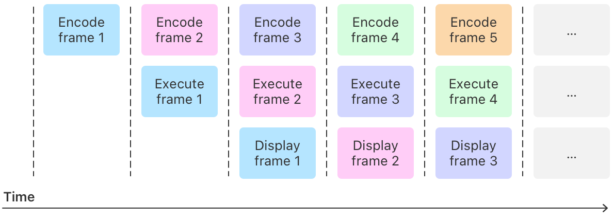

> Navigation: [Technologies](../technologies.md) · [Metal](../metal.md)

# Drawing a triangle with Metal 4

<sub>Sample Code</sub>

Render a colorful, rotating 2D triangle by running draw commands with a render pipeline on a GPU.

## Overview

This sample demonstrates how to render imagery by sending commands to the GPU with the Metal 4 API, and relates to WWDC25 session 205: [Discover Metal 4](https://developer.apple.com/wwdc25/205).

[A short video of a slowly rotating triangle on a dark background. The triangle's fill is a color gradient between its three corners, which are red, green, and blue](https://docs-assets.developer.apple.com/published/72797498a6891f381eb54d8b157a4be2/drawing-a-triangle-with-metal-4.mp4)

Multiple times a second, the sample’s app displays a colorful triangle by:

1. Updating the vertex data for the triangle
2. Encoding draw commands as a _frame_ of visual content
3. Running the draw commands on a Metal device that represents an Apple silicon GPU
4. Updating the display after the GPU finishes rendering that frame

Apps can give a person the impression of motion by rendering and displaying frames at a sufficient frequency, typically at 60 frames or more per second.

The renderer encodes one frame at a time, and has three frames of content in flight at the same time. Starting when the first frame is visible on the display, the renderer is continually managing three frames at once:

- The first frame is in its final lifetime phase as the frame that’s visible to a person on the device’s display.
- The second frame is in its second lifetime phase where the GPU renders it in a _render pass_, which is the collection of render commands that draw the triangle.
- The third frame is in its first lifetime phase where the renderer encodes the draw commands for the next render pass by using the Metal API on the CPU.

The renderer manages the frames as each progresses through its three lifetime phases. The diagram below illustrates how the first frames move through time, where each column represents a snapshot of the app’s current frames and their states:



<sub>A timeline diagram that shows how frames progress through their lifetime phases by dividing time into vertical columns, each of which represents a snapshot in time as they flow from left to right. The first column has one box with the label “encode frame 1”. The second column has two boxes with the labels “encode frame 2” and “execute frame 1”. The third column has three boxes with the labels “encode frame 3”, “execute frame 2” and “display frame 1”. The next two columns continue the pattern with three boxes each, where column five has the labels “encode frame 5”, “execute frame 4”, and “display frame 3”. The final, right-most column has three boxes, each with an ellipsis that indicates the pattern continues indefinitely.</sub>

### Create a renderer

The sample implements two separate renderer classes and the app creates a new instance of the one that’s appropriate for the system it’s running on. The two classes are:

- `Metal4Renderer`, a renderer class that works with the Metal 4 API
- `MetalRenderer`, a renderer class that works with previous Metal API versions

The app checks whether the system supports Metal 4 by calling [- supportsFamily:](<mtldevice/supportsfamily(__).md>) in the `MetalKitViewDelegate` class.

**MetalKitViewDelegate.m**

```objective-c
if ([view.device supportsFamily:MTLGPUFamilyMetal4]) {
    // Create a Metal 4 renderer instance for the app's lifetime.
    renderer = [[Metal4Renderer alloc] initWithMetalKitView:view];

    return self;
}
```

The app creates a Metal 4 renderer if the operating system supports [MTLGPUFamilyMetal4](mtlgpufamily/metal4.md); otherwise it creates an instance of the other renderer, which supports previous versions of Metal.

**MetalKitViewDelegate.m**

```objective-c
// Create a Metal renderer instance for the app's lifetime.
renderer = [[MetalRenderer alloc] initWithMetalKitView:view];
```

The two renderers are identical in their behavior, but they use different Metal API generations to submit the same render commands to the GPU.

> [!note] Note
> You may only need to implement a renderer that supports one Metal API depending on the platforms and devices you want your app to support.

### Create long-term resources

The Metal 4 renderer’s initializer starts by creating an instance of [MTL4CommandQueue](mtl4commandqueue.md), [MTL4CommandBuffer](mtl4commandbuffer.md), and [MTLLibrary](mtllibrary.md) with the view’s [MTLDevice](mtldevice.md).

**Metal4Renderer.m**

```objective-c
// Retrieve the Metal device instance from the view.
_device = view.device;

// Create a command queue from the device.
commandQueue = [self.device newMTL4CommandQueue];

// Create the command buffer from the device.
commandBuffer = [self.device newCommandBuffer];

// Create a default library instance, which contains the project's shaders.
_defaultLibrary = [self.device newDefaultLibrary];
```

Generally, you send work to the GPU by encoding commands into a command buffer, and then submitting one or more command buffers to a queue. Your app can have multiple command buffers and queues, but the sample’s `Metal4Renderer` class needs only one of each.

The initializer creates other resources the renderer needs by calling helper methods.

**Metal4Renderer.m**

```objective-c
// Create the essential resources.
triangleVertexBuffers = [self makeTriangleDataBuffers:kMaxFramesInFlight];
argumentTable = [self makeArgumentTable];
residencySet = [self makeResidencySet];
commandAllocators = [self makeCommandAllocators:kMaxFramesInFlight];

viewportSizeBuffer = [self.device newBufferWithLength:sizeof(viewportSize)
                                              options:MTLResourceStorageModeShared];
```

The renderer defines `kMaxFramesInFlight` near the top of its primary source file.

**Metal4Renderer.m**

```objective-c
/// The number of frames the renderer works with at the same time.
#define kMaxFramesInFlight 3
```

The sample applies this constant when it creates separate instances of the resources the renderer needs for each in-flight frame, which includes the buffers that store a triangle’s geometry and color information.

**Metal4Renderer.m**

```objective-c
/// An array of buffers, each of which stores the geometric position and color
/// data of a triangle's three vertices for one frame.
///
/// The renderer sends one of these buffers, per frame, as an input to the vertex shader.
NSArray<id<MTLBuffer>> *triangleVertexBuffers;
```

Most of the helper methods that create the renderer’s long-term resources at launch are relatively short. For example, the `makeTriangleDataBuffers:` method creates `kMaxFramesInFlight` instances of [MTLBuffer](mtlbuffer.md) because each in-flight frame needs a separate buffer to store its triangle vertex data.

**Metal4Renderer+Setup.m**

```objective-c
/// Creates new buffer instances for triangle data from the renderer's device
/// and returns them in a new array.
/// - Parameter count: The number of buffers the method creates.
- (nonnull NSArray<id<MTLBuffer>> *) makeTriangleDataBuffers:(NSUInteger) count
{
    NSMutableArray<id<MTLBuffer>> *bufferArray;
    bufferArray = [[NSMutableArray alloc] initWithCapacity:count];
    for (uint bufferNumber = 0; bufferNumber < count; bufferNumber += 1) {
        id<MTLBuffer> buffer;
        // Create the buffer that stores the triangle's vertex data.
        buffer = [self.device newBufferWithLength:sizeof(TriangleData)
                                          options:MTLResourceStorageModeShared];

        [self check:buffer name:@"buffer" number:bufferArray.count error:nil];
        [bufferArray addObject:buffer];
    }

    return bufferArray;
}
```

Creating a separate buffer instance for each in-flight frame eliminates the possibility of modifying a buffer for a later frame before or as the GPU reads from the same buffer to render an earlier frame.

The `makeArgumentTable` method creates just a single argument table that the renderer can reuse each time it encodes render commands into a render pass the GPU eventually runs. You set the resource bindings for any pass you encode with an [MTL4CommandBuffer](mtl4commandbuffer.md), including compute and render passes, by configuring an [MTL4ArgumentTable](mtl4argumenttable.md) instance.

**Metal4Renderer+Setup.m**

```objective-c
/// Creates a new argument table from the renderer's device that stores two arguments.
- (id<MTL4ArgumentTable>) makeArgumentTable
{
    NSError *error = nil;

    // Configure the settings for a new argument table with two buffer bindings.
    MTL4ArgumentTableDescriptor *argumentTableDescriptor;
    argumentTableDescriptor = [MTL4ArgumentTableDescriptor new];
    argumentTableDescriptor.maxBufferBindCount = 2;

    // Create the argument table.
    id<MTL4ArgumentTable> argumentTable;
    argumentTable = [self.device newArgumentTableWithDescriptor:argumentTableDescriptor
                                                          error:&error];

    [self check:argumentTable name:@"argument table" number:-1 error:error];
    return argumentTable;
}
```

Each argument table can store bindings to instances of various resource types, including:

- [MTLBuffer](mtlbuffer.md)
- [MTLTexture](mtltexture.md)
- [MTLTensor](mtltensor.md)
- [MTLSamplerState](mtlsamplerstate.md)
- [MTLAccelerationStructure](mtlaccelerationstructure.md)

For this sample, the argument table only needs to store two buffer bindings, one for the buffer that stores vertex triangle data, and another buffer that stores the viewport’s width and height.

> [!tip] Tip
> You can help minimize an app’s memory footprint by reducing the number of binding entries in an argument table to what your renderer needs.

The `makeResidencySet` and `makeCommandAllocators:` methods create a single [MTLResidencySet](mtlresidencyset.md) instance, and an [MTL4CommandAllocator](mtl4commandallocator.md) instance for each in-flight frame, respectively.

The end of the initializer configures the renderer’s initial state so that it’s ready to render the first frame when the system requests it.

**Metal4Renderer.m**

```objective-c
// Set the frame number to `0`, which sets up the first frame to get the number `1`.
frameNumber = 0;

// Create a shared event that starts at zero.
sharedEvent = [self.device newSharedEvent];
sharedEvent.signaledValue = frameNumber;
```

The initializer adds two residency sets to the renderer’s command queue:

- The long-term residency set, which the renderer configures to track all of its [MTLBuffer](mtlbuffer.md) instances
- The view’s residency set, which MetalKit configures

**Metal4Renderer.m**

```objective-c
// Add the viewport size buffer to the residency set.
[residencySet addAllocation:viewportSizeBuffer];

// Add the buffers that store the triangle vertex data to the residency set.
for (id<MTLBuffer> triangleVertexBuffer in triangleVertexBuffers) {
    [residencySet addAllocation:triangleVertexBuffer];
}

// Apply the updates to the residency set.
[residencySet commit];

// Make the resources in the long-term residency set accessible to the GPU
// when it runs any command buffer the app submits to the command queue.
[commandQueue addResidencySet:residencySet];

// Make the resources in the view's residency set accessible to the GPU
// when it runs any command buffer the app submits to the command queue.
[commandQueue addResidencySet:((CAMetalLayer *)view.layer).residencySet];

// Initialize the renderer with the view's drawable size.
[self updateViewportSize:view.drawableSize];
```

See [Simplifying GPU resource management with residency sets](simplifying-gpu-resource-management-with-residency-sets.md) for more information about working with residency sets.

### Create a render pipeline

The renderer’s `compileRenderPipeline:` method creates a render pipeline by configuring an [MTL4RenderPipelineDescriptor](mtl4renderpipelinedescriptor.md) instance and passing it to an [MTL4Compiler](mtl4compiler.md) instance’s [newRenderPipelineStateWithDescriptor:compilerTaskOptions:error:](mtl4compiler/newrenderpipelinestatewithdescriptor_compilertaskoptions_error_.md) method.

**Metal4Renderer+Compilation.m**

```objective-c
/// Creates the renderer's pipeline state that works with a specific pixel format.
///
/// - Parameter colorPixelFormat: A pixel size and layout configuration the
/// method applies to the render pipeline it compiles.
- (id<MTLRenderPipelineState>) compileRenderPipeline:(MTLPixelFormat) colorPixelFormat
{
    /// A Metal 4 compiler instance with a default configuration.
    id<MTL4Compiler> compiler = [self createDefaultMetalCompiler];

    /// A configuration for the render pipeline the method compiles.
    MTL4RenderPipelineDescriptor *descriptor;
    descriptor = [self configureRenderPipeline: colorPixelFormat];

    /// An optional configuration that stores references to binary archives.
    MTL4CompilerTaskOptions *compilerTaskOptions;
    compilerTaskOptions = [self configureCompilerTaskOptions];

    /// A reference to an error instance the compiler assigns
    /// if it can't compile the render pipeline.
    NSError *error = nil;

    // Compile a render pipeline state.

    id<MTLRenderPipelineState> renderPipelineState;
    renderPipelineState = [compiler newRenderPipelineStateWithDescriptor:descriptor
                                                     compilerTaskOptions:compilerTaskOptions
                                                                   error:&error];

    // Verify the compiler creates the pipeline state successfully.
    // Xcode turns on Metal API Validation by default for debug builds.
    NSAssert(nil != renderPipelineState,
             @"The compiler can't create a pipeline state due to: %@\n%@", error,
             @"Check the descriptor's configuration and turn on Metal API validation for more information."
             );

    return renderPipelineState;
}
```

The renderer’s `configureRenderPipeline:` method sets the various properties the compiler needs to create a render pipeline state.

**Metal4Renderer+Compilation.m**

```objective-c
/// Creates and configures the renderer's only render pipeline.
///
/// - Parameter colorPixelFormat: An output data format that the new render pipeline produces.
- (MTL4RenderPipelineDescriptor*) configureRenderPipeline:(MTLPixelFormat) colorPixelFormat
{
    MTL4RenderPipelineDescriptor *renderPipelineDescriptor;
    renderPipelineDescriptor = [MTL4RenderPipelineDescriptor new];
    renderPipelineDescriptor.label = @"Basic Metal 4 render pipeline";

    // Set the pixel format, the vertex shader, and fragment shader for the configuration.
    renderPipelineDescriptor.colorAttachments[0].pixelFormat = colorPixelFormat;
    renderPipelineDescriptor.vertexFunctionDescriptor = [self makeVertexShaderConfiguration];
    renderPipelineDescriptor.fragmentFunctionDescriptor = [self makeFragmentShaderConfiguration];

    return renderPipelineDescriptor;
}
```

The `makeVertexShaderConfiguration` helper method creates an [MTL4LibraryFunctionDescriptor](mtl4libraryfunctiondescriptor.md) instance that refers to the renderer’s vertex shader.

**Metal4Renderer+Compilation.m**

```objective-c
/// Creates a library function descriptor for the app's vertex shader.
///
/// Xcode compiles the `vertexShader` GPU function in the `Shaders.metal` source
/// code file into the app's default library.
- (MTL4LibraryFunctionDescriptor*) makeVertexShaderConfiguration
{
    MTL4LibraryFunctionDescriptor *vertexFunction;
    vertexFunction = [MTL4LibraryFunctionDescriptor new];
    vertexFunction.library = self.defaultLibrary;
    vertexFunction.name = @"vertexShader";

    return vertexFunction;
}
```

Similarly, the `makeFragmentShaderConfiguration` helper method creates another function descriptor instance that refers to the renderer’s fragment shader.

**Metal4Renderer+Compilation.m**

```objective-c
/// Creates a library function descriptor for the app's fragment shader.
///
/// Xcode compiles the `fragmentShader` GPU function in the `Shaders.metal` source
/// code file into the app's default library.
- (MTL4LibraryFunctionDescriptor*) makeFragmentShaderConfiguration
{
    MTL4LibraryFunctionDescriptor *fragmentFunction;
    fragmentFunction = [MTL4LibraryFunctionDescriptor new];
    fragmentFunction.library = self.defaultLibrary;
    fragmentFunction.name = @"fragmentShader";

    return fragmentFunction;
}
```

### Draw a frame by encoding a render pass

The app is ready to render frames after its renderer creates and sets up all its resources at launch, including data buffers and a render pipeline state. Each time the system calls the app’s [draw(in:)](<../metalkit/mtkviewdelegate/draw(in_).md>) method, its [MTKViewDelegate](../metalkit/mtkviewdelegate.md) implementation calls the renderer’s `renderFrameToView:` method, which encodes and runs the commands that render the frame with the following steps:

1. Check that the [MTKView](../metalkit/mtkview.md) parameter has valid [currentDrawable](../metalkit/mtkview/currentdrawable.md) and [currentMTL4RenderPassDescriptor](../metalkit/mtkview/currentmtl4renderpassdescriptor.md) properties.
2. Increment the frame number, which tracks the resources it can reuse from previous frames that don’t need them any longer.
3. Prepare a command buffer.
4. Create and configure a render pass encoder.
5. Set the viewport to the size of the app’s view.
6. Configure the arguments for the render pass, which in this case are two data buffers.
7. Encode a draw command for the triangle.
8. Mark the end of the render pass and the command buffer that contains it.
9. Run the render pass by submitting the command buffer to the Metal device’s command queue, and display the result when it finishes.
10. Notify the renderer when it’s safe to reuse this frame’s resources for a new frame by signaling its shared event.

The remaining sections explain the important details of these steps.

### Prepare a command buffer

The renderer uses the same [MTL4CommandBuffer](mtl4commandbuffer.md) instance to render every frame. You can reuse a Metal 4 command buffer instance immediately after submitting it to an [MTL4CommandQueue](mtl4commandqueue.md). This is because a command allocator stores a record of the command buffer’s contents when you submit it to a queue.

The renderer prepares the command buffer for a new set of commands by calling its [- beginCommandBufferWithAllocator:](<mtl4commandbuffer/begincommandbuffer(allocator_).md>) method.

**Metal4Renderer.m**

```objective-c
// Increment the frame number for this frame.
frameNumber += 1;

const uint32_t frameIndex = frameNumber % kMaxFramesInFlight;
NSString *label = [NSString stringWithFormat:@"Frame: %llu", frameNumber];

if (frameNumber >= kMaxFramesInFlight) {
    [self waitOnSharedEvent:sharedEvent
             forEarlierFrame:frameNumber - kMaxFramesInFlight];
}

// Prepare to use or reuse the allocator by resetting it.
id<MTL4CommandAllocator> frameAllocator = commandAllocators[frameIndex];
[frameAllocator reset];

// Prepare to use or reuse the command buffer for the frame's commands.
[commandBuffer beginCommandBufferWithAllocator:frameAllocator];
commandBuffer.label = label;
```

The renderer reuses an [MTL4CommandAllocator](mtl4commandallocator.md) instance the GPU no longer needs by rotating through the `kMaxFramesInFlight` allocators it creates at launch.

> [!important] Important
> Unlike a command buffer, you can’t immediately reuse an allocator after submitting a command buffer to a queue, but you can after the device finishes running the passes in the command buffer you associate with the allocator.

The renderer ensures the next allocator in the rotation is available by calling the `waitOnSharedEvent:forEarlierFrame:` method. That method calls the [- waitUntilSignaledValue:timeoutMS:](<mtlsharedevent/wait(untilsignaledvalue_timeoutms_).md>) method of the renderer’s [MTLSharedEvent](mtlsharedevent.md) instance, which can potentially block the caller for 10 milliseconds before it returns.

**Metal4Renderer+Encoding.m**

```objective-c
/// Pauses the CPU when the device is rendering a previous frame that needs the resources
/// that the renderer is about to reuse for a frame.
///
/// The method adds a command that waits for a signal from the command queue that
/// indicates when the Metal device is done rendering an earlier frame.
/// This signal means the renderer can safely reuse the resources for that prior frame.
- (void) waitOnSharedEvent:(id<MTLSharedEvent>) sharedEvent
            forEarlierFrame:(uint64_t) earlierFrameNumber
{
    const uint64_t tenMilliseconds = 10;

    // Wait for the GPU to finish rendering the frame that's
    // `kMaxFramesInFlight` before this one, and then proceed to the next step.
    BOOL beforeTimeout = [sharedEvent waitUntilSignaledValue:earlierFrameNumber
                                                   timeoutMS:tenMilliseconds];

    if (false == beforeTimeout) {
        NSLog(@"No signal from frame %llu to shared event after %llums",
              earlierFrameNumber, tenMilliseconds);
    }
}
```

The command queue updates the shared event after the Metal device finishes rendering the previous frame that uses the same allocator, which indicates to this method that it’s now available to reuse. Ideally, the shared event’s method returns immediately because the earlier frame using the allocator is done rendering and no longer needs it.

### Create an encoder for a render pass

The `renderFrameToView:` method creates a render command encoder by retrieving an [MTL4RenderPassDescriptor](mtl4renderpassdescriptor.md) instance from the view’s [currentMTL4RenderPassDescriptor](../metalkit/mtkview/currentmtl4renderpassdescriptor.md) property and passing it to the command buffer’s [- renderCommandEncoderWithDescriptor:options:](<mtl4commandbuffer/makerendercommandencoder(descriptor_options_).md>) method. The view’s property represents a valid configuration for a render pass to render a frame in a format that’s compatible with that view.

**Metal4Renderer.m**

```objective-c
// Create a render pass encoder from the command buffer with the view's configuration.
id<MTL4RenderCommandEncoder> renderPassEncoder;
MTL4RenderPassDescriptor *configuration = view.currentMTL4RenderPassDescriptor;
renderPassEncoder = [commandBuffer renderCommandEncoderWithDescriptor:configuration];
renderPassEncoder.label = label;
```

The command buffer’s factory method returns an [MTL4RenderCommandEncoder](mtl4rendercommandencoder.md) instance, which provides methods that configure a render pass and encode the commands for that pass.

The method also gives the render encoder a unique name that can help you identify its render pass from other passes in Metal debugger. For more information about Metal debugger and inspecting passes, see:

- [Metal debugger](../xcode/metal-debugger.md)
- [Analyzing your Metal workload](../xcode/analyzing-your-metal-workload.md)

### Configure the viewport for the render pass

The renderer’s `setViewport` method configures an [MTLViewport](mtlviewport.md) and passes it to the encoder’s [- setViewport:](<mtl4rendercommandencoder/setviewport(__).md>)method.

**Metal4Renderer+Encoding.m**

```objective-c
/// Configures the viewport for a render pass.
///
/// The method sets the size to the same dimensions as the view's drawable region.
/// - Parameter renderPassEncoder: An encoder for a render pass.
- (void) setViewportSize:(simd_uint2) size
        forRenderEncoder:(id<MTL4RenderCommandEncoder>) renderPassEncoder
{
    // Configure the viewport with the size of the drawable region.
    MTLViewport viewPort;
    viewPort.originX = 0.0;
    viewPort.originY = 0.0;
    viewPort.znear = 0.0;
    viewPort.zfar = 1.0;
    viewPort.width = (double)size.x;
    viewPort.height = (double)size.y;

    [renderPassEncoder setViewport:viewPort];
}
```

The method configures the viewport’s 2D size by setting the `x` and `y` members to the dimensions of the app’s view, in pixels.

### Configure any arguments for the render pass

The renderer’s `setRenderPassArguments:` method configures two arguments for the render pass, both of which are [MTLBuffer](mtlbuffer.md) instances.

**Metal4Renderer+Encoding.m**

```objective-c
/// Configures the arguments for a render pass.
///
/// - Parameter renderPassEncoder: An encoder for a render pass.
///
/// The draw command in every render pass this app creates needs two arguments:
/// - The vertex position and color data for a triangle
/// - The size of the app's current viewport
///
/// The triangle data changes every frame.
/// The size of the viewport can change, but typically remains the same until a
/// person changes the size of the app or its window.
- (void) setRenderPassArguments:(id<MTL4RenderCommandEncoder>) renderPassEncoder
                       forFrame:(NSUInteger) frameNumber
                           with:(id<MTL4ArgumentTable>) argumentTable
                   vertexBuffer:(id<MTLBuffer>) vertexBuffer
                   viewPortSize:(id<MTLBuffer>) viewportSizeBuffer
{
    configureVertexDataForBuffer(frameNumber, vertexBuffer.contents);

    // Add the buffer with the triangle data to the argument table.
    [argumentTable setAddress:vertexBuffer.gpuAddress
                      atIndex:InputBufferIndexForVertexData];

    // Add the buffer with the viewport's size to the argument table.
    [argumentTable setAddress:viewportSizeBuffer.gpuAddress
                      atIndex:InputBufferIndexForViewportSize];

    // Assign the argument table to the encoder.
    [renderPassEncoder setArgumentTable:argumentTable
                               atStages:MTLRenderStageVertex];
}
```

The method retrieves the next triangle vertex buffer in the rotation. Each render pass needs its own copy of triangle vertex data because the data for each frame is unique, and the GPU needs access to each frame’s input data until it finishes rendering that frame. The renderer tracks and rotates through `kMaxFramesInFlight` buffers of triangle vertex data in an array, similar to the command allocators because each frame has slightly different coordinates for the triangle as it rotates.

The method calls the renderer’s `configureVertexDataForBuffer:` method, which calculates the positions of the triangle’s vertices by applying a rotation angle and then copies the vertex data into the [MTLBuffer](mtlbuffer.md).

**TriangleData.c**

```objective-c
/// Configures an equilateral triangle's vertex data
/// and copies the bytes into a Metal buffer's pointer.
///
/// - Parameters:
///   - rotationInDegrees: An angle of rotation for the triangle, in degrees.
///   - bufferContents: A pointer from an `MTLBuffer` instance's `contents` property.
void configureVertexDataForBuffer(long rotationInDegrees,
                                  void *bufferContents)
{
    const short radius = 350;
    const short angle = rotationInDegrees % 360;

    TriangleData triangleData;
    triangleRedGreenBlue(radius, (float)angle, &triangleData);

    // Update the buffer that stores the triangle data.
    memcpy(bufferContents, &triangleData, sizeof(TriangleData));
}
```

### Encode draw commands

The renderer draws exactly one triangle with a single call to [- drawPrimitives:vertexStart:vertexCount:](<mtl4rendercommandencoder/drawprimitives(primitivetype_vertexstart_vertexcount_).md>):

**Metal4Renderer.m**

```objective-c
// Draw the triangle.
[renderPassEncoder drawPrimitives:MTLPrimitiveTypeTriangle
                      vertexStart:0
                      vertexCount:3];
```

This renderer only needs one draw command, but yours can encode multiple drawing commands in a single render pass.

### End the render pass

The `renderFrameToView:` method marks the conclusion of the render pass by calling the encoder’s [- endEncoding](<mtl4commandencoder/endencoding().md>) method.

**Metal4Renderer.m**

```objective-c
// Finalize the render pass.
[renderPassEncoder endEncoding];

// Submit the command buffer to the GPU.
[commandBuffer endCommandBuffer];
```

It then marks the end of the command buffer by calling its [- endCommandBuffer](<mtl4commandbuffer/endcommandbuffer().md>) method because it only needs to encode a single render pass. However, your app can encode multiple passes of different types in a single command buffer with a series of encoder types, including the following:

- [MTL4ComputeCommandEncoder](mtl4computecommandencoder.md)
- [MTL4RenderCommandEncoder](mtl4rendercommandencoder.md)
- [MTL4MachineLearningCommandEncoder](mtl4machinelearningcommandencoder.md)

### Run the render pass by submitting the command buffer

The renderer sends the command buffer to run on the GPU in its `submitCommandBufferForView:` method. The method starts by retrieving the [CAMetalDrawable](../quartzcore/cametaldrawable.md) instance the view stores in its [currentDrawable](../metalkit/mtkview/currentdrawable.md) property.

> [!note] Note
> The view’s current drawable is the same instance as the one in the view’s [currentMTL4RenderPassDescriptor](../metalkit/mtkview/currentmtl4renderpassdescriptor.md) convenience property, specifically the first entry in the descriptor’s [colorAttachments](mtl4renderpassdescriptor/colorattachments.md) property, which the renderer uses to create each render pass encoder.

The method adds the following actions to the renderer’s [MTL4CommandQueue](mtl4commandqueue.md) instance, which run on the GPU timeline:

1. Wait for the view’s drawable with the [- waitForDrawable:](<mtl4commandqueue/waitfordrawable(__).md>) method.
2. Submit the command buffer to run on the GPU with the [commit:count:](mtl4commandqueue/commit_count_.md) method.
3. Notify the drawable that the GPU is finished running the render pass with the [- signalDrawable:](<mtl4commandqueue/signaldrawable(__).md>) method.

**Metal4Renderer+Encoding.m**

```objective-c
/// Sends a command buffer to run on a Metal device by committing it to a
/// command queue.
///
/// - Parameters:
///   - commandBuffer: A command buffer with work for `view` that's ready to submit.
///   - commandQueue: A command queue the method submits the command buffer to.
///   - view: A MetalKit view instance, which provides a render target
/// with its `currentDrawable` property.
- (void) submitCommandBuffer:(id<MTL4CommandBuffer>) commandBuffer
              toCommandQueue:(id<MTL4CommandQueue>) commandQueue
                     forView:(nonnull MTKView *) view
{
    /// A drawable from the view that the method renders the frame to.
    id<CAMetalDrawable> currentDrawable = view.currentDrawable;

    // Instruct the queue to wait until the drawable is ready to receive output from the render pass.
    [commandQueue waitForDrawable:currentDrawable];

    // Run the command buffer on the GPU by submitting it the Metal device's queue.
    [commandQueue commit:&commandBuffer count:1];

    // Notify the drawable that the GPU is done running the render pass.
    [commandQueue signalDrawable:currentDrawable];

    // Instruct the drawable to show itself on the device's display when the render pass completes.
    [currentDrawable present];
}
```

The Metal device needs to wait until the view’s drawable is available because it stores the output from the render pass and provides the mechanism that updates the content on the display. When the drawable is ready, the GPU runs the single render pass in the command buffer, which saves the results to the drawable’s texture.

> [!note] Note
> Your app can submit one or more Metal 4 command buffers to any command queue, if and only if the command buffers and command queues come from the same Metal device.

The method concludes by calling the drawable’s [- present](<mtldrawable/present().md>) method, which instructs the drawable to show its content on the device’s display shortly after it gets the notification from the command queue. The [MTLDrawable](mtldrawable.md) protocol defines this method, which the [CAMetalDrawable](../quartzcore/cametaldrawable.md) protocol inherits.

### Notify the renderer when a frame’s resources are ready for reuse

The last command the `renderFrameToView:` method adds to the command queue notifies the renderer when it can reuse this frame’s triangle vertex buffer and command allocator, by signaling its [MTLSharedEvent](mtlsharedevent.md) instance with the current frame number.

**Metal4Renderer.m**

```objective-c
// Signal when the GPU finishes rendering this frame with a shared event.
[commandQueue signalEvent:sharedEvent value:frameNumber];
```

For example, if the `frameNumber` equals `4` and `kMaxFramesInFlight` equals `3`, this signal informs the renderer when its okay to reuse the fourth frame’s resources and apply them for frame seven.

## See Also

### Essentials

- [Understanding the Metal 4 core API](understanding-the-metal-4-core-api.md) — Discover the features and functionality in the Metal 4 foundational APIs.
- [Performing calculations on a GPU](performing-calculations-on-a-gpu.md) — Use Metal to find GPUs and perform calculations on them.
- [Using Metal to draw a view’s contents](using-metal-to-draw-a-view's-contents.md) — Create a MetalKit view and a render pass to draw the view’s contents.

## Download

- [DrawingATriangleWithMetal4.zip](https://docs-assets.developer.apple.com/published/afbc1ba209ed/DrawingATriangleWithMetal4.zip)
