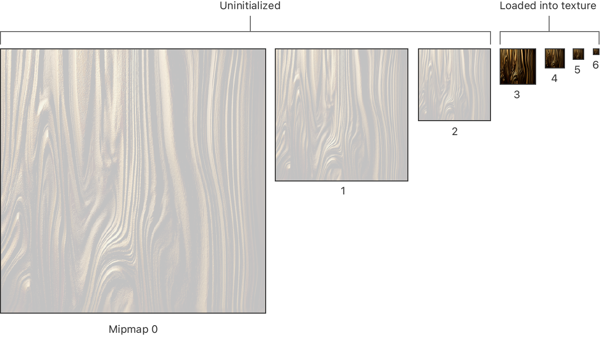
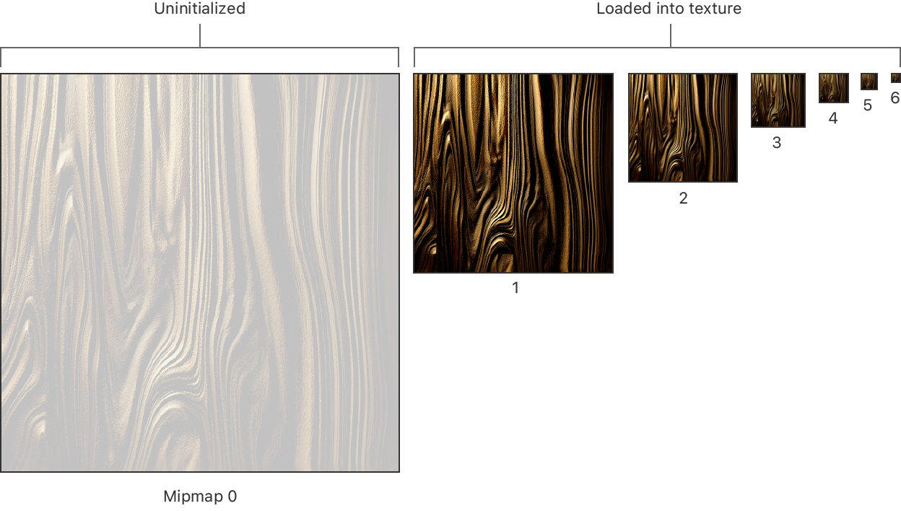

> Navigation: [Technologies](../technologies.md) · [Metal](../metal.md) · [Textures](textures.md)

# Dynamically adjusting texture level of detail

Article

Defer generating or loading larger mipmaps until that level of detail is needed.

## Overview

While the most common use for mipmaps is to improve sampling quality and performance, they have other uses, such as texture streaming. If you are loading texture data over a network or generating textures procedurally at runtime, it can be expensive to create a full set of mipmaps, especially if mipmap 0 is large. Further, if the objects being rendered are far away from the camera, the detail in mipmap 0 may never be needed. But because you aren’t required to provide mipmaps when you create the texture, you can bring in additional levels of detail only when needed.

### Provide data for smaller mipmaps

Start by creating the textures, as described in [Creating a mipmapped texture](creating-a-mipmapped-texture.md). Remember that Metal allocates memory for all of the mipmaps when you create the texture. Instead of loading data for all mipmaps, pick a lower mipmap, and provide data for it and any mipmaps lower in the chain. For example, if you started at mipmap level 3, as shown in the figure below, you are loading only about 2% of the total texture data required for the entire mipmap chain.

### Limit access to higher mipmaps

You need to keep track of the highest mipmap you’ve loaded and pass this information to your shader so that it samples only from mipmaps that contain data. You can do this by passing in an appropriately configured sampler, or, on some GPUs, by passing in the minimum level of detail (LOD) to your shader and using it as the minimum LOD when you sample the texture. See [Control mipmap selection when you sample the texture](restricting-access-to-specific-mipmaps.md#Control-mipmap-selection-when-you-sample-the-texture).

### Determine when objects get closer to the camera

As the scene animates, some objects may get closer to the camera. Detect when this happens by asking the shader which mipmap it needs to access or by performing a calculation based on the rendered image size, as described in [Predicting which mips the GPU samples with level-of-detail queries](predicting-which-mips-the-gpu-samples-with-level-of-detail-queries.md) and [Using function specialization to build pipeline variants](using-function-specialization-to-build-pipeline-variants.md).

### Update the mipmaps

When it seems likely that an app needs more detailed textures, start preparing new mipmap data. Depending on what kind of system you are implementing, you might make a network request to your server or render a new mipmap procedurally on the device. When you have the data, copy it into the appropriate mipmaps, and update the range of mipmaps that your shaders can sample. For example, in the following diagram, two additional levels of mipmaps were loaded and copied into the texture.

A figure showing how the mipmap chain has been updated with additional texture data. Originally, mipmaps 3 through 6 had valid data. After the update, mipmaps 1 through 6 have data. 

## See Also

### Texture mipmapping

- [Improving texture sampling quality and performance with mipmaps](improving-texture-sampling-quality-and-performance-with-mipmaps.md) — Avoid texture-rendering artifacts and reduce the GPU’s workload by creating smaller versions of a texture.
- [Creating a mipmapped texture](creating-a-mipmapped-texture.md) — Decide whether a texture that you’re creating needs mipmaps.
- [Copying data into or out of mipmaps](copying-data-into-or-out-of-mipmaps.md) — Specify which mipmaps that the data transfer affects.
- [Generating mipmap data](generating-mipmap-data.md) — Create your mipmaps either when you author content or at runtime.
- [Adding mipmap filtering to samplers](adding-mipmap-filtering-to-samplers.md) — Specify how the GPU samples mipmaps in your textures.
- [Restricting access to specific mipmaps](restricting-access-to-specific-mipmaps.md) — Set the range of mipmap levels that a sampler can access.
- [Predicting which mips the GPU samples with level-of-detail queries](predicting-which-mips-the-gpu-samples-with-level-of-detail-queries.md) — Determine in advance which mipmap levels the GPU requires to sample a texture.
