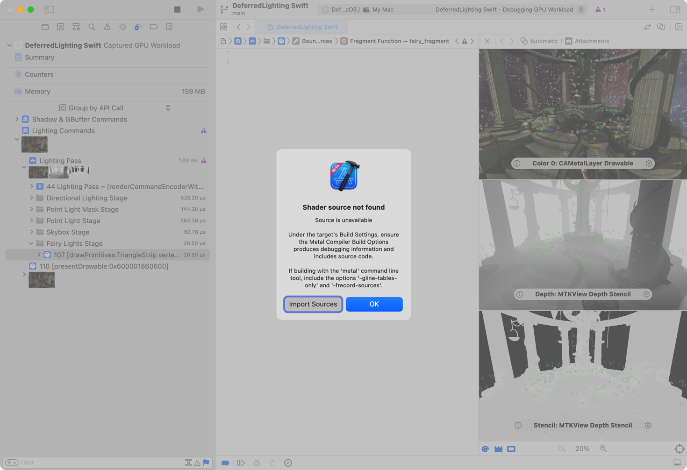
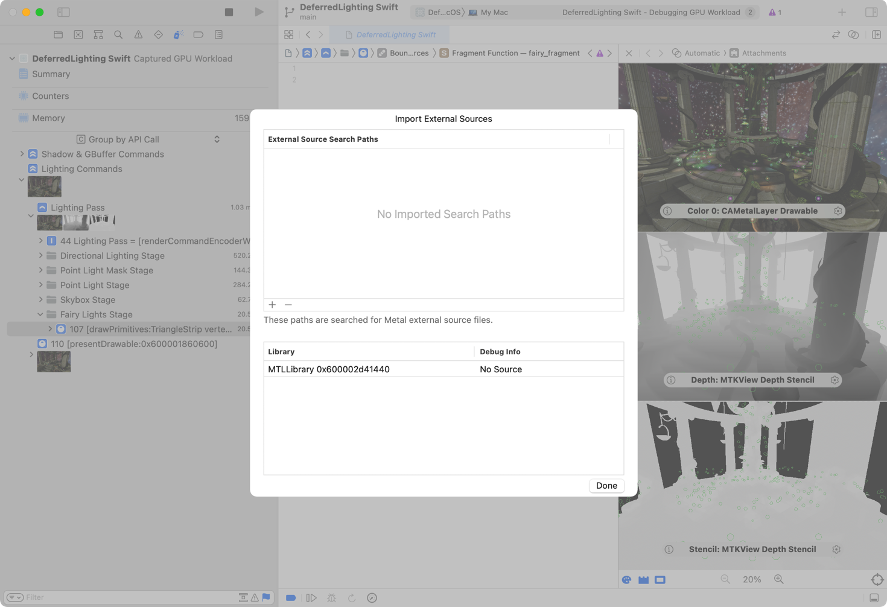
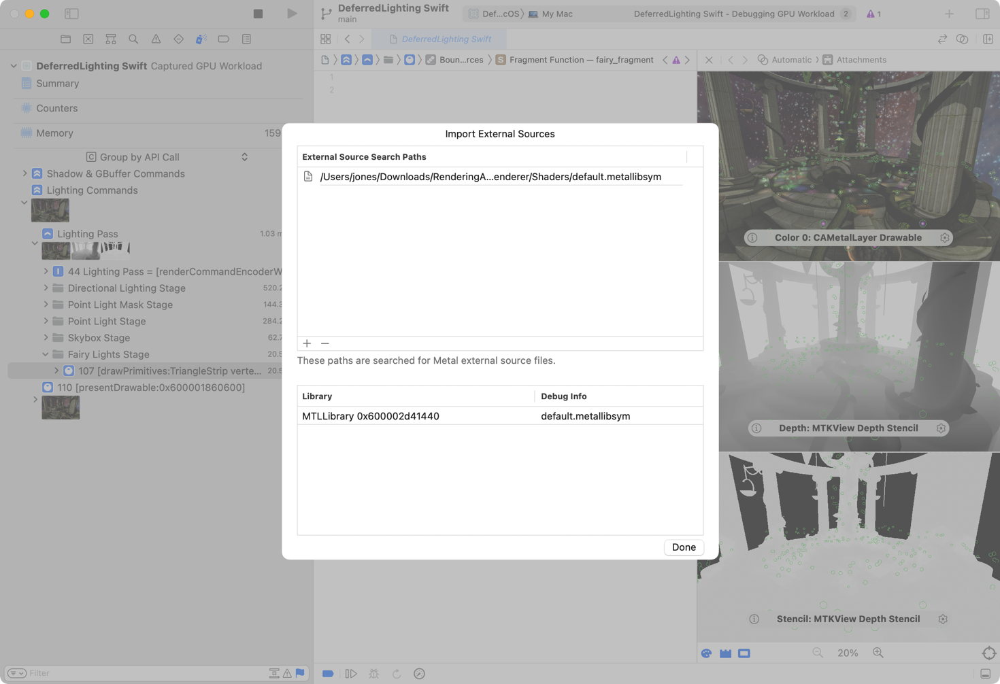

> Navigation: [Technologies](../technologies.md) · [Metal](../metal.md) · [Shader libraries](shader-libraries.md) · [Metal libraries](metal-libraries.md)

# Generating and loading a Metal library symbol file

<sub>Article</sub>

Debug your Metal shaders from your production apps by creating companion symbol files at compile time and loading them at debug time.

## Overview

With Xcode 13 or later, you can generate a separate symbol file for each Metal library built for a project. Each symbol file is a companion file that stores useful debugging information for the Metal library it represents. By separating each Metal library from its symbols, you can:

- Build and deploy a Metal library without source code — a requirement for apps on the App Store.
- Debug that same Metal library at a later time by loading its companion symbol file in Xcode.
- Avoid building each library twice — once for release and then again for debugging.

See [Debugging the shaders within a draw command or compute dispatch](../xcode/debugging-the-shaders-within-a-draw-command-or-compute-dispatch.md) to learn how to debug your Metal shaders.

### Generate a symbol file with a single command

Generate a Metal library’s symbol file in a single command by running the Metal compiler with the `-frecord-sources=flat` option.

```shell
% xcrun -sdk macosx metal -frecord-sources=flat Shadow.metal PointLights.metal DirectionalLight.metal
```

> [!note] Note
> This example uses the `macosx` SDK, but you can use any SDK your app targets.

The `-frecord-sources=flat` option, which replaces the deprecated `-MO=<value>` option, tells the Metal compiler to create two files:

- `default.metallib`, the compiled Metal library
- `default.metallibsym`, the library’s companion symbol file

### Generate a symbol file with multiple commands

You can also generate a Metal library’s symbol file with multiple commands, which may be more appropriate for your workflow than the single-command technique. For those scenarios, you can generate each Metal library and its companion symbol file by following these steps:

1. Compile each Metal source file to a Metal IR (intermediate representation) file.
2. Generate a Metal library with the source by linking its IR files.
3. Separate the library’s source and save it as a companion symbol file.

First, compile each Metal source file to a Metal IR file by passing the `-c` option to the compiler.

```shell
% xcrun -sdk macosx metal -c -frecord-sources Shadow.metal
% xcrun -sdk macosx metal -c -frecord-sources PointLights.metal
% xcrun -sdk macosx metal -c -frecord-sources DirectionalLight.metal
```

The `-frecord-sources` option tells the Metal compiler to embed the symbols in the IR output file for that command. However, this command doesn’t create a separate symbols file at this time, which is why the `-frecord-sources` option doesn’t include the `=flat` suffix.

Next, generate a Metal library by linking the IR files.

```shell
% xcrun -sdk macosx metal -frecord-sources -o LightsAndShadow.metallib Shadow.air PointLights.air DirectionalLight.air
```

Separate the sources from the library and create a companion symbol file by running the `metal-dsymutil` command.

```shell
% xcrun -sdk macosx metal-dsymutil -flat -remove-source LightsAndShadow.metallib
```

The `-remove-source` option modifies the Metal library file by removing its embedded source information. At the same time, the command’s `-flat` option saves that source and other symbol information to a symbol file. After the command finishes execution, the directory contains both the modified Metal library and its new companion symbol file:

- `LightsAndShadow.metallib`
- `LightsAndShadow.metallibsym`

> [!note] Note
> The Metal command-line tools for Windows use the same options and arguments as their macOS counterparts.

### Load a symbol file in Xcode

As you debug a shader, Xcode automatically presents a prompt when it doesn’t have access to a shader library’s source code.



<sub>A screenshot of a Metal debugger dialog that Xcode shows when the debugger doesn’t have shader sources. The dialog has two buttons, ‘Import Sources’ and ‘OK’.</sub>

Click the Import Sources button and select the shader’s companion symbol file.



<sub>A screenshot of an Import dialog from the Metal debugger that shows an empty list of search paths in the upper half, and one Metal library in the lower half. The library shows ‘No source’ in its ‘Debug Info’ column.</sub>

Add your shader library’s companion symbol file by clicking the Add button (+) and locating the file. Select a directory to tell Xcode to find all companion symbol files that match any Metal libraries in the current Metal debugging capture. The dialog reflects each library’s symbol file in a list as you add them.



<sub>A screenshot of an Import dialog from the Metal debugger that shows one entry in its list of search paths in the upper half, and one Metal library in the lower half. The library shows ‘default dot metal l-i-b s-y-m’ in its ‘Debug Info’ column.</sub>

Click Done when you finish adding your companion symbol files. Xcode imports the shader source and profiling information from each companion symbol file for the Metal library it represents.

> [!tip] Tip
> You can load your Metal library’s companion symbol file before you begin debugging by choosing Debug \> Import Metallib Debug Info.

## See Also

### Working with Metal intermediate representation libraries

- [Building a shader library by precompiling source files](building-a-shader-library-by-precompiling-source-files.md) — Create a shader library that you can add to an Xcode project with the Metal compiler tools in a command-line environment.
- [Minimizing the binary size of a shader library](minimizing-the-binary-size-of-a-shader-library.md) — Reduce the storage footprint of your shaders, and potentially reduce their compile time, by selecting the Metal compiler’s size optimization option.
