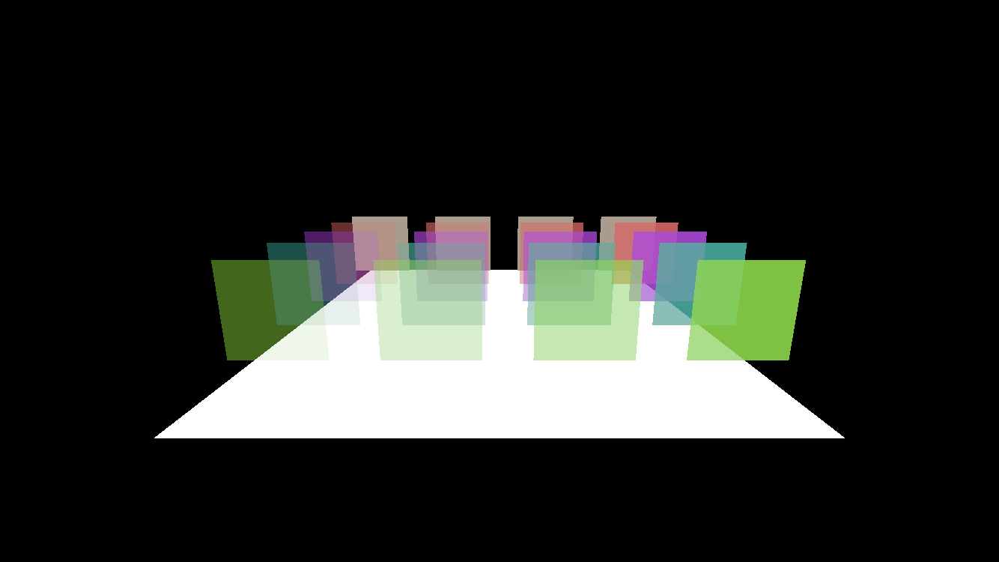
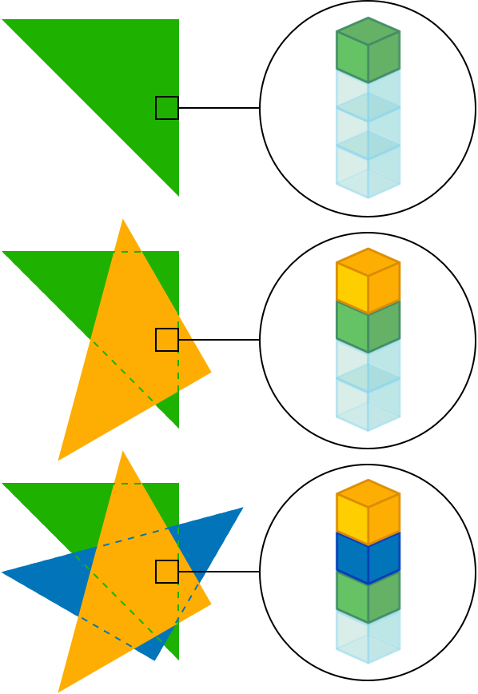

> Navigation: [Technologies](../technologies.md) · [Metal](../metal.md) · [Metal sample code library](metal-sample-code-library.md)

# Implementing order-independent transparency with image blocks

<sub>Sample Code</sub>

Draw overlapping, transparent surfaces in any order by using tile shaders and image blocks.

## Overview



In order to draw a convincing transparency effect, apps typically draw a scene’s transparent, 3D geometry in depth order, from farthest to nearest, relative to the camera. These apps use the CPU to sort the geometry by depth before drawing, but this approach has some drawbacks in that it:

- Can produce incorrect results when two meshes intersect
- Requires the app to recalculate the depth of each mesh with the CPU each time the camera or objects move within the scene

Order-independent transparency solves these issues by:

- Eliminating the need to sort meshes
- Moving the computation workload to the GPU
- Evaluating the geometry’s depth on a per-fragment basis

The sample takes advantage of _tile memory_ available on Apple silicon GPUs to quickly evaluate the depth and color of each fragment. Tile memory is a fast, temporary storage that shaders can use to store and retrieve information to and from other shaders.

### Configure the sample code project

To run this sample, you need Xcode 12 and a physical device including:

- A Mac with Apple silicon running macOS 12 or later
- An iOS device with an A11 Bionic chip or later running iOS 15 or later

This sample can only run on a physical device because it uses the image block and tile shader features, which Simulator doesn’t support.

### Check for support

The app checks that the device supports the features required to implement this order-independent transparency algorithm.

**AAPLRenderer.m**

```objective-c
// Check that this GPU supports raster order groups.
_supportsOrderIndependentTransparency = [_device supportsFamily:MTLGPUFamilyApple4];
```

The techniques implemented by this sample require the image block and tile shader features, which are a part of the [MTLGPUFamilyApple4](mtlgpufamily/apple4.md) feature set. Although this app does run on devices that don’t support these features, it incorrectly blends transparent geometries.

### Set up storage for transparent fragments

The sample uses tile memory to store data for multiple transparent layers. The `processTransparentFragment` shader draws the transparent geometry and populates the `TransparentFragmentStore` structure. This structure contains a single member, `fragmentValues`, which uses the `[[imageblock_data]]` attribute to specify that data for this element resides in tile memory.

**AAPLShaders.metal**

```metal
struct TransparentFragmentStore
{
    TransparentFragmentValues values [[imageblock_data]];
};
```

The `TransparentFragmentValues` structure stores the color and depth values for each fragment generated by transparent triangles. Because the fragment shader writes this data to tile memory, each member needs to be part of a raster order group. Raster order groups allow precise control of the order of parallel fragment shader threads accessing the same pixel coordinates. For more information, see [Tailor your apps for Apple GPUs and tile-based deferred rendering](tailor-your-apps-for-apple-gpus-and-tile-based-deferred-rendering.md).

**AAPLShaders.metal**

```metal
struct TransparentFragmentValues
{
    // Store the color of the transparent fragment.
    // Use a packed data type to reduce the size of the explicit ImageBlock.
    rgba8unorm<half4> colors [[raster_order_group(0)]] [kNumLayers];

    // An array of transparent fragment distances from the camera.
    half depths              [[raster_order_group(0)]] [kNumLayers];
};
```

The `kNumLayers` constant defines the maximum number of transparent layers the image block can store.

**AAPLShaders.metal**

```metal
/// The number of transparent geometry layers that the app stores in image block memory.
/// Each layer consumes tile memory and increases the value of the pipeline's `imageBlockSampleLength` property.
static constexpr constant short kNumLayers = 4;
```

If the number of transparent layers for any pixel exceeds `kNumLayers`, the `processTransparentFragment` shader drops the excess values. The subsequent blending shader ignores those color values that yield a technically incorrect result. Despite this, even if `kNumLayers` isn’t large enough, this algorithm still produces a convincing result.

### Reserve tile memory

When the sample sets up a render pass, it partitions the tile memory between storage for the `TransparentFragmentValues` structure and render targets.

Once the sample builds a render pipeline using the `TransparentFragmentValues` structure, the pipeline’s `imageblockSampleLength` property specifies the amount of tile memory the pipeline requires. As the value of `kNumLayers` increases and the structure side increases, the value of `imageblockSampleLength` also increases.

The sample reserves memory in the render pass by setting the `imageblockSampleLength` property of `_forwardRenderPassDescriptor` to the pipeline’s `imageblockSampleLength `property. Once the sample builds a render pipeline using the `TransparentFragmentStore` structure, the pipeline’s `imageblockSampleLength` property specifies the amount of tile memory the pipeline requires. As the value of `kNumLayers` increases, the value of `imageblockSampleLength` also increases.

**AAPLRenderer.m**

```objective-c
// Set the image block's memory size.
_forwardRenderPassDescriptor.imageblockSampleLength = _transparencyPipeline.imageblockSampleLength;
```

The sample chooses the tile size for the rasterized color and depth targets by setting the `tileWidth` and `tileHeight` properties of `_forwardRenderPassDescriptor`.

**AAPLRenderer.m**

```objective-c
// Set the tile size for the fragment shader.
_forwardRenderPassDescriptor.tileWidth  = _optimalTileSize.width;
_forwardRenderPassDescriptor.tileHeight = _optimalTileSize.height;
```

In general, a larger tile size yields better performance because the GPU incurs less overhead to render fewer tiles. However, the GPU uses tile memory for both rasterization data and image block data. You need to balance the dimensions chosen for the tile size with that of the value for `kNumLayers`. If these values exceed the amount of tile memory, the GPU can’t execute the tile shader in the render pass. In that case, creation of the render pass fails.

### Initialize the image block

The sample begins each render pass by initializing the image block structure.

**AAPLRenderer.m**

```objective-c
// Initialize the image block's memory before rendering.
[renderEncoder pushDebugGroup:@"Init Image Block"];
[renderEncoder setRenderPipelineState:_initImageBlockPipeline];
[renderEncoder dispatchThreadsPerTile:_optimalTileSize];
[renderEncoder popDebugGroup];
```

The `initTransparentFragmentStore` kernel writes zeros to each color value in the image block and `INFINITY` to each depth value.

**AAPLShaders.metal**

```metal
/// Initializes an image block structure to sentinel values.
kernel void initTransparentFragmentStore
(
    imageblock<TransparentFragmentValues, imageblock_layout_explicit> blockData,
    ushort2 localThreadID[[thread_position_in_threadgroup]]
)
{
    threadgroup_imageblock TransparentFragmentValues* fragmentValues = blockData.data(localThreadID);
    for (short i = 0; i < kNumLayers; ++i)
    {
        fragmentValues->colors[i] = half4(0.0h);
        fragmentValues->depths[i] = half(INFINITY);
    }
}
```

### Layer transparent geometry

After the sample initializes the image block and renders opaque objects, it uses the `processTransparentFragments` shader to populate the layers of the `TransparentFragmentValues` structure. This fragment shader doesn’t actually render to any of the render pass attachments and only writes to the structure in the image block. Because it doesn’t write to an attachment, the pipeline disables writes to color attachments.

**AAPLRenderer.m**

```objective-c
renderPipelineDesc.colorAttachments[AAPLRenderTargetColor].writeMask = MTLColorWriteMaskNone;
```

The shader inserts transparent fragment values in order of depth. It also discards fragment values with the farthest depth value when fragment values occupy all layers.

**AAPLShaders.metal**

```metal
for (short i = 0; i < kNumLayers; ++i)
{
    half layerDepth = fragmentValues.depths[i];
    half4 layerColor = fragmentValues.colors[i];

    bool insert = (depth <= layerDepth);
    fragmentValues.colors[i] = insert ? finalColor : layerColor;
    fragmentValues.depths[i] = insert ? depth : layerDepth;

    finalColor = insert ? layerColor : finalColor;
    depth = insert ? layerDepth : depth;
}
out.values = fragmentValues;
```

Each index in the array represents a layer. The shader tests the depth value of the incoming fragment against the depth value of the fragment in the current layer. If the depth value is less than the fragment in the current layer, the shader sets `insert` to `true`. When `insert` is `true`, the shader swaps the fragment values in the current layer with the tested fragment’s values. The values replaced become the new fragment values, which the shader tests in the next iteration of the loop. When the array fills, the shader discards the fragments with the farthest depth.

The following diagram shows an example of a shader populating layers of the image block as the app renders three transparent triangles.



In this example, the app first renders a green triangle whose fragments populate the first layer in the image block. It then renders an orange triangle with depth values less than the green triangle. The shader replaces any fragments covering the green triangle with the orange color and moves the fragments from the green triangle to the next layer. Finally, the app renders a blue triangle whose depth is in between the orange triangle and the green triangle. The shader replaces all the values of the green triangle in the second layer and moves them to the third. This results in an image block with fragments ordered by their depth values.

### Blend fragments for transparency

After the app layers all transparent geometry, the image block contains a list of fragment colors ordered by depth for every transparent fragment.

The app executes the `blendFragments` shader by drawing a full screen quad. This shader takes the current values in the color buffer populated by the `processOpaqueFragments` shader. It also takes the image block data populated by the `processTransparentFragments` shader.

**AAPLShaders.metal**

```metal
TransparentFragmentValues fragmentValues     [[imageblock_data]],
half4                     forwardOpaqueColor [[color(AAPLRenderTargetColor), raster_order_group(0)]]
```

The shader calculates the output color starting with the opaque value in the color attachment.

**AAPLShaders.metal**

```metal
out.xyz = forwardOpaqueColor.xyz;
```

It iterates through each layer in the image block structure, accumulating their color values.

**AAPLShaders.metal**

```metal
for (short i = kNumLayers - 1; i >= 0; --i)
{
    half4 layerColor = fragmentValues.colors[i];
    out.xyz = layerColor.xyz + (1.0h - layerColor.w) * out.xyz;
}
```

The resulting value is a mix of the transparent and opaque colors blended in order of their depth values.

## See Also

### Render workflows

- [Using Metal to draw a view’s contents](using-metal-to-draw-a-view's-contents.md) — Create a MetalKit view and a render pass to draw the view’s contents.
- [Drawing a triangle with Metal 4](drawing-a-triangle-with-metal-4.md) — Render a colorful, rotating 2D triangle by running draw commands with a render pipeline on a GPU.
- [Selecting device objects for graphics rendering](selecting-device-objects-for-graphics-rendering.md) — Switch dynamically between multiple GPUs to efficiently render to a display.
- [Customizing render pass setup](customizing-render-pass-setup.md) — Render into an offscreen texture by creating a custom render pass.
- [Creating a custom Metal view](creating-a-custom-metal-view.md) — Implement a lightweight view for Metal rendering that’s customized to your app’s needs.
- [Calculating primitive visibility using depth testing](calculating-primitive-visibility-using-depth-testing.md) — Determine which pixels are visible in a scene by using a depth texture.
- [Encoding indirect command buffers on the CPU](encoding-indirect-command-buffers-on-the-cpu.md) — Reduce CPU overhead and simplify your command execution by reusing commands.
- [Loading textures and models using Metal fast resource loading](loading-textures-and-models-using-metal-fast-resource-loading.md) — Stream texture and buffer data directly from disk into Metal resources using fast resource loading.
- [Adjusting the level of detail using Metal mesh shaders](adjusting-the-level-of-detail-using-metal-mesh-shaders.md) — Choose and render meshes with several levels of detail using object and mesh shaders.
- [Creating a 3D application with hydra rendering](creating-a-3d-application-with-hydra-rendering.md) — Build a 3D application that integrates with Hydra and USD.
- [Culling occluded geometry using the visibility result buffer](culling-occluded-geometry-using-the-visibility-result-buffer.md) — Draw a scene without rendering hidden geometry by checking whether each object in the scene is visible.
- [Improving edge-rendering quality with multisample antialiasing (MSAA)](improving-edge-rendering-quality-with-multisample-antialiasing-msaa.md) — Apply MSAA to enhance the rendering of edges with custom resolve options and immediate and tile-based resolve paths.
- [Achieving smooth frame rates with a Metal display link](achieving-smooth-frame-rates-with-a-metal-display-link.md) — Pace rendering with minimal input latency while providing essential information to the operating system for power-efficient rendering, thermal mitigation, and the scheduling of sustainable workloads.

## Download

- [ImplementingOrderIndependentTransparencyWithImageBlocks.zip](https://docs-assets.developer.apple.com/published/f2960914ed50/ImplementingOrderIndependentTransparencyWithImageBlocks.zip)
