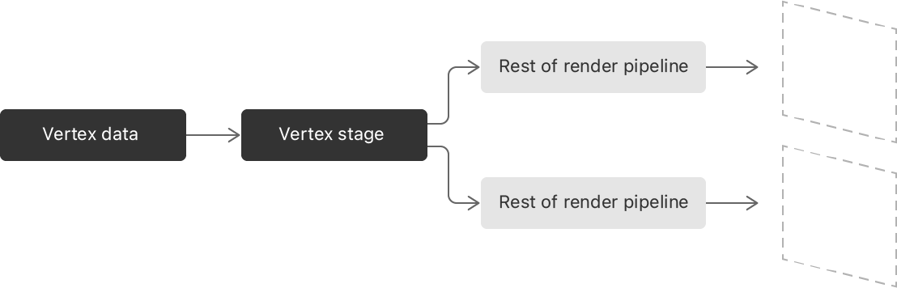

> Navigation: [Technologies](../technologies.md) · [Metal](../metal.md) · [Render passes](render-passes.md)

# Improving rendering performance with vertex amplification

<sub>Article</sub>

Run draw commands that render to different outputs using the same vertex data multiple times.

## Overview

With _vertex amplification_, you can encode drawing commands that process the same vertex multiple times, one per render target. Vertex amplification generates copies of a command’s vertex data for each render pipeline. Vertex amplification is more efficient than encoding the command multiple times with the same vertex because the GPU fetches the vertex data only once. The GPU then calls your vertex function multiple times — equal to the amplification multiplier — for each vertex.



<sub>A flow diagram that begins with a single instance of vertex data that flows into a single vertex stage. The vertex stage then produces two outputs that flow into two separate,  parallel render pipeline instances.</sub>

For example, you can use vertex amplification to implement cascaded shadow maps, with an amplification multiplier that’s equal to the number of cascade levels.

Apps typically leverage vertex amplification to render the same vertices to different texture layers or to multiple viewports. For more information about these techniques, see [Rendering to multiple texture slices in a draw command](rendering-to-multiple-texture-slices-in-a-draw-command.md) and [Rendering to multiple viewports in a draw command](rendering-to-multiple-viewports-in-a-draw-command.md).

### Check whether a GPU supports a vertex amplification multiplier

Confirm whether the GPU supports a specific multiplier for vertex amplification by passing its integer value to an [MTLDevice](mtldevice.md) instance’s [- supportsVertexAmplificationCount:](<mtldevice/supportsvertexamplificationcount(__).md>) method. Pass an amplification multiplier value that’s `2` or greater. A value of `1` has no effect because it effectively disables vertex amplification.

> [!important] Important
> Passing a multiplier value of `1` or less to the [- supportsVertexAmplificationCount:](<mtldevice/supportsvertexamplificationcount(__).md>) method triggers an API validation error.

After your app confirms that the GPU supports a vertex amplification multiplier at runtime, it can safely configure a pipeline state to use that multiplier.

### Set a render pipeline descriptor’s largest vertex amplification multiplier

Configure an [MTLRenderPipelineDescriptor](mtlrenderpipelinedescriptor.md) instance’s [maxVertexAmplificationCount](mtlrenderpipelinedescriptor/maxvertexamplificationcount.md) property to a multiplier value that the GPU supports. Any encoders you create with the descriptor can support any vertex amplification factor in the range `[1, `[maxVertexAmplificationCount](mtlrenderpipelinedescriptor/maxvertexamplificationcount.md)`]`.

**Swift**

```swift
let pipelineStateDescriptor = MTLRenderPipelineDescriptor()
pipelineStateDescriptor.vertexFunction = vertexFunction
pipelineStateDescriptor.fragmentFunction = fragmentFunction
pipelineStateDescriptor.maxVertexAmplificationCount = 2

...
```

**Objective-C**

```objective-c
MTLRenderPipelineDescriptor *pipelineStateDescriptor = [[MTLRenderPipelineDescriptor alloc] init];
pipelineStateDescriptor.vertexFunction = vertexFunction;
pipelineStateDescriptor.fragmentFunction = fragmentFunction;
pipelineStateDescriptor.maxVertexAmplificationCount = 2;

...
```

Continue configuring your pipeline descriptor and create an [MTLRenderPipelineState](mtlrenderpipelinestate.md) instance with it that you can assign to a render command encoder.

The example above sets the descriptor’s [maxVertexAmplificationCount](mtlrenderpipelinedescriptor/maxvertexamplificationcount.md) property to `2`. Most apps typically set this property to the largest amplification factor the GPU supports. That way, an encoder that uses the pipeline state from that descriptor has the option to use any valid vertex amplification factor for that GPU.

### Enable vertex amplification for a render pass

Configure an [MTLRenderCommandEncoder](mtlrendercommandencoder.md) instance to apply vertex amplification for subsequent rendering commands by calling its [- setVertexAmplificationCount:viewMappings:](<mtlrendercommandencoder/setvertexamplificationcount(__viewmappings_).md>) method.

**Swift**

```swift
renderEncoder.setVertexAmplificationCount(2, viewMappings: nil)
```

**Objective-C**

```objective-c
[renderEncoder setVertexAmplificationCount:2 viewMappings:nil];
```

Set the vertex amplification count parameter to a value that’s less than or equal to the [maxVertexAmplificationCount](mtlrenderpipelinedescriptor/maxvertexamplificationcount.md) property that configures the current render pipeline.

You can also provide an array of [MTLVertexAmplificationViewMapping](mtlvertexamplificationviewmapping.md) instances as you configure vertex amplification. Apps typically provide view mappings to render to multiple textures or viewports with vertex amplification.

The following example sets the [renderTargetArrayIndexOffset](mtlvertexamplificationviewmapping/rendertargetarrayindexoffset.md) values to `0` and `1` for the first and second mappings, respectively. It also sets the [viewportArrayIndexOffset](mtlvertexamplificationviewmapping/viewportarrayindexoffset.md) values to `1` and `2` for the first and second mappings, respectively.

The GPU adds these offsets to the vertex shader outputs with the corresponding attribute. In this example, the GPU adds `0` and `1` to the output value with the `[[render_target_array_index]]` attribute for the first and second pipeline invocations, respectively. It also adds `1` and `2` to the output value with the `[[viewport_array_index]]` attribute for the first and second pipeline invocations, respectively.

**Swift**

```swift
func configureEncoder(_ renderEncoder: MTLRenderCommandEncoder) {
    // Create two mappings for vertex amplification.
    var mapping0 = MTLVertexAmplificationViewMapping()
    var mapping1 = MTLVertexAmplificationViewMapping()

    // Set each mapping's index offset for a render target array.
    mapping0.renderTargetArrayIndexOffset = 0
    mapping1.renderTargetArrayIndexOffset = 1

    // Set each mapping's index offset for a viewport array.
    mapping0.viewportArrayIndexOffset = 1
    mapping1.viewportArrayIndexOffset = 2

    // Create an array of the two mappings.
    let mappings = [mapping0, mapping1]

    // Set the vertex amplification multiplier with view mappings.
    renderEncoder.setVertexAmplificationCount(2, viewMappings: mappings)
}
```

**Objective-C**

```objective-c
- (void)configureEncoder:(id<MTLRenderCommandEncoder>) renderEncoder {
    // Create two mappings for vertex amplification.
    MTLVertexAmplificationViewMapping mapping0;
    MTLVertexAmplificationViewMapping mapping1;

    // Set each mapping's index offset for a render target array.
    mapping0.renderTargetArrayIndexOffset = 0;
    mapping1.renderTargetArrayIndexOffset = 1;

    // Set each mapping's index offset for a viewport array.
    mapping0.viewportArrayIndexOffset = 1;
    mapping1.viewportArrayIndexOffset = 2;

    // Create an array of the two mappings.
    MTLVertexAmplificationViewMapping mappings[] = { mapping0, mapping1 };

    // Set the vertex amplification multiplier.
    [renderEncoder setVertexAmplificationCount:2 viewMappings:mappings];
}
```

See the [Metal Shading Language Specification](https://developer.apple.com/metal/Metal-Shading-Language-Specification.pdf) for information about applying an attribute to a parameter of a GPU function (shader and kernel).

### Add vertex amplification to your vertex shader

Implement vertex amplification in your shader code by adding parameters that represent the amplification ID and amplification factor. Designate which parameter is which by appending an attribute to each.

For example, the parameter with the `[[amplification_id]]` attribute represents the unique identifier for each copy of the vertex data. The parameter with the `[[amplification_count]]` attribute represents the total number of unique identifiers.

```metal
vertex VertexOut vs_main(VertexIn in[[stage_in]],
                         ushort amp_id [[amplification_id]],
                         ushort amp_count [[amplification_count]],
                         constant int* buffer)
{
    ...
}
```

The GPU invokes the shader one time for each amplification ID. For each invocation, the GPU sets the parameter with the `[[amplification_id]]` to a unique value in the range `[0, amplification_count - 1]`. The GPU sets the parameter with the `[[amplification_count]]` attribute to the same amplification factor you configure the draw command to use for all invocations.

You can customize your shader’s behavior for each render pipeline instance with these parameters, which are `amp_id` and `amp_count` in these examples.

```metal
struct VertexOut
{
    int data;
    ...
};

...

vertex VertexOut vs_main(VertexIn in[[stage_in]],
                         ushort amp_id [[amplification_id]],
                         ushort amp_count [[amplification_count]],
                         constant int* buffer)
{
    VertexOut out;
    ...
 
    if (amp_count == 1) {
        // The draw command isn't using vertex amplification.
        ...
    } else {
        out.data = buffer[amp_id];
        ...
    }

    ...
    return out;
}
```

You can also invoke shaders that have these parameters with a draw call that’s not applying vertex amplification. In those scenarios, the GPU calls the shader once per vertex, and sets the parameters with `[[amplification_id]]` and `[[amplification_count]]` to `0` and `1`, respectively.

### Mark values common to all vertices as shared

You can help reduce the GPU’s runtime workload by annotating values that are the same for all amplification IDs of a vertex. The Metal compiler detects values that remain consistent across all amplification IDs as _shared_ values. You can also tell the compiler which values you consider shared by adding the `[[shared]]` attribute.

By default, the Metal shader compiler looks for shared values by detecting calculations that have the same value for all amplification IDs of a vertex. The compiler instructs the GPU to calculate these values once per vertex so that the GPU doesn’t calculate the same value for every amplification ID. For example, if the shader copies a value directly from an input, the compiler infers that as a shared value.

```metal
#define PositionAttribute            0
#define TextureCoordinatesAttribute  1
#define NormalAttribute              2

struct VertexIn
{
    float3 position         [[attribute(PositionAttribute)]];
    float2 textureLocation  [[attribute(TextureCoordinatesAttribute)]];
    float3 normal           [[attribute(NormalAttribute)]];
};

struct VertexOut
{
    int data;
    float4 position [[position]];
    float3 normal;
    float2 textureLocation [[shared]];
};

...

vertex VertexOut vs_main(VertexIn in[[stage_in]],
                         ushort amp_id [[amplification_id]],
                         ushort amp_count [[amplification_count]],
                         constant int* buffer)
{
    VertexOut out;
    ...

    // This is a shared value because it's the same for all copies of the vertex.
    out.normal = in.normal;

    ...
    return out;
}
```

The compiler can also infer other calculations as a shared value if a vertex’s calculation result is the same for all amplification IDs.

Conversely, the compiler infers other calculations that vary across amplification IDs as _nonshared_. For example, a calculation that depends on the `[[amplification_id]]` parameter is a nonshared value because the amplification ID changes for each vertex copy.

```metal
struct VertexOut
{
    int data;
    ...
};

...

vertex VertexOut vs_main(VertexIn in[[stage_in]],
                         ushort amp_id [[amplification_id]],
                         ushort amp_count [[amplification_count]],
                         constant int* buffer)
{
    VertexOut out;
    ...

    // This is a nonshared value because it depends on the [[amplification_id]] parameter.
    out.data = buffer[amp_id];

    ...
    return out;
}
```

The compiler also infers any calculation that depends on a `[[position]]` parameter as a nonshared value.

```metal
#define PositionAttribute            0
...

struct VertexIn
{
    float3 position         [[attribute(PositionAttribute)]];
    ...
 };

struct VertexOut
{
    ...
    float4 position [[position]];
    ...
};

constant float4x4 transform = { ... };

vertex VertexOut vs_main(VertexIn in[[stage_in]],
                         ushort amp_id [[amplification_id]],
                         ushort amp_count [[amplification_count]],
                         constant int* buffer)
{
    VertexOut out;
    ...

    // This is a nonshared value because the assignment stores the result to the [[position]] parameter.
    out.position = transform * float4(in.position, 1.0);

    ...
    return out;
}
```

> [!note] Note
> The Metal compiler infers all assignments to parameters with built-in attributes as _shared_ values, except for assignments to the `[[position]]` attribute.

The compiler infers other calculations as shared values if it can prove the result is the same for all amplification IDs. However, you can explicitly designate a parameter as a shared value by adding the `[[shared]]` attribute as a hint to the shader compiler.

```metal
struct VertexOut
{
    ...
     float2 textureLocation [[shared]];
};
vertex VertexOut vs_main(VertexIn in[[stage_in]],
                         ushort amp_id [[amplification_id]],
                         ushort amp_count [[amplification_count]],
                         constant int* buffer)
{
    VertexOut out;
    ...

    // This is a shared value the `VertexOut` type declares with the [[shared]] attribute.
    out.textureLocation = in.position.xy;

    ...
    return out;
}
```

### Combine vertex amplification with primitive instancing

_Primitive instancing_ is another way to generate copies of vertex data by providing additional data that modifies the original vertices for each instance. For example, you might animate a model by altering its vertex data with a sequence of pose offsets, each corresponding to a frame of animation.

Primitive instancing generates a copy of vertex data for each instance. If you encode a draw call with an instance count of `10`, the GPU invokes the render pipeline 10 times, once per instance. Unlike vertex amplification, the GPU recalculates all vertex output values each time it invokes your vertex shader.

You can apply both vertex amplification and primitive instancing in the same render pass for separate components of the scene. You can use primitive instancing to draw multiple characters for a scene and then use vertex amplification to render to different shadow maps.

The total number of render pipelines instances is equal to the product of the vertex amplification factor and the number of primitive instances. For example, if you encode a draw call with `10` primitive instances and a vertex amplification factor of `2`, the GPU calls your vertex shader 20 times per vertex. In this case, the vertex shader runs twice for each of the 10 instances. However, the GPU calculates the vertex amplification’s shared output values once per vertex for all amplification IDs.

## See Also

### Applying rendering techniques

- [Drawing a triangle with Metal 4](drawing-a-triangle-with-metal-4.md) — Render a colorful, rotating 2D triangle by running draw commands with a render pipeline on a GPU.
- [Customizing render pass setup](customizing-render-pass-setup.md) — Render into an offscreen texture by creating a custom render pass.
- [Setting load and store actions](setting-load-and-store-actions.md) — Set actions that define how a render pass loads and stores a render target.
