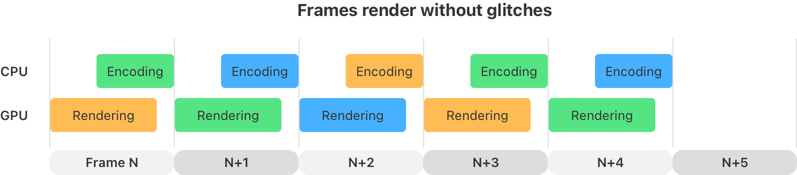
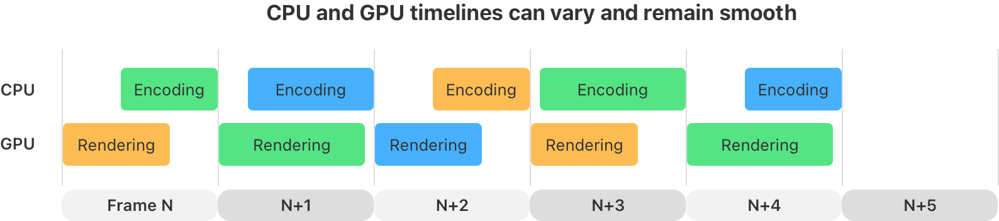
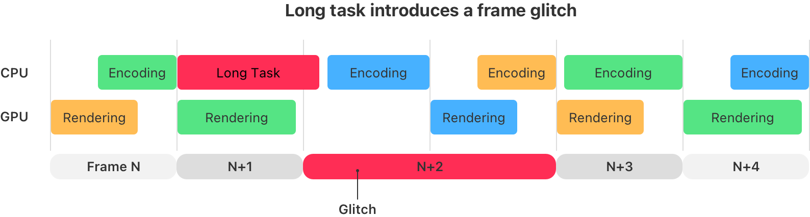
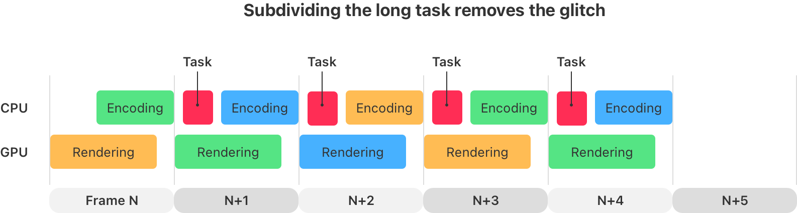

> Navigation: [Technologies](../technologies.md) · [Metal](../metal.md)

# Improving your game’s graphics performance and settings

Article

Fix performance glitches and develop default settings for smooth experiences on Apple platforms using the powerful suite of Metal development tools.

## Overview

Metal games range from having modest performance requirements to pushing hardware to their limits. Players expect smooth frame rates and animation, and when that doesn’t happen, they’re perceived as glitches in the game. You can investigate the underlying cause of these glitches, and organize your work by creating a data collection plan to measure your performance data before and after you make improvements.

After you understand the performance characteristics of your game, you can tailor the player experience for different devices depending on the available set of features, computing power, and memory resources. You can also identify the game’s features that are performance or image-quality oriented and choose a subset that work for the entire game, and in a variety of circumstances. There are many tools like Instruments, Metal HUD, and GPU Debugger to aide you as you investigate performance bottlenecks in your Metal game.

### Avoid frame glitches

Ideally, players perceive that a game runs smoothly if there are no noticeable frame glitches. A frame glitch is commonly defined as any kind of rendering error, hitch, sudden visual change, and low or uneven frame rate. Hitching occurs when a frame takes too long to render and ends up missing the time it was supposed to display onscreen. Streaming resources and loading shaders inefficiently cause sudden visual changes to the game graphics. And inconsistent frame rates cause the game to fluctuate from a steady frame rate to a lower frame rate, especially when a player wants the best frame rate to perform well, such as during an action scene.

These frame glitches happen on either the CPU or GPU timeline. For example, a game streams data and loads shaders on the CPU timeline while your renderer runs shaders and executes rendering passes on the GPU timeline. If a game has a bottleneck on one of these timelines, it can create delays on the other.

If you want a frame to render at a specific frames per second (fps) rate, then profile the game to ensure that it doesn’t exceed a certain time interval per frame, measured in milliseconds (ms). For example, 30 fps is about 33 ms, 40 fps is 25 ms, and 60 fps is about 16 ms. If you design a game to work at 60 fps, then it’s best if the game’s CPU time not exceed 16 ms and the GPU time not exceed 16 ms. Apple ProMotion displays support different frame rates so the game can use a rate like 30, 40, and 60 fps. Note that the CPU and GPU timelines can overlap so each timeline can take up to 16 ms. The following diagram shows a well-paced CPU and GPU timeline:

A diagram that depicts the CPU, GPU, and display timelines for the encoding, rendering, and display of a sequence of five frames. The timing is uniform showing that there are no frame pacing problems.

Typically, the frame time isn’t consistent. The number of objects visible on the screen varies, the game might be streaming in the next level, shadow maps might need an update, and so on. If the encoding and rendering times remain within their time budgets, your game’s motion remains smooth. However, if there’s considerable change from one frame to another when they’re almost the same, it’s important to understand the cause. The following diagram shows when this variance isn’t an issue:

A diagram depicting the CPU, GPU, and display timelines for the encoding, rendering, and display for a sequence of five frames. The blocks aren’t uniformly sized, but remain within the time limits and don’t create frame pacing problems.

An unexpected long task can create a frame glitch in the timeline. For example, the game might introduce a data dependency while it loads textures, models, or shaders for a rendering pass. Some game tasks can increase the CPU utilization and affect the game’s rendering thread. The following diagram shows a long game task on the CPU timeline delaying the encoding of a frame, resulting in a glitch. Profile all parts of the game with Instruments to rule those out.

A diagram depicting the CPU, GPU, and display timelines for the encoding, rendering, and display for a sequence of five frames. There’s a long task inserted into the CPU timeline that delays the encoding of one of the frames so that it causes the previous frame to be shown for twice as long, resulting in a hitch on the display.

To solve this type of problem, reorganize a long task for the renderer to split it over several frames. Plan to schedule those tasks on a different thread, or manage any dependencies ahead of time so they don’t create stalls. The following diagram shows that splitting the long task resolves this glitch and restores the encoding thread’s optimal timeline:

A diagram depicting the CPU, GPU, and display timelines for the encoding, rendering, and display for a sequence of five frames. The long task from the previous diagram is split so that it doesn’t delay the encoding of the frames and result in a hitch on the display.

Apply the same approach to the GPU timeline too. Consider a cache to store temporary resources, like shadow maps, or use GPU culling to reduce geometric complexity. Note that tasks that aren’t part of every frame create opportunities to add delays. Carefully understand all parts of the game’s rendering pipeline to locate and eliminate glitches. There are some techniques to measure, understand, and fix these performance problems.

### Think through performance problems

Performance problems typically have several underlying reasons, or root causes. Root causes are usually separate issues that affect the game to different degrees. The process to fix these issues is measure, analyze, and improve. The first step in investigating performance problems is to measure with tools. Analyze these data measurements to identify the performance problem’s root causes. Some problems are easy to find and fix, but most need investigation. After identifying the root causes, prioritize fixing the problem that affects the game’s performance most. After this improvement, re-measure the game until it meets its performance requirements or repeat this improvement process.

The “five whys” technique is a helpful way to find and scope the root cause of a performance problem. Repeatedly ask and answer the question “why?” five times to gain a more specific understanding of the problem. Here are some sample questions and answers:

- Why does my game have frame glitches? On the Metal system trace in Instruments, some frames take longer than 33 ms to render.
- Why does the frame time exceed 33 ms? The system trace shows that the game spends 22 ms rendering the geometry buffer.
- Why does it take 22 ms to render the geometry buffer? Measuring the time of the vertex shader stage shows 16 ms, and the fragment shader takes 6 ms to render.
- Why does it take 16 ms for the vertex shader to run? A GPU trace shows that the vertex shader is processing 5,000,000 vertices and it looks ALU bound.
- Why is the vertex shader ALU bound? The vertex shader uses several matrix multiplications and doesn’t use half-precision types.

This process creates opportunities to ask additional side questions. Focus on one line of questions at a time and write down the other ones to investigate them afterward. In the example, there was a choice to examine the vertex shader time or the fragment shader time. Because the vertex shader time seems to be the source of the bottleneck, that’s the first place to look. Later, investigate the fragment shader to see if there’s a problem. It’s helpful to put these questions and answers on a diagram or board to see the whole picture. When you make an improvement to the game, then take a full profile again to compare the results and investigate where the next bottleneck is.

### Organize your work with a plan

To stay organized, create a data collection plan to decide the key data points in the investigation and validate whether you achieved the desired results. Include a process to store the investigation data when you collect it because the game and its data might change during development. This makes it easier to document a specific problem or validate the improvements you made to the game.

There are two kinds of performance data: specific collections and general collections. An Instruments trace or GPU Debugger trace is an example of a specific data collection that focuses on a moment in the game. An example of a general data collection is a recording of the frame rate over an entire level, or the game, such as using the Metal HUD or onscreen telemetry.

Tips for creating a plan to collect data:

- Include the time and date of the data measurement in a descriptive format. For example, you could use `YYYYMMDD-HHMM-ToolName-Description-OtherUsefulInformation` in the filename.
- Describe the place in the game where you captured the data and relevant details like the game’s time of day, game coordinates, and player and camera orientations.
- Add the name of the measurement tool to the data, such as Metal HUD, GPU Debugger trace, Instruments Metal system trace, or in-game telemetry.

Here’s an example of recording a measurement of the frame rate. Capture a video of the game with the Metal HUD and onscreen telemetry turned on during a play-through. The Metal HUD logging option prints performance data to the console, and this can be converted to a file format like comma-separated values (CSV) to analyze the data with a spreadsheet. Scrub through the video to look for glitches. After making an improvement, re-record a similar video and compare the results to understand the improvement. For tips on screen recording, see the following resources:

- [How to record the screen on your Mac](https://support.apple.com/en-us/102618)
- [Record the screen on your iPhone, iPad, or iPod touch](https://support.apple.com/en-us/102653)

Match the data with the kind of improvement you’re trying to make. For instance, if the goal is to improve the frame rate, then recording the GPU frame time is essential. In this case, record a Metal system trace with Instruments for about 5 to 10 seconds. A second example using Metal HUD is to log and display the game’s memory utilization, especially if there’s instability caused by excess resources in memory. These kinds of performance data measurements help inform decisions for the right initial defaults in a variety of situations, like the player’s device capabilities, preferred frame rate, or image quality.

### Choose the initial defaults for your game

Performance data is useful for selecting good default settings. Choose a few sets of options that work all of the time, rather than presenting all of the options to players. Avoid setting combinations that lead to instability or poor performance. Optimize the game for the range of devices that players may use, and to adjust the default settings based on the device the game is running on. For instance, the game can select a set of defaults based on the amount of memory and the type of processor. For example, the [userInterfaceIdiom](../uikit/uidevice/userinterfaceidiom.md) API on iOS returns the kind of device that the game is running on. Refer to the article [Running code on a specific platform or OS version](../xcode/running-code-on-a-specific-version.md) for details on customizing the game’s behavior on different Apple platforms.

Each device the game runs on — like iPhone, iPad, or Mac — has different ranges of performance characteristics. Players expect fewer, but tuned, settings for a game running on iPhone compared with Mac. Design a few settings that work well with smaller, portable devices, such as a performance mode that prioritizes battery life and frame rate, and a quality mode that prioritizes image quality. For all devices, tune settings to optimize input latency, frame pacing, and interoperability with the other features on the device. For example, test whether the player can record their screens or switch apps without requiring a restart.

### Determine the set of options that work for the entire game

Use the data collection plan from earlier to monitor the key details for the entire game. The following list of data points can help determine if the game is stable, stays within its memory budget, and has a good frame rate:

- Time of measurement
- Frame time and present time
- Memory usage
- Set of options or graphics settings for the game

If the game doesn’t meet the required performance targets, this data helps to find the cause. The game might need additional texture and geometry optimizations in a level, renderer fixes, shader improvements, or different graphics settings for a device. Repeat this process until game play is smooth throughout the entire game and meets its performance targets.

### Limit the system’s burst performance

Use sustained execution mode to limit the burst performance of the system while the game runs. Include the [com.apple.developer.sustained-execution](../bundleresources/entitlements/com.apple.developer.sustained-execution.md) entitlement and set the App Category in the `Info.plist` to one of the Games categories. Use this entitlement to obtain accurate performance measurements while the game runs. Benchmark and test various areas in the game to tune the sustained performance on different devices.

### Detect the device’s capabilities to choose the settings

The game can adjust its runtime performance characteristics by applying these recommendations:

- Check whether an [MTLDevice](mtldevice.md) instance supports the capabilities of an [MTLGPUFamily](mtlgpufamily.md) instance by passing one of the enumeration’s cases — such as [MTLGPUFamilyApple8](mtlgpufamily/apple8.md), [MTLGPUFamilyApple9](mtlgpufamily/apple9.md), and so on — to the device’s [- supportsFamily:](<mtldevice/supportsfamily(__).md>) method.
- Use the [com.apple.developer.kernel.increased-memory-limit](../bundleresources/entitlements/com.apple.developer.kernel.increased-memory-limit.md) entitlement for extra memory on certain iOS devices. Check [os_proc_available_memory](../os/os_proc_available_memory.md) for the amount of available runtime device memory.
- Use Quality of Service (QoS) and Grand Central Dispatch (GCD) as shown in [Tuning your code’s performance for Apple silicon](../apple-silicon/tuning-your-code-s-performance-for-apple-silicon.md).

To more finely tune your apps and games, you can call the [Kernel](../kernel.md) function, [sysctlbyname](../kernel/1387446-sysctlbyname.md). See [Determining system capabilities](../kernel/1387446-sysctlbyname/determining_system_capabilities.md) and [Apple Silicon CPU Optimization Guide](https://developer.apple.com/download/apple-silicon-cpu-optimization-guide/) for information about checking the specifics of a device, such as:

- `hw.perflevels` for the number of types of general purpose cores in the system
- `hw.perflevel0.logicalcpu` for the number of performance cores
- `hw.perflevel1.logicalcpu` for the number of efficiency cores

### Support features on devices with hardware support

When the game starts, query for the GPU family support with the [- supportsFamily:](<mtldevice/supportsfamily(__).md>) API and use the device’s supported hardware features, if they’re available. For instance, prefer to enable hardware-accelerated ray tracing when the hardware supports it. If the game needs more memory to use a feature than is available, then disable that feature as a last resort and provide a fallback if possible. Players prefer to use a feature that’s supported in hardware.

> [!note] Note
> Hardware-accelerated mesh shaders and ray tracing are supported on `MTLGPUFamilyApple9` GPU families.

### Adapt the game for battery life or low-power mode

When designing games that run on a portable device, consider detecting when the app goes into low-power mode. See the [isLowPowerModeEnabled](../foundation/processinfo/islowpowermodeenabled.md) API for more information on getting a notification when the system goes into low-power mode. This technique allows a game to adapt its graphics settings so that it uses less energy. For example, the game can:

- Lower the rendering resolution
- Limit the frame rate
- Use less-detailed models, textures, and shaders

## See Also

### Developer tools

- [Supporting Simulator in a Metal app](supporting-simulator-in-a-metal-app.md) — Configure alternative render paths in your Metal app to enable running your app in Simulator.
- [Capturing Metal commands programmatically](capturing-metal-commands-programmatically.md) — Invoke a Metal frame capture from your app, then save the resulting GPU trace to a file or view it in Xcode.
- [Logging shader debug messages](logging-shader-debug-messages.md) — Print debugging messages that a shader generates using shader logging.
- [Developing Metal apps that run in Simulator](developing-metal-apps-that-run-in-simulator.md) — Prototype and test your Metal apps in Simulator.
- [Metal debugger](../xcode/metal-debugger.md) — Debug and profile your Metal workload with a GPU trace.
- [Metal developer workflows](../xcode/metal-developer-workflows.md) — Locate and fix issues related to your app’s use of the Metal API and GPU functions.
- [GPU counters and counter sample buffers](gpu-counters-and-counter-sample-buffers.md) — Retrieve runtime data from a GPU device by sampling one or more of its counters.
- [Metal debugging types](metal-debugging-types.md) — Create capture managers and capture scopes, and review a GPU device’s log after it runs a command buffer.
