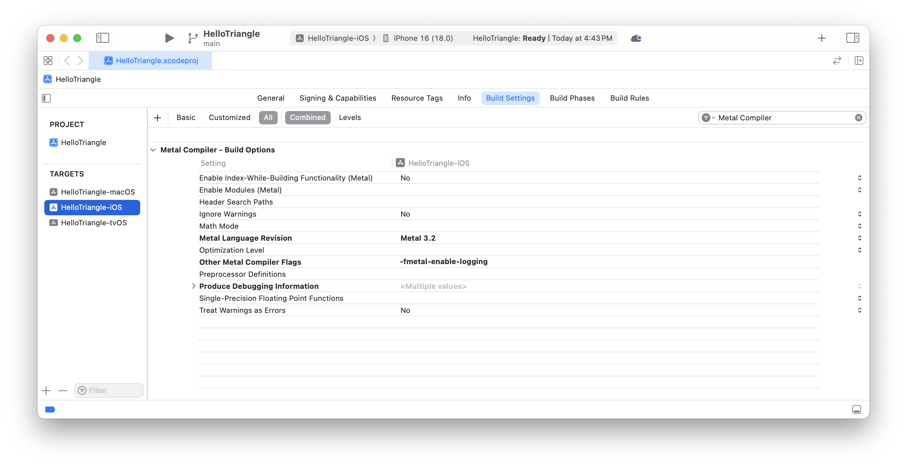
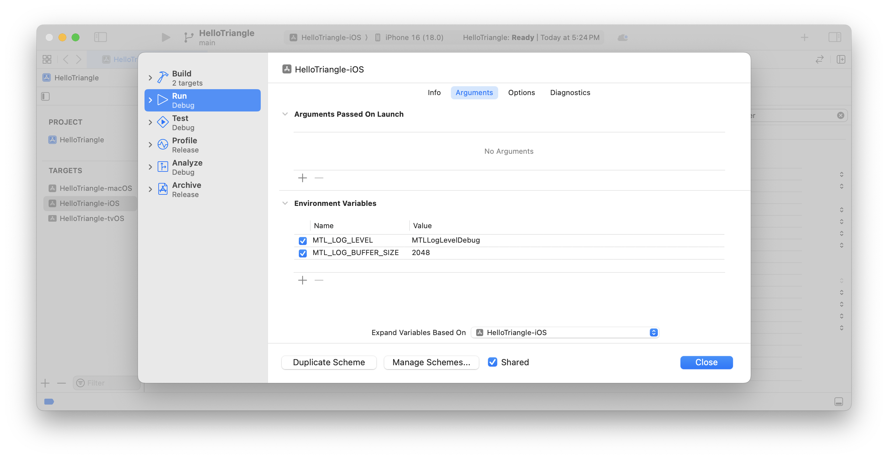
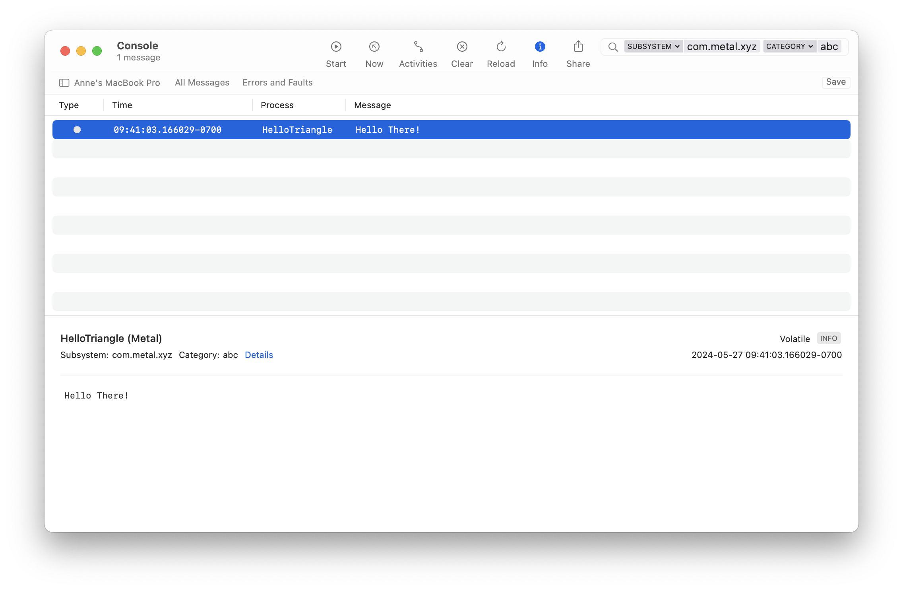

> Navigation: [Technologies](../technologies.md) · [Metal](../metal.md)

# Logging shader debug messages

<sub>Article</sub>

Print debugging messages that a shader generates using shader logging.

## Overview

With shader logging, you can print debugging messages directly from the shader in your app, to help identify issues you may not catch otherwise. You can view these messages from the Console app, the log command-line tool, or the Xcode debug area.

### Enable shader logging

To enable shader logging, you first need to enable the compiler setting in [MTLCompileOptions](mtlcompileoptions.md). You can either do this directly through Xcode, or while building your [MTLLibrary](mtllibrary.md). Shader logging is only available in Metal 3.2 and later. It’s also only available in iOS 18 and later, iPadOS 18 and later, macOS 15 and later, tvOS 18 and later, and visionOS 2 and later.

To enable the compiler setting through Xcode:

1. Choose your project in the Project Navigator and select the target you want to enable logging for. Click Build Settings at the top.
2. Search for “Other Metal Compiler Flags”.
3. Add `-fmetal-enable-logging` as a compile flag.

The following image shows an Xcode project’s build settings with the compiler flag set:



<sub>An image showing an Xcode project’s build settings with the -fmetal-enable-logging compiler flag set. The image also shows the Metal Language Revision set to use Metal 3.2.</sub>

You can also enable the same compiler setting through the command line:

```shell
xcrun metal -std=metal3.2 -fmetal-enable-logging -o helloTriangle.metallib helloTriangle.metal
```

If you’re creating a Metal Library by compiling source code using `newLibraryWithSource`, use the `MTLCompileOptions` instance’s [enableLogging](mtlcompileoptions/enablelogging.md) property to set the compile option:

```objective-c
MTLCompileOptions *options = [MTLCompileOptions new];
options.libraryType = MTLLibraryTypeExecutable;
options.enableLogging = true;
id<MTLLibrary> myLibrary = newLibraryWithSource: (NSString *) myShaderPath
                                        options: (MTLCompileOptions *) options
                                          error: (NSError * _Nullable *) error;
```

After you set the compiler settings, set the app’s environment variables. The two environment variables that influence logging are `MTL_LOG_LEVEL` and `MTL_LOG_BUFFER_SIZE`. If you define only one of the variables, the other assumes its default value. The default value for `MTL_LOG_LEVEL` is `MTLLogLevelDebug`, and the default value for `MTL_LOG_BUFFER_SIZE` is 1024 bytes.

To set the environment variables:

1. Open your Xcode project.
2. From the Xcode menu, select Product \> Scheme \> Edit Scheme.
3. In the new window, select Run \> Arguments.
4. Add the variables by clicking the plus button under “Environment Variables”.

The following image shows an Xcode project with both of the logging environment variables:



<sub>An image showing an Xcode project’s environment variables set. The MTL_LOG_LEVEL variable is set with a value of MTLLogLevelDebug, and the MTL_LOG_BUFFER_SIZE is set with a value of 2048.</sub>

`MTL_LOG_BUFFER_SIZE` is the storage capacity for the logging data, in bytes. Anticipating the volume of data can help you determine a buffer size to use. If the shader generates many logs, use a larger buffer size. The minimum capacity is 1 KB, and the maximum is 1 GB. When the log buffer reaches its capacity, the system discards any subsequent messages.

Draining of the log buffer is heavily dependent on the duration of the command buffers, and only happens after the command buffer finishes. As a result, the system may not maintain the sequence of messages.

The `MTL_LOG_LEVEL` variable is the minimum logging level you want to use. The system doesn’t add any messages to the log buffer with a level lower than the one you set. The acceptable log level values are:

- **`MTLLogLevelDebug`** — The log level that captures diagnostic information.
- **`MTLLogLevelInfo`** — The log level that captures additional information.
- **`MTLLogLevelNotice`** — The log level that captures notifications.
- **`MTLLogLevelError`** — The log level that captures error information.
- **`MTLLogLevelFault`** — The log level that captures fault information.

### Generate and view the log messages

After you enable shader logging, add `os_log` functions to your shader to begin generating the log messages:

```metal
uint index [[thread_position_in_grid]];

[[kernel]] void myKernel()
{
    if (index == 7)
    {
        metal::os_log_default.log_info("Hello There!")
    }
}
```

If you want to filter the log messages you preview, use `os_log` functions along with subsystems and categories. To specify the subsystems and categories, create an `os_log` instance. You can then use this instance and call logging functions similarly to the code snippet above. The subsystem, category, and format strings should be less than 1024 characters per message. Exceeding this limit can result in truncated messages:

```metal
constant os_log logger(/*subsystem=*/"com.metal.xyz", /*category=*/"abc");

uint index [[thread_position_in_grid]];

[[kernel]] void myKernel()
{
    if (index == 7)
    {
        logger.log_info("Hello There!");
    }
}
```

Logging functions, like any other function, execute once per thread. In a multithreaded kernel, you’re responsible for limiting the logging to either a single or specific number of threads. Failing to do so causes you to call logging functions for each thread, which can quickly fill up the log buffer. This can lead to dropping messages, and a reduction in system performance.

To learn more about generating log messages, see [Generating Log Messages from Your Code](../os/generating-log-messages-from-your-code.md).

You can view the shader logs using the Console app, the log command-line tool, or through the Xcode debug area. If you’re using `log_info()` or `log_debug()`, make sure to include info or debug messages by selecting the appropriate option in the Console app. To show or hide these messages, select Action \> Include Info Messages/Include Debug Messages from the Console menu:



To view the logs through the Xcode debug console, set the environment variable `MTL_LOG_TO_STDERR` to 1.

### Use shader logging via the API

The above methods enable shader logging for the entire app. However, if you want to enable logging for a specific command buffer or command queue, you can use the Metal API, [MTLLogState](mtllogstate.md).

To create an `MTLLogState`, first create an [MTLLogStateDescriptor](mtllogstatedescriptor.md), and set its buffer size and log level:

```objective-c
MTLLogStateDescriptor *logStateDesc = [MTLLogStateDescriptor new];
logStateDesc.bufferSize = 2048;
logStateDesc.level = MTLLogLevelDebug;
```

You can then create the `MTLLogState` using the descriptor:

```objective-c
id<MTLLogState> logState = [device newLogStateWithDescriptor:logStateDesc error:&error];
```

This `LogState` can attach to one or more command buffers by setting its `logState` property in the `CommandBufferDescriptor`. If you attach this same log state to multiple command buffers, they all share a single log buffer to store the log data:

```objective-c
MTLCommandBufferDescriptor *cbufDesc = [MTLCommandBufferDescriptor new];
cbufDesc.logState = logState;
id<MTLCommandBuffer> cbuf = [queue commandBufferWithDescriptor:cbufDesc];
```

Through a similar process, you can attach the log state to a command queue:

```objective-c
MTLCommandQueueDescriptor *cqDesc = [MTLCommandQueueDescriptor new];
cqDesc.logState = logState;
id<MTLCommandQueue> cq = [device newCommandQueueWithDescriptor:cqDesc];
```

Multiple instances of `MTLLogState` occupy separate memory. Avoid creating excessive log states with large log buffers, as this can lead to your app exceeding its memory limit. If you share a log state between buffers, the system may delay or block the draining of the buffer until all command buffers finish. If the buffer drains, you may see log messages that an unfinished buffer generated.

By default, you can still view all log messages through either the Console app or the `log` command-line tool. However, log handlers give you an alternative method to preview the logs. The [- addLogHandler:](<mtllogstate/addloghandler(__).md>) method allows you to add one or more log handlers to a log state. You can also filter and customize the way you preview the messages by using a subsystem and category:

```objective-c
[logState addLogHandler:^(NSString *substring, NSString *category,
                          MTLLogLevel level, NSString *message)
{
    if ([substring isEqualToString:@"com.metal.xyz"] && 
        [category isEqualToString:@"abc"])
    {
        NSLog(@"%@", message);
    }
}];
```

In the absence of using log handlers, your CPU adds a default handler that internally calls `OSLog` functions to preview logging. For more information on viewing log messages, see [Viewing Log Messages](../os/viewing-log-messages.md).

## See Also

### Developer tools

- [Supporting Simulator in a Metal app](supporting-simulator-in-a-metal-app.md) — Configure alternative render paths in your Metal app to enable running your app in Simulator.
- [Capturing Metal commands programmatically](capturing-metal-commands-programmatically.md) — Invoke a Metal frame capture from your app, then save the resulting GPU trace to a file or view it in Xcode.
- [Developing Metal apps that run in Simulator](developing-metal-apps-that-run-in-simulator.md) — Prototype and test your Metal apps in Simulator.
- [Improving your game’s graphics performance and settings](improving-your-games-graphics-performance-and-settings.md) — Fix performance glitches and develop default settings for smooth experiences on Apple platforms using the powerful suite of Metal development tools.
- [Metal debugger](../xcode/metal-debugger.md) — Debug and profile your Metal workload with a GPU trace.
- [Metal developer workflows](../xcode/metal-developer-workflows.md) — Locate and fix issues related to your app’s use of the Metal API and GPU functions.
- [GPU counters and counter sample buffers](gpu-counters-and-counter-sample-buffers.md) — Retrieve runtime data from a GPU device by sampling one or more of its counters.
- [Metal debugging types](metal-debugging-types.md) — Create capture managers and capture scopes, and review a GPU device’s log after it runs a command buffer.
