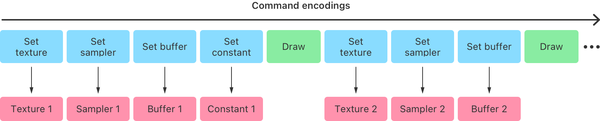
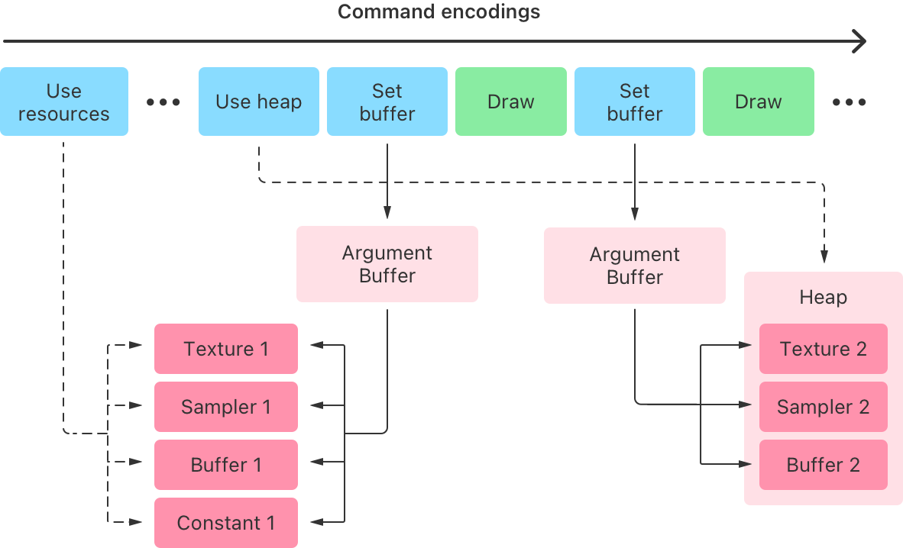

> Navigation: [Technologies](../technologies.md) · [Metal](../metal.md) · [Buffers](buffers.md)

# Managing groups of resources with argument buffers

<sub>Sample Code</sub>

Create argument buffers to organize related resources.

## Overview

An argument buffer represents a group of resources that you can collectively assign as an argument to a graphics or compute function. You use argument buffers to reduce CPU overhead, simplify resource management, and implement GPU-driven pipelines.

This sample code project shows how to specify, encode, set, and access resources in an argument buffer. In particular, you can learn about the advantages of managing groups of resources in an argument buffer instead of individual resources. The sample app renders a static quad using a texture, sampler, buffer, and constant that the renderer encodes into an argument buffer.

The Xcode project contains schemes for running the sample in macOS and iOS.  For each, it specifies targets for a Metal 2 and a Metal 3 version of the app.

### Reduce CPU overhead

Metal commands are efficient, and incur minimal CPU overhead when apps access the GPU. However, each command does incur some overhead, so the sample app uses the following strategies to further reduce that amount:

- Perform more GPU work with fewer CPU commands.
- Avoid repeating expensive CPU commands.

The Metal argument buffer feature reduces the number and performance cost of CPU commands in the sample app’s critical path, such as in the render loop. An argument buffer groups and encodes multiple resources within a single buffer instead of encoding each resource individually. By using argument buffers, the sample shifts a significant amount of CPU overhead from its critical path to its initial setup.

### Pack resources into argument buffers

Metal apps, particularly games, typically contain multiple 3D objects, each associated with a set of resources, such as textures, samplers, buffers, and constants. To render each object, the Metal apps encode commands that set these resources as arguments to a graphics function before issuing a draw call.

Metal apps set individual resources as arguments by calling [MTLRenderCommandEncoder](mtlrendercommandencoder.md) methods, such as [- setVertexBuffer:offset:atIndex:](<mtlrendercommandencoder/setvertexbuffer(__offset_index_).md>) or [- setFragmentTexture:atIndex:](<mtlrendercommandencoder/setfragmenttexture(__index_).md>) for each resource.



<sub>A layout diagram entitled “Encoded Comments” that depicts textures, samplers, buffers, and constants as individual arguments for different draw calls.</sub>

Commands that set individual resources can become numerous and expensive, especially for large apps or games. Instead, the sample app groups related resources into an argument buffer and then sets that entire buffer as a single argument to a graphics function. This approach greatly reduces CPU overhead and still provides individual GPU access to the resources.

`MTLBuffer` objects represent the argument buffers in the sample code. The sample code sets the objects as arguments by calling [MTLRenderCommandEncoder](mtlrendercommandencoder.md) methods, such as [- setVertexBuffer:offset:atIndex:](<mtlrendercommandencoder/setvertexbuffer(__offset_index_).md>) or [- setFragmentBuffer:offset:atIndex:](<mtlrendercommandencoder/setfragmentbuffer(__offset_index_).md>) for each argument buffer.



<sub>A layout diagram entitled “Encoded commands” that depicts encoded textures, samplers, buffers, and constants encoded as grouped arguments within an argument buffer, which is set as an individual argument for different draw calls.</sub>

> [!note] Note
> To access individual resources in an argument buffer, the sample code calls the `useResource:usage:` method for each resource that it uses. Additional information is available in the “Enable the GPU memory of resources in the argument buffer” section below.

### Define argument buffers

The Metal Shading Language defines argument buffers as custom structures. Each structure element represents an individual resource that the shader code declares as a texture, sampler, buffer, or constant data type.

The sample declares the argument buffer as a `FragmentShaderArguments` structure.

With Metal 2, the sample app associates an integer, which the shader code declares with the `[[id(n)]]` attribute qualifier to specify the index of the individual resources.  The Metal 2 target uses these identifiers to encode resources into a buffer.

**AAPLShaders.metal**

```metal
struct FragmentShaderArguments {
    texture2d<half> exampleTexture  [[ id(AAPLArgumentBufferIDExampleTexture)  ]];
    sampler         exampleSampler  [[ id(AAPLArgumentBufferIDExampleSampler)  ]];
    device float   *exampleBuffer   [[ id(AAPLArgumentBufferIDExampleBuffer)   ]];
    uint32_t        exampleConstant [[ id(AAPLArgumentBufferIDExampleConstant) ]];
};
```

This argument buffer contains the following resources:

- `exampleTexture`, a 2D texture with an index of `0`
- `exampleSampler`, a sampler with an index of `1`
- `exampleBuffer`, a `float` buffer with an index of `2`
- `exampleConstant`, a `uint32_t` constant with an index of `3`

With Metal 3, the sample app’s Objective-C code can write the resources directly to a buffer.  Because of this, the Metal 3 target defines  `FragmentShaderArguments` in a header it shares with the `AAPLRenderer` classes’ code.

**AAPLShaderTypes-Metal3.h**

```objective-c
struct FragmentShaderArguments {
    texture2d<half>  exampleTexture;
    sampler          exampleSampler;
    DEVICE float    *exampleBuffer;
    uint32_t         exampleConstant;
};
```

The following example’s fragment function, `fragmentShader`, uses the argument buffer as a single parameter:

**AAPLShaders.metal**

```metal
fragment float4
fragmentShader(       RasterizerData            in                 [[ stage_in ]],
               device FragmentShaderArguments & fragmentShaderArgs [[ buffer(AAPLFragmentBufferIndexArguments) ]])
```

The `fragmentShaderArgs` parameter is a buffer of type `FragmentShaderArguments`. When the sample code sets a `MTLBuffer` as an argument to the fragment function, the function interprets the data in the `fragmentShaderArgs` parameter as an argument buffer with a texture, sampler, buffer, and constant (as the `FragmentShaderArguments` structure defines).

### Encode resources into an argument buffer with Metal 2

With Metal 2, the renderer encodes individual resources into an argument buffer before a buffer accesses it. It accomplishes this by creating a `MTLArgumentBufferEncoder` from a `MTLFunction` that uses an argument buffer.

The following example creates a `MTLArgumentBufferEncoder` from the `fragmentShader` function, which contains the `fragmentShaderArgs` parameter:

**AAPLRenderer.mm**

```objective-c
id <MTLFunction> fragmentFunction = [defaultLibrary newFunctionWithName:@"fragmentShader"];

id <MTLArgumentEncoder> argumentEncoder =
    [fragmentFunction newArgumentEncoderWithBufferIndex:AAPLFragmentBufferIndexArguments];
```

The `encodedLength` property of `argumentEncoder` determines the size, in bytes, necessary to contain all the resources in the argument buffer. This example uses that value to create a new buffer, `_fragmentShaderArgumentBuffer`, with a `length` parameter that matches the required size for the argument buffer:

**AAPLRenderer.mm**

```objective-c
NSUInteger argumentBufferLength = argumentEncoder.encodedLength;

_fragmentShaderArgumentBuffer = [_device newBufferWithLength:argumentBufferLength options:0];
```

The following example calls the [- setArgumentBuffer:offset:](<mtlargumentencoder/setargumentbuffer(__offset_).md>) method to specify that `_fragmentShaderArgumentBuffer` is an argument buffer that the renderer can encode resources into:

**AAPLRenderer.mm**

```objective-c
[argumentEncoder setArgumentBuffer:_fragmentShaderArgumentBuffer offset:0];
```

The example below encodes individual resources into the argument buffer by:

- Calling specific methods for each resource type, such as `setTexture:atIndex:`, `setSamplerState:atIndex:`, and `setBuffer:offset:atIndex`.
- Matching the value of the `index` parameter to the value of the `[[id(n)]]` attribute qualifier the shader code declares for each element of the `FragmentShaderArguments` structure.

**AAPLRenderer.mm**

```objective-c
[argumentEncoder setTexture:_texture atIndex:AAPLArgumentBufferIDExampleTexture];
[argumentEncoder setSamplerState:_sampler atIndex:AAPLArgumentBufferIDExampleSampler];
[argumentEncoder setBuffer:_indirectBuffer offset:0 atIndex:AAPLArgumentBufferIDExampleBuffer];
```

The renderer encodes constants a bit differently.  It embeds constant data directly into the argument buffer, instead of storing the data in another object that the argument buffer points to. The renderer calls the [- constantDataAtIndex:](<mtlargumentencoder/constantdata(at_).md>) method to retrieve the address in the argument buffer where the constant resides. Then, it sets the actual value of the constant, `bufferElements`, at the retrieved address.

**AAPLRenderer.mm**

```objective-c
uint32_t *numElementsAddress =  (uint32_t *)[argumentEncoder constantDataAtIndex:AAPLArgumentBufferIDExampleConstant];

*numElementsAddress = bufferElements;
```

### Set resource handles in an argument buffer with Metal 3

With Metal 3, the renderer writes GPU resource handles directly into a buffer’s contents.

Because the sample code defines the `FragmentShaderArguments` structure in a header it shares with the `AAPLRenderer` source, the renderer determines the size necessary for the buffer by using the `sizeof` operator on the structure.

**AAPLRenderer.mm**

```objective-c
NSUInteger argumentBufferLength = sizeof(FragmentShaderArguments);

_fragmentShaderArgumentBuffer = [_device newBufferWithLength:argumentBufferLength options:0];
```

The following example writes to the buffer’s contents using the `gpuResourceID` property of the `MTLTexture` and `MTLSampler` objects, and the `gpuHandle` property of the `MTLBuffer` object.

**AAPLRenderer.mm**

```objective-c
FragmentShaderArguments *argumentStructure = (FragmentShaderArguments *)_fragmentShaderArgumentBuffer.contents;

argumentStructure->exampleTexture = _texture.gpuResourceID;
argumentStructure->exampleBuffer = (float*) _indirectBuffer.gpuAddress;
argumentStructure->exampleSampler = _sampler.gpuResourceID;
argumentStructure->exampleConstant = bufferElements;
```

### Enable the GPU memory of resources in the argument buffer

Metal efficiently manages memory accessed by the GPU. However, before the GPU uses any resource, Metal needs to ensure that the GPU has access to the resource’s memory. Setting resources individually by calling [MTLRenderCommandEncoder](mtlrendercommandencoder.md) methods, such as [- setVertexBuffer:offset:atIndex:](<mtlrendercommandencoder/setvertexbuffer(__offset_index_).md>) or [- setFragmentTexture:atIndex:](<mtlrendercommandencoder/setfragmenttexture(__index_).md>), ensures that the resource’s memory is accessible to the GPU.

However, when the renderer encodes resources into an argument buffer, setting the argument buffer doesn’t set each of its resources individually. Metal doesn’t determine what resource’s memory to make accessible to the GPU by inspecting the argument buffer. Instead, the renderer calls the [- useResource:usage:stages:](<mtlrendercommandencoder/useresource(__usage_stages_).md>) method to explicitly make a specific resource’s memory accessible to the GPU.

> [!note] Note
> Best practice is to call the [- useResource:usage:stages:](<mtlrendercommandencoder/useresource(__usage_stages_).md>) method once for each resource during the lifetime of an [MTLRenderCommandEncoder](mtlrendercommandencoder.md), even when using the resource in multiple draw calls. The [- useResource:usage:stages:](<mtlrendercommandencoder/useresource(__usage_stages_).md>) method is specific to argument buffers, but calling it is far less expensive than setting each resource individually.

### Set argument buffers

The following example calls the [- useResource:usage:stages:](<mtlrendercommandencoder/useresource(__usage_stages_).md>) method for the `_texture` and `_indirectBuffer` encoded resources in the argument buffer. These calls specify `MTLResourceUsage` values that further indicate which GPU operations to perform on each resource (the GPU samples the texture and reads the buffer):

**AAPLRenderer.mm**

```objective-c
[renderEncoder useResource:_texture usage:MTLResourceUsageRead stages:MTLRenderStageFragment];
[renderEncoder useResource:_indirectBuffer usage:MTLResourceUsageRead stages:MTLRenderStageFragment];
```

> [!note] Note
> The [- useResource:usage:stages:](<mtlrendercommandencoder/useresource(__usage_stages_).md>) method doesn’t apply to samplers or constants because they’re not [MTLResource](mtlresource.md) instances.

The following example sets only `_fragmentShaderArgumentBuffer` as an argument to the fragment function. It doesn’t set the `_texture`, `_indirectBuffer`, `_sampler`, or `bufferElements` resources individually. This command allows the fragment function to access the argument buffer and its encoded resources:

**AAPLRenderer.mm**

```objective-c
[renderEncoder setFragmentBuffer:_fragmentShaderArgumentBuffer
                          offset:0
                         atIndex:AAPLFragmentBufferIndexArguments];
```

### Access the resources in an argument buffer

Within a function, accessing encoded resources in an argument buffer is similar to accessing individual resources directly. The main difference is that the function accesses the resources as elements of the argument buffer structure.

In the following example, the `fragmentShaderArgs` parameter of the `fragmentShader` function accesses the argument buffer resources:

**AAPLShaders.metal**

```metal
// Get the encoded sampler from the argument buffer.
sampler exampleSampler = fragmentShaderArgs.exampleSampler;

// Sample the encoded texture in the argument buffer.
half4 textureSample = fragmentShaderArgs.exampleTexture.sample(exampleSampler, in.texCoord);

// Use the fragment position and the encoded constant in the argument buffer to calculate an array index.
uint32_t index = (uint32_t)in.position.x % fragmentShaderArgs.exampleConstant;

// Index into the encoded buffer in the argument buffer.
float colorScale = fragmentShaderArgs.exampleBuffer[index];
```

The example uses all four resources in the argument buffer to produce the final color for each fragment.

### Combine argument buffers with a resource heap

The [Using argument buffers with resource heaps](using-argument-buffers-with-resource-heaps.md) sample code project demonstrates how to combine argument buffers with arrays of resources and resource heaps. This further reduces CPU overhead.

## See Also

### Argument buffers

- [Improving CPU performance by using argument buffers](improving-cpu-performance-by-using-argument-buffers.md) — Optimize your app’s performance by grouping your resources into argument buffers.
- [Tracking the resource residency of argument buffers](tracking-the-resource-residency-of-argument-buffers.md) — Optimize resource performance within an argument buffer.
- [Indexing argument buffers](indexing-argument-buffers.md) — Assign resource indices within an argument buffer.
- [Rendering terrain dynamically with argument buffers](rendering-terrain-dynamically-with-argument-buffers.md) — Use argument buffers to render terrain in real time with a GPU-driven pipeline.
- [Encoding argument buffers on the GPU](encoding-argument-buffers-on-the-gpu.md) — Use a compute pass to encode an argument buffer and access its arguments in a subsequent render pass.
- [Using argument buffers with resource heaps](using-argument-buffers-with-resource-heaps.md) — Reduce CPU overhead by using arrays inside argument buffers and combining them with resource heaps.
- [MTLArgumentDescriptor](mtlargumentdescriptor.md) — A representation of an argument within an argument buffer.
- [MTLArgumentEncoder](mtlargumentencoder.md) — An interface you can use to encode argument data into an argument buffer.
- [MTLAttributeStrideStatic](mtlattributestridestatic.md)

## Download

- [ManagingGroupsOfResourcesWithArgumentBuffers.zip](https://docs-assets.developer.apple.com/published/16dcfbb48cec/ManagingGroupsOfResourcesWithArgumentBuffers.zip)
