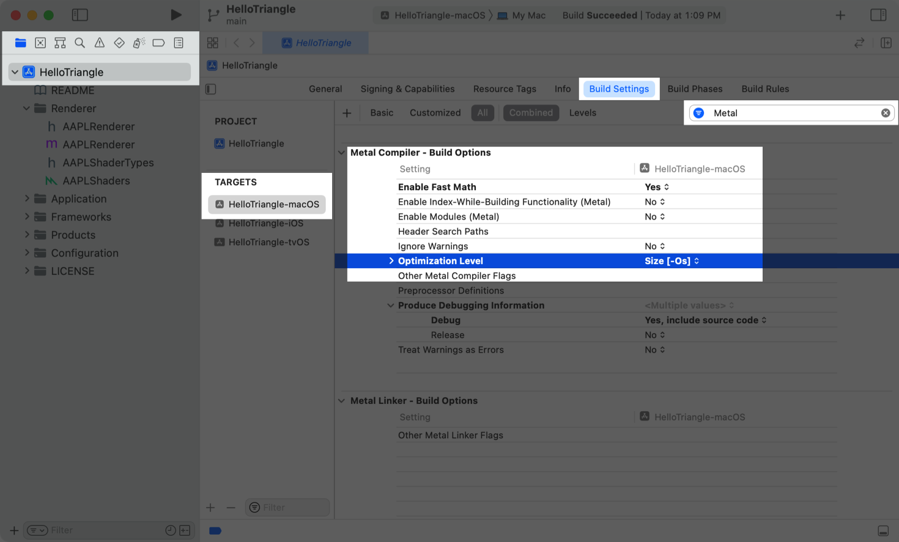

> Navigation: [Technologies](../technologies.md) · [Metal](../metal.md) · [Shader libraries](shader-libraries.md) · [Metal libraries](metal-libraries.md)

# Minimizing the binary size of a shader library

<sub>Article</sub>

Reduce the storage footprint of your shaders, and potentially reduce their compile time, by selecting the Metal compiler’s size optimization option.

## Overview

By default, the Metal compiler optimizes your shader code for runtime speed. For example, the compiler may use _inlining_ or _loop unrolling_, techniques that make copies of executable code to avoid branch penalties at runtime. Depending on the specifics of your shader code, these runtime-optimization efforts can significantly increase your shader library’s binary size and your shaders’ compile time.

You can change the compiler’s optimization setting so that it prioritizes minimizing a binary’s size. The compiler avoids the techniques that duplicate code, minimizing your shader library’s size and typically shortening compile time as well.

A shader library’s binary size, compile time performance, and runtime performance depend largely on the code’s complexity. Check to see which of the shader compiler’s optimization settings work best for your app and workflow. Consider using the Metal compiler’s size optimization option if the compilation generates binaries that are too big for your app or take too long to compile.

You can set the Metal compiler’s size optimization option in the following ways:

- In Xcode 14 or later
- From the command line
- At runtime using the Metal API

The simplest way to compile your shaders is to have Xcode compile them along with the rest of your app. As your shaders increase in complexity, size, or build time, you may consider precompiling them with the Metal command-line tools to avoid compiling them in Xcode. Some apps may need to compile shaders on the device, at runtime, with the Metal API.

### Compile shaders at build time

To optimize for size while compiling shaders at build time, set the Metal compiler’s size optimization setting in Xcode:

1. Click a build target in your project.
2. Click the Builds Settings tab, and filter for the Metal compiler.
3. Under Metal Compiler - Build Options, set the Optimization Level to `Size [-Os]`.



<sub>A screenshot of an Xcode window that’s open to the macOS target’s build settings for the Hello Triangle sample app. The Optimization Level setting for the Metal compiler is set to </sub>

Xcode passes this setting to the Metal compiler each time you build a target that includes shader code.

### Precompile shaders on the command line

For apps that use numerous or complex shaders, consider precompiling your shaders outside of Xcode to save build time each time you compile your app. For more information on manually compiling your shader library, see [Building a shader library by precompiling source files](building-a-shader-library-by-precompiling-source-files.md).

To optimize for size when compiling a Metal shader source file in a command-line environment, such as Terminal, use the Metal compiler’s `-Os` optimization option.

```shell
% xcrun -sdk macosx metal -Os Shadows.metal
```

> [!note] Note
> This example uses the `macosx` SDK, but you can use any SDK your app targets.

### Compile shaders at runtime

If you want to compile shaders at runtime, your app can configure the Metal API to optimize for size. For some apps, it may be more practical to compile a shader on the device when the app is running, typically to reduce the app’s storage size. You can also compile shaders at runtime for rapid prototyping and debugging.

This approach reduces your app’s build time by deferring its shader compilation to when your app runs on a person’s device, but your app may take noticeably longer to load on initial launches.

To minimize binary size when compiling a shader library on a device:

1. Create an [MTLCompileOptions](mtlcompileoptions.md) instance.
2. Set its [optimizationLevel](mtlcompileoptions/optimizationlevel.md) property to [MTLLibraryOptimizationLevelSize](mtllibraryoptimizationlevel/size.md).
3. Compile your library with an [MTLDevice](mtldevice.md) instance’s [- newLibraryWithSource:options:error:](<mtldevice/makelibrary(source_options_).md>) or [- newLibraryWithSource:options:completionHandler:](<mtldevice/makelibrary(source_options_completionhandler_).md>) method.

## See Also

### Working with Metal intermediate representation libraries

- [Building a shader library by precompiling source files](building-a-shader-library-by-precompiling-source-files.md) — Create a shader library that you can add to an Xcode project with the Metal compiler tools in a command-line environment.
- [Generating and loading a Metal library symbol file](generating-and-loading-a-metal-library-symbol-file.md) — Debug your Metal shaders from your production apps by creating companion symbol files at compile time and loading them at debug time.
