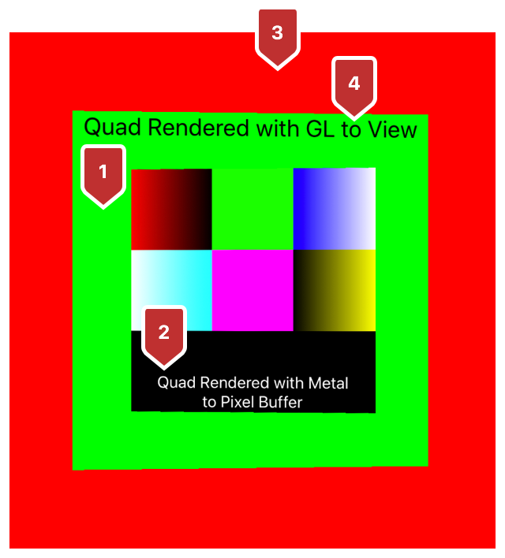
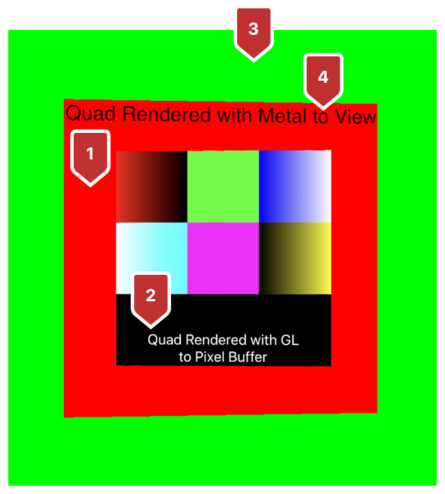

> Navigation: [Technologies](../technologies.md) · [Metal](../metal.md) · [Metal sample code library](metal-sample-code-library.md)

# Mixing Metal and OpenGL rendering in a view

<sub>Sample Code</sub>

Draw with Metal and OpenGL in the same view using an interoperable texture.

## Overview

If you’re developing a new app and migrating legacy OpenGL code to Metal, interoperable textures make it easy for you to see the results live as you go.

You can render Metal or OpenGL content into either view by initializing a [CVPixelBuffer](../corevideo/cvpixelbuffer-q2e.md) that operates as an interoperable texture. When you enable the pixel buffer’s Metal and OpenGL compatibility flags, the textures are capable of being drawn to—and presented by—either rendering technology.

If you’re working with an app you’ve already deployed, the interoperable textures give you the option of incrementally releasing updates throughout the porting process.

### Getting started

Interoperating with Metal and OpenGL requires macOS 10.13 or greater or iOS 11 or greater.

### Select a compatible pixel format

To create an interoperable texture, select a Core Video  pixel format, a Metal pixel format, and an OpenGL internal format that are compatible with each other. This sample provides you with a table preloaded with compatible options, and selects one based on the desired Metal pixel format:

**AAPLOpenGLMetalInteropTexture.m**

```objective-c
for(int i = 0; i < AAPLNumInteropFormats; i++) {
    if(pixelFormat == AAPLInteropFormatTable[i].mtlFormat) {
        return &AAPLInteropFormatTable[i];
    }
}
```

### Create an interoperable texture

Use a `CVPixelBuffer` as an interoperable texture to get a shared memory backing that’s synchronized across both renderers. To create the `CVPixelBuffer`, provide your Core Video  pixel format and enable OpenGL and Metal compatibility:

**AAPLOpenGLMetalInteropTexture.m**

```objective-c
NSDictionary* cvBufferProperties = @{
    (__bridge NSString*)kCVPixelBufferOpenGLCompatibilityKey : @YES,
    (__bridge NSString*)kCVPixelBufferMetalCompatibilityKey : @YES,
};
CVReturn cvret = CVPixelBufferCreate(kCFAllocatorDefault,
                        size.width, size.height,
                        _formatInfo->cvPixelFormat,
                        (__bridge CFDictionaryRef)cvBufferProperties,
                        &_CVPixelBuffer);
```

### Create an OpenGL texture from the pixel buffer in macOS

Start by creating an OpenGL Core Video texture cache from the pixel buffer:

**AAPLOpenGLMetalInteropTexture.m**

```objective-c
cvret  = CVOpenGLTextureCacheCreate(
                kCFAllocatorDefault,
                nil,
                _openGLContext.CGLContextObj,
                _CGLPixelFormat,
                nil,
                &_CVGLTextureCache);
```

Then, create a `CVPixelBuffer`-backed OpenGL texture image from the texture cache:

**AAPLOpenGLMetalInteropTexture.m**

```objective-c
cvret = CVOpenGLTextureCacheCreateTextureFromImage(
                kCFAllocatorDefault,
                _CVGLTextureCache,
                _CVPixelBuffer,
                nil,
                &_CVGLTexture);
```

Finally, get an OpenGL texture name from the `CVPixelBuffer`-backed OpenGL texture image:

**AAPLOpenGLMetalInteropTexture.m**

```objective-c
_openGLTexture = CVOpenGLTextureGetName(_CVGLTexture);
```

### Create an OpenGL ES texture from the pixel buffer in iOS

Start by creating an OpenGL `ES` Core Video  texture cache from the pixel buffer:

**AAPLOpenGLMetalInteropTexture.m**

```objective-c
cvret = CVOpenGLESTextureCacheCreate(kCFAllocatorDefault,
                nil,
                _openGLContext,
                nil,
                &_CVGLTextureCache);
```

Then, create a `CVPixelBuffer`-backed OpenGL `ES` texture image from the texture cache:

**AAPLOpenGLMetalInteropTexture.m**

```objective-c
cvret = CVOpenGLESTextureCacheCreateTextureFromImage(kCFAllocatorDefault,
                _CVGLTextureCache,
                _CVPixelBuffer,
                nil,
                GL_TEXTURE_2D,
                _formatInfo->glInternalFormat,
                _size.width, _size.height,
                _formatInfo->glFormat,
                _formatInfo->glType,
                0,
                &_CVGLTexture);
```

Finally, get an OpenGL `ES` texture name from the `CVPixelBuffer`-backed OpenGL `ES` texture image:

**AAPLOpenGLMetalInteropTexture.m**

```objective-c
_openGLTexture = CVOpenGLESTextureGetName(_CVGLTexture);
```

### Create a Metal texture from the pixel buffer

Start by instantiating a Metal texture cache as follows:

**AAPLOpenGLMetalInteropTexture.m**

```objective-c
cvret = CVMetalTextureCacheCreate(
                kCFAllocatorDefault,
                nil,
                _metalDevice,
                nil,
                &_CVMTLTextureCache);
```

Then, create a `CVPixelBuffer`-backed Metal texture image from the texture cache:

**AAPLOpenGLMetalInteropTexture.m**

```objective-c
cvret = CVMetalTextureCacheCreateTextureFromImage(
                kCFAllocatorDefault,
                _CVMTLTextureCache,
                _CVPixelBuffer, nil,
                _formatInfo->mtlFormat,
                _size.width, _size.height,
                0,
                &_CVMTLTexture);
```

Finally, get a Metal texture using the Core Video  Metal texture reference:

**AAPLOpenGLMetalInteropTexture.m**

```objective-c
_metalTexture = CVMetalTextureGetTexture(_CVMTLTexture);
```

### Draw Metal content in an OpenGL view

When porting your app, statement by statement, begin by using Metal to render into an interoperable pixel buffer that OpenGL can draw. Each item in the following list describes the corresponding numbered area in the figure that follows:

1. Metal clears the interoperable texture by applying a green color.
2. Metal renders a quad with white text and color swatch onto the interoperable texture.
3. OpenGL clears the background by applying a red color.
4. OpenGL renders a quad with black text and the interoperable texture.



<sub>Screenshot of the app showing, in the background, a red color cleared by OpenGL, a green quad cleared by Metal with a black text overlay rendered by OpenGL, and a color swatch with white text rendered by Metal.</sub>

### Draw OpenGL content in a Metal view

Draw OpenGL content into a Metal view when you’re ready to use Metal but have some legacy OpenGL code that you intend to port incrementally. Each item in the following list describes the corresponding numbered area in the figure that follows:

1. OpenGL clears the interoperable texture by applying a red color.
2. OpenGL renders a quad with white text and color swatch onto the interoperable texture.
3. Metal clears the background by applying a green color.
4. Metal renders a quad with black text and the interoperable texture.



<sub>Screenshot of the app showing, in the background, a green color cleared by Metal, a red quad cleared by OpenGL with a black text overlay rendered by Metal, and a color swatch with white text rendered by OpenGL.</sub>

## See Also

### OpenGL

- [Migrating OpenGL code to Metal](migrating-opengl-code-to-metal.md) — Replace your app’s deprecated OpenGL code with Metal.

## Download

- [MixingMetalAndOpenGLRenderingInAView.zip](https://docs-assets.developer.apple.com/published/84862c7e7ce1/MixingMetalAndOpenGLRenderingInAView.zip)
