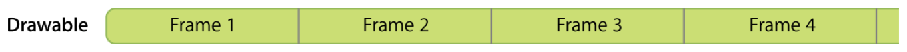
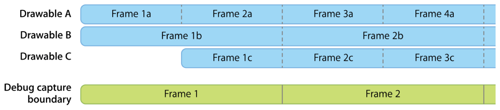

> Navigation: [Technologies](../../technologies.md) · [Metal](../../metal.md) · [MTLCommandQueue](../mtlcommandqueue.md)

# insertDebugCaptureBoundary()

<sub>Instance Method</sub>

Informs Xcode about when GPU Frame Capture starts and stops.

> [!warning] Deprecated
> Use [MTLCaptureManager](../mtlcapturemanager.md) and [MTLCaptureScope](../mtlcapturescope.md) instead. See [Naming resources and commands](../../xcode/naming-resources-and-commands.md) for more information.

<sub>iOS, iPadOS, Mac Catalyst, macOS, tvOS, visionOS</sub>

```swift
func insertDebugCaptureBoundary()
```

## Discussion

You can explicitly define the boundary between two GPU captures by calling this method, which overrides the default behavior in Xcode when you caputre a GPU frame. If your app doesn’t call the method, Xcode adds a frame boundary each time your app calls the [- presentDrawable:](<../mtlcommandbuffer/present(__).md>) or [- presentDrawable:atTime:](<../mtlcommandbuffer/present(__attime_).md>) methods.

For example, an app with a single drawable may not need this method because the default behavior’s implicit frame boundaries are appropriate for that scenario.



<sub>A timeline diagram that shows a single drawable that presents a sequence of four frames at regular intervals, each of which implicitly creates a frame capture.</sub>

However, you may want to create explicit frame boundaries for apps with multiple drawables that produce frames at different rates.



<sub>A timeline diagram that shows three drawables, each of which presents their own sequence of frames at regular, but differing, intervals from each other. Drawable A presents four frames in the time span, Drawable B presents two frames, and Drawable C presents three frames, the first of which starts at the same time as  Drawable A’s second frame.</sub>

In this example scenario, the app uses three drawables, each of which presents their frames at different rates or times. The developer can use this method to add arbitrary boundaries that create two captures. The first capture contains the first two frames from Drawable A, the first frame from Drawable B, and the first frame from Drawable C. The second capture contains the third and fourth frames from Drawable A, the second frame from Drawable B, and the second and third frames from Drawable C.

> [!warning] Warning
> Don’t call this method from within the completion handler you pass to [- addCompletedHandler:](<../mtlcommandbuffer/addcompletedhandler(__).md>) because it can trigger a deadlock when you capture a GPU frame.
