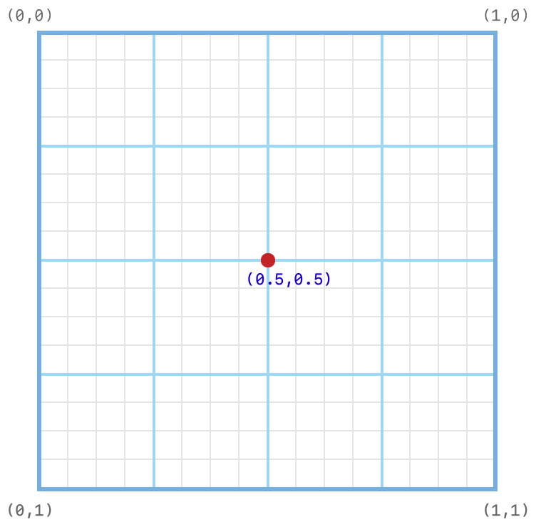
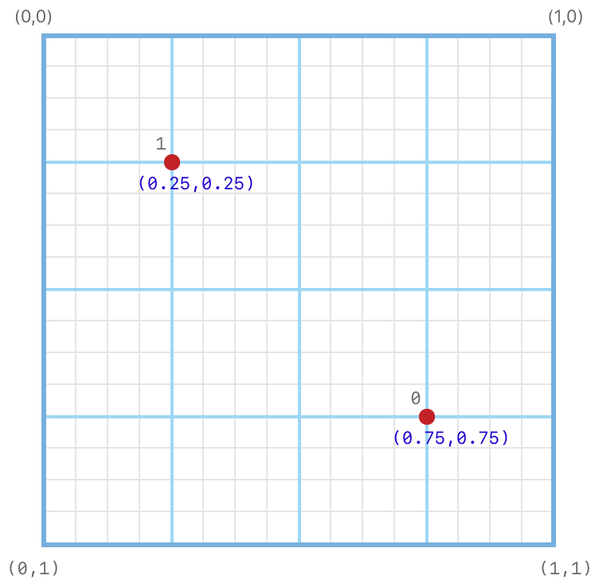
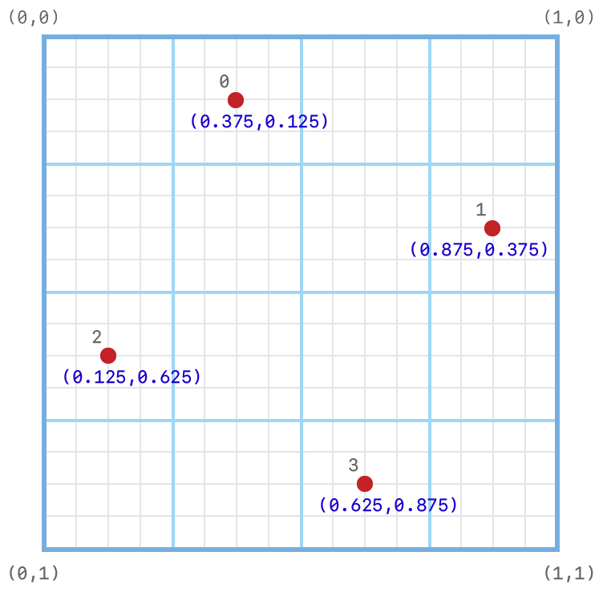
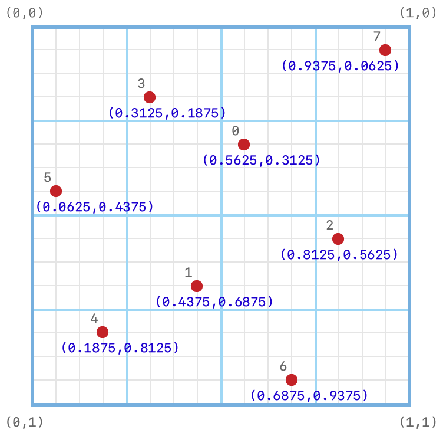

> Navigation: [Technologies](../../technologies.md) · [Metal](../../metal.md) · [MTLDevice](../mtldevice.md)

# getDefaultSamplePositions:count:

<sub>Instance Method</sub>

Retrieves the default sample positions for a specific sample count.

<sub>iOS, iPadOS, Mac Catalyst, macOS, tvOS, visionOS</sub>

```objc
- (void) getDefaultSamplePositions:(MTLSamplePosition *) positions count:(NSUInteger) count;
```

## Parameters

- `positions` — A pointer to a destination C array of [MTLSamplePosition](../mtlsampleposition.md) instances — with at least `count` elements — the method writes the default positions to.

- `count` — The number of points a GPU can sample from a texture. Ensure the GPU can support the `count` value by first calling the device’s [- supportsTextureSampleCount:](<supportstexturesamplecount(__).md>) method.

## Discussion

The default sample positions are the same on all GPUs that support programmable sample positions (see [programmableSamplePositionsSupported](areprogrammablesamplepositionssupported.md)).

> [!note] Note
> GPUs that don’t support programmable sample positions may have different default sample positions that you can’t retrieve.

The default sample position for GPUs that can sample one time is at the pixel’s center.



<sub>Normalized coordinate system diagram that shows a subpixel grid with one point at the center, with coordinates zero-.5, zero-0.5.</sub>

The default sample positions for GPUs that can sample two times have locations in the center of the pixel’s second quadrant and fourth quadrants.



<sub>Normalized coordinate system diagram that shows a subpixel grid with two points, one located at zero-.25, zero-0.25. and the other at zero-.75, zero-0.75.</sub>

The default sample positions for GPUs that can sample four times have one location in each of the pixel’s quadrants. Each location is at the center of one of that quadrant’s subquadrants.



<sub>Normalized coordinate system diagram that shows a subpixel grid with four points. Each of the pixel’s four quadrants contains one point.</sub>

The default sample positions for GPUs that can sample eight times have two locations in each of the pixel’s quadrants.



<sub>Normalized coordinate system diagram that shows a subpixel grid with four points. Each of the pixel’s four quadrants contains two points. </sub>

The table lists the indices and default locations for GPUs that support 1, 2, 4, or 8 sample positions.

| Sample count | Position indices | Subpixel coordinates |
|---|---|---|
| 1 | 0 | (0.5, 0.5) |
| 2 | 0  1 | (0.75, 0.75)  (0.25, 0.25) |
| 4 | 0  1  2  3 | (0.375, 0.125)  (0.875, 0.375)  (0.125, 0.625)  (0.625, 0.875) |
| 8 | 0  1  2  3  4  5  6  7 | (0.5625, 0.3125)  (0.4375, 0.6875)  (0.8125, 0.5625)  (0.3125, 0.1875)  (0.1875, 0.8125)  (0.0625, 0.4375)  (0.6875, 0.9375)  (0.9375, 0.0625) |

## See Also

### Creating samplers

- [- supportsTextureSampleCount:](<supportstexturesamplecount(__).md>) — Returns a Boolean value that indicates whether the GPU can sample a texture with a specific number of sample points.
- [- newSamplerStateWithDescriptor:](<makesamplerstate(descriptor_).md>) — Creates a sampler state instance.
