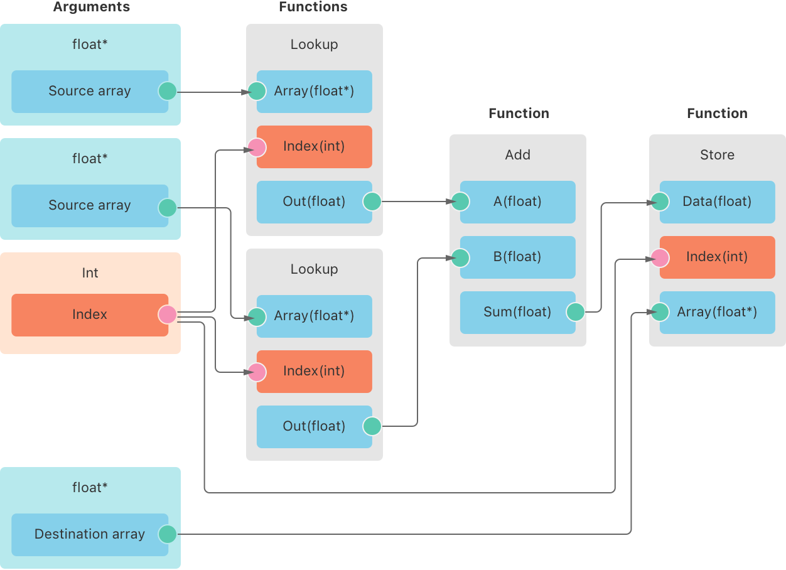

> Navigation: [Technologies](../technologies.md) · [Metal](../metal.md)

# MTLFunctionStitchingGraph

<sub>Class</sub>

A description of a new stitched function.

<sub>iOS, iPadOS, Mac Catalyst, macOS, tvOS, visionOS</sub>

```swift
class MTLFunctionStitchingGraph
```

## Overview

An [MTLFunctionStitchingGraph](mtlfunctionstitchinggraph.md) instance describes the function graph for a stitched function. A _stitched function_ is a visible function you create by composing other Metal shader functions together in a function graph. A function stitching graph contains nodes for the function’s arguments and any functions it calls in the implementation. Data flows from the arguments to the end of the graph until the stitched function evaluates all of the graph’s nodes.

The graph in the figure below constructs a new function that adds numbers from two source arrays, storing the result in a third array. The function’s parameters are pointers to the source and destination arrays, and an index for performing the array lookup. The graph uses three separate MSL functions to construct the stitched function: a function to look up a value from an array, a function that adds two numbers together, and a function that stores a value to an array.



<sub>A function graph with four columns. The first column shows the function’s arguments, which consist of two source arrays, an index, and a destination array. The second column shows two function calls to look up numbers in the source arrays in the first column. The third column shows a function call to add the numbers, and the final column calls a function to store the sum to the destination array in the first column.</sub>

Create an [MTLFunctionStitchingGraph](mtlfunctionstitchinggraph.md) instance for each stitched function you want to create. Configure its properties to describe the new function and the nodes that define its behavior, as described below. To create a new library with these stitched functions, see [MTLStitchedLibraryDescriptor](mtlstitchedlibrarydescriptor.md).

### Configuring a function stitching graph

To create a valid stitched function, the function stitching graph and shader code need to meet some requirements:

- Implement the MSL functions that you use to create the new function, adding the `stitchable` attribute to each. Stitchable functions are visible functions that you can also use in a function graph. Stitchable functions may require the compiler to do additional work or emit larger instance code, so mark functions as stitchable only when necessary.
- Declare the stitched function’s name and signature in a header file to include in any shader code that calls the new function. Alternatively, you can add the function to a function table with a matching type and pass the function table as an argument.
- Create an [MTLFunctionStitchingInputNode](mtlfunctionstitchinginputnode.md) node for each of the function’s arguments, specifying which parameter each node references. The output type of each input node is the type of that parameter in your function signature.
- Create an [MTLFunctionStitchingFunctionNode](mtlfunctionstitchingfunctionnode.md) for each function the implementation calls. A function node’s output type is the return type of the MSL function.
- Make sure the output types of each node match the types of the node they pass to. For example, if a function takes a `float` parameter, the node that provides that data need to output a `float` value. If you don’t match the types correctly, Metal doesn’t define the behavior of the resulting function.
- Create an array from the node instances and assign it to the [nodes](mtlfunctionstitchinggraph/nodes.md) property.
- If the function produces an output, create another node and assign it to the [outputNode](mtlfunctionstitchinggraph/outputnode.md) property. The output type of this node needs to match the function’s return type. Don’t include this node in the array of nodes you assign to the [nodes](mtlfunctionstitchinggraph/nodes.md) property.

The MSL code below implements the functions in the example graph above, as well as the function’s signature:

```metal
[[stitchable]] float add(float a, float b)
{
    return a + b;
}

[[stitchable]] float lookup(const constant float *a, uint index)
{
    return a[index];
}

[[stitchable]] float store(float value, device float *a, uint index)
{
    a[index] = value;
}

// The output function declaration.
[[visible]] void add_arrays(constant float *a, constant float *b, device float*c, uint tid);
```

The following code creates the graph above:

**Swift**

```swift
// Load the functions from the library.
let functions = [
    library.makeFunction(name: "add"),
    library.makeFunction(name: "lookup"),
    library.makeFunction(name: "store")
]

// Create nodes for the input parameters.
let srcA = MTLFunctionStitchingInputNode.init(argumentIndex: 0)
let srcB = MTLFunctionStitchingInputNode.init(argumentIndex: 1)
let dest = MTLFunctionStitchingInputNode.init(argumentIndex: 2)
let index = MTLFunctionStitchingInputNode.init(argumentIndex: 3)

// Create nodes for the functions.
let lookup_a = MTLFunctionStitchingFunctionNode.init(name: "read", arguments: [srcA, index], controlDependencies: [])
let lookup_b = MTLFunctionStitchingFunctionNode.init(name: "read", arguments: [srcB, index], controlDependencies: [])
let sum = MTLFunctionStitchingFunctionNode.init(name: "add", arguments: [lookup_a, lookup_b], controlDependencies: [])
let store = MTLFunctionStitchingFunctionNode.init(name: "store", arguments: [sum, dest, index], controlDependencies: [])

// Create the stitching graph.
let graph = MTLFunctionStitchingGraph.init(functionName: "add_arrays", nodes: [lookup_a, lookup_b, sum, store], outputNode: nil, attributes: [])
```

**Objective-C**

```objective-c
// Load the functions from the library.
NSArray *functions = @[
    [library newFunctionWithName:@"add"],
    [library newFunctionWithName:@"lookup"],
    [library newFunctionWithName:@"store"],
];

// Create nodes for the input parameters.
MTLFunctionStitchingInputNode *srcA = [[MTLFunctionStitchingInputNode alloc] initWithArgumentIndex:0];
MTLFunctionStitchingInputNode *srcB = [[MTLFunctionStitchingInputNode alloc] initWithArgumentIndex:1];
MTLFunctionStitchingInputNode *dest = [[MTLFunctionStitchingInputNode alloc] initWithArgumentIndex:2];
MTLFunctionStitchingInputNode *index = [[MTLFunctionStitchingInputNode alloc] initWithArgumentIndex:3];

// Create nodes for the functions.
MTLFunctionStitchingFunctionNode *lookup_a =
    [[MTLFunctionStitchingFunctionNode alloc] initWithName:@"read" arguments:@[srcA, index] controlDependencies:@[]];
MTLFunctionStitchingFunctionNode *lookup_b =
    [[MTLFunctionStitchingFunctionNode alloc] initWithName:@"read" arguments:@[srcB, index] controlDependencies:@[]];
MTLFunctionStitchingFunctionNode *sum =
    [[MTLFunctionStitchingFunctionNode alloc] initWithName:@"add" arguments:@[lookup_a, lookup_b] controlDependencies:@[]];
MTLFunctionStitchingFunctionNode *store =
    [[MTLFunctionStitchingFunctionNode alloc] initWithName:@"store" arguments:@[sum, dest, index] controlDependencies:@[]];

// Create the stitching graph.
MTLFunctionStitchingGraph *graph =
    [[MTLFunctionStitchingGraph alloc] initWithFunctionName:@"add_arrays" nodes:@[lookup_a, lookup_b, sum, store]
                                                 outputNode:nil attributes:@[]];
```

## Relationships

- **Inherits From**: [NSObject](../objectivec/nsobject-swift.class.md)

- **Conforms To**: [CVarArg](../swift/cvararg.md), [CustomDebugStringConvertible](../swift/customdebugstringconvertible.md), [CustomStringConvertible](../swift/customstringconvertible.md), [Equatable](../swift/equatable.md), [Hashable](../swift/hashable.md), [NSCopying](../foundation/nscopying.md), [NSObjectProtocol](../objectivec/nsobjectprotocol.md)

## Topics

### Initializing a function graph

- [- initWithFunctionName:nodes:outputNode:attributes:](<mtlfunctionstitchinggraph/init(functionname_nodes_outputnode_attributes_).md>) — Creates a description of a new function call graph.

### Configuring a function graph

- [functionName](mtlfunctionstitchinggraph/functionname.md) — The name of the new stitched function.
- [nodes](mtlfunctionstitchinggraph/nodes.md) — The nodes in the function’s call graph.
- [outputNode](mtlfunctionstitchinggraph/outputnode.md) — The node with the output that’s the output of the new stitched function.
- [attributes](mtlfunctionstitchinggraph/attributes.md) — A list of attributes to configure how the Metal device object generates the new stitched function.

## See Also

### Stitched function libraries

- [Customizing shaders using function pointers and stitching](customizing-shaders-using-function-pointers-and-stitching.md) — Define custom shader behavior at runtime by creating functions from existing ones and preferentially linking to others in a dynamic library.
- [MTLStitchedLibraryDescriptor](mtlstitchedlibrarydescriptor.md) — A description of a new library of procedurally generated functions.
- [MTLFunctionStitchingInputNode](mtlfunctionstitchinginputnode.md) — A call graph node that describes an input to the call graph.
- [MTLFunctionStitchingFunctionNode](mtlfunctionstitchingfunctionnode.md) — A call graph node that describes a function call and its inputs.
- [MTLFunctionStitchingNode](mtlfunctionstitchingnode.md) — A protocol to identify call graph nodes.
- [MTLFunctionStitchingAttributeAlwaysInline](mtlfunctionstitchingattributealwaysinline.md) — An attribute to specify that Metal needs to inline all of the function calls when generating the stitched function.
- [MTLFunctionStitchingAttribute](mtlfunctionstitchingattribute.md) — A protocol to identify types that customize how the Metal compiler stitches a function together.
