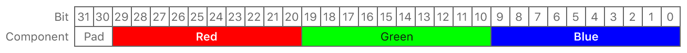

> Navigation: [Technologies](../../technologies.md) · [Metal](../../metal.md) · [MTLPixelFormat](../mtlpixelformat.md)

# MTLPixelFormat.bgr10_xr

<sub>Case</sub>

A 32-bit extended-range pixel format with three fixed-point components of 10-bit blue, 10-bit green, and 10-bit red.

<sub>iOS, iPadOS, Mac Catalyst, macOS, tvOS, visionOS</sub>

```swift
case bgr10_xr
```

## Discussion

Pixel components are in blue, green, and red order, from least significant bit to most significant bit. Bits 30 and 31 are padding, and their value is `0`.



<sub>Bit layout diagram showing the pixel data storage arrangement of the bgr10_xr pixel format. The blue component is stored in bits 0 to 9, the green component is stored in bits 10 to 19, the red component is stored in bits 20 to 29, and bits 30 to 31 are used as padding.</sub>

Components are linearly encoded in a transform from `[0,2^10)` to [`-0.752941, 1.25098]`. The formula used in this linear encoding is `shader_float = (xr10_value - 384) / 510.0f`.

> [!tip] Tip
> Each UNorm8-based pixel value has an exact corresponding value in the XR10 pixel range, given by `xr10_value = unorm8_value * 2 + 384`.

To display wide color values on devices with wide color displays, set this pixel format on the [colorPixelFormat](../../metalkit/mtkview/colorpixelformat.md) property of an [MTKView](../../metalkit/mtkview.md) or the [pixelFormat](../../quartzcore/cametallayer/pixelformat.md) property of a [CAMetalLayer](../../quartzcore/cametallayer.md).

> [!note] Note
> Only devices with a wide color display can display color values outside the `[0.0, 1.0]` range; all other devices clamp color values to the `[0.0, 1.0]` range.

## See Also

### Extended range and wide color pixel formats

- [MTLPixelFormatBGRA10_XR](bgra10_xr.md) — A 64-bit extended-range pixel format with four fixed-point components of 10-bit blue, 10-bit green, 10-bit red, and 10-bit alpha.
- [MTLPixelFormatBGRA10_XR_sRGB](bgra10_xr_srgb.md) — A 64-bit extended-range pixel format with sRGB conversion and four fixed-point components of 10-bit blue, 10-bit green, 10-bit red, and 10-bit alpha.
- [MTLPixelFormatBGR10_XR_sRGB](bgr10_xr_srgb.md) — A 32-bit extended-range pixel format with sRGB conversion and three fixed-point components of 10-bit blue, 10-bit green, and 10-bit red.
