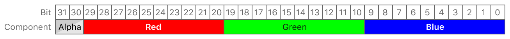

> Navigation: [Technologies](../../technologies.md) · [Metal](../../metal.md) · [MTLPixelFormat](../mtlpixelformat.md)

# MTLPixelFormat.bgr10a2Unorm

<sub>Case</sub>

A 32-bit packed pixel format with four normalized unsigned integer components: 10-bit blue, 10-bit green, 10-bit red, and 2-bit alpha.

<sub>iOS, iPadOS, Mac Catalyst, macOS, tvOS, visionOS</sub>

```swift
case bgr10a2Unorm
```

## Discussion

Pixel data is stored in blue, green, red, and alpha order, from least significant bit to most significant bit.



<sub>Bit layout diagram showing the pixel data storage arrangement of the bgr10a2Unorm pixel format. The blue component is stored in bits 0 to 9, the green component is stored in bits 10 to 19, the red component is stored in bits 20 to 29, and the alpha component is stored in bits 30 to 31.</sub>

On devices with a wide color display, use this format instead of [MTLPixelFormatBGRA8Unorm](bgra8unorm.md) to reduce banding artifacts in your displayed content.

## See Also

### Packed 32-bit pixel formats

- [MTLPixelFormatRGB10A2Unorm](rgb10a2unorm.md) — A 32-bit packed pixel format with four normalized unsigned integer components: 10-bit red, 10-bit green, 10-bit blue, and 2-bit alpha.
- [MTLPixelFormatRGB10A2Uint](rgb10a2uint.md) — A 32-bit packed pixel format with four unsigned integer components: 10-bit red, 10-bit green, 10-bit blue, and 2-bit alpha.
- [MTLPixelFormatRG11B10Float](rg11b10float.md) — 32-bit format with floating-point color components, 11 bits each for red and green and 10 bits for blue.
- [MTLPixelFormatRGB9E5Float](rgb9e5float.md) — Packed 32-bit format with floating-point color components: 9 bits each for RGB and 5 bits for an exponent shared by RGB, packed into 32 bits.
