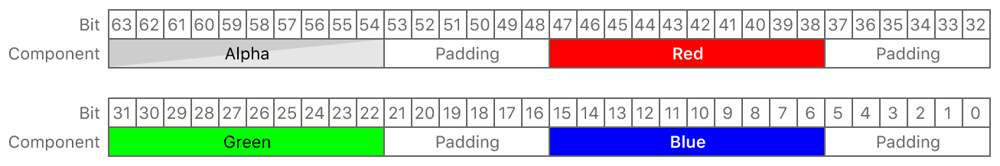

> Navigation: [Technologies](../../technologies.md) · [Metal](../../metal.md) · [MTLPixelFormat](../mtlpixelformat.md)

# MTLPixelFormat.bgra10_xr_srgb

<sub>Case</sub>

A 64-bit extended-range pixel format with sRGB conversion and four fixed-point components of 10-bit blue, 10-bit green, 10-bit red, and 10-bit alpha.

<sub>iOS, iPadOS, Mac Catalyst, macOS, tvOS, visionOS</sub>

```swift
case bgra10_xr_srgb
```

## Discussion

Pixel components are in blue, green, red, and alpha order, from least significant bit to most significant bit. Each component is a 16-bit chunk arranged as follows:

- The 10 most significant bits (9–15) store the component’s data.
- The 6 least significant bits (0–5) bits are padding, and their value is `0`.



<sub>Bit layout diagram showing the pixel data storage arrangement of the bgra10_XR_sRGB pixel format. The blue component is stored in bits 6 to 15, the green component is stored in bits 22 to 31, the red component is stored in bits 38 to 47, and the alpha component is stored in bits 54 to 63. Bits 0 to 5, 16 to 21, 32 to 37, and 48 to 53 are used as padding.</sub>

The blue, green, and red components are gamma encoded, and their values range from `-0.5271` to `1.66894`, before gamma expansion. The alpha component is always clamped to a `[0.0, 1.0]` range in sampling, rendering, and writing operations, despite supporting values outside this range.

In order to determine a component’s value as a shader float:

- When reading a pixel, first apply the linear encoding `(xr10_value - 384) / 510.0f` and then the sRGB transform.
- When writing a pixel, first apply the sRGB transform and then the linear encoding `shader_float = (xr10_value - 384) / 510.0f`.

To display wide color values on devices with wide color displays, you set this pixel format on the [colorPixelFormat](../../metalkit/mtkview/colorpixelformat.md) property of an [MTKView](../../metalkit/mtkview.md) or the [pixelFormat](../../quartzcore/cametallayer/pixelformat.md) property of a [CAMetalLayer](../../quartzcore/cametallayer.md). Also provide an extended sRGB color space.

> [!note] Note
> Only devices with a wide color display can display color values outside the `[0.0, 1.0]` range; all other devices clamp color values to the `[0.0, 1.0]` range.

## See Also

### Extended range and wide color pixel formats

- [MTLPixelFormatBGRA10_XR](bgra10_xr.md) — A 64-bit extended-range pixel format with four fixed-point components of 10-bit blue, 10-bit green, 10-bit red, and 10-bit alpha.
- [MTLPixelFormatBGR10_XR](bgr10_xr.md) — A 32-bit extended-range pixel format with three fixed-point components of 10-bit blue, 10-bit green, and 10-bit red.
- [MTLPixelFormatBGR10_XR_sRGB](bgr10_xr_srgb.md) — A 32-bit extended-range pixel format with sRGB conversion and three fixed-point components of 10-bit blue, 10-bit green, and 10-bit red.
