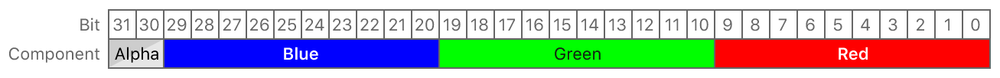

> Navigation: [Technologies](../../technologies.md) · [Metal](../../metal.md) · [MTLPixelFormat](../mtlpixelformat.md)

# MTLPixelFormat.rgb10a2Uint

<sub>Case</sub>

A 32-bit packed pixel format with four unsigned integer components: 10-bit red, 10-bit green, 10-bit blue, and 2-bit alpha.

<sub>iOS, iPadOS, Mac Catalyst, macOS, tvOS, visionOS</sub>

```swift
case rgb10a2Uint
```

## Discussion

Pixel data is stored in red, green, blue, and alpha order, from least significant bit to most significant bit.



<sub>Bit layout diagram showing the pixel data storage arrangement of the rgb10a2Uint pixel format. The red component is stored in bits 0 to 9, the green component is stored in bits 10 to 19, the blue component is stored in bits 20 to 29, and the alpha component is stored in bits 30 to 31.</sub>

## See Also

### Packed 32-bit pixel formats

- [MTLPixelFormatBGR10A2Unorm](bgr10a2unorm.md) — A 32-bit packed pixel format with four normalized unsigned integer components: 10-bit blue, 10-bit green, 10-bit red, and 2-bit alpha.
- [MTLPixelFormatRGB10A2Unorm](rgb10a2unorm.md) — A 32-bit packed pixel format with four normalized unsigned integer components: 10-bit red, 10-bit green, 10-bit blue, and 2-bit alpha.
- [MTLPixelFormatRG11B10Float](rg11b10float.md) — 32-bit format with floating-point color components, 11 bits each for red and green and 10 bits for blue.
- [MTLPixelFormatRGB9E5Float](rgb9e5float.md) — Packed 32-bit format with floating-point color components: 9 bits each for RGB and 5 bits for an exponent shared by RGB, packed into 32 bits.
