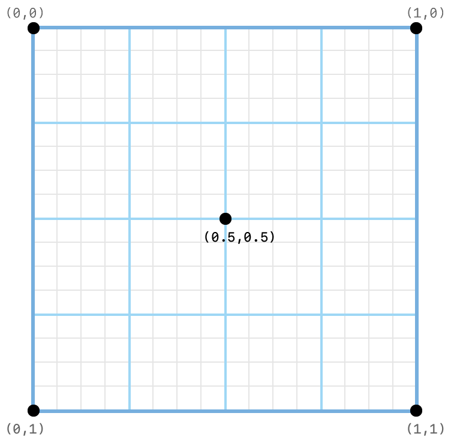
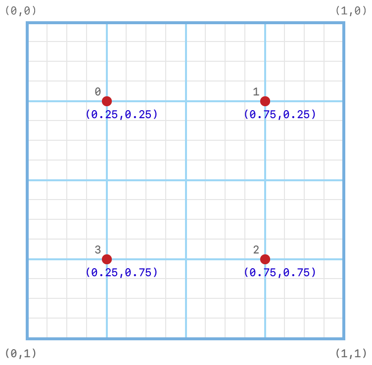

> Navigation: [Technologies](../technologies.md) · [Metal](../metal.md) · [Render passes](render-passes.md)

# Positioning samples programmatically

<sub>Article</sub>

Configure the position of samples when rendering to a multisampled render target.

## Overview

When you perform a render pass that uses multisample antialiasing (MSAA) operations, the GPU samples and resolves subpixels using a specific visual pattern. On GPUs that support programmable sample positions, you can change this pattern. Programmable sample positions unlock additional rendering techniques because you can configure them into custom patterns that you reuse or reposition in each render pass.

### Verify support for programmable sample positions

Not all GPUs support programmable sample positions. Check for support by reading the [programmableSamplePositionsSupported](mtldevice/areprogrammablesamplepositionssupported.md) property on a device instance. If this property’s value is [false](../swift/false.md), the device instance uses fixed sample positions that you can’t query or modify.

Additionally, the number of sample positions that the device instance supports may vary. Call the [- supportsTextureSampleCount:](<mtldevice/supportstexturesamplecount(__).md>) method to determine if a given number of samples is usable on that device instance.

### Get the default sample positions

Programmable sample positions are set on a 4-bit subpixel grid (16 x 16 subpixels). Floating-point values are in the `[0.0,1.0)` range along each axis, with the origin `(0,0)` defined at the top-left corner.  You can set values from `0/16` up to `15/16`, inclusive, in `1/16` increments along each axis.



<sub>Coordinate system diagram showing the subpixel grid on which programmable sample positions are set. Example positions are set at the top-left corner (0, 0), top-right corner (1,0), bottom-right corner (1,1), bottom-left corner (0,1), and center (0.5,0.5).</sub>

Metal uses the same default sample positions on all GPUs that support programmable sample positions. Get the default sample positions for a given sample count by calling the [getDefaultSamplePositions:count:](mtldevice/getdefaultsamplepositions_count_.md) method, as shown in the code below. Programmable sample positions are defined as an array of [MTLSamplePosition](mtlsampleposition.md) values.

```swift
MTLSamplePosition samplePositions[4];
[_device getDefaultSamplePositions:samplePositions count:4];
```

For example, the following table and grid show the position index, values, and placement for the default one-sample position. The complete set of default sample positions is described in [getDefaultSamplePositions:count:](mtldevice/getdefaultsamplepositions_count_.md).

| Position index | Position values |
|---|---|
| 0 | 0.5, 0.5 |


### Set the sample positions in a render pass

To change the sample positions in a render pass, call the [setSamplePositions:count:](mtlrenderpassdescriptor/setsamplepositions_count_.md) method of an [MTLRenderPassDescriptor](mtlrenderpassdescriptor.md), as shown below, passing in the array of sample positions you want to use.

```objective-c
static const MTLSamplePosition samplePositions[4] = {
    0.25, 0.25,
    0.75, 0.25,
    0.75, 0.75,
    0.25, 0.75,
};
[renderPassDescriptor setSamplePositions:samplePositions count:4];
```

The following grid shows the programmable sample positions in the `samplePositions` array:



## See Also

### Advanced multisampling

- [Storing data a pass makes with custom sample positions for a subsequent pass](storing-data-a-pass-makes-with-custom-sample-positions-for-a-subsequent-pass.md) — Inform Metal when your app uses programmable sample positions for its depth render targets or copies MSAA depth data.
