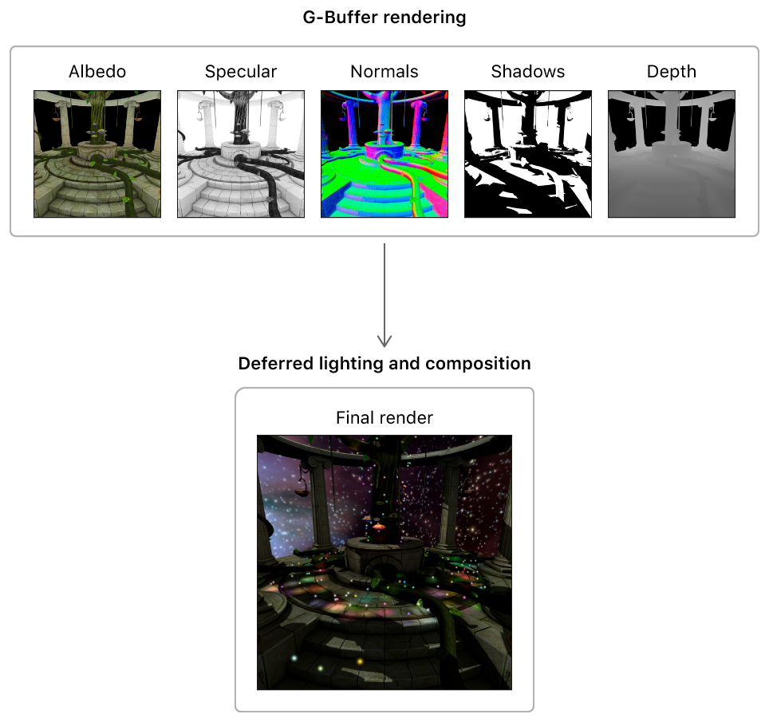
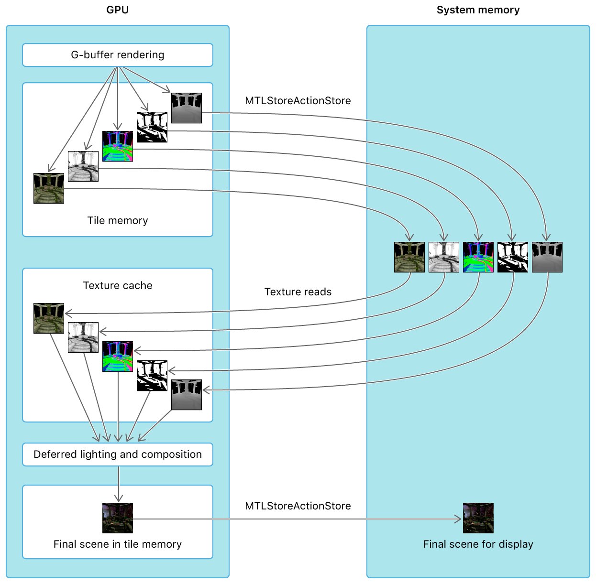
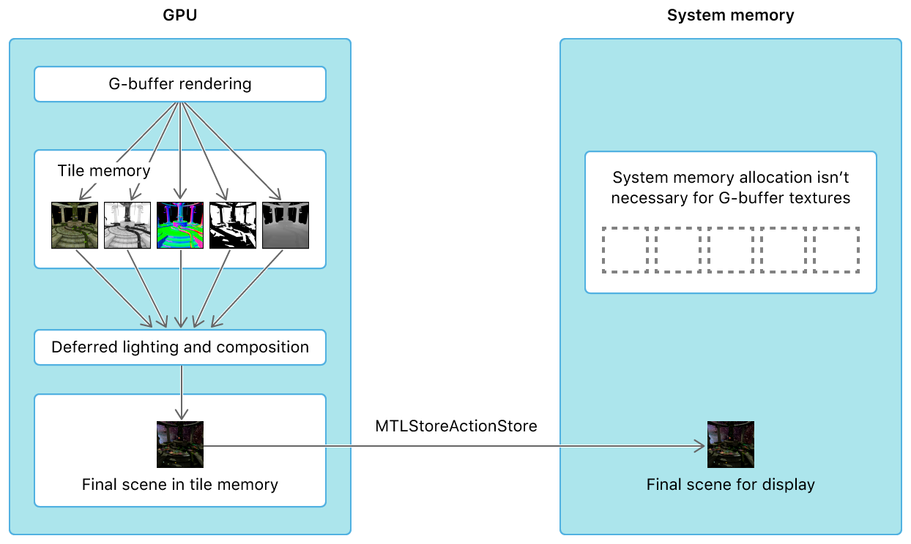
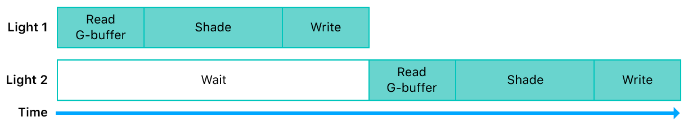
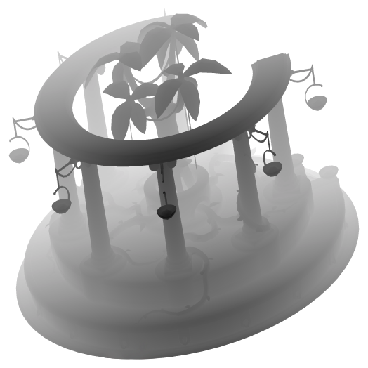
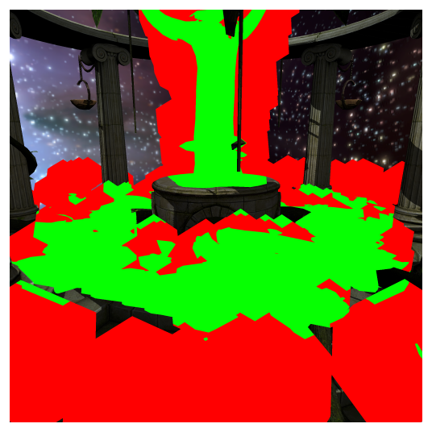

> Navigation: [Technologies](../technologies.md) · [Metal](../metal.md) · [Metal sample code library](metal-sample-code-library.md)

# Rendering a scene with deferred lighting in Swift

<sub>Sample Code</sub>

Avoid expensive lighting calculations by implementing a deferred lighting renderer optimized for immediate mode and tile-based deferred renderer GPUs.

## Overview

This sample demonstrates a deferred lighting renderer that implements shadows using a shadow map, and culls light volumes using the stencil buffer.


Deferred lighting can render a large number of lights more easily than forward lighting. For example, with forward lighting, in a scene with many lights, it’s infeasible for every fragment to calculate the contribution of every light. Complex sorting and binning algorithms need to be implemented to limit the calculation of light contributions to only those lights affecting each fragment. With deferred lighting, multiple lights can be applied to the scene with ease.

### Configure the sample code project

The Xcode project contains schemes for running the sample on macOS, iOS, or tvOS.  The default scheme is macOS, which runs the sample as is on your Mac.

> [!note] Note
> Splitting render targets into separate groups for fragment function execution requires a macOS or iOS device that supports raster order groups. Query the `rasterOrderGroupsSupported` property of your device to determine support.

The sample contains the following preprocessor conditionals that you can modify to control the configuration of the app.

**AAPLConfig.h**

```objective-c
#define USE_EYE_DEPTH              1
#define LIGHT_STENCIL_CULLING      1
```

Here’s what they modify in the app’s behavior:

- `USE_EYE_DEPTH` — When enabled, writes depth values in eye space to the geometry buffer depth component. This allows the deferred pass to calculate the eye space fragment position more easily to apply lighting. When disabled, the screen depth is written to the geometry buffer depth component and an extra inverse transform from screen space to eye space is necessary to calculate lighting contributions in the deferred pass.
- `LIGHT_STENCIL_CULLING` — When enabled, uses the stencil buffer to avoid execution of lighting calculations on fragments that don’t intersect with a 3D light volume. When disabled, the GPU calculates lighting for all fragments covered by a light in screen space. This means that considerably more fragments need expensive lighting calculations than is actually necessary.

### Review important concepts

Before you get started with the sample app, review these concepts to better understand key details of a deferred lighting renderer and some unique Metal features.

**Traditional Deferred Lighting Renderer**

A traditional deferred lighting renderer is typically separated into two render passes:

- **First pass: Geometry buffer rendering.** The renderer draws and transforms the scene’s models, and the fragment function renders the results to a collection of textures known as the _geometry buffer_ or _g-buffer_. The geometry buffer contains material colors from the models, as well as per-fragment normal, shadow, and depth values.
- **Second pass: Deferred lighting and composition.** The renderer draws each light volume, using the geometry buffer data to reconstruct the position of each fragment and apply the lighting calculations. As the lights are drawn, the output of each light is blended on top of the previous light outputs. Finally, the renderer composites other data, such as shadows and directional lighting, onto the scene by executing a full-screen quad or a compute kernel.



> [!note] Note
> Some macOS GPUs have an _immediate mode rendering_ (IMR) architecture. On IMR GPUs, a deferred lighting renderer can only be implemented with at least two render passes. Therefore, the sample implements a two-pass deferred lighting algorithm for the macOS version of the app. The iOS and tvOS simulators run on macOS Metal implementations so these also use the two-pass deferred lighting algorithm.

**Single-Pass Deferred Lighting on Apple silicon GPUs**

Apple silicon GPUs, found on all iOS and tvOS device and now certain macOS devices, use a tile-based deferred rendering (TBDR) architecture, which allows them to render data to tile memory within the GPU. By rendering to tile memory, the device avoids potentially expensive round trips between the GPU and system memory (via a bandwidth-constrained memory bus). Whether a GPU writes tile memory to system memory depends on these configurations:

- The store action of the app’s render command encoders.
- The storage mode of the app’s textures.

When `MTLStoreAction.store` is set as a store action, output data for the render targets of a render pass is written from tile memory to system memory, where the render targets are backed by textures. If this data is then used for a subsequent render pass, input data from these textures is read from system memory into a texture cache in the GPU. Therefore, a traditional deferred lighting renderer that accesses system memory requires geometry buffer data to be stored in system memory between the first and second render passes.



<sub>Diagram showing how geometry buffer data in a traditional deferred lighting algorithm is transferred between the GPU and system memory.</sub>

However, because of the TBDR architecture, Apple silicon GPUs can also read data from tile memory at any given time. This allows fragment shaders to read from and perform calculations on render targets in tile memory, before this data is written to tile memory again. This feature allows the sample to avoid storing geometry buffer data in system memory between the first and second render passes; thus, a deferred lighting renderer can be implemented with a single render pass.

Geometry buffer data is produced and consumed exclusively by the GPU, not the CPU, within the single render pass. Therefore, this data isn’t loaded from system memory before the render pass begins, nor is it stored in system memory after the render pass finishes. Instead of reading geometry buffer data from a texture in system memory, the lighting fragment functions read data from the geometry buffer while it’s still attached to the render pass as a render target. Thus, system memory doesn’t need to be allocated for geometry buffer textures, and each of these textures can be declared with a `MTLStorageMode.memoryless` storage mode.



> [!note] Note
> The feature that allows a TBDR GPU to read from attached render targets in a fragment function is also known as _programmable blending_.

**Deferred Lighting with Raster Order Groups**

By default, when a fragment shader writes data to a pixel, the GPU waits until the shader has completely finished writing to that pixel before beginning the execution of another fragment shader for that same pixel.



Raster order groups allow apps to increase the parallelization of the GPU’s fragment shaders. With raster order groups, a fragment function can separate render targets into different execution groups. This separation allows the GPU to read from and perform calculations on render targets in one group, before a previous instance of a fragment shader has finished writing data to pixels in another group.


In this sample, some lighting fragment functions use these raster order groups:

- **Raster order group 0.** `AAPLLightingROG` is used for the render target that contains the results of the lighting calculations.
- **Raster order group 1.** `AAPLGBufferROG` is used for the geometry buffer data in the lighting function.

These raster order groups allow the GPU to read the geometry buffer in a fragment shader and execute the lighting calculations, before the lighting calculations from a previous instance of a fragment shader have finished writing their output data.

### Render a deferred lighting frame

The sample renders each full frame by rendering these stages, in this order:

1. Shadow map
2. Geometry buffer
3. Directional light
4. Light mask
5. Point lights
6. Skybox
7. Fairy lights

The sample’s single pass deferred renderer produces the geometry buffer and performs all subsequent stages in a single render pass. This single-pass implementation is possible due to the TBDR architecture of iOS and tvOS GPUs, which allows a device to read geometry buffer data from render targets in tile memory.

**SinglePassDeferredRenderer.swift**

```swift
encodePass(into: commandBuffer, using: gBufferAndLightingPassDescriptor, label: "GBuffer & Lighting Pass") { renderEncoder in

    encodeGBufferStage(using: renderEncoder)
    encodeDirectionalLightingStage(using: renderEncoder)
    encodeLightMaskStage(using: renderEncoder)
    encodePointLightStage(using: renderEncoder)
    encodeSkyboxStage(using: renderEncoder)
    encodeFairyBillboardStage(using: renderEncoder)
}
```

The sample’s traditional deferred renderer produces the geometry buffer in one render pass and then performs all subsequent stages in another render pass. This two-pass implementation is necessary with GPUs using an IMR architecture, which don’t support reading render target color data in a fragment function.

**TraditionalDeferredRenderer.swift**

```swift
encodePass(into: commandBuffer,
           using: gBufferPassDescriptor,
           label: "GBuffer Generation Pass") { renderEncoder in

            encodeGBufferStage(using: renderEncoder)
}
```

```swift
encodePass(into: commandBuffer,
           using: lightingPassDescriptor,
           label: "Lighting Pass") { (renderEncoder) in

            encodeDirectionalLightingStage(using: renderEncoder)
            encodeLightMaskStage(using: renderEncoder)
            encodePointLightStage(using: renderEncoder)
            encodeSkyboxStage(using: renderEncoder)
            encodeFairyBillboardStage(using: renderEncoder)
}
```

### Render the shadow map

The sample renders a shadow map for the single directional light in the scene (the sun) by rendering the model from the light’s perspective.



The render pipeline for the shadow map has a vertex function but not a fragment function; therefore, the sample can determine the screen-space depth value written to the shadow map without executing further stages of the render pipeline. (Additionally, the render executes quickly because it doesn’t have a fragment function.)

**PipelineStates.swift**

```swift
lazy var shadowGeneration = makeRenderPipelineState(label: "Shadow Generation Stage") { descriptor in
    descriptor.vertexFunction = library.makeFunction(name: "shadow_vertex")
    descriptor.depthAttachmentPixelFormat = .depth32Float
}
```

Before drawing geometry for the shadow map, the sample sets a depth bias value to reduce shadow artifacts:

**Renderer.swift**

```swift
renderEncoder.setDepthBias(0.015, slopeScale: 7, clamp: 0.02)
```

Then, in the fragment function of the geometry buffer stage, the sample tests whether the fragment is occluded and shadowed:

**AAPLGBuffer.metal**

```metal
// Compare the depth value in the shadow map to the depth value of the fragment in the sun's.
// frame of reference.  If the sample is occluded, it will be zero.
float shadow_sample = shadowMap.sample_compare(shadowSampler, in.shadow_coord.xy, in.shadow_coord.z);
```

The sample stores the result of the `sample_compare` function in the `w` component of the `normal_shadow` render target:

**AAPLGBuffer.metal**

```metal
gBuffer.normal_shadow = half4(eye_normal.xyz, shadow_sample);
```

In the directional light and point light composition stages, the sample reads the shadow value from the geometry buffer and applies it to the fragment.

### Render the geometry buffer

The sample’s geometry buffer contains these textures:

- `albedoSpecular`, which stores albedo and specular data. Albedo data is stored in the `x`, `y`, and `z` components; specular data is stored in the `w` component.
- `normalShadow`, which stores normal and shadow data. Normal data is stored in the `x`, `y`, and `z` components; shadow data is stored in the `w` component.
- `depth`, which stores depth values in eye space.


When the sample renders the geometry buffer, both the traditional and single pass deferred renderers attach all the geometry buffer textures as render targets for the render pass. However, because devices using a TBDR architecture can both render the geometry buffer and read from it in a single render pass, the sample creates the geometry buffer textures with a memoryless storage mode, which indicates that system memory isn’t allocated for these textures. Instead, these textures are allocated and populated only in tile memory for the duration of the render pass.

The sample creates the geometry buffer textures in the implmentation of the common `drawableSizeWillChange` computed property, but the single-pass deferred renderer sets the `storageMode` variable to `MTLStorageMode.memoryless` while the traditional deferred renderer sets it to `MTLStorageMode.private`.

**SinglePassDeferredRenderer.swift**

```swift
var storageMode = MTLStorageMode.private
```

For the traditional deferred renderer, after the sample finishes writing data to the geometry buffer textures, it calls the `endEncoding` method to finalize the geometry buffer render pass. Because the store action for the render command encoder is set to `MTLStoreAction.store`, the GPU writes each of the render target textures to video memory when the encoder completes its execution. This allows the sample to read these textures from video memory in the subsequent deferred lighting and composition render pass.

For the single pass deferred renderer, after the sample finishes writing data to the geometry buffer textures, the sample doesn’t finalize the render command encoder and instead continues to use it for subsequent stages.

### Apply the directional lighting and shadows

The sample applies directional lighting and shadows to the drawable that’s destined for the display.

The traditional deferred renderer reads geometry buffer data from textures set as arguments to a fragment function:

**AAPLDirectionalLight.metal**

```metal
fragment half4
deferred_directional_lighting_fragment_traditional(
    QuadInOut                in                      [[ stage_in ]],
    constant AAPLFrameData & frameData               [[ buffer(AAPLBufferFrameData) ]],
    texture2d<half>          albedo_specular_GBuffer [[ texture(AAPLRenderTargetAlbedo) ]],
    texture2d<half>          normal_shadow_GBuffer   [[ texture(AAPLRenderTargetNormal) ]],
    texture2d<float>         depth_GBuffer           [[ texture(AAPLRenderTargetDepth)  ]])
```

The single pass deferred renderer reads geometry buffer data from render targets attached to the render pass:

**AAPLShaderCommon.h**

```metal
struct GBufferData
{
    half4 lighting        [[color(AAPLRenderTargetLighting), raster_order_group(AAPLLightingROG)]];
    half4 albedo_specular [[color(AAPLRenderTargetAlbedo),   raster_order_group(AAPLGBufferROG)]];
    half4 normal_shadow   [[color(AAPLRenderTargetNormal),   raster_order_group(AAPLGBufferROG)]];
    float depth           [[color(AAPLRenderTargetDepth),    raster_order_group(AAPLGBufferROG)]];
};
```

**AAPLDirectionalLight.metal**

```metal
deferred_directional_lighting_fragment_single_pass(
    QuadInOut                in        [[ stage_in ]],
    constant AAPLFrameData & frameData [[ buffer(AAPLBufferFrameData) ]],
    GBufferData              GBuffer)
```

Although these fragment functions have different inputs, they share a common implementation in the `deferred_directional_lighting_fragment_common` fragment function. This function performs these operations:

- Reconstructs the normals from the geometry buffer normal data to calculate the diffuse term.
- Reconstructs the eye space position from the geometry buffer depth data to apply specular highlights.
- Uses the geometry buffer shadow data to darken the fragment and apply the shadow to the scene.

Because this is the first stage that renders to the drawable, the iOS and tvOS renderer obtains a drawable before the earlier geometry buffer stage so that the drawable can be merged with the output of later stages. The traditional deferred renderer, however, delays obtaining a drawable until after the geometry buffer stage is completed and before the directional light stage begins. This delay reduces the amount of time that the app holds onto the drawable and thus improves performance.

> [!note] Note
> Because of the state of `directionalLighting` property of the `DepthStencilStates` object, the `deferred_directional_lighting_fragment` functions only execute for fragments that should be lit. This optimization is simple yet important, and saves many fragment shader execution cycles.

### Cull the light volumes

The sample creates a stencil mask that’s used to avoid executing expensive lighting calculations for many fragments. It creates this stencil mask by using the depth buffer from the geometry buffer pass, and the stencil buffer, to track whether a light volume intersects any geometry. (If not, then it isn’t casting light on anything.)

In the `encodeLightMaskStage` implementation, the sample sets the `lightMask` object of the `PipelineStates` class and encodes an instanced draw call to draw only the back faces of icosahedrons, which encompass the volumes of the point lights. If a fragment within this draw call fails the depth test, this result indicates that the back face of the icosahedron is behind some geometry.

**Renderer.swift**

```swift
renderEncoder.setRenderPipelineState(lightMaskPipelineState)
renderEncoder.setDepthStencilState(lightMaskDepthStencilState)

renderEncoder.setStencilReferenceValue(128)
renderEncoder.setCullMode(.front)

renderEncoder.setVertexBuffer(scene.frameData,
                              offset: 0,
                              index: Int(AAPLBufferFrameData.rawValue))

renderEncoder.setVertexBuffer(scene.pointLights,
                              offset: 0,
                              index: Int(AAPLBufferIndexLightsData.rawValue))

renderEncoder.setVertexBuffer(scene.lightPositions,
                              offset: 0,
                              index: Int(AAPLBufferIndexLightsPosition.rawValue))

renderEncoder.setFragmentBuffer(scene.frameData,
                                offset: 0,
                                index: Int(AAPLBufferFrameData.rawValue))

renderEncoder.draw(meshes: [scene.icosahedron],
                   instanceCount: scene.numberOfLights,
                   requiresMaterials: false)
```

The `lightMask` pipeline object doesn’t have a fragment function, so no color data is written from this render pipeline. However, due to the set `lightMask` depth and stencil state, any fragment that fails the depth test increments the stencil buffer for that fragment. Fragments that contain geometry have a starting depth value of `128`, which the sample set in the geometry buffer stage. Therefore, any fragment that fails the depth test while `lightMask` depth and stencil state is set increments the depth value to greater than `128`. (Because front face culling is enabled, a fragment that fails the depth test and has a value greater than `128` indicates that at least the back half of the icosahedron is behind all geometry.)

In the next draw call, in the `encodePointLightStage` implementation, the sample applies the contribution of the point lights to the drawable. The sample tests whether the front half of the icosahedron is in front of all geometry, which determines if the volume intersects some geometry and thus if the fragment should be lit. The depth and stencil state,  `pointLight`, set for this draw call only executes the fragment function if the stencil value for the fragment is greater than the reference value of `128`. (Because the stencil test value is set to `MTLCompareFunction.less`, the sample passes the test only if the reference value of `128` is less than the value in the stencil buffer.)

**Renderer.swift**

```swift
renderEncoder.setRenderPipelineState(pipelineStates.pointLighting)
renderEncoder.setDepthStencilState(depthStencilStates.pointLighting)

if !device.supportsFamily(.apple1) {
    scene.setGBufferTextures(renderEncoder: renderEncoder)
}

renderEncoder.setStencilReferenceValue(128)
renderEncoder.setCullMode(.back)

renderEncoder.setVertexBuffer(scene.frameData,
                              offset: 0,
                              index: Int(AAPLBufferFrameData.rawValue))

renderEncoder.setVertexBuffer(scene.pointLights,
                              offset: 0,
                              index: Int(AAPLBufferIndexLightsData.rawValue))

renderEncoder.setVertexBuffer(scene.lightPositions,
                              offset: 0,
                              index: Int(AAPLBufferIndexLightsPosition.rawValue))

renderEncoder.setFragmentBuffer(scene.frameData,
                                offset: 0,
                                index: Int(AAPLBufferFrameData.rawValue))

renderEncoder.setFragmentBuffer(scene.pointLights,
                                offset: 0,
                                index: Int(AAPLBufferIndexLightsData.rawValue))

renderEncoder.setFragmentBuffer(scene.lightPositions,
                                offset: 0,
                                index: Int(AAPLBufferIndexLightsPosition.rawValue))

renderEncoder.draw(meshes: [scene.icosahedron],
                   instanceCount: scene.numberOfLights,
                   requiresMaterials: false)
```

Because the draw call in `encodeLightMaskStage` increments the stencil values for fragments that are behind any geometry, the only fragments for which the sample executes the fragment function are those that meet both of these conditions:

- Fragments whose front face passes the depth test and is in front of some geometry.
- Fragments whose back face fails the depth test and is behind some geometry.

The following diagrams show the difference in fragment coverage between a rendered frame that uses this stencil mask algorithm and another that doesn’t. When the algorithm is enabled, pixels in green are pixels for which the point light fragment function was executed.


When the algorithm is disabled, pixels in green and red are pixels for which the point light fragment function was executed.



### Render the skybox and fairy lights

In the final lighting stages, the sample applies much simpler lighting techniques to the scene.

The sample applies depth testing to the skybox, against the temple’s geometry, so the renderer only renders to areas of the drawable that have not been filled by some geometry.

**Renderer.swift**

```swift
renderEncoder.setRenderPipelineState(pipelineStates.skybox)
renderEncoder.setDepthStencilState(depthStencilStates.skybox)

renderEncoder.setCullMode(.front)

renderEncoder.setVertexBuffer(scene.frameData, offset: 0, index: Int(AAPLBufferFrameData.rawValue))
renderEncoder.setFragmentTexture(scene.skyMap, index: Int(AAPLTextureIndexBaseColor.rawValue))

renderEncoder.draw(meshes: [scene.skyMesh],
                   requiresMaterials: false)
```

The sample renders fairy lights onto the drawable as 2D circles and uses a texture to determine the alpha blending factors for their fragments.

**AAPLFairy.metal**

```metal
half4 c = colorMap.sample(linearSampler, float2(in.tex_coord));

half3 fragColor = in.color * c.x;

return half4(fragColor, c.x);
```

## See Also

### Lighting techniques

- [Rendering a scene with forward plus lighting using tile shaders](rendering-a-scene-with-forward-plus-lighting-using-tile-shaders.md) — Implement a forward plus renderer using the latest features on Apple GPUs.
- [Rendering a scene with deferred lighting in Objective-C](rendering-a-scene-with-deferred-lighting-in-objective-c.md) — Avoid expensive lighting calculations by implementing a deferred lighting renderer optimized for immediate mode and tile-based deferred renderer GPUs.
- [Rendering a scene with deferred lighting in C++](rendering-a-scene-with-deferred-lighting-in-c++.md) — Avoid expensive lighting calculations by implementing a deferred lighting renderer optimized for immediate mode and tile-based deferred renderer GPUs.
- [Rendering reflections with fewer render passes](rendering-reflections-with-fewer-render-passes.md) — Use layer selection to reduce the number of render passes needed to generate an environment map.

## Download

- [RenderingASceneWithDeferredLightingInSwift.zip](https://docs-assets.developer.apple.com/published/badbf3ddc465/RenderingASceneWithDeferredLightingInSwift.zip)
