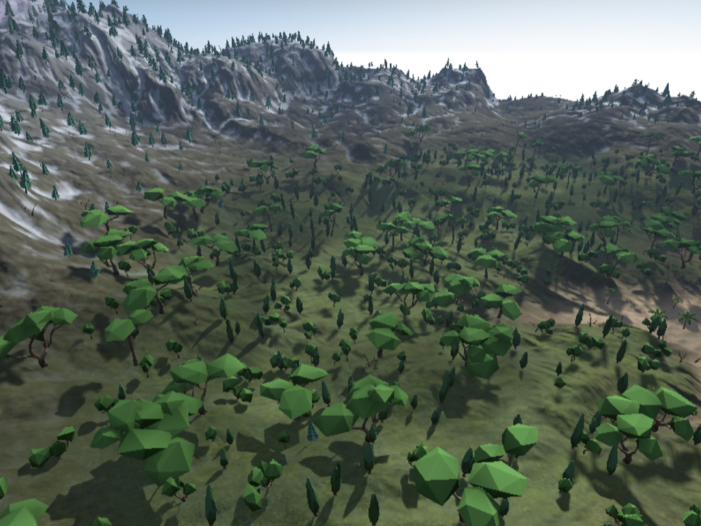

> Navigation: [Technologies](../technologies.md) · [Metal](../metal.md) · [Buffers](buffers.md)

# Rendering terrain dynamically with argument buffers

<sub>Sample Code</sub>

Use argument buffers to render terrain in real time with a GPU-driven pipeline.

## Overview

This sample demonstrates dynamic terrain generation on an outdoor landscape, using argument buffers to select terrain materials, vegetation geometry, and particle effects within a GPU-driven pipeline. The sample creates a landscape with visually distinct areas, called habitats, that differ based on the land’s elevation. These are the habitats in the sample, ordered from highest to lowest elevation:

- Snow
- Rock
- Grass
- Sand



> [!note] Note
> This sample reduces the overhead of encoding commands on the CPU by using argument buffers. For an introduction to argument buffers, see the samples listed in [Buffers](buffers.md).

### Getting started

The Xcode project contains schemes for running the sample in macOS and iOS. Metal isn’t supported in the iOS Simulator, so the iOS scheme requires a physical device that supports GPU family 4 to run the sample. The default scheme is macOS, which runs the sample as is on your Mac.

In macOS, use these controls to navigate the scene:

- **W, S, A, and D keys.** Move the camera body.
- **Arrow keys.** Move the camera view.
- **Mouse or trackpad drag.** Move the camera view.
- **Mouse or trackpad primary click.** Raise the terrain.
- **Mouse or trackpad secondary click.** Lower the terrain.

In iOS, use these controls to navigate the scene:

- **Pan gesture.** Move the camera view.
- **`modify terrain` button.** Cycle through a predefined terrain manipulation sequence.

> [!note] Note
> The particle effects in this sample require a Mac that supports Tier 2 argument buffers. Particle effects aren’t available on iOS devices.

### Respond to landscape alterations

The app determines the landscape’s initial topology from a static height map, `TerrainHeightMap.png`.

**AAPLTerrainRenderer.mm**

```objective-c
_targetHeightmap = CreateTextureWithDevice (device, @"Textures/TerrainHeightMap.png", false, false);
```

At runtime, as you alter the landscape with the provided controls, the sample evaluates the latest topology to determine whether it should apply a new habitat to the land based on its new elevation. If so, the sample updates the argument buffer corresponding to the land with the correct materials and vegetation geometry for the new habitat. The sample renders this new habitat by passing the land elevation value to the `EvaluateTerrainAtLocation` function.

**AAPLTerrainRendererUtilities.metal**

```metal
static void EvaluateTerrainAtLocation(float2 uv,
                                      float3 worldPosition,
                                      texture2d<float> heightMap,
                                      texture2d<float> normalMap,
                                      texture2d<float> propertiesMap,
                                      constant const TerrainParams& terrainParams,
                                      thread float outHabitat[TerrainHabitatTypeCOUNT],
                                      thread float3 &outNormal)
```

### Define an argument buffer for terrain habitats

The sample defines a custom argument buffer structure, `TerrainHabitat`, that defines the elements of a terrain habitat.

**AAPLTerrainRenderer_shared.h**

```objective-c
struct TerrainHabitat
{
#ifndef __METAL_VERSION__
    // This struct should not be instantiated in C++ because it contains textures that aren't visible on the CPU
private:
    TerrainHabitat ();
public:
#endif

    float slopeStrength      IAB_INDEX(TerrainHabitat_MemberIds::slopeStrength);
    float slopeThreshold     IAB_INDEX(TerrainHabitat_MemberIds::slopeThreshold);
    float elevationStrength  IAB_INDEX(TerrainHabitat_MemberIds::elevationStrength);
    float elevationThreshold IAB_INDEX(TerrainHabitat_MemberIds::elevationThreshold);
    float specularPower      IAB_INDEX(TerrainHabitat_MemberIds::specularPower);
    float textureScale       IAB_INDEX(TerrainHabitat_MemberIds::textureScale);
    bool  flipNormal         IAB_INDEX(TerrainHabitat_MemberIds::flipNormal);

    struct ParticleProperties
    {
        // The fields of this struct need to be reflected in TerrainHabitat_MemberIds
        simd::float4    keyTimePoints;
        simd::float4    scaleFactors;
        simd::float4    alphaFactors;
        simd::float4    gravity;
        simd::float4    lightingCoefficients;
        int             doesCollide;
        int             doesRotate;
        int             castShadows;
        int             distanceDependent;
    } particleProperties;

#ifdef __METAL_VERSION__
    texture2d_array <float,access::sample> diffSpecTextureArray IAB_INDEX(TerrainHabitat_MemberIds::diffSpecTextureArray);
    texture2d_array <float,access::sample> normalTextureArray   IAB_INDEX(TerrainHabitat_MemberIds::normalTextureArray);
#endif
};
```

Among these elements, `elevationStrength` and `elevationThreshold` determine the elevation range in which the habitat is active. Additionally, `diffSpecTextureArray` and `normalTextureArray` determine the textures used to render the habitat.

The app nests `TerrainHabitat` within another argument buffer, `TerrainParams`, that provides many slight visual variations for added realism.

**AAPLTerrainRenderer_shared.h**

```objective-c
struct TerrainParams
{
    TerrainHabitat habitats [TerrainHabitatTypeCOUNT];
    float ambientOcclusionScale    IAB_INDEX(TerrainParams_MemberIds::ambientOcclusionScale);
    float ambientOcclusionContrast IAB_INDEX(TerrainParams_MemberIds::ambientOcclusionContrast);
    float ambientLightScale        IAB_INDEX(TerrainParams_MemberIds::ambientLightScale);
    float atmosphereScale          IAB_INDEX(TerrainParams_MemberIds::atmosphereScale);
};
```

`TerrainHabitat` is the specific argument buffer definition for a terrain habitat. However, because the app nests its definition within `TerrainParams`, the app sends the `TerrainParams` objects to the GPU pipeline.

### Render terrain

The sample provides the GPU with the textures corresponding to various habitats. First, the sample calls the `useResource:usage:` method to indicate which textures the GPU uses.

**AAPLTerrainRenderer.mm**

```objective-c
for (int i = 0; i < _terrainTextures.size(); i++)
{
    [renderEncoder useResource: _terrainTextures[i].diffSpecTextureArray
                         usage: MTLResourceUsageSample | MTLResourceUsageRead];
    [renderEncoder useResource: _terrainTextures[i].normalTextureArray
                         usage: MTLResourceUsageSample | MTLResourceUsageRead];
}
```

Then, the sample calls the `setFragmentBuffer:offset:atIndex:` method to set the argument buffer, `terrainParamsBuffer`, that contains those textures.

**AAPLTerrainRenderer.mm**

```objective-c
[renderEncoder setFragmentBuffer:_terrainParamsBuffer offset:0 atIndex:_iabBufferIndex_PplTerrainMainView];
```

The sample accesses the argument buffer in the fragment function, `terrain_fragment`, to output the correct material for the terrain. First, the sample passes the `mat` parameter into the fragment function.

**AAPLTerrainRenderer.metal**

```metal
fragment GBufferFragOut terrain_fragment(const TerrainVertexOut in [[stage_in]],
                                         constant TerrainParams & mat [[buffer(1)]],
                                         constant AAPLUniforms& globalUniforms [[buffer(2)]],
                                         texture2d<float> heightMap [[texture(0)]],
                                         texture2d<float> normalMap [[texture(1)]],
                                         texture2d<float> propertiesMap [[texture(2)]])
```

Then, the sample passes the current land elevation into the `EvaluateTerrainAtLocation` function, where the fragment samples the texture corresponding to that elevation.

**AAPLTerrainRenderer.metal**

```metal
BrdfProperties curSubLayerBrdf = sample_brdf(
                                             mat.habitats [curLayerIdx].diffSpecTextureArray,
                                             mat.habitats [curLayerIdx].normalTextureArray,
                                             curSubLayerIdx,
                                             mat.habitats [curLayerIdx].textureScale,
                                             mat.habitats [curLayerIdx].specularPower,
                                             mat.habitats [curLayerIdx].flipNormal,
                                             in.worldPosition,
                                             normal,
                                             tangent,
                                             bitangent);
```

### Render vegetation

The sample passes the `terrainParamsBuffer` argument buffer to the vegetation render pass through an instance of `AAPLTerrainRenderer`. This data determines which type of vegetation to render at a given location. First, the sample calls the `setBuffer:offset:atIndex:` method to set the argument buffer for the vegetation render pass.

**AAPLVegetationRenderer.mm**

```objective-c
[computeEncoder setBuffer:terrain.terrainParamsBuffer offset:0 atIndex:3];
```

Then, the sample passes the argument buffer into the `EvaluateTerrainAtLocation` function, which produces a `habitatPercentages` value.

**AAPLVegetationRenderer.metal**

```metal
EvaluateTerrainAtLocation(uv_pos, world_pos, heightMap,
                          normalMap, propertiesMap, terrainParams,
                          habitatPercentages,
                          worldNormal);
```

The habitat percentages are processed to select a specific index into the vegetation geometries, determined by the value of `pop_idx`.

**AAPLVegetationRenderer.metal**

```metal
pop_idx = rules[rule_index].populationStartIndex + uint((s / rules[rule_index].densityInHabitat * float(rules[rule_index].populationIndexCount)));
```

Finally, the sample uses this population index to render an instance of a particular vegetation geometry onto the landscape.

**AAPLVegetationRenderer.metal**

```metal
vegetationSpawnInstance(pop_idx, world_matrix, float4(world_pos, radius), globalUniforms, instances, indirect);
```

### Render particles

The sample passes the `terrainParamsBuffer` argument buffer to the particle render pass through an instance of `AAPLTerrainRenderer`. This data determines which type of particles to render at a given location. First, the sample calls the `setBuffer:offset:atIndex:` method to set the argument buffer for the particle render pass.

**AAPLParticleRenderer.mm**

```objective-c
[enc setBuffer:[terrain terrainParamsBuffer] offset:0 atIndex:14];
```

Then, the sample checks the relative percentages of habitat coverage in the altered landscape with the `EvaluateTerrainAtLocation` function, where the sample passes the 3D position of the particle.

**AAPLParticleRenderer.metal**

```metal
EvaluateTerrainAtLocation(mouseUvPos, mouseWorldPos, heightMap,
                          normalMap, propsMap, terrainParams,
                          habitatPercentages,
                          worldNormal);
```

The sample chooses the appropriate habitat by selecting the terrain with the highest percentage of habitat coverage.

**AAPLParticleRenderer.metal**

```metal
float highestLevel = 0.f;
for (uint i = 0; i < TerrainHabitatTypeCOUNT; i++)
{
    if (habitatPercentages [i] > highestLevel)
    {
        highestLevel = habitatPercentages [i];
        habitatIndex = i;
    }
}
```

Finally, the app retrieves the particle’s corresponding habitat material from the argument buffer and sets it to the new particle.

**AAPLParticleRenderer.metal**

```metal
ParticleData data;
data.habitatIndex = habitatIndex;
data.texture = terrainParams.habitats [habitatIndex].diffSpecTextureArray;
```

## See Also

### Argument buffers

- [Improving CPU performance by using argument buffers](improving-cpu-performance-by-using-argument-buffers.md) — Optimize your app’s performance by grouping your resources into argument buffers.
- [Managing groups of resources with argument buffers](managing-groups-of-resources-with-argument-buffers.md) — Create argument buffers to organize related resources.
- [Tracking the resource residency of argument buffers](tracking-the-resource-residency-of-argument-buffers.md) — Optimize resource performance within an argument buffer.
- [Indexing argument buffers](indexing-argument-buffers.md) — Assign resource indices within an argument buffer.
- [Encoding argument buffers on the GPU](encoding-argument-buffers-on-the-gpu.md) — Use a compute pass to encode an argument buffer and access its arguments in a subsequent render pass.
- [Using argument buffers with resource heaps](using-argument-buffers-with-resource-heaps.md) — Reduce CPU overhead by using arrays inside argument buffers and combining them with resource heaps.
- [MTLArgumentDescriptor](mtlargumentdescriptor.md) — A representation of an argument within an argument buffer.
- [MTLArgumentEncoder](mtlargumentencoder.md) — An interface you can use to encode argument data into an argument buffer.
- [MTLAttributeStrideStatic](mtlattributestridestatic.md)

## Download

- [RenderingTerrainDynamicallyWithArgumentBuffers.zip](https://docs-assets.developer.apple.com/published/56eb378e3977/RenderingTerrainDynamicallyWithArgumentBuffers.zip)
