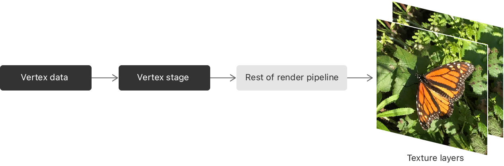

> Navigation: [Technologies](../technologies.md) · [Metal](../metal.md) · [Render passes](render-passes.md)

# Rendering to multiple texture slices in a draw command

<sub>Article</sub>

Select a destination texture slice in your vertex shader.

## Overview

Using layer selection, you can render to multiple layers (_slices_) of a texture array, cube texture, or 3D texture, choosing a destination slice for each primitive in your vertex shader. A layer is a single 1D, 2D, or 3D block of pixels, specified by a slice and mipmap level in the target texture. Load and store actions apply to every slice of the render pass’s attachments.

Layer selection is useful when you need to render content to multiple related textures from the same source data, such as when rendering environment cube maps or stereo imagery for virtual reality.



For a specific example that demonstrates layer selection, see [Rendering reflections with fewer render passes](rendering-reflections-with-fewer-render-passes.md).

### Check whether the device object supports layer selection

All GPUs in the macOS family support layer selection. Layer selection is available in the Apple GPU family starting with family 5. Test for layer selection using the following code:

**Swift**

```swift
func supportsLayerSelection() -> Bool {
    return device.supportsFamily(MTLGPUFamily.mac2) || device.supportsFamily(MTLGPUFamily.apple5)
}
```

**Objective-C**

```objective-c
- (Boolean) supportsLayerSelection
{
  return
    [_device supportsFamily: MTLGPUFamilyMac1 ] ||
    [_device supportsFamily: MTLGPUFamilyApple5 ];
}
```

### Add layer selection to your vertex shader

To specify which slice to render a primitive into, add a vertex output with the `[[render_target_array_index]]` attribute. Your vertex shader needs to set this value so that Metal knows which slice to render into.

The example below uses instanced rendering to render primitives into multiple output slices. It adds a `layer` field to the vertex output to specify the target slice. The code passes the target in as part of the per-instance properties, and copies it to the vertex output.

```metal
typedef struct
{
    ...
    uint   layer [[render_target_array_index]];
} ColorInOut;

vertex ColorInOut vertexTransform (
          const Vertex in                               [[ stage_in ]],
          const uint   instanceId                       [[ instance_id ]],
          const device InstanceParams* instanceParams   [[ buffer ]],
{
    ColorInOut out;
    out.layer = instanceParams[instanceId].layer;
    ...
}
```

Your vertex function needs to return the same index for all vertices that make up any given primitive.

### Configure the pipeline state object

Render pipelines that can render to layers need to specify the type of primitive that they can render. This requirement differs from a normal render pipeline, where you can select a different primitive for each draw command.

When you configure the [MTLRenderPipelineDescriptor](mtlrenderpipelinedescriptor.md) for the render pipeline, set the [inputPrimitiveTopology](mtlrenderpipelinedescriptor/inputprimitivetopology.md) property to specify the primitive type it can render.

**Swift**

```swift
let descriptor = MTLRenderPipelineDescriptor()
descriptor.inputPrimitiveTopology = .triangle
descriptor.rasterSampleCount = 1
...
```

**Objective-C**

```objective-c
MTLRenderPipelineDescriptor *descriptor = [[MTLRenderPipelineDescriptor alloc] init];
descriptor.inputPrimitiveTopology = MTLPrimitiveTopologyClassTriangle;
descriptor.rasterSampleCount = 1
...
```

### Configure the render pass

When you configure the [MTLRenderPassDescriptor](mtlrenderpassdescriptor.md), specify a texture array, cube map texture, or 3D texture as the color attachment. You also need to set the render pass descriptor’s [renderTargetArrayLength](mtlrenderpassdescriptor/rendertargetarraylength.md) property to the maximum number of slices that the shader can choose from. For example, when rendering to a cube map texture, set the length to `6`.

When rendering to texture arrays and cube maps, you can specify multiple attachments and render to all of them simultaneously. You can’t render to multiple attachments if you specify a 3D texture. Here’s an example that sets up the render pass descriptor with one cube map texture for color data and another for depth information:

**Swift**

```swift
let reflectionPassDesc = MTLRenderPassDescriptor()
reflectionPassDesc.colorAttachments[0].texture = reflectionCubeMap
reflectionPassDesc.depthAttachment.texture = reflectionCubeMapDepth
reflectionPassDesc.renderTargetArrayLength = 6
...
```

**Objective-C**

```objective-c
MTLRenderPassDescriptor* reflectionPassDesc = [MTLRenderPassDescriptor renderPassDescriptor];
reflectionPassDesc.colorAttachments[0].texture    = _reflectionCubeMap;
reflectionPassDesc.depthAttachment.texture        = _reflectionCubeMapDepth;
reflectionPassDesc.renderTargetArrayLength        = 6;
...
```

## See Also

### Optimizing techniques

- [Specifying drawing and dispatch arguments indirectly](specifying-drawing-and-dispatch-arguments-indirectly.md) — Use indirect commands if you don’t know your draw or dispatch call arguments when you encode the command.
- [Rendering to multiple viewports in a draw command](rendering-to-multiple-viewports-in-a-draw-command.md) — Select viewports and their corresponding scissor rectangles in your vertex shader.
