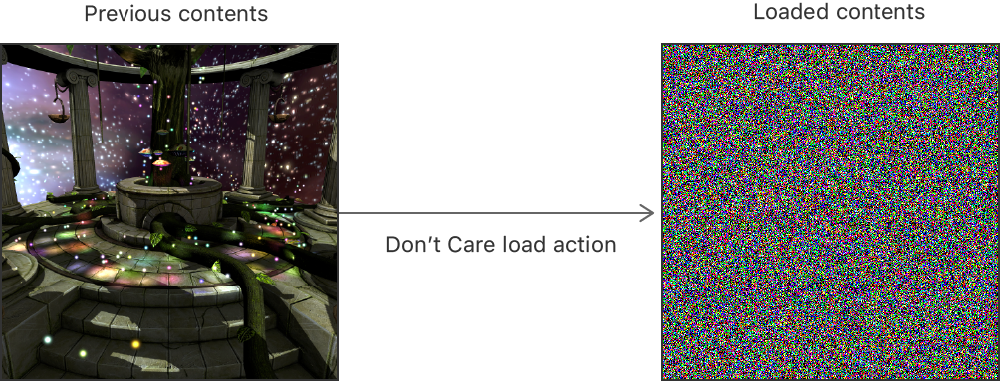
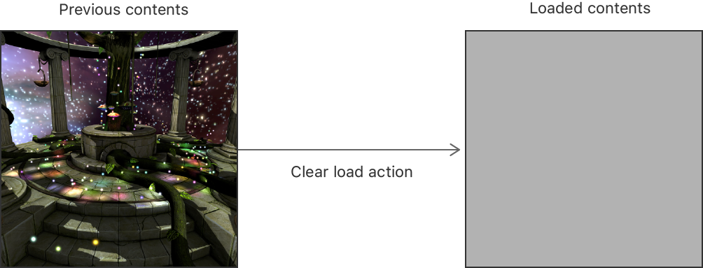
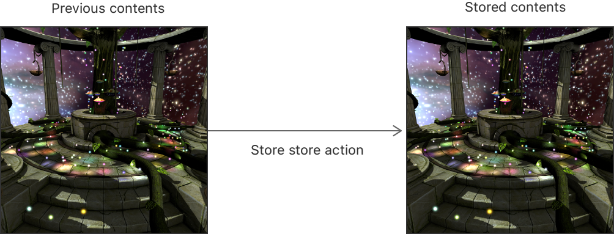
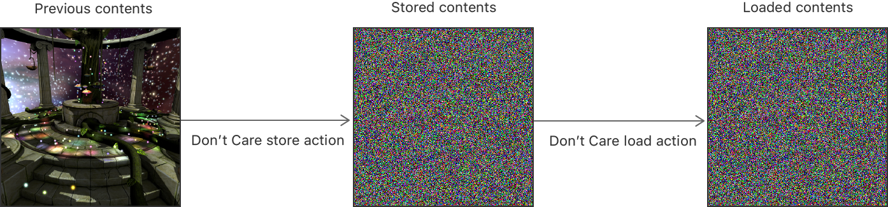
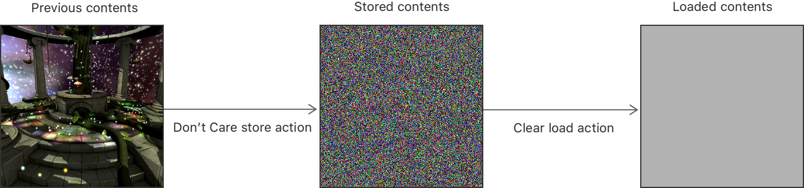
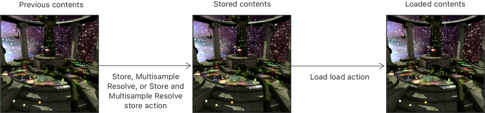

> Navigation: [Technologies](../technologies.md) · [Metal](../metal.md) · [Render passes](render-passes.md)

# Setting load and store actions

<sub>Article</sub>

Set actions that define how a render pass loads and stores a render target.

## Overview

[MTLLoadAction](mtlloadaction.md) and [MTLStoreAction](mtlstoreaction.md) values allow you to define how a render pass loads and stores your [MTLRenderPassAttachmentDescriptor](mtlrenderpassattachmentdescriptor.md) objects. By choosing appropriate actions for your render targets, you can avoid costly and unnecessary work at the start (load) or end (store) of a render pass.

Set a render targetʼs texture on its [texture](mtlrenderpassattachmentdescriptor/texture.md) property. Then, set its actions on its [loadAction](mtlrenderpassattachmentdescriptor/loadaction.md) and [storeAction](mtlrenderpassattachmentdescriptor/storeaction.md) properties:

**Swift**

```swift
let renderPassDescriptor = MTLRenderPassDescriptor()

// Color render target
renderPassDescriptor.colorAttachments[0].texture = colorTexture
renderPassDescriptor.colorAttachments[0].loadAction = .clear
renderPassDescriptor.colorAttachments[0].storeAction = .store

// Depth render target
renderPassDescriptor.colorAttachments[0].texture = depthTexture
renderPassDescriptor.colorAttachments[0].loadAction = .dontCare
renderPassDescriptor.colorAttachments[0].storeAction = .dontCare

// Stencil render target
renderPassDescriptor.colorAttachments[0].texture = stencilTexture
renderPassDescriptor.colorAttachments[0].loadAction = .dontCare
renderPassDescriptor.colorAttachments[0].storeAction = .dontCare
```

**Objective-C**

```objective-c
MTLRenderPassDescriptor *renderPassDescriptor = [MTLRenderPassDescriptor renderPassDescriptor];

// Color render target
renderPassDescriptor.colorAttachments[0].texture = colorTexture;
renderPassDescriptor.colorAttachments[0].loadAction = MTLLoadActionClear;
renderPassDescriptor.colorAttachments[0].storeAction = MTLStoreActionStore;

// Depth render target
renderPassDescriptor.depthAttachment.texture = depthTexture;
renderPassDescriptor.depthAttachment.loadAction = MTLLoadActionDontCare;
renderPassDescriptor.depthAttachment.storeAction = MTLStoreActionDontCare;

// Stencil render target
renderPassDescriptor.stencilAttachment.texture = stencilTexture;
renderPassDescriptor.stencilAttachment.loadAction = MTLLoadActionDontCare;
renderPassDescriptor.stencilAttachment.storeAction = MTLStoreActionDontCare;
```

### Choose a load action

Several options are available, depending on which of the following scenarios describes your render targetʼs loading needs.

**You donʼt need the previous contents of the render target and you render to all of its pixels.** Choose [MTLLoadActionDontCare](mtlloadaction/dontcare.md). This action incurs no cost, and pixel values are always undefined at the start of the render pass.



<sub>A block diagram that shows the previous contents of a render target and its loaded contents after a Don’t Care load action.</sub>

**You donʼt need the previous contents of the render target and you render to only some of its pixels.** Choose [MTLLoadActionClear](mtlloadaction/clear.md). This action incurs the cost of writing the render targetʼs clear value to each pixel.



**You do need the previous contents of the render target and you render to only some of its pixels.** Choose [MTLLoadActionLoad](mtlloadaction/load.md). This action incurs the cost of loading the previous values of each pixel from memory. This action is significantly slower than [MTLLoadActionDontCare](mtlloadaction/dontcare.md) or [MTLLoadActionClear](mtlloadaction/clear.md).


> [!note] Note
> You canʼt choose [MTLLoadActionLoad](mtlloadaction/load.md) for a memoryless render target because it isnʼt backed by system memory. For more information about memoryless render targets, see [Choosing a resource storage mode for Apple GPUs](choosing-a-resource-storage-mode-for-apple-gpus.md).

### Choose a store action

Several options are available, depending on which of the following scenarios describes your render targetʼs storage needs.

**You donʼt need to preserve the contents of the render target.** Choose [MTLStoreActionDontCare](mtlstoreaction/dontcare.md). This action incurs no cost, and pixel values are always undefined at the end of the render pass. Choose this action for intermediary render targets that you use within the render pass, but you donʼt need afterward. This is typically the correct action for depth and stencil render targets.


<sub>A block diagram that shows the previous contents of a render target and its stored contents after a Don’t Care store action.</sub>

**You do need to preserve the contents of the render target.** Choose [MTLStoreActionStore](mtlstoreaction/store.md). This action incurs the cost of storing the values of each pixel to memory. This is always the correct action for drawables.



**Your render target is a multisample texture.** When you perform multisampling, you decide whether to store the render targetʼs multisampled or resolved data. Multisampled data is stored in the render targetʼs [texture](mtlrenderpassattachmentdescriptor/texture.md) property. Resolved data is stored in the render targetʼs [resolveTexture](mtlrenderpassattachmentdescriptor/resolvetexture.md) property. Refer to this table to choose a store action when multisampling:

| Multisampled data stored | Resolved data stored | Resolve texture required | Required store action |
|---|---|---|---|
| Yes | Yes | Yes | [MTLStoreActionStoreAndMultisampleResolve](mtlstoreaction/storeandmultisampleresolve.md) |
| Yes | No | No | [MTLStoreActionStore](mtlstoreaction/store.md) |
| No | Yes | Yes | [MTLStoreActionMultisampleResolve](mtlstoreaction/multisampleresolve.md) |
| No | No | No | [MTLStoreActionDontCare](mtlstoreaction/dontcare.md) |

To store and resolve a multisample texture in a single render pass, always choose the [MTLStoreActionStoreAndMultisampleResolve](mtlstoreaction/storeandmultisampleresolve.md) action and use a single render command encoder.

**You need to defer your storage choice.** In some cases, you might not know which store action to use for a particular render target until you gather more render pass information. To defer your store action choice, set the temporary [MTLStoreActionUnknown](mtlstoreaction/unknown.md) value when you create your [MTLRenderPassAttachmentDescriptor](mtlrenderpassattachmentdescriptor.md) object. Setting an unknown store action may avoid potential costs incurred by setting another store action prematurely. However, you need to specify a valid store action before you finish encoding your render pass; otherwise, an error occurs.

> [!note] Note
> You canʼt choose [MTLStoreActionStore](mtlstoreaction/store.md) or [MTLStoreActionStoreAndMultisampleResolve](mtlstoreaction/storeandmultisampleresolve.md) for a memoryless render target because it isnʼt backed by system memory. For more information about memoryless render targets, see [Choosing a resource storage mode for Apple GPUs](choosing-a-resource-storage-mode-for-apple-gpus.md).

### Evaluate actions between render passes

You can use the same render targets across multiple render passes. Several load and store combinations are possible for the same render target between any two render passes, depending on which of the following scenarios describes your render targetʼs needs from one render pass to another.

**You donʼt need the previous contents of a render target in the next render pass.** In the first render pass, choose [MTLStoreActionDontCare](mtlstoreaction/dontcare.md) to avoid storing the contents of the render target. In the second render pass, choose [MTLLoadActionDontCare](mtlloadaction/dontcare.md) or [MTLLoadActionClear](mtlloadaction/clear.md) to avoid loading the contents of the render target.



<sub>A block diagram that shows a store and load sequence for a single render target. The render target uses a Don’t Care store action and a Don’t Care load action.</sub>



<sub>A block diagram that shows a store and load sequence for a single render target. The render target uses a Don’t Care store action and a Clear load action.</sub>

**You do need the previous contents of a render target in the next render pass.** In the first render pass, choose [MTLStoreActionStore](mtlstoreaction/store.md), [MTLStoreActionMultisampleResolve](mtlstoreaction/multisampleresolve.md), or [MTLStoreActionStoreAndMultisampleResolve](mtlstoreaction/storeandmultisampleresolve.md) to store the contents of the render target. In the second render pass, choose [MTLLoadActionLoad](mtlloadaction/load.md) to load the contents of the render target.



<sub>A block diagram that shows a store and load sequence for a single render target. The render target uses a Store, Multisample Resolve, or Store And Multisample Resolve store action, and then uses a Load load action.</sub>

## See Also

### Applying rendering techniques

- [Drawing a triangle with Metal 4](drawing-a-triangle-with-metal-4.md) — Render a colorful, rotating 2D triangle by running draw commands with a render pipeline on a GPU.
- [Customizing render pass setup](customizing-render-pass-setup.md) — Render into an offscreen texture by creating a custom render pass.
- [Improving rendering performance with vertex amplification](improving-rendering-performance-with-vertex-amplification.md) — Run draw commands that render to different outputs using the same vertex data multiple times.
