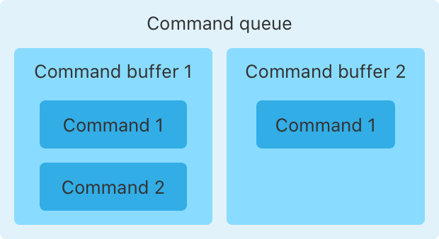
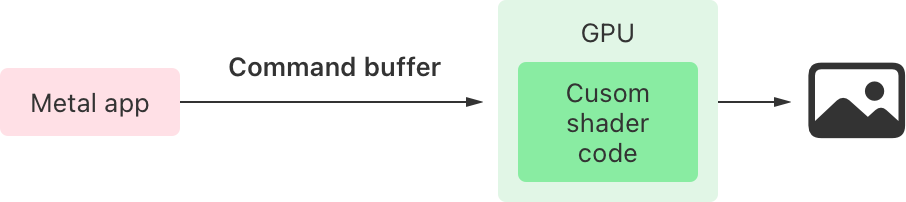
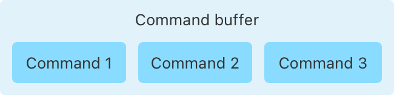
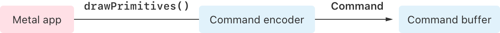

> Navigation: [Technologies](../technologies.md) · [Metal](../metal.md) · [GPU devices and work submission](gpu-devices-and-work-submission.md)

# Setting up a command structure

<sub>Article</sub>

Discover how Metal executes commands on a GPU.

## Overview

In Metal, you send commands to the GPU so it can perform work on your behalf. A command performs the drawing, parallel computation, and resource management work your app requires.

The relationship between Metal apps and the GPU on a device is a client/server model where your app is the client and the GPU is the server. You make requests by sending commands to the GPU that you encapsulate in a command buffer and then add to a command queue. After processing the commands, the GPU notifies your app when it’s ready for more work.


<sub>A flow diagram representing a Metal app’s command processing cycle. On the left, the Metal app, labeled Client, issues a command, labeled Request, to the GPU on the right. At the right, the GPU sends a completion notification, labeled Response, to the client on the left.</sub>

The order that you place commands in command buffers, then enqueue and commit command buffers, affects the perceived order in which Metal executes your commands.

The following sections explain how to set up a command structure to produce the results you want. Some objects you create once and use throughout your app, and others you create specifically to execute a set of commands.

### Create expensive shared objects during initialization

Create objects that are expensive to allocate during initialization, not in time-critical code paths. Objects that you can share in your code are command queues, pipelines, buffers, and textures. After you initialize these objects, they’re fast to reuse.

#### Make a Command Queue

To make a command queue, call the device’s [- newCommandQueue](<mtldevice/makecommandqueue().md>) function.

**Swift**

```swift
commandQueue = device.makeCommandQueue()
```

**Objective-C**

```objective-c
commandQueue = [device newCommandQueue];
```

Then use the same command queue throughout your app to hold command buffers. The figure below illustrates the command queue that contains command buffers:



<sub>A diagram that depicts a command queue’s relationship to the command buffers it contains. A box representing a command queue contains two boxes representing command buffers, numbered in ascending order. The first box contains two boxes representing commands, numbered in ascending order. The second box contains one box representing a single command.</sub>

#### Make One or More Pipeline Objects

A _pipeline object_ tells Metal how to process your commands. The pipeline object encapsulates functions that you write in the Metal shading language. To use a pipeline in your Metal workflow, follow these steps:

1. Write Metal shader functions that process your data.
2. Create a pipeline object that contains your shaders.
3. Set the state of the render or compute pipeline.
4. Make draw or compute calls.

Metal doesn’t perform your draw or compute calls immediately. Instead, you use an encoder object to insert commands that encapsulate those calls into your command buffer. After you commit the command buffer, Metal sends it to the GPU and uses the active pipeline object to process the commands.

The figure below illustrates the active pipeline on the GPU that contains your custom shader code that processes commands:



<sub>A flow diagram depicting the process by which Metal processes commands using the active pipeline. At left, the Metal app issues commands to the GPU, at center. The GPU contains the active pipeline object, which contains your custom shader code. At the right, an image icon represents the command result.</sub>

### Issue commands to the GPU

To execute commands on the GPU, follow this process:

1. Create a command buffer from a command queue.
2. Create a command encoder using the command buffer.
3. Add the commands to the command buffer using the command encoder.
4. Get callbacks when the GPU schedules and executes the commands by setting completion handlers.
5. Commit the command buffer.

If you’re performing animation as part of a rendering loop, do this for each frame of the animation. You also follow this process to execute one-off image processing, or machine learning tasks.

#### Create a Command Buffer

Create a command buffer by calling [- commandBuffer](<mtlcommandqueue/makecommandbuffer().md>) on the command queue.

**Swift**

```swift
guard let commandBuffer = commandQueue.makeCommandBuffer() else { 
    return 
}
```

**Objective-C**

```objective-c
id <MTLCommandBuffer> commandBuffer = [commandQueue commandBuffer];
```

For single-threaded apps, create a single command buffer containing the commands. The figure below illustrates the command buffer’s relationship to the commands it contains:



<sub>A diagram depicting a command’s relationship to the command buffer that contains it. A box labeled Command buffer contains a series of boxes representing commands, numbered in ascending order to indicate their insertion order from left to right.  </sub>

#### Add Commands to the Command Buffer

When you call task-specific functions on an encoder object — like draws or compute operations — the encoder places commands corresponding to those calls in the command buffer. The encoder inserts the commands into the command buffer, including everything the GPU needs to process the task at runtime.

The figure below illustrates a command encoder inserting commands into a command buffer when the app makes a draw call:



<sub>A flow diagram showing the series of events that affect command creation and placement of a command into a command buffer. At left, a Metal app makes a draw call to a command encoder, at center. The command encoder responds by sending a command to the command buffer, at right.</sub>

You encode actual commands with concrete subclasses of [MTLCommandEncoder](mtlcommandencoder.md), depending on your task. For example, use [MTLRenderCommandEncoder](mtlrendercommandencoder.md) to issue render commands, and [MTLComputeCommandEncoder](mtlcomputecommandencoder.md) to issue parallel computation commands. For a complete list of subclasses, see [MTLCommandEncoder](mtlcommandencoder.md).

For a complete rendering example, see [Drawing a triangle with Metal 4](drawing-a-triangle-with-metal-4.md). For a complete parallel processing example, see [Combining blit and compute operations in a single pass](combining-blit-and-compute-operations-in-a-single-pass.md).

#### Commit a Command Buffer

To submit your commands to run on the GPU, commit the command buffer to the GPU.

**Swift**

```swift
commandBuffer.commit()
```

**Objective-C**

```objective-c
[commandBuffer commit];
```

Committing a command buffer doesn’t run its commands immediately. Instead, Metal schedules the buffer’s commands to run only after you commit prior command buffers that are waiting in the queue. If you don’t explicitly enqueue a command buffer, Metal does that for you when you commit the buffer.

You can’t reuse a buffer after you commit it, but you can receive notifications when Metal schedules and completes the commands, or you can query the buffer’s [status](mtlcommandbuffer/status.md). To receive callbacks during this process, use the [MTLCommandBuffer](mtlcommandbuffer.md) [- addScheduledHandler:](<mtlcommandbuffer/addscheduledhandler(__).md>) and [- addCompletedHandler:](<mtlcommandbuffer/addcompletedhandler(__).md>) methods.

As much as possible, the perceived order in which Metal executes the commands is the same as the way you order them. Although Metal might reorder some of your commands before processing them, this usually only occurs when there’s a performance gain and no other perceivable impact.

## See Also

### Submitting work to a GPU with Metal

- [MTLCommandQueue](mtlcommandqueue.md) — An instance you use to create, submit, and schedule command buffers to a specific GPU device to run the commands within those buffers.
- [MTLCommandQueueDescriptor](mtlcommandqueuedescriptor.md) — A configuration that customizes the behavior for a new command queue.
- [MTLCommandBuffer](mtlcommandbuffer.md) — A container that stores a sequence of GPU commands that you encode into it.
- [MTLCommandBufferDescriptor](mtlcommandbufferdescriptor.md) — A configuration that customizes the behavior for a new command buffer.
- [MTLCommandBufferError](mtlcommandbuffererror-swift.struct.md) — The command buffer error codes that indicate why the GPU doesn’t finish executing a command buffer.
- [MTLCommandEncoder](mtlcommandencoder.md) — An encoder that writes GPU commands into a command buffer.
