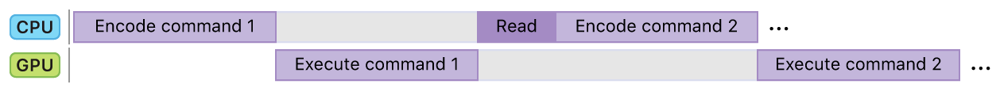
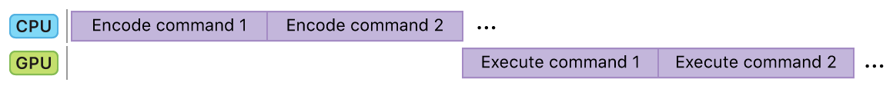

> Navigation: [Technologies](../technologies.md) · [Metal](../metal.md) · [Indirect command encoding](indirect-command-encoding.md)

# Specifying drawing and dispatch arguments indirectly

Article

Use indirect commands if you don’t know your draw or dispatch call arguments when you encode the command.

## Overview

An indirect command obtains its arguments from data stored in an [MTLBuffer](mtlbuffer.md) instance, with a specific data layout for each kind of drawing or dispatch command. The supported layouts are defined by the following structures:

- [MTLDrawPrimitivesIndirectArguments](mtldrawprimitivesindirectarguments.md)
- [MTLDrawIndexedPrimitivesIndirectArguments](mtldrawindexedprimitivesindirectarguments.md)
- [MTLDrawPatchIndirectArguments](mtldrawpatchindirectarguments.md)
- [MTLDispatchThreadgroupsIndirectArguments](mtldispatchthreadgroupsindirectarguments.md)

The arguments can be dynamically generated after the indirect command is encoded, but they need to be available by the time their associated render or compute pass begins execution. Dynamic arguments are typically generated by the GPU; for example, a patch kernel can dynamically generate the arguments for a patch draw call.

### Eliminate unnecessary data transfers and reduce processor idle time

If you are using the GPU to calculate arguments for a future drawing or dispatch command, use an indirect command to encode the second call, and avoid accessing the arguments from the CPU for other reasons. Following this practice eliminates unnecessary transfers between the GPU and CPU and stalls between the CPU and GPU.

If you create this workflow using a direct call, the timeline looks something like the figure below. First, the CPU encodes a command buffer with a compute operation to calculate the arguments. After commiting this command buffer, the CPU needs to wait until the GPU completes the command. Then, the CPU reads the results, creates a new command buffer, encodes a second command using the calculated arguments, and commits it. You pay a performance penalty because the processor stalls in the middle of this workflow, and additional time is spent reading back the results.

With indirect commands, the CPU can encode both commands in a single command buffer. After the CPU commits the command buffer, the GPU executes both passes, generating the arguments in the first pass, and executing the indirect call in the other. If your app needs to process this workflow repeatedly, it is easier for you to process work on one iteration on the GPU while you encode commands for the next iteration.

## See Also

### Indirect command buffers

- [Creating an indirect command buffer](creating-an-indirect-command-buffer.md) — Configure a descriptor to specify the properties of an indirect command buffer.
- [Encoding indirect command buffers on the CPU](encoding-indirect-command-buffers-on-the-cpu.md) — Reduce CPU overhead and simplify your command execution by reusing commands.
- [Encoding indirect command buffers on the GPU](encoding-indirect-command-buffers-on-the-gpu.md) — Maximize CPU to GPU parallelization by generating render commands on the GPU.
- [MTLIndirectCommandBuffer](mtlindirectcommandbuffer.md) — A command buffer containing reusable commands, encoded either on the CPU or GPU.
- [MTLIndirectCommandBufferDescriptor](mtlindirectcommandbufferdescriptor.md) — A configuration you create to customize an indirect command buffer.
- [MTLIndirectCommandType](mtlindirectcommandtype.md) — The types of commands that you can encode into the indirect command buffer.
- [MTLIndirectCommandBufferExecutionRange](mtlindirectcommandbufferexecutionrange.md) — A range of commands in an indirect command buffer.
- [MTLIndirectCommandBufferExecutionRangeMake](<mtlindirectcommandbufferexecutionrangemake(____).md>) — Creates a command execution range.
