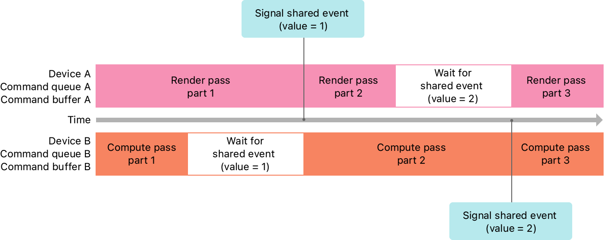

> Navigation: [Technologies](../technologies.md) · [Metal](../metal.md) · [Resource synchronization](resource-synchronization.md)

# Synchronizing events across multiple devices or processes

<sub>Article</sub>

Use shareable events to synchronize your app’s work across multiple devices or processes.

## Overview

The following figure and code show a shareable event that synchronizes graphics rendering on one device with compute processing on another.



<sub>A timeline diagram that shows a shareable synchronization event encoded into two devices. Device A shows graphics-rendering commands, and device B shows compute-processing commands.</sub>

**Swift**

```swift
func setupMultipleDeviceEvent() {
    // Shareable event
    sharedEvent = deviceA.makeSharedEvent()
    
    // Built-in GPU command queue
    commandQueueA = deviceA.makeCommandQueue()
    
    // External GPU command queue
    commandQueueB = deviceB.makeCommandQueue()
}

func renderFrame() {
    guard
        let sharedEvent = sharedEvent,
        let commandBufferA = commandQueueA?.makeCommandBuffer(),
        let commandBufferB = commandQueueB?.makeCommandBuffer()
        else { return }
    
    // Device A (Graphics Rendering)
    /* Encode first render pass */
    commandBufferA.encodeSignalEvent(sharedEvent, value: 1)
    /* Encode second render pass */
    commandBufferA.encodeWaitForEvent(sharedEvent, value: 2)
    /* Encode third render pass */
    commandBufferA.commit()
    
    // Device B (Compute Processing)
    /* Encode first compute pass */
    commandBufferB.encodeWaitForEvent(sharedEvent, value: 1)
    /* Encode second compute pass  */
    commandBufferB.encodeSignalEvent(sharedEvent, value: 2)
    /* Encode third compute pass */
    commandBufferB.commit()
}
```

**Objective-C**

```objective-c
- (void)setupMultipleDeviceEvent
{
    // Shareable event
    _sharedEvent = [_deviceA newSharedEvent];
    
    // Built-in GPU command queue
    _commandQueueA = [_deviceA newCommandQueue];
    
    // External GPU command queue
    _commandQueueB = [_deviceB newCommandQueue];
}

- (void)renderFrame
{
    // Device A (Graphics Rendering)
    id<MTLCommandBuffer> commandBufferA = [_commandQueueA commandBuffer];
    /* Encode first render pass */
    [commandBufferA encodeSignalEvent:_sharedEvent value:1];
    /* Encode second render pass  */
    [commandBufferA encodeWaitForEvent:_sharedEvent value:2];
    /* Encode third render pass  */
    [commandBufferA commit];
    
    // Device B (Compute Processing)
    id<MTLCommandBuffer> commandBufferB = [_commandQueueB commandBuffer];
    /* Encode first compute pass */
    [commandBufferB encodeWaitForEvent:_sharedEvent value:1];
    /* Encode second compute pass */
    [commandBufferB encodeSignalEvent:_sharedEvent value:2];
    /* Encode third compute pass */
    [commandBufferB commit];
}
```

During setup, the code creates a shareable event ([MTLSharedEvent](mtlsharedevent.md)) and command queues on two different devices. Like the example shown in [Synchronizing events within a single device](synchronizing-events-within-a-single-device.md), it encodes render commands onto the first queue and compute commands on the second queue.

You call the same methods when signaling and waiting on shared events as you do when working with events on a single device. The only difference is that the queues are associated with different devices and the event being used to synchronize access is a shared event.

The code shown above assumes you’ve created each resource on both device objects, and each pair of resources share a single allocation of memory. This strategy means that change made by one device object are visible to the other device object. For an example of how to do this, see [Selecting device objects for compute processing](selecting-device-objects-for-compute-processing.md).

## See Also

### Synchronizing with events

- [Implementing a multistage image filter using heaps and events](implementing-a-multistage-image-filter-using-heaps-and-events.md) — Use events to synchronize access to resources allocated on a heap.
- [About synchronization events](about-synchronization-events.md) — Synchronize access to resources in your app by signaling events.
- [Synchronizing events within a single device](synchronizing-events-within-a-single-device.md) — Use nonshareable events to synchronize your app’s work within a single device.
- [Synchronizing events between a GPU and the CPU](synchronizing-events-between-a-gpu-and-the-cpu.md) — Use shareable events to synchronize your app’s work between a GPU and the CPU.
- [MTLEvent](mtlevent.md) — A type that synchronizes memory operations to one or more resources within a single Metal device.
- [MTLSharedEvent](mtlsharedevent.md) — A type that synchronizes memory operations to one or more resources across multiple CPUs, GPUs, and processes.
- [MTLSharedEventHandle](mtlsharedeventhandle.md) — An instance you use to recreate a shareable event.
- [MTLSharedEventListener](mtlsharedeventlistener.md) — A listener for shareable event notifications.
- [MTLSharedEventNotificationBlock](mtlsharedeventnotificationblock.md) — A block of code invoked after a shareable event’s signal value equals or exceeds a given value.
