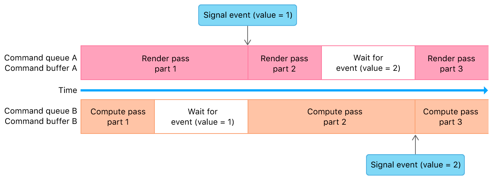

> Navigation: [Technologies](../technologies.md) · [Metal](../metal.md) · [Resource synchronization](resource-synchronization.md)

# Synchronizing events within a single device

<sub>Article</sub>

Use nonshareable events to synchronize your app’s work within a single device.

## Overview

The following figure and code show a nonshareable event that synchronizes graphics rendering on one command queue with compute processing on another.



<sub>Timeline diagram that shows a nonshareable synchronization event encoded into two command queues. Command queue A shows graphics-rendering commands, and command queue B shows compute-processing commands.</sub>

**Swift**

```swift
func setupSingleDeviceEvent() {
    // Nonshareable event
    event = device.makeEvent()
    
    // Command queues
    commandQueueA = device.makeCommandQueue()
    commandQueueB = device.makeCommandQueue()
}

func renderFrame() {
    guard
        let event = event,
        let commandBufferA = commandQueueA?.makeCommandBuffer(),
        let commandBufferB = commandQueueB?.makeCommandBuffer()
        else { return }
    
    // Command Queue A (Graphics Rendering)
    /* Encode first render pass */
    commandBufferA.encodeSignalEvent(event, value: 1)
    /* Encode second render pass */
    commandBufferA.encodeWaitForEvent(event, value: 2)
    /* Encode third render pass */
    commandBufferA.commit()
    
    // Command Queue B (Compute Processing)
    /* Encode first compute pass */
    commandBufferB.encodeWaitForEvent(event, value: 1)
    /* Encode second compute pass */
    commandBufferB.encodeSignalEvent(event, value: 2)
    /* Encode third compute pass */
    commandBufferB.commit()
}
```

**Objective-C**

```objective-c
- (void)setupSingleDeviceEvent
{
    // Nonshareable event
    _event = [_device newEvent];

    // Command queues
    _commandQueueA = [_device newCommandQueue];
    _commandQueueB = [_device newCommandQueue];
}

- (void)renderFrame
{
    // Command Queue A (Graphics Rendering)
    id<MTLCommandBuffer> commandBufferA = [_commandQueueA commandBuffer];
    /* Encode first render pass */
    [commandBufferA encodeSignalEvent:_event value:1];
    /* Encode second render pass */
    [commandBufferA encodeWaitForEvent:_event value:2];
    /* Encode third render pass */
    [commandBufferA commit];
    
    // Command Queue B (Compute Processing)
    id<MTLCommandBuffer> commandBufferB = [_commandQueueB commandBuffer];
    /* Encode first compute pass */
    [commandBufferB encodeWaitForEvent:_event value:1];
    /* Encode second compute pass */
    [commandBufferB encodeSignalEvent:_event value:2];
    /* Encode third compute pass */
    [commandBufferB commit];
}
```

During setup, the code creates a nonshareable event and two command queues. Then, to render a frame, the code encodes render commands onto the first queue and compute commands on the second queue. While the code shows these commands being encoded sequentially, in a real app, you should determine whether you can encode the commands for each command queue on a different thread.

The first render pass and first compute pass are assumed to not depend on each other’s results and modify the same data. By encoding them on different queues, the device object can schedule these commands concurrently.

When two sets of commands have dependencies on each other, the code expresses these dependencies by signaling or waiting on the event. When each queue reaches a command that waits for an event, that queue blocks further execution until the event is signaled.

## See Also

### Synchronizing with events

- [Implementing a multistage image filter using heaps and events](implementing-a-multistage-image-filter-using-heaps-and-events.md) — Use events to synchronize access to resources allocated on a heap.
- [About synchronization events](about-synchronization-events.md) — Synchronize access to resources in your app by signaling events.
- [Synchronizing events across multiple devices or processes](synchronizing-events-across-multiple-devices-or-processes.md) — Use shareable events to synchronize your app’s work across multiple devices or processes.
- [Synchronizing events between a GPU and the CPU](synchronizing-events-between-a-gpu-and-the-cpu.md) — Use shareable events to synchronize your app’s work between a GPU and the CPU.
- [MTLEvent](mtlevent.md) — A type that synchronizes memory operations to one or more resources within a single Metal device.
- [MTLSharedEvent](mtlsharedevent.md) — A type that synchronizes memory operations to one or more resources across multiple CPUs, GPUs, and processes.
- [MTLSharedEventHandle](mtlsharedeventhandle.md) — An instance you use to recreate a shareable event.
- [MTLSharedEventListener](mtlsharedeventlistener.md) — A listener for shareable event notifications.
- [MTLSharedEventNotificationBlock](mtlsharedeventnotificationblock.md) — A block of code invoked after a shareable event’s signal value equals or exceeds a given value.
