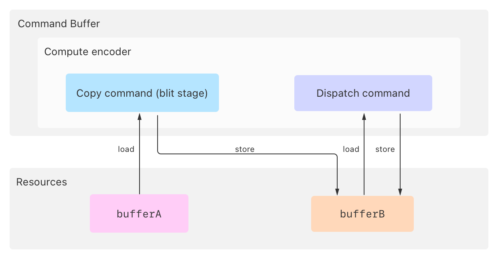
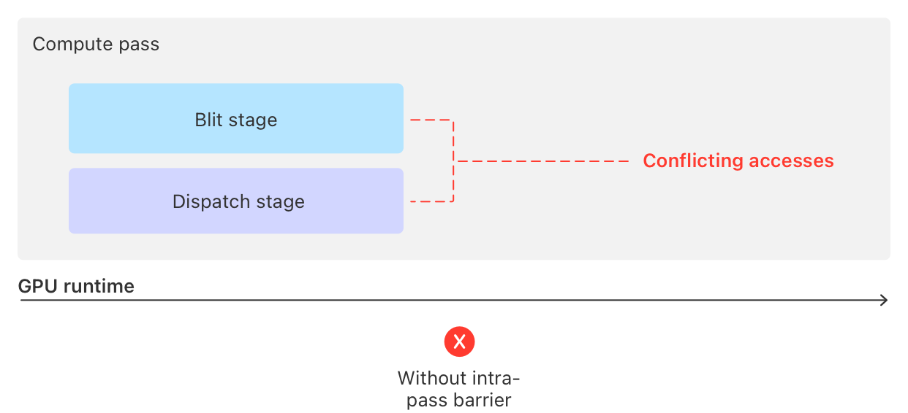
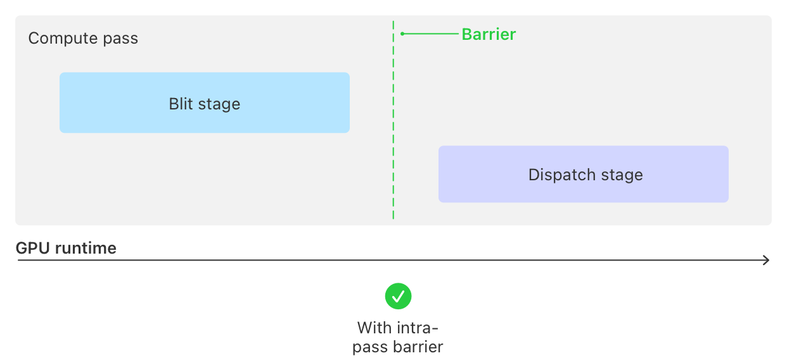

> Navigation: [Technologies](../technologies.md) · [Metal](../metal.md) · [Resource synchronization](resource-synchronization.md)

# Synchronizing stages within a pass

<sub>Article</sub>

Block GPU stages in the a pass from running until other stages in the same pass finish.

## Overview

An intrapass barrier resolves access conflicts between commands within the same pass, without affecting any other passes. When your app encodes commands that access a resource from different passes — or different stages within a single pass — it creates an access conflict when at least one command modifies that resource. This conflict happens because the GPU can run multiple commands at the same time, including those from:

- Multiple passes
- Different stages of a pass, such as the [MTLStageBlit](mtlstages/blit.md) and [MTLStageDispatch](mtlstages/dispatch.md) stages of a compute pass
- Multiple instances of a stage, such as two or more dispatch commands within a compute pass

For more information about resource access conflicts and GPU stages, see [Resource synchronization](resource-synchronization.md) and [MTLStages](mtlstages.md), respectively.

Start by identifying which memory operations from different stages within a pass introduce a conflict. Then resolve the conflict by adding an _intrapass barrier_ to pause the GPU before running the consuming stage until it finishes running the producing stage.

> [!note] Note
> An intrapass barrier has no effect on any other pass. A GPU may still be running an earlier pass, or it may begin running the next pass, or both.

### Identify access conflicts within a single pass

The following code example encodes a compute pass that has an access conflict between its copy and dispatch commands.

**Swift**

```swift
func encodeComputeWorkWithIntrapassBarrier(computeEncoder: MTL4ComputeCommandEncoder,
                                           argumentTable: MTL4ArgumentTable,
                                           buffers: [MTLBuffer])
{
    // Assign the argument table to the compute encoder.
    computeEncoder.setArgumentTable(argumentTable)

    // Add the buffers to the argument table.
    let bufferA = buffers[0]
    let bufferB = buffers[1]

    argumentTable.setAddress(bufferA.gpuAddress, index: 0)
    argumentTable.setAddress(bufferB.gpuAddress, index: 1)

    // Encode a copy command, which the GPU runs during the blit stage.
    computeEncoder.copy(sourceBuffer: bufferA, sourceOffset: 0,
                        destinationBuffer: bufferB, destinationOffset: 0,
                        size: copySize)

    // This method needs a barrier here.

    // Run a dispatch command that works with `bufferB`,
    // which the GPU runs during the dispatch stage.
    computeEncoder.setComputePipelineState(modifyBufferIndex1ComputePipeline)
    computeEncoder.dispatchThreadgroups(threadgroupsPerGrid: threadgroupCount,
                                        threadsPerThreadgroup: threadsPerThreadgroup)
}
```

**Objective-C**

```objective-c
- (void)encodeComputeWorkWithIntrapassBarrier:(id<MTL4ComputeCommandEncoder>)computeEncoder
                                argumentTable:(id<MTL4ArgumentTable>)argumentTable
                                      buffers:(id<MTLBuffer> *)buffers
{
    // Assign the argument table to the compute encoder.
    [computeEncoder setArgumentTable:argumentTable];

    // Add the buffers to the argument table.
    id<MTLBuffer> bufferA = buffers[0];
    id<MTLBuffer> bufferB = buffers[1];

    [argumentTable setAddress:bufferA.gpuAddress atIndex:0];
    [argumentTable setAddress:bufferB.gpuAddress atIndex:1];

    // Encode a copy command, which the GPU runs during the blit stage.
    [computeEncoder copyFromBuffer:bufferA sourceOffset:0
                          toBuffer:bufferB destinationOffset:0
                              size:copySize];

    // This method needs a barrier here.

    // Run a dispatch command that works with `bufferB`,
    // which the GPU runs during the dispatch stage.
    [computeEncoder setComputePipelineState:modifyBufferIndex1ComputePipeline];
    [computeEncoder dispatchThreadgroups:threadgroupCount
                   threadsPerThreadgroup:threadsPerThreadgroup];
}
```

The example has at least one access conflict because the pass accesses two common resources — `bufferA` and `bufferB` — from different stages, and at least one command modifies one or more of those resources.

The copy command and the dispatch commands run during the blit and dispatch stages, respectively; both commands modify `bufferB`.



<sub>A diagram showing a single compute pass with copy and dispatch commands both accessing buffer B, where the copy command runs during the blit stage and stores to buffer B, and the dispatch command runs during the dispatch stage and modifies buffer B.</sub>

Without a barrier, the GPU can run the commands at any time relative to each other, including at the same time, which can yield inconsistent results in resources with access conflicts.



<sub>A diagram showing the blit and dispatch stages running in parallel without synchronization, potentially causing inconsistent results when both access buffer B.</sub>

### Resolve an intrapass conflict with a barrier

Resolve access conflicts between commands within the same pass by adding an intrapass barrier with the encoder’s [barrier(afterEncoderStages:beforeEncoderStages:visibilityOptions:)](<mtl4commandencoder/barrier(afterencoderstages_beforeencoderstages_visibilityoptions_).md>) method.

The following code example modifies the previous one adding an intrapass barrier between the blit and dispatch stages within the pass.

**Swift**

```swift
    // Encode a copy command, which the GPU runs during the blit stage.
    computeEncoder.copy(sourceBuffer: bufferA, sourceOffset: 0,
                        destinationBuffer: bufferB, destinationOffset: 0,
                        size: copySize)

    // Add a barrier between the copy above and the dispatch below.
    computeEncoder.barrier(afterEncoderStages: .blit,
                           beforeEncoderStages: .dispatch,
                           visibilityOptions: .device)

    // Run a dispatch command that works with `bufferB`,
    // which the GPU runs during the dispatch stage.
    computeEncoder.setComputePipelineState(modifyBufferIndex1ComputePipeline)
    computeEncoder.dispatchThreadgroups(threadgroupsPerGrid: threadgroupCount,
                                        threadsPerThreadgroup: threadsPerThreadgroup)
```

**Objective-C**

```objective-c
    // Encode a copy command, which the GPU runs during the blit stage.
    [computeEncoder copyFromBuffer:bufferA sourceOffset:0
                          toBuffer:bufferB destinationOffset:0
                              size:copySize];

    // Add a barrier between the copy above and the dispatch below.
    [computeEncoder barrierAfterEncoderStages:MTLStageBlit
                          beforeEncoderStages:MTLStageDispatch
                            visibilityOptions:MTL4VisibilityOptionDevice];

    // Run a dispatch command that works with `bufferB`,
    // which the GPU runs during the dispatch stage.
    [computeEncoder setComputePipelineState:modifyBufferIndex1ComputePipeline];
    [computeEncoder dispatchThreadgroups:threadgroupCount
                   threadsPerThreadgroup:threadsPerThreadgroup];
```

The code example adds a barrier between the blit and dispatch stages because they both access `bufferB` with load or store operations. The barrier forces the GPU to wait until the blit command completes before starting the dispatch stage.



<sub>A diagram showing the intrapass barrier synchronization where the GPU waits for the blit stage to complete before starting the dispatch stage.</sub>

The barrier makes it so that the store operations from the blit stage’s commands finish completely before the dispatch stage’s commands load from the same memory.

### Encode commands that rely on fragment or tile stage outputs

Metal doesn’t support intrapass barriers that wait for the [MTLStageTile](mtlstages/tile.md) or [MTLStageFragment](mtlstages/fragment.md) stages on devices that have a tile-based deferred rendering (TBDR) architecture, such as Apple silicon GPUs.

> [!note] Note
> For more information about TBDR architecture, see [Tailor your apps for Apple GPUs and tile-based deferred rendering](tailor-your-apps-for-apple-gpus-and-tile-based-deferred-rendering.md).

You can encode a tile dispatch that depends on the results of a previous tile dispatch because tile compute dispatches can access data from anywhere within the same tile. Similarly, you can encode a draw command that depends on the results of a previous draw command’s fragment stage because fragment shaders can only access data at their specific pixel location. However, if a tile dispatch needs results from another tile, or a fragment shader needs results from another fragment, then start a new render pass and synchronize them with a barrier.

For example, to synchronize the two passes by adding a consumer-based queue barrier in the new pass:

1. End the current render pass by calling the encoder’s [- endEncoding](<mtl4commandencoder/endencoding().md>) method.
2. Start a new render pass by creating a new render encoder from the command buffer, or another bound for the queue.
3. Add a consumer barrier by calling the new encoder’s [barrier(afterQueueStages:beforeStages:visibilityOptions:)](<mtl4commandencoder/barrier(afterqueuestages_beforestages_visibilityoptions_).md>) method, which synchronizes the results of the previous render pass.

Similarly, to create a producer-based queue barrier in a pass:

1. Add a producer barrier by calling the encoder’s [barrier(afterStages:beforeQueueStages:visibilityOptions:)](<mtl4commandencoder/barrier(afterstages_beforequeuestages_visibilityoptions_).md>) method to synchronize the results of the current render pass.
2. End the current render pass by calling the encoder’s [- endEncoding](<mtl4commandencoder/endencoding().md>) method.
3. Start a new render pass by creating a new encoder from the command buffer, or another bound for the queue.

Alternatively, use an [MTLFence](mtlfence.md):

1. Update a fence in the current render pass by calling the encoder’s [- updateFence:afterEncoderStages:](<mtl4commandencoder/updatefence(__afterencoderstages_).md>) method.
2. End the current render pass by calling the encoder’s [- endEncoding](<mtl4commandencoder/endencoding().md>) method.
3. Start a new render pass by creating a new encoder from the same command buffer.
4. Wait for the same fence instance in the new render pass by calling the new encoder’s [- waitForFence:beforeEncoderStages:](<mtl4commandencoder/waitforfence(__beforeencoderstages_).md>) method.

For more information about other synchronization mechanisms, see these articles in the series:

- [Synchronizing passes with a fence](synchronizing-passes-with-a-fence.md)
- [Synchronizing passes with consumer barriers](synchronizing-passes-with-consumer-barriers.md)
- [Synchronizing passes with producer barriers](synchronizing-passes-with-producer-barriers.md)

## See Also

### Synchronizing with barriers and fences

- [Synchronizing passes with a fence](synchronizing-passes-with-a-fence.md) — Block GPU stages in a pass until another pass unblocks it by signaling a fence.
- [Synchronizing passes with consumer barriers](synchronizing-passes-with-consumer-barriers.md) — Block GPU stages in a pass, and all subsequent passes, from running until stages from earlier passes finish.
- [Synchronizing passes with producer barriers](synchronizing-passes-with-producer-barriers.md) — Block GPU stages in subsequent passes from running until stages in a pass, and earlier passes, finish.
- [Synchronizing CPU and GPU work](synchronizing-cpu-and-gpu-work.md) — Avoid stalls between CPU and GPU work by using multiple instances of a resource.
- [Implementing a multistage image filter using heaps and fences](implementing-a-multistage-image-filter-using-heaps-and-fences.md) — Use fences to synchronize access to resources allocated on a heap.
- [MTLStages](mtlstages.md) — The segments of command execution within the Metal pass types.
- [MTLFence](mtlfence.md) — A synchronization mechanism that orders memory operations between GPU passes.
- [MTLRenderStages](mtlrenderstages.md) — The stages in a render pass that triggers a synchronization command.
- [MTLBarrierScope](mtlbarrierscope.md) — Describes the types of resources that a barrier operates on.
- [MTL4VisibilityOptions](mtl4visibilityoptions.md) — Memory consistency options for synchronization commands.
