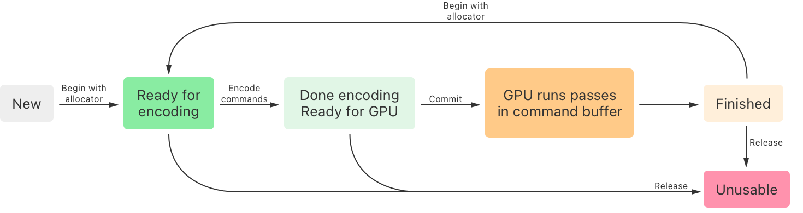

> Navigation: [Technologies](../technologies.md) · [Metal](../metal.md)

# Understanding the Metal 4 core API

<sub>Article</sub>

Discover the features and functionality in the Metal 4 foundational APIs.

## Overview

Metal 4 improves runtime performance and memory efficiency while making it easier to adapt your apps and games from other platforms, such as DirectX and Vulkan.

Metal 4 introduces new types for existing concepts and several new ones, including:

- Command queues
- Command buffers
- Command encoders
- Command allocators
- Argument tables
- Texture view pools
- Next generation barriers

Metal 4 introduces several types with the `MTL4` prefix that are completely independent from the original `MTL` types they replace, such as [MTL4CommandQueue](mtl4commandqueue.md) versus [MTLCommandQueue](mtlcommandqueue.md). Other types are common to all versions of Metal.

| Metal 4 | Metal |
|---|---|
| [MTL4CommandQueue](mtl4commandqueue.md) | [MTLCommandQueue](mtlcommandqueue.md) |
| [MTL4CommandBuffer](mtl4commandbuffer.md) | [MTLCommandBuffer](mtlcommandbuffer.md) |
| [MTL4RenderCommandEncoder](mtl4rendercommandencoder.md) | [MTLRenderCommandEncoder](mtlrendercommandencoder.md) |
| [MTL4ComputeCommandEncoder](mtl4computecommandencoder.md) | [MTLComputeCommandEncoder](mtlcomputecommandencoder.md)   [MTLBlitCommandEncoder](mtlblitcommandencoder.md)  [MTLAccelerationStructureCommandEncoder](mtlaccelerationstructurecommandencoder.md) |

At runtime, your app can detect whether the current system supports Metal 4. For devices that support Metal 4, you can create an [MTL4CommandQueue](mtl4commandqueue.md), otherwise, create an [MTLCommandQueue](mtlcommandqueue.md). The type of queue you create determines which family of types you work with. For more information, see [Work submission](work-submission.md).

You can incrementally adopt Metal 4 over time, which is convenient for larger projects. Portions of your app can individually switch to submitting work to an [MTL4CommandQueue](mtl4commandqueue.md) instance. When applicable, an app can synchronize the work it sends to an [MTL4CommandQueue](mtl4commandqueue.md) with other parts of the app that send work to [MTLCommandQueue](mtlcommandqueue.md) instances. For more information, see [Resource synchronization](resource-synchronization.md).

### Command queues

Metal 4 introduces a new command queue protocol, [MTL4CommandQueue](mtl4commandqueue.md), which reduces CPU runtime and memory overhead by sending work to the GPU when you commit a command buffer. This means your app can submit work from any thread. You create a Metal 4 command queue by calling an [MTLDevice](mtldevice.md) factory method, such as [- newMTL4CommandQueue](<mtldevice/makemtl4commandqueue().md>).

Metal 4 command queues can commit multiple command buffers as a group. Apps can encode subsets of GPU work to multiple command buffers — each on a separate worker thread. When the worker threads finish encoding to their respective command buffers, you send the command buffers to the GPU as a whole by committing them to an [MTL4CommandQueue](mtl4commandqueue.md) instance with one of its methods, such as [commit:count:](mtl4commandqueue/commit_count_.md). This is similar to how you use an [MTLParallelRenderCommandEncoder](mtlparallelrendercommandencoder.md), but different in that you can also apply other types of work in addition to rendering.

You can synchronize work between command queues with an [MTLEvent](mtlevent.md) instance, or synchronize work on the CPU and other Metal devices with an [MTLSharedEvent](mtlsharedevent.md) instance. Events work with any combination of [MTLCommandQueue](mtlcommandqueue.md) and [MTL4CommandQueue](mtl4commandqueue.md) instances. This interoperability makes it easier for you to:

- Coordinate work between your app’s Metal 4 queues and existing Metal code.
- Transition to Metal 4 over time and incrementally adopt its features.

You can synchronize work within the same queue by adding a barrier (see [Resource synchronization](resource-synchronization.md)).

### Command buffers

Metal 4 introduces [MTL4CommandBuffer](mtl4commandbuffer.md), which is more efficient and works differently than [MTLCommandBuffer](mtlcommandbuffer.md) in the following ways:

- You create a Metal 4 command buffer by calling an [MTLDevice](mtldevice.md) factory method, such as [- newCommandBuffer](<mtldevice/makecommandbuffer().md>), instead of from a queue.
- You submit a command buffer to any [MTL4CommandQueue](mtl4commandqueue.md) instance that belongs to the same device by calling one of its methods, such as [commit:count:](mtl4commandqueue/commit_count_.md), unlike [MTLCommandBuffer](mtlcommandbuffer.md) which has its own [- commit](<mtlcommandbuffer/commit().md>) method.
- You can reuse and repurpose each command buffer indefinitely by starting over, encoding new commands, and committing it again, instead of allocating a new buffer.
- Unlike the default behavior of [MTLCommandBuffer](mtlcommandbuffer.md), you may need to consider a resource’s retain count because each [MTL4CommandBuffer](mtl4commandbuffer.md) instance doesn’t create strong references to resources. This is similar to creating an [MTLCommandBuffer](mtlcommandbuffer.md) with the [- commandBufferWithUnretainedReferences](<mtlcommandqueue/makecommandbufferwithunretainedreferences().md>) method of an [MTLCommandQueue](mtlcommandqueue.md).



<sub>A diagram for the life cycle of a Metal 4 command buffer instance. Starting on the left side as a new command buffer, it moves into the next phase where it’s ready for encoding when you call its begin-with-allocator method. The next phase is when you’re ready to submit to the GPU after encoding commands into it. Committing the command buffer moves it to the next phase where the GPU runs the commands. The command buffer moves to the Finished phase after the GPU runs its commands. You can reuse the command buffer by calling its begin-with-allocator method again. The command buffer moves to an unusable phase when you call its release method, which you can call during encoding or after the GPU finishes running it.</sub>

After committing a command buffer to a queue, you can use it again by calling its [- beginCommandBufferWithAllocator:](<mtl4commandbuffer/begincommandbuffer(allocator_).md>) method. You can then encode commands to the buffer as if it were a new instance. This is different from previous versions of Metal that require you to create a new transient, single-use command buffer when you need to commit more work to a queue.

### Command allocators

The _command allocator_ is a companion type that provides memory for command buffers. You associate a command allocator with one command buffer at a time by calling its [- beginCommandBufferWithAllocator:](<mtl4commandbuffer/begincommandbuffer(allocator_).md>) method. When you finish encoding commands to a command buffer, you can apply the allocator to another command buffer by first calling the current command buffer’s [- endCommandBuffer](<mtl4commandbuffer/endcommandbuffer().md>) method and then another command buffer’s [- beginCommandBufferWithAllocator:](<mtl4commandbuffer/begincommandbuffer(allocator_).md>) method.

Each allocator manages the memory that your app needs to encode commands into the command buffer that you associate with it. Like command buffers, you create each new [MTL4CommandAllocator](mtl4commandallocator.md) instance by calling a factory method of an [MTLDevice](mtldevice.md), such as [- newCommandAllocator](<mtldevice/makecommandallocator().md>).

Your app can manage the memory that it requires by using a command allocator for each frame’s work. When the GPU finishes the work for that frame, call the [- reset](<mtl4commandallocator/reset().md>) method to release the memory for reuse.

Apps can render frames by reusing a series of allocators, one for each frame it might have in flight at the same time to begin working on the next frame.

For example, the sample code project, [Drawing a triangle with Metal 4](drawing-a-triangle-with-metal-4.md) (Hello Triangle), works with three frames at the same time:

**Swift**

```swift
/// The number of frames the renderer works with at the same time.
let kMaxFramesInFlight = 3

/// A class that renders each of the app's video frames.
class Metal4Renderer {

    /// The Metal device the renderer draws with by sending commands to it.
    let device: MTLDevice

    /// A command queue the app uses to send command buffers to the Metal device.
    let commandQueue: MTL4CommandQueue

    /// An array of allocators that store commands for each frame
    /// while the app encodes them and the GPU runs them.
    var commandAllocators: [MTL4CommandAllocator] = []

    /// A command buffer the app reuses to render each frame.
    let commandBuffer: MTL4CommandBuffer

    // ...
}

/// Draws a frame of content to a view's drawable.
/// - Parameter view: A view with a drawable that the renderer draws into.
func renderFrameToView(_ view: MTKView) {

    // ...

    // Get the next allocator in the rotation.
    let frameIndex: Int = Int(frameNumber) % kMaxFramesInFlight
    let frameAllocator = commandAllocators[frameIndex]

    // Prepare to use or reuse the allocator by resetting it.
    frameAllocator.reset()

    // Prepare to use or reuse the command buffer for the frame's commands.
    commandBuffer.beginCommandBuffer(allocator: frameAllocator)

    // ...
}
```

**Objective-C**

```objective-c
/// The number of frames the renderer works with at the same time.
#define kMaxFramesInFlight 3

/// A class that renders each of the app's video frames.
@implementation Metal4Renderer
{
    /// The Metal device the renderer draws with by sending commands to it.
    id<MTLDevice> device;

    /// A command queue the app uses to send command buffers to the Metal device.
    id<MTL4CommandQueue> commandQueue;

    /// An array of allocators that store commands for each frame
    /// while the app encodes them and the GPU runs them.
    id<MTL4CommandAllocator> commandAllocators[kMaxFramesInFlight];

    /// A command buffer the app reuses to render each frame.
    id<MTL4CommandBuffer> commandBuffer;

    // ...
}

/// Draws a frame of content to a view's drawable.
/// - Parameter view: A view with a drawable that the renderer draws into.
- (void)renderFrameToView:(nonnull MTKView *)view
{
    // ...

    // Get the next allocator in the rotation.
    uint32_t frameIndex = frameNumber % kMaxFramesInFlight;
    id<MTL4CommandAllocator> frameAllocator = commandAllocators[frameIndex];

    // Prepare to use or reuse the allocator by resetting it.
    [frameAllocator reset];

    // Prepare to use or reuse the command buffer for the frame's commands.
    [commandBuffer beginCommandBufferWithAllocator:frameAllocator];

    // ...
}
```

At any point, each in-flight frame is in a different part of its life cycle.

- The current frame is what the app displays until the GPU finishes rendering the next frame.
- Meanwhile, the GPU is rendering the first future frame from the most recent command buffers that the app submits to the GPU.
- The app encodes the second future frame — either on the CPU or GPU — and submits the frame when other frames advance to the next stage in their life cycle.

### Command encoders

The _command encoder_, [MTL4CommandEncoder](mtl4commandencoder.md), is a base protocol for other work-specific protocols that Metal provides, including:

- [MTL4MachineLearningCommandEncoder](mtl4machinelearningcommandencoder.md)
- [MTL4RenderCommandEncoder](mtl4rendercommandencoder.md)
- [MTL4ComputeCommandEncoder](mtl4computecommandencoder.md)

The base command encoder protocol defines a different interface and default behavior than its earlier counterpart, [MTLCommandEncoder](mtlcommandencoder.md). The most important difference with Metal 4 encoders is that they don’t have methods that bind individual buffers, textures, and heaps. Instead, you configure the resource bindings in an argument table and then bind that table to one or more pipeline stages with a command encoder.

Use [MTL4MachineLearningCommandEncoder](mtl4machinelearningcommandencoder.md) to encode inference commands that apply [Core ML](../coreml.md) models into a command buffer, alongside your app’s rendering and computation workloads. For more information, see [Machine learning passes](machine-learning-passes.md).

The [MTL4RenderCommandEncoder](mtl4rendercommandencoder.md) protocol is the equivalent to its earlier counterpart, [MTLRenderCommandEncoder](mtlrendercommandencoder.md), and has most of the same rendering methods. `MTL4RenderCommandEncoder` differs from `MTLRenderCommandEncoder` by removing methods that manage resource bindings and residency sets, and methods that configure store-action options and tessellation. Instead, `MTL4RenderCommandEncoder` gives you the ability to:

- Add a residency set to either an encoder’s command buffer, or the command queue you submit that command buffer to.
- Create an argument table, configure it with bindings to resources, and then assign it to an encoder that refers to those resources.
- Apply mesh shader techniques to replace tessellation functionality.

> [!note] Note
> Store-action options (see [MTLStoreActionOptions](mtlstoreactionoptions.md)) aren’t available because they don’t apply to Apple silicon GPUs.

`MTL4RenderCommandEncoder` also supports encoding a render pass across command buffers by:

- Suspending the work at the end of one render encoder
- Resuming the work after the beginning of the next render encoder in the sequence

This technique conceptually replaces the [MTLParallelRenderCommandEncoder](mtlparallelrendercommandencoder.md) protocol and simplifies encoding a render pass in parallel with multiple threads because each thread can have its own render encoder instead of tying all of them to a single render encoder.

The [MTL4ComputeCommandEncoder](mtl4computecommandencoder.md) protocol is a new type that combines the functionality of its three predecessors:

- [MTLBlitCommandEncoder](mtlblitcommandencoder.md)
- [MTLComputeCommandEncoder](mtlcomputecommandencoder.md)
- [MTLAccelerationStructureCommandEncoder](mtlaccelerationstructurecommandencoder.md)

### Argument tables

Metal 4 introduces an _argument table_ type that stores bindings to resources, such as data buffers, textures, and samplers, on an encoder’s behalf. Argument tables can reduce your app’s memory footprint because:

- Metal 4 encoders don’t require memory for storing the binding tables for every resource type, at every stage.
- Each table consumes only the memory it needs to store its resource bindings.

Each [MTL4ArgumentTable](mtl4argumenttable.md) instance stores a list for each resource type, which your app creates and maintains.

- Create or reuse an [MTL4ArgumentTableDescriptor](mtl4argumenttabledescriptor.md) instance.
- Configure how many bindings of each type it stores by configuring its properties, including [maxBufferBindCount](mtl4argumenttabledescriptor/maxbufferbindcount.md) and [maxTextureBindCount](mtl4argumenttabledescriptor/maxtexturebindcount.md).
- Create an argument table by passing the descriptor instance to an [MTLDevice](mtldevice.md) factory method, such as [- newArgumentTableWithDescriptor:error:](<mtldevice/makeargumenttable(descriptor_).md>).
- Add or update bindings to the argument table by calling its methods, such as [- setResource:atBufferIndex:](<mtl4argumenttable/setresource(__bufferindex_).md>) and [- setSamplerState:atIndex:](<mtl4argumenttable/setsamplerstate(__index_).md>).

Assign an argument table to one or more stages of a command encoder, and then the commands you encode with it can refer to the resources in the argument table’s lists, such as textures and data buffers. You can also apply a single argument table to the stages of multiple encoders at the same time.

As your app adds render or dispatch work to a command buffer by calling an encoder’s methods, the encoder looks up the resources that the method needs from the encoder’s argument table.

The design adds flexibility for reducing your app’s CPU and memory overhead. For example, in Metal 4 you can create a single argument table that stores bindings to resources that apply to multiple encoders, and then reuse that argument table indefinitely. This approach is more efficient than previous Metal encoder types, where each encoder instance manages its own resource binding tables. In Metal 4, the memory and runtime savings add up with each common resource your encoders share, and each time you assign the argument table to a new encoder.

> [!tip] Tip
> Create and configure separate argument tables for your app’s disparate types of work so that each table only manages the common resources for similar or overlapping tasks.

### Barriers

Earlier versions of Metal support tracking data hazards for textures and heaps you create with hazard tracking (see the `hazardTrackingMode` property of the [MTLTextureDescriptor](mtltexturedescriptor.md) and [MTLHeapDescriptor](mtlheapdescriptor.md) types, respectively).

In Metal 4, the framework considers all resources untracked. You need to synchronize pipeline stages that can concurrently access a resource if any of the shaders in these pipelines modify it. For example, apps commonly encode a pass that writes to a common buffer that a later pass needs to read from to do its work, such as rendering to a texture.

One of the most efficient ways to synchronize work between two or more passes is to add a _barrier_. A barrier tells the GPU that it needs to avoid a race condition by delaying the start of a pipeline stage until a previous stage finishes, so that it’s safe to access the results of that stage. For example, if an app encodes a compute pass that produces data that a subsequent render pass consumes in its fragment shader, the app needs to add a barrier between the dispatch stage of the compute pass and the fragment stage of the render pass. In that scenario, the barrier signals to the GPU that it needs to wait before running the fragment stage of the render pass until the dispatch stage of the compute pass finishes modifying common resources.

### Texture view pools

Metal 4 introduces the [MTLTextureViewPool](mtltextureviewpool.md) protocol which creates lightweight texture views that can reduce your app’s memory footprint compared to creating the equivalent instances of [MTLTexture](mtltexture.md). Each [MTLTexture](mtltexture.md) instance is a heavyweight type that stores a texture’s underlying data and metadata. Each texture also has an implicit _texture view_, which is the default format interpretation of the texture’s underlying data. With a texture view pool, you can create lightweight texture views that interpret and access a texture’s underlying data with a different format than its original. For example, you can create an [MTLTexture](mtltexture.md) instance with its [pixelFormat](mtltexture/pixelformat.md) equal to [MTLPixelFormatRGBA32Uint](mtlpixelformat/rgba32uint.md), and then create a new texture view of the same texture that interprets the underlying data as if its pixel format is [MTLPixelFormatRG11B10Float](mtlpixelformat/rg11b10float.md).

Every texture view has a unique [MTLResourceID](mtlresourceid.md), which includes:

- Texture views you create with an [MTLTextureViewPool](mtltextureviewpool.md) instance’s methods, which is the return value of those methods
- Implicit texture views that Metal assigns to each [MTLTexture](mtltexture.md) you create, which you can access with a texture’s [gpuResourceID](mtltexture/gpuresourceid.md) property

The resource IDs that a texture pool creates are part of a contiguous range of values that belong to that pool. For example, for a texture view pool that has 20 texture views, you can get the resource ID of the fifth texture view by adding `4` to the first texture view’s resource ID. Similarly, you can get the resource ID of the last (twentieth) texture view by adding `19` to the first texture view’s resource ID.

You can reuse a resource ID within a texture view pool, such as when you no longer need it, by reassigning the index of that pool with another view of any texture.

A texture view pool has a contiguous range of `MTLResourceID` values that you can manage by creating lightweight texture views, each of which gets its own resource ID. You can repurpose any ID in the pool to another view when you no longer need the view that it currently represents.

## See Also

### Essentials

- [Drawing a triangle with Metal 4](drawing-a-triangle-with-metal-4.md) — Render a colorful, rotating 2D triangle by running draw commands with a render pipeline on a GPU.
- [Performing calculations on a GPU](performing-calculations-on-a-gpu.md) — Use Metal to find GPUs and perform calculations on them.
- [Using Metal to draw a view’s contents](using-metal-to-draw-a-view's-contents.md) — Create a MetalKit view and a render pass to draw the view’s contents.
