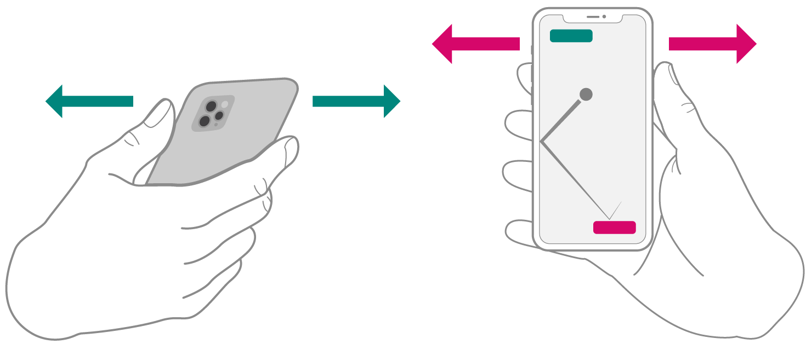

> Navigation: [Technologies](technologies.md)

# Nearby Interaction

Framework

Locate and interact with nearby devices using identifiers, distance, and direction.

## Overview

Use Nearby Interaction in your app to acquire the position of devices with an Ultra Wideband (UWB) chip, such as iPhone 11 or later, Apple Watch, and third-party accessories. To participate in an interaction, devices in physical proximity run an app and share their position and device tokens that uniquely identify them. When the app runs in the foreground, Nearby Interaction notifies the interaction session of the peer’s location by reporting the peer’s direction and distance in meters.

Apple devices use the high-frequency capabilities of the UWB chip to share their positions in the physical environment and enable fluid, interactive sessions. For example:

- A multiuser AR experience that places virtual water balloons in the hands of its participants
- A taxi or rideshare app that employs a peer user’s direction in real time to identify the relative locations of a driver and a customer
- A game app that enables a user to control a paddle with their device and respond to a moving ball on the peer user’s screen, as in the following figure

An illustration of two hands, each holding an iPhone. Arrows extend from the phones to indicate the users’ physical movement. Onscreen, the app displays a ball and paddle game where the first user’s movement slides the bottom paddle left or right, and the opponent’s movement slides the top paddle left or right. In the center of the screen, a ball with motion lines indicates the movement of the ball as it bounces off the first user’s paddle and heads to the upper-right corner of the screen, which isn’t guarded by the opponent’s paddle. 

For guidance on designing nearby interactions, see the [Human Interface Guidelines \> Nearby interactions](https://developer.apple.com/design/human-interface-guidelines/nearby-interactions).

### Interact with Apple Watch

The UWB chip-capable Apple Watch running watchOS 8 supports Nearby Interaction sessions. Apps share discovery tokens to begin an interaction session in watchOS using a custom server, [Core Bluetooth](corebluetooth.md), LAN (TCP/UDP), or [Watch Connectivity](watchconnectivity.md).

Nearby Interaction in iOS provides a peer device’s distance and direction, whereas Nearby Interaction in watchOS provides only a peer device’s distance.

### Interact with third-party devices

In iOS 15 and later and watchOS 8 and later, UWB-enabled devices can interact with third-party accessories you partner with or develop using the [Nearby Interaction Accessory Protocol Specification](https://developer.apple.com/nearby-interaction/specification). To begin an interaction session with a third-party accessory, establish a data link with the accessory, receive its configuration data, and create an [NINearbyAccessoryConfiguration](nearbyinteraction/ninearbyaccessoryconfiguration.md). The framework provides configuration data for your device through [- session:didGenerateShareableConfigurationData:forObject:](<nearbyinteraction/nisessiondelegate/session(__didgenerateshareableconfigurationdata_for_).md>) that your app sends to the accessory to begin detecting the accessory’s range. For more information on accessory interaction, see [NINearbyAccessoryConfiguration](nearbyinteraction/ninearbyaccessoryconfiguration.md).

> [!note] Note
> The [supportsPreciseDistanceMeasurement](nearbyinteraction/nidevicecapability/supportsprecisedistancemeasurement.md) function returns [false](swift/false.md) in Mac apps built with Mac Catalyst. For a compatible iPad or iPhone app running in visionOS, framework features are unavailable, and any calls you make to the framework APIs have no effect.

### Using Nearby Interaction in the background

While your app is in the foreground, it can freely use Nearby Interaction to perform ranging between UWB devices. When the app moves to the background, it can perform UWB ranging only with devices that are Bluetooth Low Energy (LE)-paired and connected.

In iOS 18.4 and later, your app can continue ranging in the background with any supported device if the app starts a Live Activity as it goes to the background. For more information about creating Live Activities, see [ActivityKit](activitykit.md).

> [!note] Note
> Both these forms of background activity require that you enable the appropriate capability in Xcode. In your target’s Signing & Capabilities tab, add the “Background Modes” capability, then select “Uses Nearby Interaction”.

## Topics

### Setup

- [Initiating and maintaining a session](nearbyinteraction/initiating-and-maintaining-a-session.md) — Measure the relative position of a nearby device and coach the user to sustain interaction.
- [NISession](nearbyinteraction/nisession.md) — An object that identifies a unique connection between two peer devices.

### Authorization

- [NSNearbyInteractionUsageDescription](bundleresources/information-property-list/nsnearbyinteractionusagedescription.md) — A request for user permission to begin an interaction session with nearby devices.

### Phone interaction

- [Implementing interactions between users in close proximity](nearbyinteraction/implementing-interactions-between-users-in-close-proximity.md) — Enable devices to access relative positioning information.
- [Discovering peers with Multipeer Connectivity](nearbyinteraction/discovering-peers-with-multipeer-connectivity.md) — Exchange discovery tokens over the local network.
- [Extending advanced direction finding and ranging](nearbyinteraction/extending-advanced-direction-finding-and-ranging.md) — Extend your app’s direction finding capabilities with data from Ultra Wideband devices.
- [NINearbyPeerConfiguration](nearbyinteraction/ninearbypeerconfiguration.md) — A configuration that enables interaction between iPhone or Apple Watch devices.

### Watch interaction

- [Implementing proximity-based interactions between a phone and watch](nearbyinteraction/implementing-proximity-based-interactions-between-a-phone-and-watch.md) — Interact with a nearby Apple Watch by measuring its distance to a paired iPhone.

### Third-party accessories

- [Implementing spatial interactions with third-party accessories](nearbyinteraction/implementing-spatial-interactions-with-third-party-accessories.md) — Establish a connection with a nearby accessory to receive periodic measurements of its distance from the user.
- [NINearbyAccessoryConfiguration](nearbyinteraction/ninearbyaccessoryconfiguration.md) — A configuration that enables interaction between iPhone and third-party accessories.
- [NIMotionActivityState](nearbyinteraction/nimotionactivitystate.md) — Motion states for a nearby accessory.

### Periodic updates

- [NINearbyObject](nearbyinteraction/ninearbyobject.md) — Location information for a peer device in an interaction session.
- [NISessionDelegate](nearbyinteraction/nisessiondelegate.md) — An object that monitors and reacts to session updates.

### Camera assistance

- [Finding devices with precision](nearbyinteraction/finding-devices-with-precision.md) — Leverage the spatial awareness of ARKit and Apple Ultra Wideband Chips in your app to guide users to a nearby device.
- [NIAlgorithmConvergence](nearbyinteraction/nialgorithmconvergence.md) — An object that provides the state and reason for user coaching recommendations.
- [NIAlgorithmConvergenceStatus](nearbyinteraction/nialgorithmconvergencestatus-2fnve.md) — The possible states of Camera Assistance.
- [Algorithm Convergence Status](nearbyinteraction/algorithm-convergence-status.md) — The possible Objective-C states of Camera Assistance.

### DL-TDOA ranging

- [Downlink time difference of arrival ranging](nearbyinteraction/dl-tdoa-ranging.md) — Use anchor devices to improve the accuracy of indoor positioning.

### Errors

- [NIError](nearbyinteraction/nierror.md) — An error Nearby Interaction reports.
- [Code](nearbyinteraction/nierror/code.md) — Codes that identify errors in Nearby Interaction.
- [NIErrorDomain](nearbyinteraction/nierrordomain.md) — A unique error domain for Nearby Interaction.

### Deprecated

- [NSNearbyInteractionAllowOnceUsageDescription](bundleresources/information-property-list/nsnearbyinteractionallowonceusagedescription.md) — A one-time request for user permission to begin an interaction session with nearby devices. _(deprecated)_
