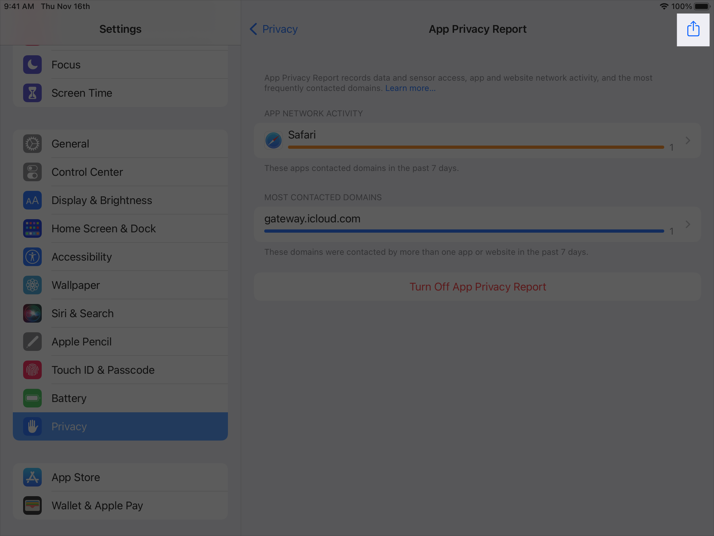

> Navigation: [Technologies](../technologies.md) · [Network](../network.md) · [Privacy Management](privacy-management.md)

# Inspecting app activity data

<sub>Article</sub>

Verify that your app accesses only the user data and network resources that you expect it to access.

## Overview

In iOS 15.2, iPadOS 15.2, and watchOS 8.3 or later, users can view a privacy report of when your app:

- Accesses certain kinds of user data, like photos and contacts.
- Accesses sensitive device resources, like the camera and microphone.
- Contacts network domains, including websites that a user visits from within your app (iOS- and iPadOS-only).

Examine the data that your app contributes to this summary to find out what the report shows users, and to make sure that your app behaves as you expect.

### Start recording app activity

Users can enable app activity recording on their device from the Settings app by choosing Privacy \> App Privacy Report, and then tapping Turn On App Privacy Report.

The system keeps a record — stored only on the user’s device — of the last seven days of app activity. After turning on this feature on your own device, use your app to fully test its data, resource, and network accesses. Be sure to use the app for long enough to allow for any delayed accesses. How long depends on the behavior of your app. For example, if an analytics framework in your app caches data to avoid frequent server accesses, be sure to run your app until it experiences an analytics server access.

### Get the app activity data

After running your app for a while, you can get a report on your app’s activity by tapping the Share button on the App Privacy Report screen:



<sub>A screenshot of the Settings app showing the App Privacy Report view inside the Privacy section. A Share button in the upper right corner of the screen is highlighted.</sub>

Save the report to a location where you can examine it. For example, you can use AirDrop to send it to a nearby Mac.

The report uses a newline-delimited JSON format (NDJSON), which you can open with any text editor, and contains a collection of JSON dictionaries separated by newlines. Dictionaries that have the `type` key with a value set to `access` provide information about resource accesses, while those that have the `type` key with a value set to `networkActivity` provide information about network activity:

```javascript
{..., "type":"access", ...}
{..., "type":"access", ...}
...
{..., "type":"networkActivity", ...}
{..., "type":"networkActivity", ...}
...
```

### Examine resource access data

Each access dictionary in the file represents the start or end of an access made by a particular app. The following shows an example of this dictionary with whitespace, newlines, and comments added for readability:

```javascript
{
  "accessor" : { 
    "identifier" : "com.example.calendar", // The app accessing the resource.
    "identifierType" : "bundleID"
  },
  "broadcaster": { // Only present for screen recording.
    "identifier" : "com.apple.springboard", // The app broadcasting the screen.
    "identifierType" : "bundleID"
  },
  "category" : "screenRecording", // The accessed resource.
  "identifier" : "8A4054BB-1810-4F8B-8163-483409E2D35C", // A unique identifier.
  "kind" : "intervalBegin", // Whether this the beginning or end of an interval.
  "timeStamp" : "2021-08-06T15:46:13.532-07:00", // The time of the access.
  "type" : "access" // This is resource access data.
}
```

To find accesses made by your app, look for all of the access dictionaries that have an `accessor` key with a dictionary value that contains the bundle identifier of your app. Use the `category` field to determine which resource your app accessed, and the `timeStamp` field to associate the access with the activity that generated the access. You might encounter any of the following category values:

| Category | Resource |
|---|---|
| `camera` | The device’s camera |
| `contacts` | The user’s contacts |
| `location` | Location data |
| `mediaLibrary` | The user’s media library |
| `microphone` | The device’s microphone |
| `photos` | The user’s photo library |
| `screenRecording` | Screen sharing |

Every resource access occurs over a time interval and generates a pair of access dictionaries to indicate:

- The start of the interval with the `kind` field set to `intervalBegin`, as shown in the example above.
- The end of the interval with the `kind` field set to `intervalEnd`.

The two dictionaries that bound an access interval have the same value for the `identifier` key.

For the `screenRecording` category, the dictionary also includes a `broadcaster` key with a value that indicates the app broadcasting the screen to the accessor, which is typically Springboard.

### Examine network activity

A file exported from iOS or iPadOS contains another set of dictionaries that have the `type` key with a value set to `networkActivity` to report network accesses. Each dictionary describes a connection made by a specified app to a particular domain. The following shows an example of this dictionary, again with whitespace and newlines added for clarity:

```javascript
{
  "domain" : "api.example.com",
  "firstTimeStamp" : "2021-06-06T16:15:48Z",
  "context" : "",
  "timeStamp" : "2021-06-06T16:15:59Z",
  "domainType" : 2,
  "initiatedType" : "AppInitiated",
  "hits" : 10,
  "type" : "networkActivity",
  "domainOwner" : "",
  "bundleID" : "com.example.App1"
}
```

The dictionary includes the following keys to describe the network activity:

- **`domain`** — The domain of the network connection.
- **`firstTimeStamp`** — The time of the first connection to this domain.
- **`context`** — The website that made the connection, if applicable.
- **`timeStamp`** — The time of the most recent connection.
- **`domainType`** — When the associated value is `1`, the domain has been identified as potentially collecting information across apps and sites, and potentially profiling users. A value of `2` means that the domain hasn’t been identified as such.
- **`initiatedType`** — Whether the app (`AppInitiated`) or the user (`NonAppInitiated`) initiated the connection.
- **`hits`** — The number of times the app contacted the domain in the last seven days.
- **`type`** — An associated value of `networkActivity` means that this dictionary describes network activity data.
- **`domainOwner`** — The owner of the domain, if applicable.
- **`bundleID`** — The bundle identifier of the initiating app.

When deciding how to set the value for the `initiatedType` key, the system attributes connections made from a web browser in your app, like when you instantiate an [SFSafariViewController](../safariservices/sfsafariviewcontroller.md), to the user. Otherwise, the system considers any connection that your app makes with the [URL Loading System](../foundation/url-loading-system.md), or lower-level interfaces like the [Network](../network.md) framework, as app-initiated. This includes user data that you load from a server in direct response to a user action.

You can change the associated value of this key when you make a general network request by setting a property. For example, when creating a [URLRequest](../foundation/urlrequest.md), set the [attribution](../foundation/urlrequest/attribution-swift.property.md) property; when using an [NWConnection](nwconnection.md) instance, call the [nw_parameters_set_attribution](<nw_parameters_set_attribution(____).md>) function. However, only change the attribution for connections that the user directly and completely controls, such as when the user enters a URL or taps or clicks a URL that they can read. For more information about network attribution, see [Indicating the source of network activity](indicating-the-source-of-network-activity.md).

### Consider whether your app needs changes

If you see that your app makes network connections that you don’t recognize, or accesses resources that it shouldn’t, review your app. Closely examine any third-party frameworks or modules that you’ve integrated because they might make unexpected connections.

## See Also

### Traffic Attribution

- [Indicating the source of network activity](indicating-the-source-of-network-activity.md) — Control whether the App Privacy Report attributes network traffic to the app or to the user.
- [nw_parameters_set_attribution](<nw_parameters_set_attribution(____).md>) — Sets a flag that indicates whether the network request originates from the developer or the user.
- [nw_parameters_get_attribution](<nw_parameters_get_attribution(__).md>) — Gets a flag that indicates whether the network request originates from the developer or the user.
- [nw_parameters_attribution_t](nw_parameters_attribution_t.md) — The entities that can make a network request.
