> Navigation: [Technologies](../technologies.md) · [Network](../network.md)

# Testing and Debugging L4S in Your App

<sub>Article</sub>

Learn how to verify your app on an L4S-capable host and network to improve your app’s responsiveness.

## Overview

With Low Latency, Low Loss, and Scalable Throughput (L4S) applications can have both low network delays and high throughput. L4S benefits most applications, such as conversational audio/video apps, interactive apps with dynamic content, interactive video, live streaming, cloud or online gaming, and virtual or augmented reality. In any end-to-end path from client to server (or server to client), there’s one slowest link at any moment of time, called the bottleneck. When the sender’s rate is higher than the bottleneck link rate, a queue builds up at the bottleneck, leading to increased delays and eventual loss, which tells the sender it needs to slow down.

L4S uses an Explicit Congestion Notification (ECN) mechanism to give early warning of congestion at the bottleneck link by marking a Congestion Experienced (CE) codepoint in the IP header of packets. After receiving the packets, the receiver echoes this congestion information to the sender in the acknowledgement (ACK) packets of the transport protocol. The sender uses this congestion feedback to reduce its sending rate to avoid delay at the bottleneck. L4S requires implementation updates at end devices as well as on the network bottleneck. Beginning with iOS 17 and iPadOS 17, Apple supports L4S on its platforms for some users, for the QUIC and TCP networking stacks.

### Turn on L4S on Apple Devices

Apple’s QUIC implementation fully supports L4S, whereas Apple’s TCP implementation supports only the receiver-side L4S. Apple’s FaceTime application also supports L4S. As L4S may not be enabled for all users, turn on L4S support for QUIC, TCP, and FaceTime on iOS and iPadOS devices by turning on L4S in Developer settings.

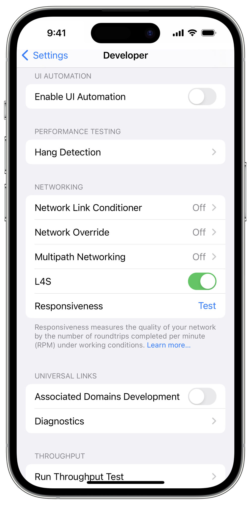

On macOS, enable L4S by using the following command in Terminal:

```shell
defaults write -g network_enable_l4s -bool true
```

### Confirm an Apple Device Sends ECT(1) for QUIC

The sending device indicates that it’s L4S capable by setting the ECN-Capable Transport (ECT) codepoint to 01, known as ECT(1).

To confirm that your Apple device is L4S capable, take a packet capture using Wireshark, and look for ECT(1) in the IP header of transmitted packets as shown below. Some networks bleach (zero) the ECN field. Apple’s stack performs validation in the beginning of the connection to test for bleaching. If bleaching is detected, Apple’s stack doesn’t use ECN and, therefore, L4S for such connections. Look for ECT(1) in at least 10–20 sent packets.

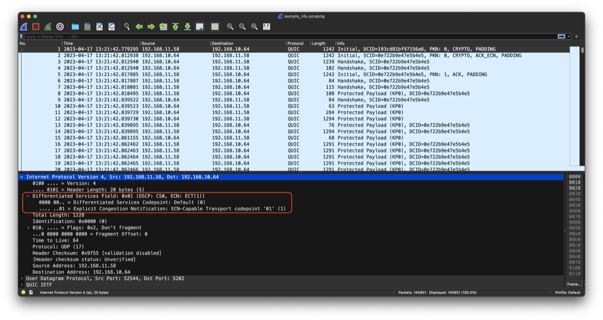

Because Apple’s QUIC stack always provides ECN feedback when the device acts as a receiver, you don’t need to confirm ECT(1) on Apple devices.

### Confirm an Apple Device Negotiated Accurate ECN for TCP

When L4S is enabled for the TCP receiver side, an Apple device negotiates Accurate ECN during the three-way handshake with the server, which is essential to provide the detailed congestion feedback an L4S sender needs. The Accurate ECN protocol uses two ways to provide feedback:

- TCP header flags that indicate the number of packets arriving with a CE codepoint in their IP-ECN field. AE, CWR, and ECE (ACE) are the three flags that convey Accurate ECN information.
- Accurate ECN TCP options that provide feedback about the number of bytes arriving with one of the three ECN code points: ECT(1), ECT(0), and CE.

Apple’s TCP implementation provides both types of feedback. To confirm that Apple’s implementation negotiated Accurate ECN in the three-way handshake, take a packet capture on the device, and look in the synchronize (SYN) packet for the flags set as shown in the figure below. You need the latest version of Wireshark to parse the new Accurate ECN feedback in TCP.

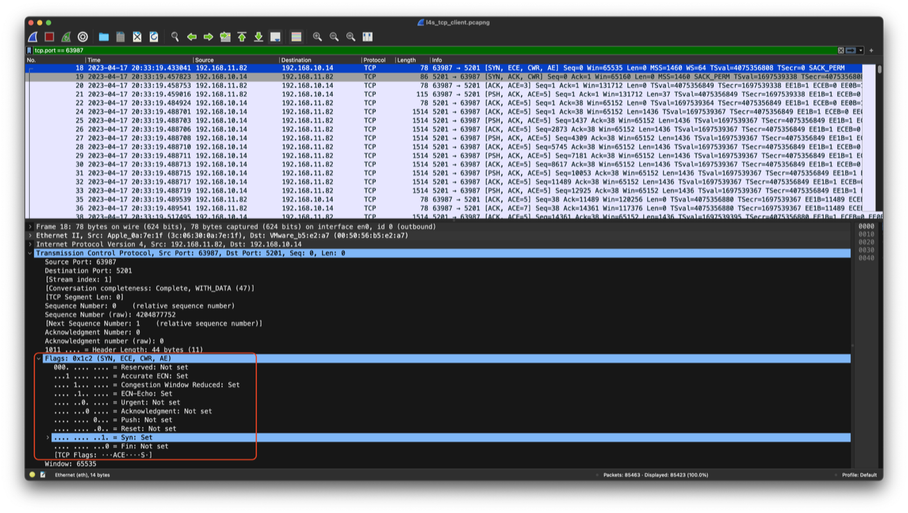

Then, to check how the server responded to this request, check if TCP flags are set on the synchronize-acknowledge (SYN-ACK) packet as below.

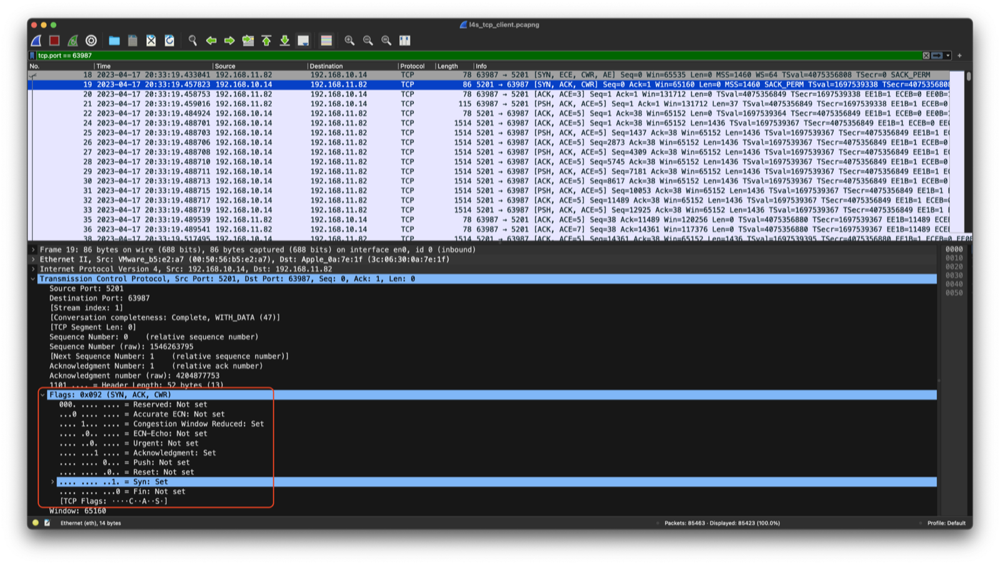

In the last ACK packet of the three-way handshake, Apple’s implementation adds the Accurate ECN TCP option in addition to setting the ACE header flags.

After the negotiation is complete, the server may send data packets. If it supports L4S sender-side behavior, the server indicates that it’s L4S capable by setting the ECT codepoint to 01. You can check for ECT(1) in the client-side packet capture by looking at packets from the server to the client. As some networks may inconsistently affect the ECN field, check at least 10–20 packets.

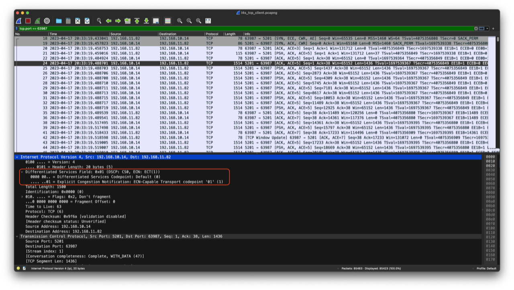

To verify that your Apple device echoes Accurate ECN feedback, look at the ACE flags and Accurate ECN options because some of these fields change as more packets arrive. Note that the ACE flags use only 3 bits to count the number of CE packets, so they reset to 0 each time 8 CE packets arrive.

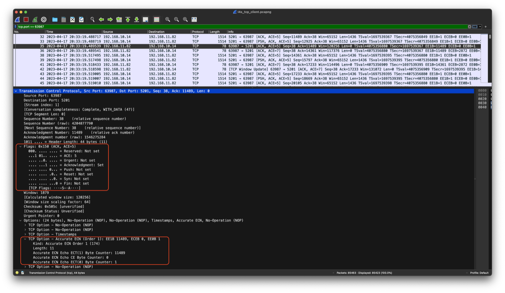

### Test Your App Against Third-Party QUIC Server Implementations

If your app uses QUIC and your Content Delivery Network (CDN) provider (for example, Amazon CloudFront or Cloudflare quiche) or some other third-party library provides your server-side implementation, work with that provider. The server implementation needs to support L4S for both its sending and receiving sides, similar to the client. But if your server supports only ECN (it can receive L4S traffic), you can test uploading use cases from Apple devices to your server.

To test for sending-side support, follow the steps described above for Apple devices. To test for receiver-side support, take a packet capture on your server. Because QUIC is an encrypted protocol, you need Transport Layer Security (TLS) keys to decrypt and view the QUIC header. The steps to decrypt QUIC packets for Cloudflare’s quiche stack are described below. Contact your server provider for other stacks.

Below are the instructions to decrypt QUIC for quiche.

1. Add the following lines to your server application:

```objc
if let Some(keylog_path) = std::env::var_os("SSLKEYLOGFILE") {
    let file = std::fs::OpenOptions::new()
        .create(true)
        .append(true)
        .open(keylog_path)
        .unwrap();

    keylog = Some(file);

    config.log_keys();
}
```

1. Configure the `SSLKEYLOGFILE` environment variable.

```shell
export SSLKEYLOGFILE=/tmp/keys.log
```

1. Restart your server application. Each new session key is logged in the file created in step 2.
2. Perform a Wireshark capture. Using a filter for User Datagram Protocol (UDP) packets is optional.
3. In Wireshark Preferences \> Protocols \> TLS, select the `SSLKEYLOGFILE` as the TLS secret log file in the (Pre)-Master-Secret log filename field.

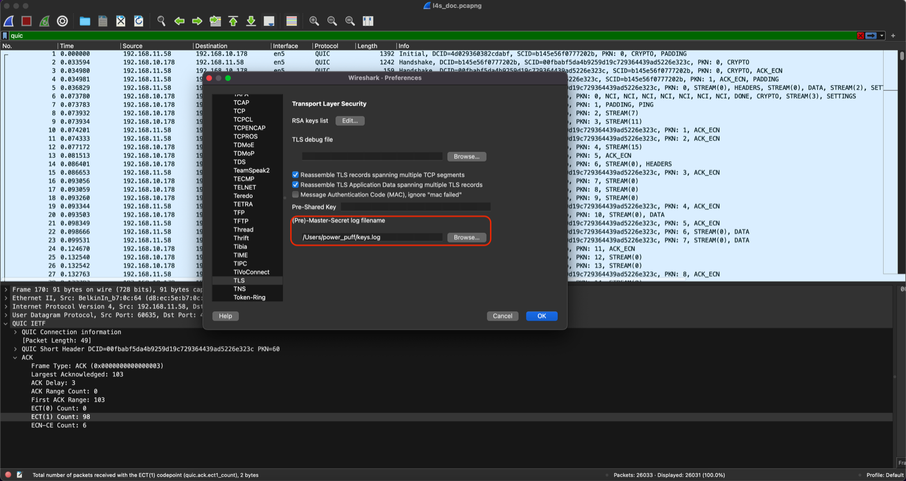 6. In Wireshark, select any packet with an ACK_ECN frame. Then, in the packet details view below under QUIC, look at the ECT counts. If the ECT counts are nonzero, then your server supports ECN and is capable of being an L4S server.

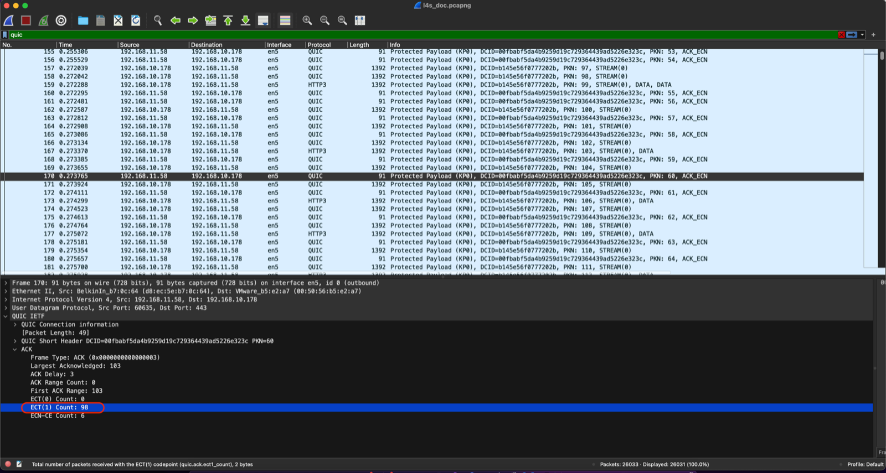

### Test L4S on a Linux TCP Implementation

Currently, a publicly available implementation for Linux TCP supports L4S. [This Linux repository](https://github.com/L4STeam/linux) describes the various patches that were developed for L4S and instructions to install such a kernel.

Check both the client-side and server-side packet captures because faulty networks may bleach (zero) the IP-ECN field or remove certain TCP headers. Similar to on the client side, take a packet capture on the server side. Look at the IP-ECN field in the direction from the server to the client, the TCP Accurate ECN flags, and the AccECN TCP option fields.

### Test If Your Network Supports ECN and L4S

There are two aspects to verifying that if your network supports L4S.

First, check that your network doesn’t change the ECN field or drop packets that have ECN bits set. Compare packet captures at the client and the server, and check if packets the client sends with ECN marking in the IP header are received at the server with ECN marking. Any of the following ECN field transitions are valid, where the left side is the sender and the right side is the receiver:

- Not-ECT → Not-ECT
- ECT1 → ECT1
- ECT0 → ECT0
- ECT1 → CE
- ECT0 → CE
- CE → CE

If you see any other transition, it means that network doesn’t support ECN correctly. To check which hop of your network doesn’t support ECN correctly, you can use Tracebox. Here is an example usage:

```shell
sudo tracebox -v -p "ip{ecn=1}/udp{dst=33451}" apple.com
```

Every line in the Tracebox output shows a hop and packet headers that were modified before they reached that hop. This helps you identify the hop that modified ECN bits on the packet. For example, in the output below, `IP::ExpCongestionNot (1 → 0)` on the third line means that hop 2 bleached the ECN bit (from 1→0) because hop 3 received a packet with modified ECN bits.

```
1: a.b.c.d 0ms IP::CheckSum (0x45bf → 0x6d97)
2: e.f.h.g 1ms IP::TTL (2 → 1) IP::CheckSum (0x44bf → 0x6d97)
3: h.i.j.k 3ms IP::ExpCongestionNot (1 → 0) IP::TTL (3 → 1) IP::CheckSum (0x6ec0 → 0x9879)
```

The second aspect is to check if your network bottleneck supports L4S queue management. Most bottleneck links use a traditional tail-drop queue, which keeps buffering packets until the queue is full and then drops packets at the tail end of the queue.

Active Queue Management (AQM) has been deployed at some bottlenecks. It drops selected packets earlier in the buffer, which keeps the queue shorter and leaves the rest of the buffer empty for bursts. After ECN was standardized, some networks implemented what is now known as Classic ECN AQM. Classic ECN AQM is an advance over a tail-drop queue, but it reduces network delays to a limited extent. With L4S, the sender and the network can use L4S ECN to reduce queuing delays even further. In most cases, a network bottleneck that supports L4S AQM can reduce the worst 1 percent of queuing delays by about 10 times compared to Classic ECN AQM.

To verify that your network bottleneck supports L4S, run the following test:

1. Start an L4S flow and a non-L4S flow together in the direction (upload or download) you want to test, running them long enough to be sure to saturate the bottleneck. Consider using two devices, one with L4S turned on and the other with L4S turned off.
2. Take a packet capture at the receiver, and check if there are non-zero CE counts in the IP header of received packets as shown below.

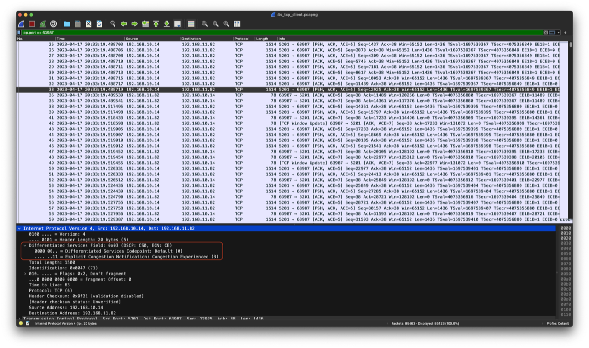 3. If you can’t take a packet capture at the receiver, you can verify the CE counts in the ACK header at the sender. The figure below shows how QUIC formats the ACK header.

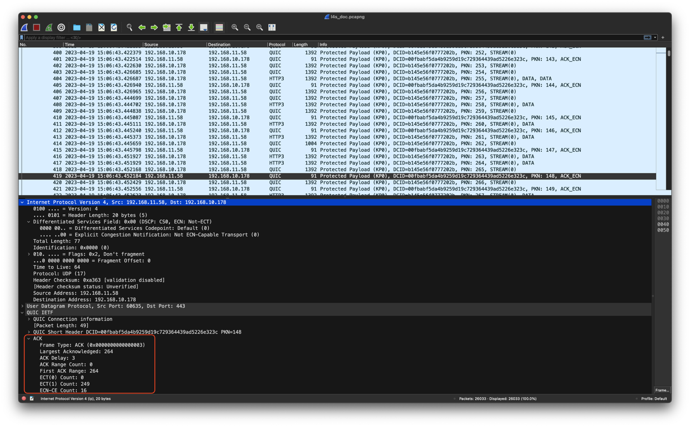 4. The screenshot below for TCP shows both CE counts in ACE flags and byte counts for ECT(1), CE, and ECT(0) in Accurate ECN options.

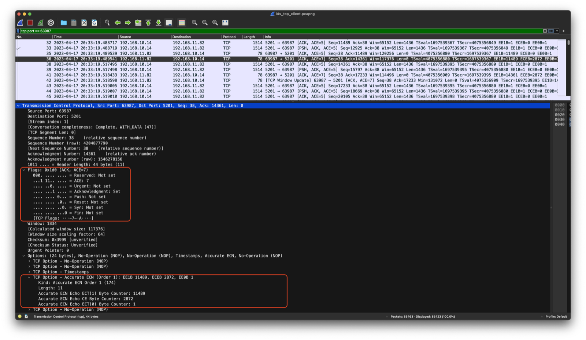 5. If there are no CE marks for either flow, your network bottleneck doesn’t support either Classic ECN AQM or L4S AQM. 6. If either flow has CE marks, measure the round-trip time (or alternatively, the one way delay) of each flow. If both L4S and non-L4S flow have the same round-trip time, your network bottleneck likely supports classic ECN AQM. If the L4S flow has a lower round-trip time than the non-L4S flow, your network bottleneck likely supports L4S AQM.

### Ensure Low Latency and Low Loss on Your Network

If you’re a network operator, you can take a couple of actions to provide low latency and low loss to your users.

Check that your network configuration doesn’t bleach, alter, or block ECN traffic because doing any of these actions may harm the traffic. However, your network might be accidentally doing it while it’s trying to zero the Differentiated Services Codepoint (DSCP) because both the Diffserv and ECN fields are in the same IP header byte. You can fix this in your code or ask your equipment provider to provide a bug fix that zeros only the DSCP portion (bytes 8-13).

```
 0                   1                   2                   3
 0 1 2 3 4 5 6 7 8 9 0 1 2 3 4 5 6 7 8 9 0 1 2 3 4 5 6 7 8 9 0 1
+-+-+-+-+-+-+-+-+-+-+-+-+-+-+-+-+-+-+-+-+-+-+-+-+-+-+-+-+-+-+-+-+
|Version|  IHL  |   DSCP    |ECN|         Total Length          |
```

To allow your users to get even lower latency, consider deploying L4S-capable queue management. An example of an L4S AQM is IETF-standardized [Dual-Queue Coupled AQM](https://datatracker.ietf.org/doc/rfc9332). Another alternative is Per-Flow Queue L4S AQM.

## See Also

### Network Debugging

- [Choosing a Network Debugging Tool](choosing-a-network-debugging-tool.md) — Decide which tool works best for your network debugging problem.
- [Debugging HTTP Server-Side Errors](debugging-http-server-side-errors.md) — Understand HTTP server-side errors and how to debug them.
- [Debugging HTTPS Problems with CFNetwork Diagnostic Logging](debugging-https-problems-with-cfnetwork-diagnostic-logging.md) — Use CFNetwork diagnostic logging to investigate HTTP and HTTPS problems.
- [Recording a Packet Trace](recording-a-packet-trace.md) — Learn how to record a low-level trace of network traffic.
- [Taking Advantage of Third-Party Network Debugging Tools](taking-advantage-of-third-party-network-debugging-tools.md) — Learn about the available third-party network debugging tools.
