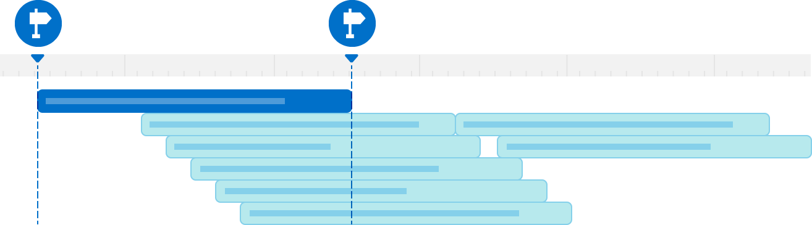

> Navigation: [Technologies](../technologies.md) · [os](../os.md)

# OSSignposter

<sub>Structure</sub>

An object for measuring task performance using the unified logging system.

<sub>iOS, iPadOS, Mac Catalyst, macOS, tvOS, visionOS, watchOS</sub>

```swift
struct OSSignposter
```

## Overview

Signposts allow you to record meaningful information about the duration of your app’s tasks using the same subsystems and categories that you use for logging. Use `OSSignposter` to create signposted intervals in your code, and then use Instruments’ `os_signposts` instrument to record those intervals as you run your app and perform the actions to measure. Instruments displays signpost data visually in a timeline.



<sub>An image that shows several signposted intervals on a timeline in Instruments. The first interval has a highlight and displays the OS signpost icon at its start and end. The icons represent the calls in code that begin and end the signposted interval.</sub>

To add a signposted interval, create a signpost ID — an identifier that disambiguates intervals that have the same name, subsystem, and category, and that exist within the same scope — and then add a call to one of the class’s `beginInterval` methods just before the code you want to measure. Retain the interval state it returns, and end the interval by passing that state to one of the class’s `endInterval` methods, which you call immediately after the measured code. A signposter uses interval state to enforce a number of runtime assertions, the behavior of which depends on your app’s build configuration. For more information, see [OSSignpostIntervalState](ossignpostintervalstate.md). A signposted interval consists of one begin call and one end call only.

`OSSignposter` also provides functionality to signpost a closure, and to emit individual signposts that don’t have a duration that you can use to highlight points of interest, such as when the user taps a button or performs a specific gesture.

## Relationships

- **Conforms To**: [Sendable](../swift/sendable.md), [SendableMetatype](../swift/sendablemetatype.md)

## Topics

### Creating a Signposter

- [init()](<ossignposter/init().md>) — Creates a signposter that uses the default subsystem.
- [init(subsystem:category:)](<ossignposter/init(subsystem_category_)-94xpb.md>) — Creates a signposter that uses the specified subsystem and category.
- [init(subsystem:category:)](<ossignposter/init(subsystem_category_)-4vdri.md>) — Creates a signposter that uses the specified subsystem and system-defined log category.
- [init(logger:)](<ossignposter/init(logger_).md>) — Creates a signposter that uses the subsystem and category of an existing logger.
- [init(logHandle:)](<ossignposter/init(loghandle_).md>) — Creates a signposter that uses the subsystem and category of an existing log.
- [disabled](ossignposter/disabled.md) — A shared signposter that doesn’t emit signposts at runtime.

### Getting State

- [isEnabled](ossignposter/isenabled.md) — A Boolean value that indicates whether the signposter can emit signposts.

### Generating Signpost IDs

- [makeSignpostID()](<ossignposter/makesignpostid().md>) — Returns an identifier that’s unique within the scope of the signposter.
- [makeSignpostID(from:)](<ossignposter/makesignpostid(from_).md>) — Returns an identifier that the signposter derives from the specified object.
- [OSSignpostID](ossignpostid.md) — An identifier that disambiguates signposted intervals.

### Starting a Signposted Interval

- [beginInterval(_:id:)](<ossignposter/begininterval(__id_).md>) — Begins a signposted interval.
- [beginInterval(_:id:_:)](<ossignposter/begininterval(__id___).md>) — Begins a signposted interval and attaches the specified message.
- [beginAnimationInterval(_:id:)](<ossignposter/beginanimationinterval(__id_).md>) — Begins a signposted interval for measuring an animation.
- [beginAnimationInterval(_:id:_:)](<ossignposter/beginanimationinterval(__id___).md>) — Begins a signposted interval for measuring an animation, and attaches a message.
- [OSSignpostIntervalState](ossignpostintervalstate.md) — An object that tracks the state of a signposted interval.
- [SignpostMetadata](signpostmetadata.md) — The type that represents a message you attach to a signpost.

### Stopping a Signposted Interval

- [endInterval(_:_:)](<ossignposter/endinterval(____).md>) — Ends the signposted interval that corresponds to the specified name and state.
- [endInterval(_:_:_:)](<ossignposter/endinterval(______).md>) — Ends a signposted interval and attaches the specified message.

### Measuring a Closure

- [withIntervalSignpost(_:id:around:)](<ossignposter/withintervalsignpost(__id_around_).md>) — Measures the execution of the specified closure.
- [withIntervalSignpost(_:id:_:around:)](<ossignposter/withintervalsignpost(__id___around_).md>) — Measures the execution of a closure and attaches the specified message.

### Emitting Individual Signposts

- [emitEvent(_:id:)](<ossignposter/emitevent(__id_).md>) — Marks a point of interest in time.
- [emitEvent(_:id:_:)](<ossignposter/emitevent(__id___).md>) — Marks a point of interest in time and attaches the specified message.

## See Also

### Measure Events

- [Recording Performance Data](recording-performance-data.md) — Add signposts to record interesting time-based events.
- [Legacy Signpost Symbols](legacy-signpost-symbols.md) — Migrate your code away from using these legacy symbols.
- [OSSignpostType](ossignposttype.md) — The different kinds of signpost. _(deprecated)_
- [os_signpost_id_t](os_signpost_id_t.md) — An identifier you use to distinguish between signposts that have the same name and destination log.
