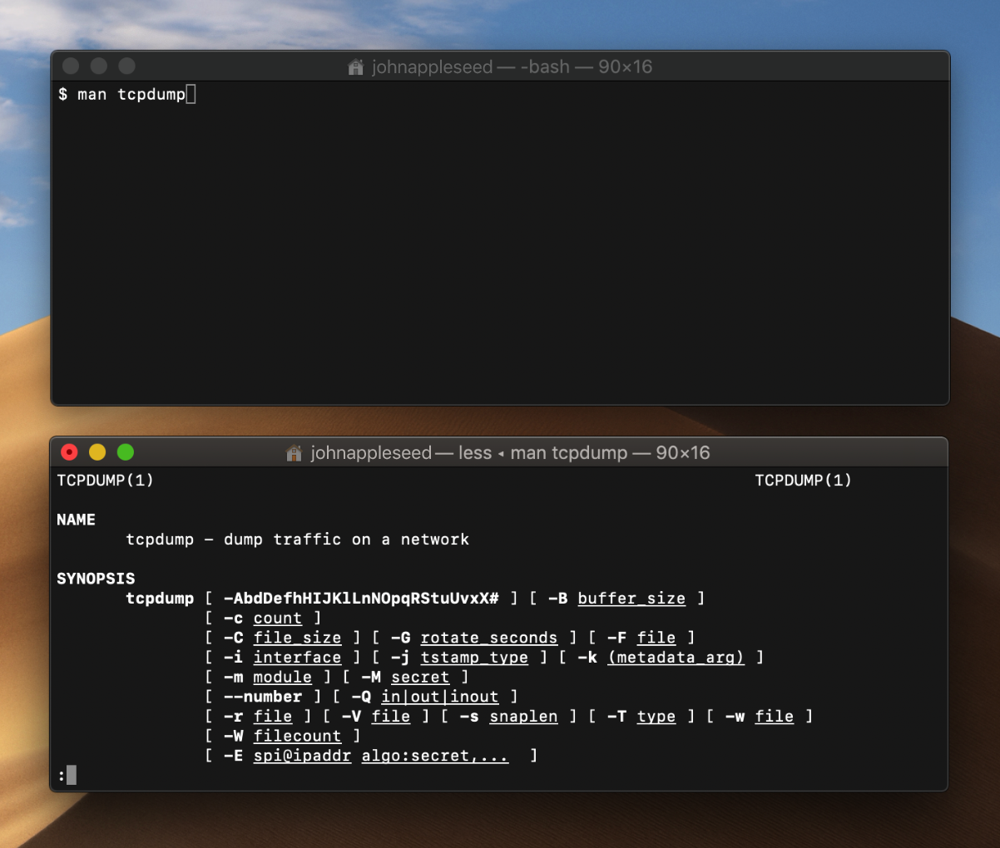

> Navigation: [Technologies](../technologies.md) · [os](../os.md)

# Reading UNIX Manual Pages

<sub>Article</sub>

Use the Terminal app to read the documentation for low-level UNIX tools and APIs.

## Overview

The UNIX online manual, known as the _man pages_, documents low-level UNIX command-line tools, APIs, and file formats. If you’re working at the lowest levels of the system, don’t miss out on this rich source of information.

### Display a Man Page in the Terminal App

Type `man` and the name of a tool or API whose documentation you want to access, and press Return.



Because the man page is larger than the window, Terminal displays only the first part of the page. Press Space to display subsequent parts, or press Q to exit the `man` tool.

> [!important] Important
> Developer-oriented man pages are distributed as part of Xcode. The `man` tool searches for man pages within the active developer directory. If you have multiple copies of Xcode installed, you can select your active developer directory using the `xcode-select` command-line tool. See the `xcode-select` man page for details.

### Search a Specific Section

Section 1 of the man pages covers command-line tools, section 2 covers system calls, section 3 covers user-space libraries, and so on. If you don’t specify a section, `man` displays the page from the first section that has a matching entry. For example, the following command displays the man page for the `open` command-line tool.

```bash
$ man open
```

If you want to get the man page for the `open` system call, specify section 2.

```bash
$ man 2 open
```

If you’re not sure which section to use, do a keyword search using the `-k` option. For example, the following command shows all the man pages that mention _open_.

```bash
$ man -k open
```

### Learn More About Man Pages

The `man` command-line tool has its own man page, which is a good place to learn more about this feature.

```bash
$ man man
```
