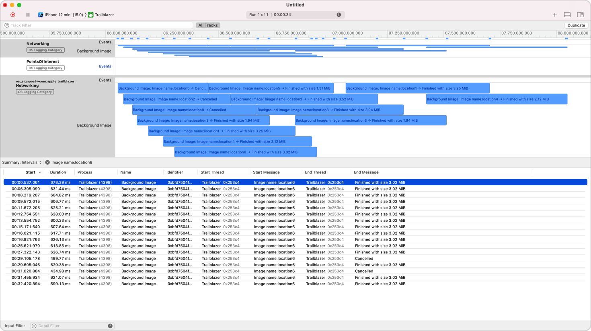

> Navigation: [Technologies](../technologies.md) · [os](../os.md) · [Logging](logging.md)

# Recording Performance Data

<sub>Article</sub>

Add signposts to record interesting time-based events.

## Overview

Users notice when an app’s performance degrades, which makes performance tuning a critical part of app development. If your app performs several tasks and leverages concurrency, it can often be difficult to visualize which tasks are executing and how long each one takes to complete.

Signposts allow you to measure your app’s tasks using the same subsystems and categories that you use for logging. After adding signposts to your app using [OSSignposter](ossignposter.md), you use Xcode’s Instruments app to record your app’s behavior as you perform the tasks to measure, and Instruments displays that data in a timeline. If you have complex workloads, you can create an instrument that presents a custom representation of your app’s signpost data.

### Disambiguate Each Instance of a Task

When emitting signposts, you need to be able to disambiguate between separate invocations of the same measured code. For example, if your app requests data from a remote server and you’re measuring those requests, you need to be able to identify each individual request, especially if several requests are executing concurrently. To do this, associate a signpost ID with each set of related signposts.

The easiest way to create a signpost ID is to call your signposter’s [makeSignpostID()](<ossignposter/makesignpostid().md>) method, which creates a unique identifier within the scope of that signposter. The following example shows how to create a signpost ID that you can use to track a specific request:

```swift
// Create a signposter that uses the default subsystem and category.
let signposter = OSSignposter()
        
// Generate a signpost ID to associate with a signposted interval.
let signpostID = signposter.makeSignpostID()
```

Alternatively, use one of the system-defined signpost IDs or derive one from an instance of one of your app’s objects. Each of these approaches has its own caveats. For more information, see [OSSignpostID](ossignpostid.md).

### Emit Signposted Intervals and Events

After you generate a signpost ID, emit signposts for the tasks you want to measure. To begin a signposted interval, use the signposter’s [beginInterval(_:id:)](<ossignposter/begininterval(__id_).md>) method. Store the interval state the method returns, and then pass it to the [endInterval(_:_:)](<ossignposter/endinterval(____).md>) method to finish the interval. Interval state contains the signpost ID, which the signposter uses to pair the two calls and to enforce a number of runtime assertions. [OSSignposter](ossignposter.md) provides alternative versions of these two methods that allow you to capture a message that Instruments displays, as well as methods to measure the execution of a specific closure. To mark a single point of interest in time, use the [emitEvent(_:id:)](<ossignposter/emitevent(__id_).md>) method.

The following example creates a signposted interval that measures the amount of time it takes to process a server request. It also emits a notable event during that process.

```swift
func processRequest(_ request: URLRequest, signposter: OSSignposter) {
    // Generate a signpost ID to associate with the signposted interval.
    let signpostID = signposter.makeSignpostID()
        
    // Begin a signposted interval and store the interval state.
    let state = signposter.beginInterval("processRequest", id: signpostID)
        
    let data = fetchData(from: request)
        
    // Emit an event to mark a specific point of interest.
    signposter.emitEvent("Fetch complete.", id: signpostID)
    processData(data)
        
    // End the signposted interval using the stored interval state.
    signposter.endInterval("processRequest", state)
}
```

### Review Signposts in Instruments

To record and view your signposts, open your project in Xcode and choose Product \> Profile to launch Instruments. Select the Blank profiling template and then click the Add button (+) to open the Instrument library. Double-click the os_signposts instrument to add it to your session. Then click the Record button and perform the tasks in your app that you want to measure. The os_signpost instrument displays separate rows for each subsystem and category combination, and the table below the timeline provides detailed information for each signpost that Instruments captures.



<sub>A screenshot of the Instruments app that shows a number of captured signposts. The upper pane displays the signposts in a timeline, and the lower pane is a table that lists individual signposts and their corresponding metadata.</sub>

If your app generates a significant amount of signpost data, it may be difficult to analyze that data using the standard instrument. Consider building a custom instrument to do the analysis on your behalf. Identify the specific behaviors of your app and create a set of rules to detect and display the corresponding data. For more information, see [Creating Custom Instruments](https://developer.apple.com/videos/play/wwdc2018/410/).

## See Also

### Measure Events

- [OSSignposter](ossignposter.md) — An object for measuring task performance using the unified logging system.
- [Legacy Signpost Symbols](legacy-signpost-symbols.md) — Migrate your code away from using these legacy symbols.
- [OSSignpostType](ossignposttype.md) — The different kinds of signpost. _(deprecated)_
- [os_signpost_id_t](os_signpost_id_t.md) — An identifier you use to distinguish between signposts that have the same name and destination log.
