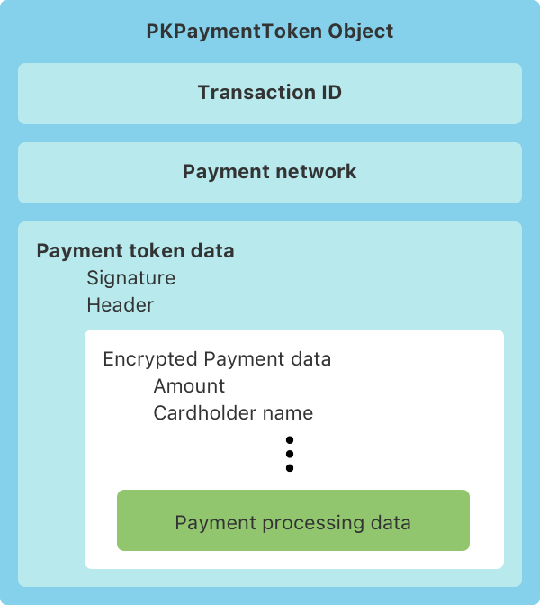

> Navigation: [Technologies](../technologies.md) · [PassKit (Apple Pay and Wallet)](../passkit.md) · [Apple Pay](apple-pay.md)

# Payment token format reference

Verify an Apple Pay payment token and validate a transaction.

## Overview

Apple Pay is available on all iOS devices with a Secure Element — an industry-standard, certified chip designed to store payment information safely. In macOS, users must have an iPhone or Apple Watch that supports Apple Pay to authorize the payment, or have a Mac with Touch ID. The Secure Element creates a payment object when an app or website that uses Apple Pay sends a payment request.

The payment object has a nested structure that contains a payment token with encrypted payment data, as shown in the figure below.

A diagram of a PKPaymentToken object, which contains three objects: a Transaction ID, a Payment network, and Payment token data.  The Payment token data contains a Signature, a Header, and Encrypted Payment Data.

The Secure Element encrypts the token’s payment data using either elliptic curve cryptography (ECC) or RSA encryption. The Secure Element selects the encryption algorithm based on the merchant capabilities that the payment request indicates. Most regions use ECC encryption. Other regions use RSA encryption if ECC encryption is unavailable due to regulatory concerns.

### Verify the signature and decrypt the payment data

The following steps describe the process of validating a transaction by verifying the signature, decrypting the payment data, and verifying additional transaction details. Refer to the reference tables to identify keys and values.

Step 1: Verify the signature as follows:

- Ensure that the certificates contain the correct custom OIDs: 1.2.840.113635.100.6.29 for the leaf certificate and 1.2.840.113635.100.6.2.14 for the intermediate CA. The value for these marker OIDs doesn’t matter, only their presence.
- Ensure that the root CA is the Apple Root CA - G3. This certificate is available from [www.apple.com/certificateauthority](https://www.apple.com/certificateauthority).
- Ensure that there’s a valid X.509 chain of trust from the signature to the root CA. Specifically, ensure that the signature was created using the private key that corresponds to the leaf certificate, that the leaf certificate is signed by the intermediate CA, and that the intermediate CA is signed by the Apple Root CA - G3.
- Validate the token’s signature. For ECC (EC_v1), ensure that the signature is a valid Ellyptical Curve Digital Signature Algorithm (ECDSA) signature (ecdsa-with-SHA256 1.2.840.10045.4.3.2) of the concatenated values of the `ephemeralPublicKey`, `data`, `transactionId`, and `applicationData` keys. For RSA (RSA_v1), ensure that the signature is a valid RSA signature (RSA-with-SHA256 1.2.840.113549.1.1.11) of the concatenated values of the `wrappedKey`, `data`, `transactionId`, and `applicationData` keys.
- Inspect the Cryptographic Message Syntax (CMS) signing time of the signature, as defined by section 11.3 of RFC 5652. If the time signature and the transaction time differ by more than 5 minutes, the token may be a replay attack.

> [!important] Important
> The signature is valid if all the signature verification steps above succeed. If the signature is invalid or any of the hash values don’t match, ignore the transaction.

Step 2: Use the value of the `publicKeyHash` key to determine which merchant public key Apple used, and then retrieve the corresponding merchant public key certificate and private key.

Step 3: Restore the symmetric key. For instructions, see [Restoring the symmetric key](restoring-the-symmetric-key.md).

Step 4: Use the symmetric key to decrypt the value of the `data` key:

- For ECC (EC_v1), decrypt the data key using AES–256 (id-aes256-GCM 2.16.840.1.101.3.4.1.46), with an initialization vector of 16 null bytes and no associated authentication data.
- For RSA (RSA_v1), decrypt the data key using AES–128 (id-aes128-GCM 2.16.840.1.101.3.4.1.6), with an initialization vector of 16 null bytes and no associated authentication data.

After you complete Step 4, the payment data in the `data` value of the payment token structure is decrypted. Use the decrypted payment data and information you have about the transaction to validate that transaction.

Step 5: Confirm that you haven’t already credited this payment by verifying that no payment with the same `transactionId` shows as processed. For efficiency, consider only those payments with a transaction time that’s within the 5-minute time window of the current `transactionId`, as explained in the last bullet point of Step 1.

Step 6: Verify the transaction details using information from the merchant about the Apple Pay payment request and other transaction information:

- Check that the `currencyCode` matches the currency code in the original Apple Pay payment request.
- Check that the `transactionAmount` is correct, as compared with the total charge of the transaction.
- Check that the `applicationData` field matches the hash of the data the original payment request used, and that the data is correct. For example, check that an order number in the data from the original payment request is the order number to which you, the payment processor, are applying this payment. For more information, see [applicationData](pkpaymentrequest/applicationdata.md) in [PKPaymentRequest](pkpaymentrequest.md). For transactions that initiate in Apple Pay on the Web, see [applicationData](../applepayontheweb/applepaypaymentrequest/applicationdata.md) in [ApplePayPaymentRequest](../applepayontheweb/applepaypaymentrequest.md) and [applicationData](../applepayontheweb/applepayrequest/applicationdata.md) in [ApplePayRequest](../applepayontheweb/applepayrequest.md).

Step 7: If the signature is valid, the hash values match, and your transaction validation passes, use the decrypted payment data to process the payment. Otherwise, ignore the transaction.

### Payment token format reference

The following tables describe the keys and values of the payment token structure.

#### Payment token structure

The [paymentData](pkpaymenttoken/paymentdata.md) property of [PKPaymentToken](pkpaymenttoken.md) (or the [paymentData](../applepayontheweb/applepaypaymenttoken/paymentdata.md) property of [ApplePayPaymentToken](../applepayontheweb/applepaypaymenttoken.md), for Apple Pay on the Web) contains a UTF-8 serialization of a plaintext JSON dictionary with the following keys and values:

| Key | Value | Description |
|---|---|---|
| `data` | payment data dictionary, Base64 encoded as a string | Encrypted payment data  See Payment Data Keys below for the decrypted payment data keys and values. |
| `header` | header dictionary | Additional version-dependent information you use to decrypt and verify the payment  See Header Keys and Values below. |
| `signature` | detached PKCS #7 signature, Base64 encoded as a string | Signature of the payment and header data  The signature includes the signing certificate, its intermediate CA certificate, and information about the signing algorithm. |
| `version` | string | Version information about the payment token  The token uses `EC_v1` for ECC-encrypted data and `RSA_v1` for RSA-encrypted data. |

#### Header keys and values

The `header` contains the following keys and values:

| `applicationData` | SHA–256 hash, hex encoded as a string | Optional. Hash of the [applicationData](pkpaymentrequest/applicationdata.md) property of the original [PKPaymentRequest](pkpaymentrequest.md) object for transactions that initiate in apps. For transactions that initiate in Apple Pay on the Web, the value is the hash of [applicationData](../applepayontheweb/applepaypaymentrequest/applicationdata.md) in [ApplePayPaymentRequest](../applepayontheweb/applepaypaymentrequest.md) or of [applicationData](../applepayontheweb/applepayrequest/applicationdata.md) in [ApplePayRequest](../applepayontheweb/applepayrequest.md).  This key is omitted if the value of that property is `nil`. |
|---|---|---|
| `ephemeralPublicKey` | X.509 encoded key bytes, Base64 encoded as a string | Ephemeral public key bytes  EC_v1 only. |
| `wrappedKey` | A Base64-encoded string | The symmetric key wrapped using your RSA public key  RSA_v1 only. |
| `publicKeyHash` | SHA–256 hash, Base64 encoded as a string | Hash of the X.509 encoded public key bytes of the merchant’s certificate |
| `transactionId` | A hexadecimal identifier, as a string | Transaction identifier, generated on the device |

For more information about the application data and the original payment request, see [applicationData](pkpaymentrequest/applicationdata.md) and [PKPaymentRequest](pkpaymentrequest.md). For transactions using Apple Pay on the Web, see [applicationData](../applepayontheweb/applepayrequest/applicationdata.md) and [ApplePayRequest](../applepayontheweb/applepayrequest.md), and [applicationData](../applepayontheweb/applepaypaymentrequest/applicationdata.md) and [ApplePayPaymentRequest](../applepayontheweb/applepaypaymentrequest.md).

#### Payment data keys

The decrypted payment data in the `data` value contains the following keys and values:

| Key | Value | Description |
|---|---|---|
| `applicationPrimaryAccountNumber` | string | Device-specific account number of the card that funds this transaction |
| `applicationExpirationDate` | date as a string | Card expiration date in the format YYMMDD |
| `currencyCode` | string | ISO 4217 numeric currency code, as a string to preserve leading zeros |
| `transactionAmount` | number | Transaction amount |
| `cardholderName` | string | Optional. Cardholder name. |
| `deviceManufacturerIdentifier` | string | Hex-encoded device manufacturer identifier |
| `paymentDataType` | string | Either `"3DSecure"` or “`EMV"` |
| `paymentData` | payment data dictionary | Detailed payment data; see Detailed Payment Data Keys (3D Secure) and Detailed Payment Data Keys (EMV) below |
| `authenticationResponses` | list of Authentication Response entries | For a multitoken request, a list of submerchant responses that contain cryptograms. See Authentication Response below. |
| `merchantTokenIdentifier` | string | For a merchant token request, the provisioned merchant token identifier from the payment network |
| `merchantTokenMetadata` | [MerchantTokenMetadata](../merchanttokennotificationservices/merchanttokenmetadata.md) | For a merchant token request, this data contains card art and the token’s last four digits and expiration date |

#### Detailed payment data keys (3D Secure)

If the `paymentDataType` value is `"3DSecure"` in the Payment Data Keys information, the payment data dictionary in `paymentData` contains the following keys and values:

| Key | Value | Description |
|---|---|---|
| `onlinePaymentCryptogram` | A Base64-encoded string | Online payment cryptogram, as defined by 3D Secure |
| `eciIndicator` | string | Optional. ECI indicator, as defined by 3D Secure  The card network may add an ECI indicator to the payment data that the payment token includes.  If you receive an ECI indicator, you must pass it on to your payment processor; otherwise, the transaction fails. |

#### Detailed payment data keys (EMV)

If the `paymentDataType` value is `“EMV”` in the Payment Data Keys information, the payment data dictionary in `paymentData` contains the following keys and values:

| Key | Value | Description |
|---|---|---|
| `emvData` | The Europay, Mastercard, and Visa (EMV) payment structure, as a Base64-encoded string | Output from the Secure Element |
| `encryptedPINData` | The encrypted PIN, as a hex-encoded string | The PIN is encrypted using the bank’s key.  RSA_v1 only. |

#### Authentication response

The dictionary for the `authenticationResponses` in the Payment Data Keys information contains the following keys and values:

| Key | Value | Description |
|---|---|---|
| `merchantIdentifier` | string | The submerchant identifier as provided by the coordinator merchant |
| `authenticationData` | string | Payment network-generated cryptogram for the submerchant |
| `transactionAmount` | string | The authorized amount for a given submerchant |

## Topics

### Symmetric keys

- [Restoring the symmetric key](restoring-the-symmetric-key.md) — Restore the symmetric key you use to verify payment data.
