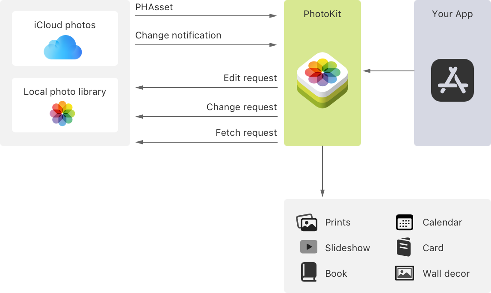

> Navigation: [Technologies](technologies.md)

# PhotoKit

Technology

Work with image and video assets that the Photos app manages, including those from iCloud Photos and Live Photos.

## Overview

PhotoKit is the combination of the Photos and PhotosUI frameworks, which together enable you to access image and video assets that the Photos app manages. You might use PhotoKit to edit or display a person’s photos, or to manage collections of assets such as albums, Moments, and Shared Albums. The framework provides access to photos on the person’s device and in iCloud.

A diagram showing the types of requests your app can make through PhotoKit, to access photos stored in the user’s photo library

## Topics

### Frameworks

- [Photos](photos.md) — Work with image and video assets that the Photos app manages, including those from iCloud Photos and Live Photos.
- [PhotosUI](photosui.md) — Present a person’s photo library using a picker interface, display Live Photos, or extend the Photos app with custom functionality.

### Sample code

- [Browsing and Modifying Photo Albums](photokit/browsing-and-modifying-photo-albums.md) — Help users organize their photos into albums and browse photo collections in a grid-based layout using PhotoKit.
- [Selecting Photos and Videos in iOS](photokit/selecting-photos-and-videos-in-ios.md) — Improve the user experience of finding and selecting assets by using the Photos picker.
- [Bringing Photos picker to your SwiftUI app](photokit/bringing-photos-picker-to-your-swiftui-app.md) — Select media assets by using a Photos picker view that SwiftUI provides.
- [Implementing an inline Photos picker](photokit/implementing-an-inline-photos-picker.md) — Embed a system-provided, half-height Photos picker into your app’s view.
- [Creating a Slideshow Project Extension for Photos](photokit/creating-a-slideshow-project-extension-for-photos.md) — Augment the macOS Photos app with extensions that support project creation.

### Articles

- [Delivering an Enhanced Privacy Experience in Your Photos App](photokit/delivering-an-enhanced-privacy-experience-in-your-photos-app.md) — Adopt the latest privacy enhancements to deliver advanced user-privacy controls.
- [Fetching Objects and Requesting Changes](photokit/fetching-objects-and-requesting-changes.md) — Get assets, asset collections, and collection lists matching a specified query.
- [Loading and Caching Assets and Thumbnails](photokit/loading-and-caching-assets-and-thumbnails.md) — Request image, video, or Live Photos content, and cache for quick reuse.
- [Displaying Live Photos](photokit/displaying-live-photos.md) — Provide the same interactive playback of Live Photos as in the iOS Photos app.
- [Creating Photo Editing Extensions](photokit/creating-photo-editing-extensions.md) — Provide custom functionality in the Photos app by bundling an app extension.
