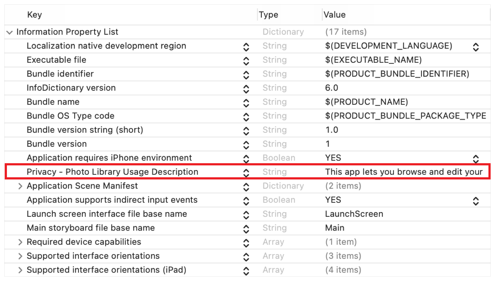
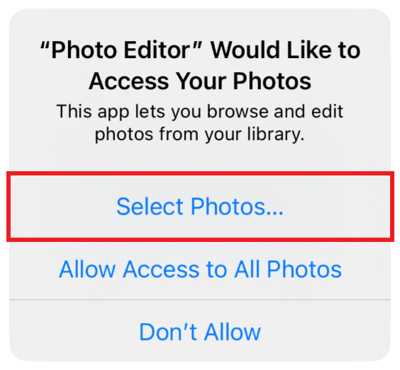
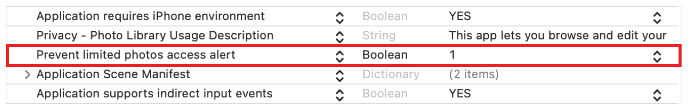

> Navigation: [Technologies](../technologies.md) · [PhotoKit](../photokit.md)

# Delivering an Enhanced Privacy Experience in Your Photos App

<sub>Article</sub>

Adopt the latest privacy enhancements to deliver advanced user-privacy controls.

## Overview

A user’s photos and videos are some of the most personal and private data they store on their devices. Due to built-in privacy protections, an app may only access the user’s Photos library if they explicitly authorize it to do so. Starting in iOS 14, PhotoKit further enhances user privacy controls with the addition of the limited Photos library, which lets users select specific assets and resources to share with an app. Adopt the latest PhotoKit APIs to use the limited library and deliver an enhanced privacy experience in your app.

> [!important] Important
> The limited Photos library affects all apps that use PhotoKit in iOS 14, including those already published to the App Store. Evaluate your app’s behavior to ensure it performs as expected when running in limited library mode.

### Determine Your App’s Access Needs

With the many privacy enhancements added in iOS 14, it’s a good time to evaluate how and why your app uses PhotoKit to access the user’s library. Many apps may only need read-only access to retrieve images to share on the internet or embed in a document or email. For these purposes, the simplest way to provide an enhanced user experience is to use [PHPickerViewController](../photosui/phpickerviewcontroller.md) to access the Photos library.

[PHPickerViewController](../photosui/phpickerviewcontroller.md) is a new picker that replaces [UIImagePickerController](../uikit/uiimagepickercontroller.md). Its user interface matches that of the Photos app, supports search and multiple selection of photos and videos, and provides fluid zooming of content. Because the system manages its life cycle in a separate process, it’s private by default. The user doesn’t need to explicitly authorize your app to select photos, which results in a simpler and more streamlined user experience.

> [!note] Note
> Session 10652: [Meet the New Photos Picker](https://developer.apple.com/videos/play/wwdc2020/10652/)

### Describe Your Appʼs Photo Library Use

If your app requires PhotoKit’s advanced features, like retrieving assets and collections, or updating the library, the user must explicitly authorize it to access those features. Provide a localizable message that describes how your app interacts with the Photos library. The system presents this message to the user when it prompts them to authorize your app for access. Attempting to access the Photos library without a valid usage description causes your app to crash.

Add an entry to your `Info.plist` file with the appropriate key. If your app only adds to the library, use the [NSPhotoLibraryAddUsageDescription](../bundleresources/information-property-list/nsphotolibraryaddusagedescription.md) key. For all other cases, use [NSPhotoLibraryUsageDescription](../bundleresources/information-property-list/nsphotolibraryusagedescription.md). The following shows an example `Info.plist` entry for an app that requires read/write access.



<sub>A screenshot of the an app’s Info.plist that shows the Privacy -  Photo Library Usage Description entry with a red box highlighting it.</sub>

### Determine and Request Authorization

To determine if the user has already authorized your app to access the library, query [PHPhotoLibrary](../photos/phphotolibrary.md) to check your app’s current authorization status.

```swift
// Check the app's authorization status (either read/write or add-only access).
let readWriteStatus = PHPhotoLibrary.authorizationStatus(for: .readWrite)
```

The above call returns a [PHAuthorizationStatus](../photos/phauthorizationstatus.md) value that specifies the app’s current authorization status for the requested access level. A status value of [PHAuthorizationStatusNotDetermined](../photos/phauthorizationstatus/notdetermined.md) indicates the user hasn’t yet authorized your app for access.

The first time your app performs an operation that requires authorization, the system automatically and asynchronously prompts the user for it. Avoid making PhotoKit calls when your app first launches, to avoid interrupting its startup or onboarding process. Instead, make these calls in response to direct user action. Timing the authorization prompt to coincide with a user action provides greater context to the user about why your app is requesting access.

You may also programmatically request authorization, which lets you control the timing of the prompt and determine the user’s response. Request authorization only for the level of access required. The following example shows how to request read/write access; if your app only adds photos to the library, instead, request add-only access.

```swift
// Request read-write access to the user's photo library.
PHPhotoLibrary.requestAuthorization(for: .readWrite) { status in
    switch status {
    case .notDetermined:
        // The user hasn't determined this app's access.
    case .restricted:
        // The system restricted this app's access.
    case .denied:
        // The user explicitly denied this app's access.
    case .authorized:
        // The user authorized this app to access Photos data.
    case .limited:
        // The user authorized this app for limited Photos access.
    @unknown default:
        fatalError()
    }
}
```

After the user sets the app’s authorization status, the system remembers their choice and won’t prompt them again. However, the user can change this choice at any time using the Settings app. Prepare your app to respond appropriately when a user changes your appʼs access.

> [!important] Important
> The [+ authorizationStatus](<../photos/phphotolibrary/authorizationstatus().md>) and [+ requestAuthorization:](<../photos/phphotolibrary/requestauthorization(__).md>) methods aren’t compatible with the limited library and return [PHAuthorizationStatusAuthorized](../photos/phauthorizationstatus/authorized.md) when the user authorizes your app for limited access only. To determine whether the user has authorized your app for limited access, instead use [+ authorizationStatusForAccessLevel:](<../photos/phphotolibrary/authorizationstatus(for_).md>) and [+ requestAuthorizationForAccessLevel:handler:](<../photos/phphotolibrary/requestauthorization(for_handler_).md>).

### Work with the Limited Library

In previous iOS releases, users either allowed or disallowed full access to their library. Most users don’t want to give apps full access to their private data, and starting in iOS 14, they can share a limited subset of their photos and videos. When the app requests authorization, the system prompts the user with a dialog like the one shown below.



In addition to the buttons to allow or disallow all access, there’s a new Select Photos option the user can tap to open the limited-library management interface. This interface lets the user select the assets to share with your app. The selected items represent the user’s limited library selection, your app can only access these assets.

The PhotoKit APIs largely function the same regardless of whether your app interacts with the full Photos library or only the user’s limited library selection. However, be aware of the following exceptions:

- The system automatically adds assets that your app creates with a [PHAssetCreationRequest](../photos/phassetcreationrequest.md) to the user’s limited library selection.
- You can’t create or fetch user albums. If your app requires this functionality, you’ll need to update its behavior and user interface appropriately when your app’s authorization status is [PHAuthorizationStatusLimited](../photos/phauthorizationstatus/limited.md).

### Present the Limited-Library Selection Interface

By default, the system automatically prompts the user to update their limited-library selection once per app life cycle. This automatic presentation isn’t the preferred user experience for most apps. Instead, apps need to suppress the automatic prompt and present it programmatically.

To suppress the prompt, add the following key and value to your app’s `Info.plist` file.



<sub>A screenshot of the an app’s Info.plist that shows the Prevent limited photos access alert entry with a red box highlighting it.</sub>

To present the limited-library picker programmatically, add an affordance in your user interface so the user can update their limited-library selection. When the user taps this interface, present the limited-library picker as shown in the following code.

```swift
// Present the limited-library selection user interface.
let viewController = // The UIViewController from which to present the picker.
PHPhotoLibrary.shared().presentLimitedLibraryPicker(from: viewController)
```

In iOS 15.0 and later, you can present the limited-library picker with a callback. The callback provides a list of local identifiers that reflect the user’s new selections. This method only works when the user enables limited-library mode.

```swift
// Present the limited-library selection user interface with a callback.
let viewController = // The UIViewController from which to present the picker.
PHPhotoLibrary.shared().presentLimitedLibraryPicker(from: viewController) { identifiers in
    for newlySelectedAssetIdentifier in identifiers {
        // Stage asset for app interaction.
    }
}
```

To monitor changes to the user’s limited-library selection, use the standard change observer API as described in [Observing Changes in the Photo Library](observing-changes-in-the-photo-library.md). Register your app to receive notifications and update your user interface as the system notifies it of state changes.

## See Also

### Articles

- [Fetching Objects and Requesting Changes](fetching-objects-and-requesting-changes.md) — Get assets, asset collections, and collection lists matching a specified query.
- [Loading and Caching Assets and Thumbnails](loading-and-caching-assets-and-thumbnails.md) — Request image, video, or Live Photos content, and cache for quick reuse.
- [Displaying Live Photos](displaying-live-photos.md) — Provide the same interactive playback of Live Photos as in the iOS Photos app.
- [Creating Photo Editing Extensions](creating-photo-editing-extensions.md) — Provide custom functionality in the Photos app by bundling an app extension.
