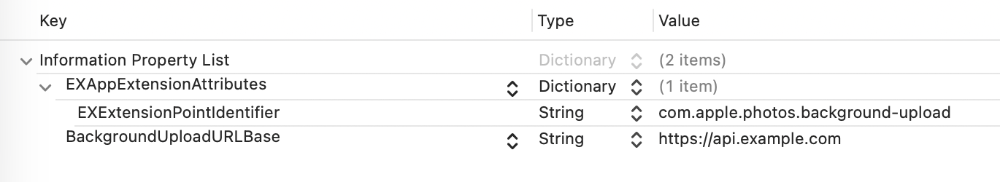
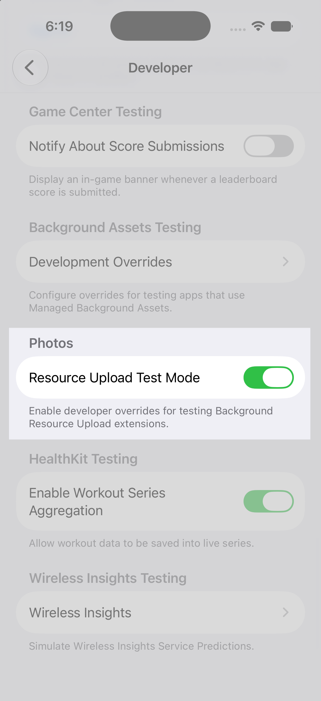

> Navigation: [Technologies](../technologies.md) · [PhotoKit](../photokit.md) · [Photos](../photos.md)

# Uploading asset resources in the background

<sub>Article</sub>

Enable reliable cloud backup for photo library assets with background processing.

## Overview

PhotoKit’s Background Resource Upload extension enables apps to deliver seamless cloud backup experiences. The system manages uploads on your app’s behalf, processing them in the background even when people switch to other apps or lock their devices. The system calls your extension to process uploads when conditions allow, scheduling work based on factors such as network availability, power state, and device activity.

The async [PHBackgroundResourceUploadJobExtension](../photos/phbackgroundresourceuploadjobextension.md) protocol is available on iOS 27.0, macOS 27.0, and Mac Catalyst 27.0. On iOS 26.1, the feature is available through [PHBackgroundResourceUploadExtension](../photos/phbackgroundresourceuploadextension.md), which is deprecated as of iOS 27.

> [!note] Note
> In iOS, this feature isn’t available in Simulator; test on a physical device.

## Create and configure the extension target

To add an upload extension to your app, begin by adding a new target:

1. In Xcode, choose File \> New \> Target.
2. In the dialog, select the iOS tab, choose the Generic Extension template, and click Next.
3. Specify a name for your extension, such as `BackgroundUploadExtension`.
4. Click Finish.

Open your extension’s main Swift file and replace its contents with a class that adopts the [PHBackgroundResourceUploadJobExtension](../photos/phbackgroundresourceuploadjobextension.md) protocol:

```swift
import Photos
import ExtensionFoundation
import Synchronization

@main
class BackgroundUploadExtension: PHBackgroundResourceUploadJobExtension {
    required init() {}

    func processJobs() async -> PHBackgroundResourceUploadProcessingResult {
        // Process upload jobs.
        return .completed
    }

    func willTerminate() async {
        // Prepare for termination.
    }
}
```

> [!note] Note
> In macOS and Mac Catalyst, [PHBackgroundResourceUploadJobExtension](../photos/phbackgroundresourceuploadjobextension.md) is the only available protocol; adopt it for new code on iOS 27 and later.

The extension conforms to this protocol by adopting the following methods:

- **[processJobs()](<../photos/phbackgroundresourceuploadjobextension/processjobs().md>)** — Performs asset resource uploads by creating and managing upload jobs.
- **[willTerminate()](<../photos/phbackgroundresourceuploadjobextension/willterminate().md>)** — Handles notification of the extension’s termination to interrupt processing and perform cleanup.

In the Info pane in Xcode, make the following changes:

- Expand the `EXAppExtensionAttributes` dictionary and change its `EXExtensionPointIdentifier` value to `com.apple.photos.background-upload`. This identifier registers your extension with the system’s background upload infrastructure.
- Add a new top-level key named `BackgroundUploadURLBase` of type `String`, and set its value to the base URL for your upload server, such as `https://api.example.com`. The system requires this key for network access validation.



> [!note] Note
> Your extension also needs photo library authorization to access assets. Ensure your host app requests the appropriate authorization level before enabling the extension. For more information, see [Delivering an Enhanced Privacy Experience in Your Photos App](delivering-an-enhanced-privacy-experience-in-your-photos-app.md).

## Enable the extension

Before the system can call your extension, your host app must explicitly enable it by calling [- setUploadJobExtensionEnabled:error:](<../photos/phphotolibrary/setuploadjobextensionenabled(__).md>) on the shared photo library instance. Your app must have full library access before enabling the extension. Call [+ requestAuthorizationForAccessLevel:handler:](<../photos/phphotolibrary/requestauthorization(for_handler_).md>) with the `.readWrite` access level and verify the status is `.authorized`.

The following example shows how to enable the background upload extension in your host app:

```swift
let library = PHPhotoLibrary.shared()

// Request full library access first.
let status = await PHPhotoLibrary.requestAuthorization(for: .readWrite)
guard status == .authorized else {
    // Handle unauthorized state.
    return
}

// Enable the upload extension.
do {
    try library.setUploadJobExtensionEnabled(true)
    print("Extension enabled successfully")
} catch {
    print("Failed to enable extension: \(error)")
}
```

Check the [uploadJobExtensionEnabled](../photos/phphotolibrary/uploadjobextensionenabled.md) property to verify the extension’s current state. To stop background processing, call the [- setUploadJobExtensionEnabled:error:](<../photos/phphotolibrary/setuploadjobextensionenabled(__).md>) method with a value of `false`.

> [!important] Important
> The extension processes uploads only while enabled. Disable the extension when a person signs out or disables cloud sync in your app.

## Process upload jobs

The system calls your extension’s [processJobs()](<../photos/phbackgroundresourceuploadjobextension/processjobs().md>) method when upload work is available. A typical implementation first retries failed uploads, then acknowledges completed or failed uploads to free resources, and finally creates new upload jobs for unprocessed assets.

[processJobs()](<../photos/phbackgroundresourceuploadjobextension/processjobs().md>) is declared `async` but does not require asynchronous work. An extension with synchronous upload logic can return a value directly. When calling async helpers such as [data(for:)](<../foundation/urlsession/data(for_).md>), use `await` as usual.

```swift
func processJobs() async -> PHBackgroundResourceUploadProcessingResult {
    do {
        // Retry any failed jobs.
        try await retryFailedJobs()

        // Acknowledge completed jobs to free up the inflight job limit.
        try await acknowledgeCompletedJobs()

        // Create new upload jobs for unprocessed assets.
        try await createNewUploadJobs()

        return .completed
    } catch PHPhotosError.limitExceeded {
        // Reached the inflight job limit; return `.processing`.
        return .processing
    } catch {
        // Other errors.
        return .failure
    }
}
```

After performing your processing, return an appropriate [PHBackgroundResourceUploadProcessingResult](../photos/phbackgroundresourceuploadprocessingresult.md) value to indicate your extension’s state:

- **[PHBackgroundResourceUploadProcessingResult.completed](../photos/phbackgroundresourceuploadprocessingresult/completed.md)** — Your extension finishes processing all jobs and no pending work remains. The system enters monitoring mode for library changes.
- **[PHBackgroundResourceUploadProcessingResult.processing](../photos/phbackgroundresourceuploadprocessingresult/processing.md)** — Work is in progress. The system calls [processJobs()](<../photos/phbackgroundresourceuploadjobextension/processjobs().md>) again to continue processing. Return this value during initial library uploads when you have remaining assets to process.
- **[PHBackgroundResourceUploadProcessingResult.failure](../photos/phbackgroundresourceuploadprocessingresult/failure.md)** — An unrecoverable error occurs. The system logs the error and may retry later.

Handle [limitExceeded](../photos/phphotoserror-swift.struct/limitexceeded.md) by returning `.processing` to pause until space becomes available. When [- fetchPersistentChangesSinceToken:error:](<../photos/phphotolibrary/fetchpersistentchanges(since_).md>) throws [persistentChangeTokenExpired](../photos/phphotoserror-swift.struct/persistentchangetokenexpired.md), the system has pruned history past your saved token; discard the saved token, return `.processing`, and re-sync on the next invocation. For other errors, log the details and return `.failure`.

> [!important] Important
> The system enforces a limit on inflight jobs. When you reach this limit, job creation throws [limitExceeded](../photos/phphotoserror-swift.struct/limitexceeded.md). Acknowledge completed jobs to free up space.

## Retry failed jobs

Network issues or temporary server problems can cause upload failures. Your extension can retry jobs in the `.failed` state that haven’t exceeded the retry limit. Retrying jobs recovers from transient errors without manual intervention.

Inspect the underlying error using the [error](../photos/phassetresourceuploadjob/error.md) property and access any headers your server returns using the [responseHeaderFields](../photos/phassetresourceuploadjob/responseheaderfields.md).

Fetch retry-able jobs by calling the [+ fetchJobsWithAction:options:](<../photos/phassetresourceuploadjob/fetchjobs(action_options_).md>) method with the [PHAssetResourceUploadJobActionRetry](../photos/phassetresourceuploadjob/action/retry.md) action, shown here:

```swift
private func retryFailedJobs() async throws {
    let library = PHPhotoLibrary.shared()
    let retryableJobs = PHAssetResourceUploadJob.fetchJobs(action: .retry, options: nil)

    for i in 0..<retryableJobs.count {
        let job = retryableJobs.object(at: i)

        // Inspect the error to determine whether to retry or acknowledge the upload job.
        if let error = job.error as? URLError,
            error.code == .badServerResponse ||
            error.code == .userAuthenticationRequired {
            // Permanent error; acknowledge instead of retrying.
            try await library.performChanges {
                guard let request = PHAssetResourceUploadJobChangeRequest(for: job) else {
                    return
                }
                request.acknowledge()
            }
            continue
        }

        try await library.performChanges {
            guard let request = PHAssetResourceUploadJobChangeRequest(for: job) else {
                return
            }

            // Option 1: Retry with the original destination.
            request.retry(destination: nil)

            // Option 2: Provide a new destination; for example, with refreshed authorization.
            // let newDestination = buildDestination(forUploadJob: job)
            // request.retry(destination: newDestination)
        }
    }
}
```

Because [PHFetchResult](../photos/phfetchresult.md) doesn’t conform to [Sequence](../swift/sequence.md), use index-based enumeration instead. All job mutations must occur within a [- performChanges:completionHandler:](<../photos/phphotolibrary/performchanges(__completionhandler_).md>) or [- performChangesAndWait:error:](<../photos/phphotolibrary/performchangesandwait(__).md>) change block.

Inspect the [error](../photos/phassetresourceuploadjob/error.md) property to distinguish transient network errors from permanent server errors. For transient errors such as timeouts or connection loss, retry the job. For permanent errors such as bad server responses or authentication failures, acknowledge the job instead.

Passing `nil` to [- retryWithDestination:](<../photos/phassetresourceuploadjobchangerequest/retry(destination_).md>) uses the original destination URL. Alternatively, you can retry the job with a different destination. Retrying a job counts toward the inflight job limit. If you’ve reached the limit, the retry throws [limitExceeded](../photos/phphotoserror-swift.struct/limitexceeded.md). Acknowledge completed jobs to free capacity before retrying.

## Acknowledge completed jobs

Jobs that you create consume space in the extension’s inflight job limit. Whether a job succeeds or fails, acknowledge it to free capacity for new uploads.

Before acknowledging a job, inspect the [responseHeaderFields](../photos/phassetresourceuploadjob/responseheaderfields.md) property to access any response headers returned from your server.

Fetch acknowledgeable jobs by calling the [+ fetchJobsWithAction:options:](<../photos/phassetresourceuploadjob/fetchjobs(action_options_).md>) method with the [PHAssetResourceUploadJobActionAcknowledge](../photos/phassetresourceuploadjob/action/acknowledge.md) action, shown here:

```swift
private func acknowledgeCompletedJobs() async throws {
    let library = PHPhotoLibrary.shared()
    let completedJobs = PHAssetResourceUploadJob.fetchJobs(action: .acknowledge, options: nil)

    for i in 0..<completedJobs.count {
        let job = completedJobs.object(at: i)

        // Inspect response headers before acknowledging.
        if let headers = job.responseHeaderFields,
           let resource = PHAssetResource.assetResource(forUploadJob: job) {
            let serverId = headers["x-server-resource-id"]
            recordServerMetadata(for: resource, serverId: serverId)
        }

        try await library.performChanges {
            // Attempt to create a change request, and return early on failure.
            guard let request = PHAssetResourceUploadJobChangeRequest(for: job) else { return }
            // Acknowledge the job.
            request.acknowledge()
        }
    }
}
```

> [!note] Note
> [resource](../photos/phassetresourceuploadjob/resource.md) is deprecated in iOS 27 and unavailable in macOS and Mac Catalyst. Use [+ assetResourceForUploadJob:](<../photos/phassetresource/assetresource(foruploadjob_).md>) to fetch the associated asset resource.

After confirming each job’s upload status with your server or local tracking system, acknowledge it by calling the [- acknowledge](<../photos/phassetresourceuploadjobchangerequest/acknowledge().md>) method on the change request. Acknowledging a job removes it from system tracking and frees up space for new jobs. You must acknowledge completed jobs before creating new ones when you reach the inflight limit.

> [!note] Note
> Before acknowledging a job, update your app’s tracking system to record its success or failure. After acknowledging the job, its record is no longer available from PhotoKit.

## Inspect response headers and errors

The system copies any response headers returned by your server to the [responseHeaderFields](../photos/phassetresourceuploadjob/responseheaderfields.md) property for jobs in the [PHAssetResourceUploadJobStateSucceeded](../photos/phassetresourceuploadjob/state-swift.enum/succeeded.md) or [PHAssetResourceUploadJobStateFailed](../photos/phassetresourceuploadjob/state-swift.enum/failed.md) state. The system normalizes header field names to lowercase for consistent lookup.

The system populates the [error](../photos/phassetresourceuploadjob/error.md) property for jobs in the [PHAssetResourceUploadJobStateFailed](../photos/phassetresourceuploadjob/state-swift.enum/failed.md) state. It provides detailed information about why the upload failed, including network, server, or system errors. The error uses standard [NSURLErrorDomain](../foundation/nsurlerrordomain.md) codes, letting you distinguish transient failures such as timeouts from permanent failures such as authentication errors.

> [!note] Note
> The system sanitizes the error it provides, so it can differ from the actual URL response error.

## Cancel inflight jobs

You can cancel redundant background upload jobs to avoid duplicate uploads. You can only cancel jobs in the [PHAssetResourceUploadJobStateRegistered](../photos/phassetresourceuploadjob/state-swift.enum/registered.md) or [PHAssetResourceUploadJobStatePending](../photos/phassetresourceuploadjob/state-swift.enum/pending.md) state.

Fetch cancellable jobs by calling the [+ fetchJobsWithAction:options:](<../photos/phassetresourceuploadjob/fetchjobs(action_options_).md>) method with the [PHAssetResourceUploadJobActionProcess](../photos/phassetresourceuploadjob/action/process.md) action, shown here:

```swift
private func cancelRedundantJobs() throws {
    let library = PHPhotoLibrary.shared()
    let inProgressJobs = PHAssetResourceUploadJob.fetchJobs(action: .process, options: nil)

    for i in 0..<inProgressJobs.count {
        let job = inProgressJobs.object(at: i)

        // Check if this job is redundant. This example checks to see if the resource has already
        // been uploaded with another process.
        guard let resource = PHAssetResource.assetResource(forUploadJob: job),
              isAlreadyUploaded(resource.assetLocalIdentifier) else { continue }

        try library.performChangesAndWait {
            guard let request = PHAssetResourceUploadJobChangeRequest(for: job) else { return }
            request.cancel()
        }
    }
}
```

Canceled jobs transition to the [PHAssetResourceUploadJobStateCancelled](../photos/phassetresourceuploadjob/state-swift.enum/cancelled.md) state, and the system automatically acknowledges them, so they don’t consume space in the inflight job limit.

## Create upload jobs

Creating upload jobs queues asset resources for background upload to your server. Each job requires a destination URL request that specifies the upload destination.

If needed, you can use the returned change request job to access the [placeholderForCreatedAssetResourceUploadJob](../photos/phassetresourceuploadjobchangerequest/placeholderforcreatedassetresourceuploadjob.md) and obtain the local identifier for the job.

Create jobs after acknowledging completed ones and when you detect new assets in the library. Your extension needs a mechanism to identify which assets require upload, typically by maintaining a list of processed asset identifiers.

```swift
private func createNewUploadJobs() async throws {
    let library = PHPhotoLibrary.shared()

    // Get unprocessed asset resources. Your implementation should query
    // for assets and filter against the uploaded set.
    let resources = getUnprocessedResources(from: library)

    // Return early if there are no resources to process.
    guard !resources.isEmpty else { return }

    for resource in resources {
        try await library.performChanges {
            // Create a URL request for your server.
            let url = URL(string: "https://api.example.com/upload")!
            var request = URLRequest(url: url)
            request.httpMethod = "POST"

            // Add authentication.
            request.setValue("YOUR_AUTH_TOKEN", forHTTPHeaderField: "Authorization")

            // Add resource metadata.
            request.setValue(resource.originalFilename, forHTTPHeaderField: "X-Filename")

            // Create the upload job.
            let jobRequest = PHAssetResourceUploadJobChangeRequest.creationRequestForJob(
                destination: request,
                resource: resource
            )

            // Use the placeholder to obtain the local identifier for tracking.
            if let jobID = jobRequest.placeholderForCreatedAssetResourceUploadJob?.localIdentifier {
                trackUploadJob(resource.assetLocalIdentifier, jobID: jobID)
            }
        }
    }
}
```

Job creation must occur within a change block. Each [PHAssetResource](../photos/phassetresource.md) you upload requires a separate job. The destination [URLRequest](../foundation/urlrequest.md) contains your server endpoint, authentication headers, and any metadata needed for upload processing.

The system enforces an inflight job limit. When you exceed that limit, [- performChanges:completionHandler:](<../photos/phphotolibrary/performchanges(__completionhandler_).md>) throws a [limitExceeded](../photos/phphotoserror-swift.struct/limitexceeded.md) exception. When job creation throws [limitExceeded](../photos/phphotoserror-swift.struct/limitexceeded.md), acknowledge completed jobs first, then retry creation.

Return `.processing` from the [processJobs()](<../photos/phbackgroundresourceuploadjobextension/processjobs().md>) method to have the system call your extension again once the upload jobs have completed.

While your extension has jobs to process, keep the job queue filled to its limit to ensure efficient processing.

> [!important] Important
> Your extension needs a mechanism to track which assets you’ve already processed and detect new ones. This typically involves persistent storage shared between your app and extension using an app group. Use [- fetchPersistentChangesSinceToken:error:](<../photos/phphotolibrary/fetchpersistentchanges(since_).md>) with a [PHPersistentChangeToken](../photos/phpersistentchangetoken.md) to track your progress.

## Create download-only jobs

The system automatically downloads asset resources before processing. However, if your workflow requires local access to the resource before submitting a processing job, the system can download the resource locally without uploading it.

Use [+ creationRequestForDownloadJobWithResource:](<../photos/phassetresourceuploadjobchangerequest/creationrequestfordownloadjob(resource_).md>) to create a job that downloads a resource from iCloud without uploading it to a server. Download-only jobs follow the same life cycle as upload jobs, transitioning through [PHAssetResourceUploadJobStateRegistered](../photos/phassetresourceuploadjob/state-swift.enum/registered.md), [PHAssetResourceUploadJobStatePending](../photos/phassetresourceuploadjob/state-swift.enum/pending.md), and eventually [PHAssetResourceUploadJobStateSucceeded](../photos/phassetresourceuploadjob/state-swift.enum/succeeded.md) or [PHAssetResourceUploadJobStateFailed](../photos/phassetresourceuploadjob/state-swift.enum/failed.md) states.

```swift
private func createDownloadJobs(for resources: [PHAssetResource]) throws {
    let library = PHPhotoLibrary.shared()

    try library.performChangesAndWait {
        for resource in resources {
            let jobRequest = PHAssetResourceUploadJobChangeRequest.creationRequestForDownloadJob(
                resource: resource
            )

            if let jobID = jobRequest.placeholderForCreatedAssetResourceUploadJob?.localIdentifier {
                trackDownloadJob(resource.assetLocalIdentifier, jobID: jobID)
            }
        }
    }
}
```

When acknowledging completed jobs, check the [type](../photos/phassetresourceuploadjob/type-swift.property.md) property to distinguish download-only jobs from upload jobs. Download-only jobs have a type of [PHAssetResourceUploadJobTypeDownloadOnly](../photos/phassetresourceuploadjob/type-swift.enum/downloadonly.md).

> [!note] Note
> The system may purge downloaded resources due to disk space constraints. After a download-only job succeeds, process the resource promptly or create an upload job to send it to your server.

## Handle extension termination

The system calls [willTerminate()](<../photos/phbackgroundresourceuploadjobextension/willterminate().md>) before suspending or terminating your extension. Use this method to stop current work and clean up resources.

The system may call this method at any time, including while the extension processes uploads. Ensure the extension exits the process method promptly after receiving a termination notification.

```swift
class BackgroundUploadExtension: PHBackgroundResourceUploadJobExtension {
    private let isCancelled = Atomic<Bool>(false)

    func processJobs() async -> PHBackgroundResourceUploadProcessingResult {
        // Perform work, checking cancellation periodically.
        if isCancelled.load(ordering: .acquiring) {
            return .processing
        }

        // Return `.completed` if you've processed all items, and
        // `.processing` if there are resources remaining to upload.
        return .completed
    }

    func willTerminate() async {
        // Signal the `processJobs()` method to exit.
        isCancelled.store(true, ordering: .releasing)

        // Perform any necessary clean up.
    }
}
```

Upon receiving a termination notification, cancel any in-progress work such as network requests or database operations. Set cancellation flags that the [processJobs()](<../photos/phbackgroundresourceuploadjobextension/processjobs().md>) method checks periodically to interrupt processing.

> [!important] Important
> The system manages the extension life cycle and may terminate your extension at any time due to resource pressure. When the extension restarts, the system calls [processJobs()](<../photos/phbackgroundresourceuploadjobextension/processjobs().md>) again. Design your implementation to handle interruption at any point.

## Support resumable uploads

The background upload system supports resumable uploads according to the draft [IETF Resumable Uploads for HTTP](https://datatracker.ietf.org/doc/draft-ietf-httpbis-resumable-upload/) protocol. Resumable uploads allow interrupted transfers to continue from the point of interruption, rather than restarting from the beginning. This reduces redundant data transfer for large asset resources uploaded over unreliable network connections.

## Respond to preflight requests

Before the system begins an upload, it checks whether your server supports the resumable upload protocol. The system sends an HTTP `OPTIONS` request to your upload endpoint to perform this preflight capability check. Your server must respond appropriately to indicate its support.

When your server supports resumable uploads, respond to the `OPTIONS` request with a `200 (OK)` status code and include the `Upload-Limit` header field in the response:

```
OPTIONS /upload HTTP/1.1
Host: api.example.com

HTTP/1.1 200 OK
Upload-Limit: 107374182400
```

The `Upload-Limit` header indicates the maximum upload size your server supports. If your server doesn’t support resumable uploads, respond with a `501 (Not Implemented)` status code.

The system caches this capability check, so your server handles fewer `OPTIONS` requests.

## Issue an informational response during uploads

For each upload, your server must also provide in-band feature detection by sending a `104 (Upload Resumption Supported)` informational response while the client uploads the request body.

When your server receives an upload request and has created the upload resource, send the `104` informational response before the final response. Include the `Location` header set to the upload URL:

```
POST /upload HTTP/1.1
Host: api.example.com
Upload-Incomplete: ?0
Content-Length: 52428800

HTTP/1.1 104 Upload Resumption Supported
Location: https://api.example.com/upload/b530ce8ff

HTTP/1.1 201 Created
Location: https://api.example.com/upload/b530ce8ff
Upload-Offset: 52428800
```

The `104` informational response serves as the authoritative signal that the server supports resumable uploads. If an upload is interrupted after the client receives this response, the system automatically resumes the transfer from where it stopped.

> [!note] Note
> Your API must include both the `OPTIONS` preflight check and the `104` informational response.

## Test your extension with Developer Mode

The system waits for ideal conditions before running your extension, which makes it hard to test. Developer Mode runs your extension promptly so you can exercise your upload logic without waiting. When you enable it, the system removes the extension runtime limit on each invocation, skips the backoff delays between scheduling attempts, and raises the scheduling priority of your extension. Developer Mode is available in iOS 27.0, macOS 27.0, and Mac Catalyst 27.0.

Developer Mode takes effect only when both your host app and your extension are built and run from Xcode with a development provisioning profile and development signing. You can toggle Developer Mode at any point during a run session, but enabling it before you build and run ensures the first invocation of your extension runs with the elevated priorities.

In iOS, open Settings, choose Developer, and enable Resource Upload Test Mode under the Photos section.



In macOS and Mac Catalyst, there’s no Settings toggle. Set the Developer Mode value from the terminal instead:

```
defaults write com.apple.photos.shareddefaults backgroundResourceUploadDeveloperMode -bool YES
```

To turn Developer Mode off again, remove the value:

```
defaults delete com.apple.photos.shareddefaults backgroundResourceUploadDeveloperMode
```

> [!important] Important
> Developer Mode relaxes the scheduling and runtime limits only while it’s on. In production, the system applies the standard runtime limit on the extension and schedules uploads based on network, power, and device conditions. Test your extension with Developer Mode off to confirm it behaves correctly under normal conditions.

While testing, keep the following in mind to help your extension run reliably under the system’s normal constraints:

- Keep your extension’s memory footprint low. The system terminates extensions that use excessive memory.
- Return [PHBackgroundResourceUploadProcessingResult.processing](../photos/phbackgroundresourceuploadprocessingresult/processing.md) only when your extension makes progress, such as acknowledging completed jobs or creating new ones.
- Keep each invocation within the runtime limit. Design your extension to make incremental progress across invocations rather than looping to process your entire library in a single invocation.

> [!note] Note
> Developer Mode changes only how the system schedules and runs your extension. It doesn’t change the upload process itself, which remains subject to external conditions such as network bandwidth and your server’s availability and support for the upload protocol.

## See Also

### Related Documentation

- [PHBackgroundResourceUploadJobExtension](../photos/phbackgroundresourceuploadjobextension.md) _(beta)_
- [+ assetResourceForUploadJob:](<../photos/phassetresource/assetresource(foruploadjob_).md>) — Returns the asset resource associated with the given upload job. _(beta)_

### Background resource upload extensions

- [PHBackgroundResourceUploadExtension](../photos/phbackgroundresourceuploadextension.md) _(deprecated)_
- [PHAssetResourceUploadJob](../photos/phassetresourceuploadjob.md) — An object that represents a request to upload an asset resource.
- [PHAssetResourceUploadJobChangeRequest](../photos/phassetresourceuploadjobchangerequest.md) — Use within an application’s `com.apple.photos.background-upload` extension to create and change [PHAssetResourceUploadJob](../photos/phassetresourceuploadjob.md) records.
