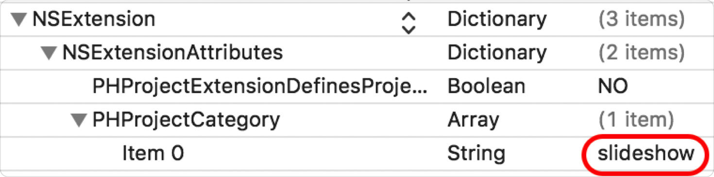

> Navigation: [Technologies](../technologies.md) · [PhotosUI](../photosui.md)

# PHProjectExtensionController

<sub>Protocol</sub>

A protocol defining the life cycle and supported types of project extensions.

<sub>macOS</sub>

```swift
protocol PHProjectExtensionController : NSObjectProtocol
```

## Overview

The principal view controller for a Photos project extension must conform to this protocol. Methods in this protocol define the basic life cycle of the extension controller. They allow you to define any number of project types that your extension supports; the Photos app displays these project types to the user as choices when creating a new project. To enable this entry point into the extension, the Info.plist must include this key/value pair in its `NSExtensionAttributes` dictionary.



Once enabled, Photos asks the extension for its list of supported project types. The option that the user selects when creating a project is passed to the extension as an attribute of [PHProjectInfo](phprojectinfo.md).

## Relationships

- **Inherits From**: [NSObjectProtocol](../objectivec/nsobjectprotocol.md)

## Topics

### Tracking the Project Extension Life Cycle

- [- beginProjectWithExtensionContext:projectInfo:completion:](<phprojectextensioncontroller/beginproject(with_projectinfo_completion_).md>) — Provides an opportunity to customize the initial state when the user creates a project using the extension.
- [- finishProjectWithCompletionHandler:](<phprojectextensioncontroller/finishproject(completionhandler_).md>) — Provides an opportunity to perform cleanup when a user switches away from the project or terminates the extension.
- [- resumeProjectWithExtensionContext:completion:](<phprojectextensioncontroller/resumeproject(with_completion_).md>) — Provides an opportunity to restore or refresh the user interface when the user returns to a previously created project.
- [- typeDescriptionDataSourceForCategory:invalidator:](<phprojectextensioncontroller/typedescriptiondatasource(for_invalidator_).md>) — Fetches the type description data source to provide the user with more information about the project extension category.

### Defining Supported Project Types

- [supportedProjectTypes](phprojectextensioncontroller/supportedprojecttypes.md) — An array of project types the extension supports. _(deprecated)_

## See Also

### macOS Photos Project Extensions

- [Creating a Slideshow Project Extension for Photos](../photokit/creating-a-slideshow-project-extension-for-photos.md) — Augment the macOS Photos app with extensions that support project creation.
- [PHProject](../photos/phproject.md) — A representation of a Photos app project extension.
- [PHProjectInfo](phprojectinfo.md) — Information about the project extension.
- [PHProjectExtensionContext](phprojectextensioncontext.md) — An object that provides Photos project extensions with access to the underlying project, as well as to the user’s photo library for editing.
- [PHProjectElement](phprojectelement.md) — The superclass for all element objects.
- [PHProjectSection](phprojectsection.md) — A collection of content representing curated asset and text elements.
- [PHProjectRegionOfInterest](phprojectregionofinterest.md) — A representation of a region of interest in a photo asset.
- [PHProjectChangeRequest](../photos/phprojectchangerequest.md) — A request to change asset data in a Photos project extension.
- [PHProjectCategory](phprojectcategory.md) — A representation of Photos project extension categories.
