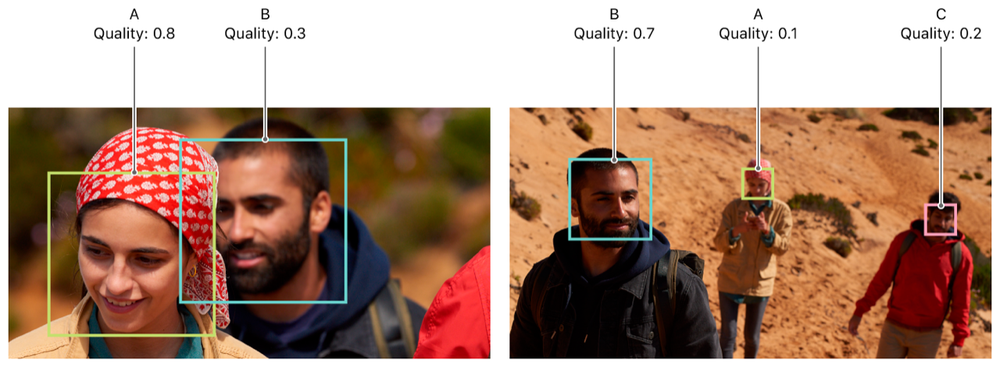

> Navigation: [Technologies](../../technologies.md) · [PhotosUI](../../photosui.md) · [PHProjectRegionOfInterest](../phprojectregionofinterest.md)

# quality

<sub>Instance Property</sub>

The region’s quality.

<sub>macOS</sub>

```swift
var quality: Double { get }
```

## Discussion

The `quality` score represents the quality of the region of interest in the individual asset, based on factors like sharpness, visibility, and prominence in the photo. Values range from `0` to `1`, with a default of `0.5`. Different regions of interest with the same identifier may have different quality values. If a project must choose between multiple assets containing the same region of interest, use the `quality` metric to choose the best representative.



## See Also

### Determining Region Properties

- [rect](rect.md) — The rectangle representing the region’s location.
- [identifier](identifier-swift.property.md) — The region’s unique identifier.
- [weight](weight.md) — The face region’s weight.
