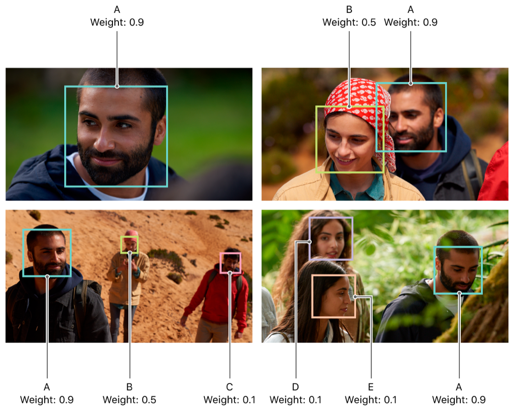

> Navigation: [Technologies](../../technologies.md) · [PhotosUI](../../photosui.md) · [PHProjectRegionOfInterest](../phprojectregionofinterest.md)

# weight

<sub>Instance Property</sub>

The face region’s weight.

<sub>macOS</sub>

```swift
var weight: Double { get }
```

## Discussion

The `weight` of a region of interest represents the pervasiveness of the face across the project as a whole. All regions of interest with the same identifier share the same weight. The values range between `0` and `1`. The default value is `0.5`.



For projects focused on animation or transition between assets, focus on the regions with the highest weight to ensure that your presentation features areas of greatest interest to the user.

## See Also

### Determining Region Properties

- [rect](rect.md) — The rectangle representing the region’s location.
- [identifier](identifier-swift.property.md) — The region’s unique identifier.
- [quality](quality.md) — The region’s quality.
