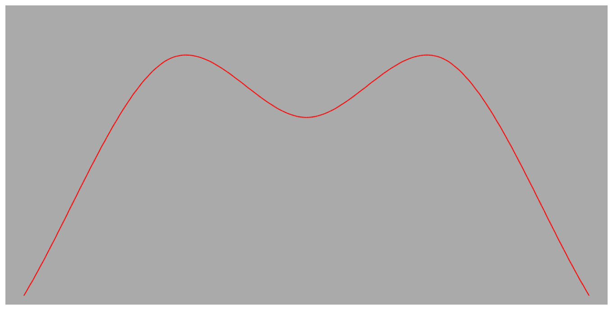

> Navigation: [Technologies](../../technologies.md) · [Core Animation](../../quartzcore.md) · [CAAnimationCalculationMode](../caanimationcalculationmode.md)

# cubic

<sub>Type Property</sub>

Smooth spline calculation between keyframe values.

<sub>iOS, iPadOS, Mac Catalyst, macOS, tvOS, visionOS</sub>

```swift
static let cubic: CAAnimationCalculationMode
```

## Discussion

Intermediate frames are computed using a Catmull-Rom spline that passes through the keyframes. You can adjust the shape of the spline by specifying an optional set of tension, continuity, and bias values, which modify the spline using the standard Kochanek-Bartels form.

The following code shows how to create a keyframe animation object using cubic interpolation.

```swift
let keyframeAnimation = CAKeyframeAnimation(keyPath: "position.y")
keyframeAnimation.calculationMode = kCAAnimationCubic
keyframeAnimation.keyTimes = [0, 0.25, 0.5, 0.75, 1]
keyframeAnimation.values = [310, 60, 120, 60, 310]
```

A layer animated with the keyframe animation created by the code above and with linearly interpolated horizontal movement would describe a path similar to the following figure.



## See Also

### Constants

- [kCAAnimationLinear](linear.md) — Simple linear calculation between keyframe values.
- [kCAAnimationDiscrete](discrete.md) — Each keyframe value is used in turn, no interpolated values are calculated.
- [kCAAnimationPaced](paced.md) — Linear keyframe values are interpolated to produce an even pace throughout the animation.
- [kCAAnimationCubicPaced](cubicpaced.md) — Cubic keyframe values are interpolated to produce an even pace throughout the animation.
