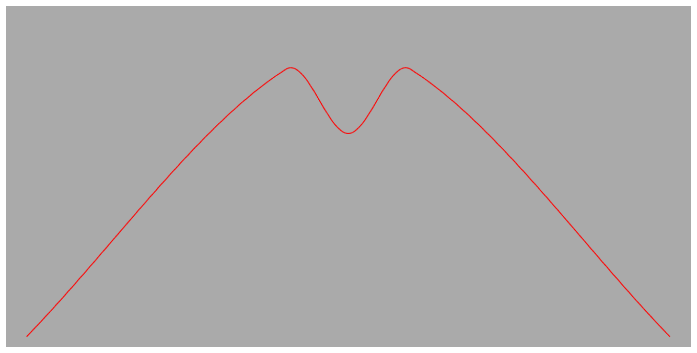

> Navigation: [Technologies](../../technologies.md) · [Core Animation](../../quartzcore.md) · [CAAnimationCalculationMode](../caanimationcalculationmode.md)

# cubicPaced

<sub>Type Property</sub>

Cubic keyframe values are interpolated to produce an even pace throughout the animation.

<sub>iOS, iPadOS, Mac Catalyst, macOS, tvOS, visionOS</sub>

```swift
static let cubicPaced: CAAnimationCalculationMode
```

## Discussion

`kCAAnimationCubicPaced` gives a linearly interpolated animation, but [keyTimes](../cakeyframeanimation/keytimes.md) and [timingFunction](../caanimation/timingfunction.md) are ignored and keyframe times are automatically generated to give the animation a constant velocity.

The following code shows how to create a keyframe animation object using paced cubic interpolation.

```objc
let keyframeAnimation = CAKeyframeAnimation(keyPath: "position.y")
keyframeAnimation.calculationMode = kCAAnimationCubicPaced
keyframeAnimation.values = [310, 60, 120, 60, 310]
```

A layer animated with the keyframe animation created by the code above and with linearly interpolated horizontal movement would describe a path similar to the following figure.



## See Also

### Constants

- [kCAAnimationLinear](linear.md) — Simple linear calculation between keyframe values.
- [kCAAnimationDiscrete](discrete.md) — Each keyframe value is used in turn, no interpolated values are calculated.
- [kCAAnimationPaced](paced.md) — Linear keyframe values are interpolated to produce an even pace throughout the animation.
- [kCAAnimationCubic](cubic.md) — Smooth spline calculation between keyframe values.
