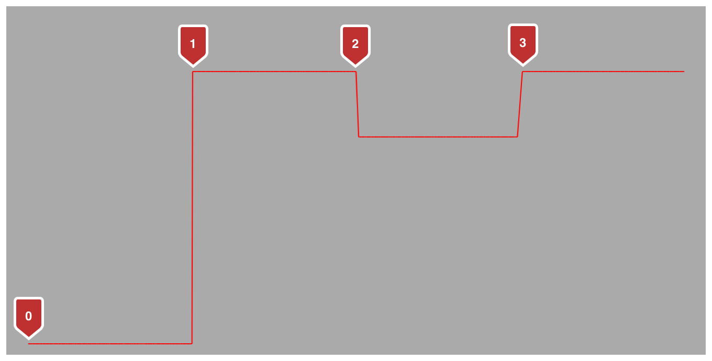

> Navigation: [Technologies](../../technologies.md) · [Core Animation](../../quartzcore.md) · [CAAnimationCalculationMode](../caanimationcalculationmode.md)

# discrete

<sub>Type Property</sub>

Each keyframe value is used in turn, no interpolated values are calculated.

<sub>iOS, iPadOS, Mac Catalyst, macOS, tvOS, visionOS</sub>

```swift
static let discrete: CAAnimationCalculationMode
```

## Discussion

Keyframe animations based on discrete calculation interpolation require one less element in the [values](../cakeyframeanimation/values.md) array than the [keyTimes](../cakeyframeanimation/keytimes.md) array. Each `value / keyTime` pair represents the value from the specified time until the next keyframe.

For example, given the [CAKeyframeAnimation](../cakeyframeanimation.md) created in the following code, the penultimate keyTime, `0.75`, has a related value of `60`. The value of `position.y` will remain at `60` until the animation completes.

```swift
let keyframeAnimation = CAKeyframeAnimation(keyPath: "position.y")
keyframeAnimation.calculationMode = kCAAnimationDiscrete
  
// keyframe 0: (0, 310), keyframe 1: (0.25, 60), keyframe 2: (0.5, 120), keyframe 3: (0.75, 60)
keyframeAnimation.keyTimes = [0, 0.25, 0.5, 0.75, 1]
keyframeAnimation.values = [310, 60, 120, 60]
```

A layer animated with the keyframe animation created by the code above and with linearly interpolated horizontal movement would describe a path similar to the following figure.



## See Also

### Constants

- [kCAAnimationLinear](linear.md) — Simple linear calculation between keyframe values.
- [kCAAnimationPaced](paced.md) — Linear keyframe values are interpolated to produce an even pace throughout the animation.
- [kCAAnimationCubic](cubic.md) — Smooth spline calculation between keyframe values.
- [kCAAnimationCubicPaced](cubicpaced.md) — Cubic keyframe values are interpolated to produce an even pace throughout the animation.
