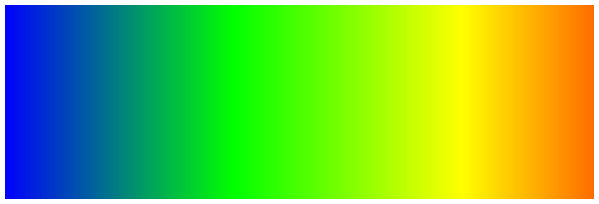

> Navigation: [Technologies](../technologies.md) · [Core Animation](../quartzcore.md)

# CAGradientLayer

<sub>Class</sub>

A layer that draws a color gradient over its background color, filling the shape of the layer.

<sub>iOS, iPadOS, Mac Catalyst, macOS, tvOS, visionOS</sub>

```swift
class CAGradientLayer
```

## Overview

You use a gradient layer to create a color gradient containing an arbitrary number of colors. By default, the colors are spread uniformly across the layer, but you can optionally specify locations for control over the color positions through the gradient.

The following code shows how to create a gradient layer containing four colors that are evenly distributed through the gradient. Rotating the layer by 90° ([pi](../swift/floatingpoint/pi.md) ⁄ `2` radians) gives a horizontal gradient.

```objc
gradientLayer.colors = [UIColor.red.cgColor,
                        UIColor.yellow.cgColor,
                        UIColor.green.cgColor,
                        UIColor.blue.cgColor]
     
gradientLayer.transform = CATransform3DMakeRotation(CGFloat.pi / 2, 0, 0, 1)
```

The following figure shows the appearance of the gradient layer.



## Relationships

- **Inherits From**: [CALayer](calayer.md)

- **Conforms To**: [CAMediaTiming](camediatiming.md), [CVarArg](../swift/cvararg.md), [CustomDebugStringConvertible](../swift/customdebugstringconvertible.md), [CustomStringConvertible](../swift/customstringconvertible.md), [Equatable](../swift/equatable.md), [Hashable](../swift/hashable.md), [NSCoding](../foundation/nscoding.md), [NSObjectProtocol](../objectivec/nsobjectprotocol.md), [NSSecureCoding](../foundation/nssecurecoding.md), [Sendable](../swift/sendable.md), [SendableMetatype](../swift/sendablemetatype.md)

## Topics

### Gradient Style Properties

- [colors](cagradientlayer/colors.md) — An array of `CGColorRef` objects defining the color of each gradient stop. Animatable.
- [locations](cagradientlayer/locations.md) — An optional array of NSNumber objects defining the location of each gradient stop. Animatable.
- [endPoint](cagradientlayer/endpoint.md) — The end point of the gradient when drawn in the layer’s coordinate space. Animatable.
- [startPoint](cagradientlayer/startpoint.md) — The start point of the gradient when drawn in the layer’s coordinate space. Animatable.
- [type](cagradientlayer/type.md) — Style of gradient drawn by the layer.

### Constants

- [Gradient Types](gradient-types.md) — The style of gradient drawn by the layer.

## See Also

### Text, Shapes, and Gradients

- [CATextLayer](catextlayer.md) — A layer that provides simple text layout and rendering of plain or attributed strings.
- [CAShapeLayer](cashapelayer.md) — A layer that draws a cubic Bezier spline in its coordinate space.
