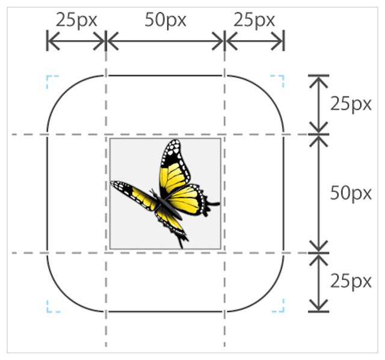
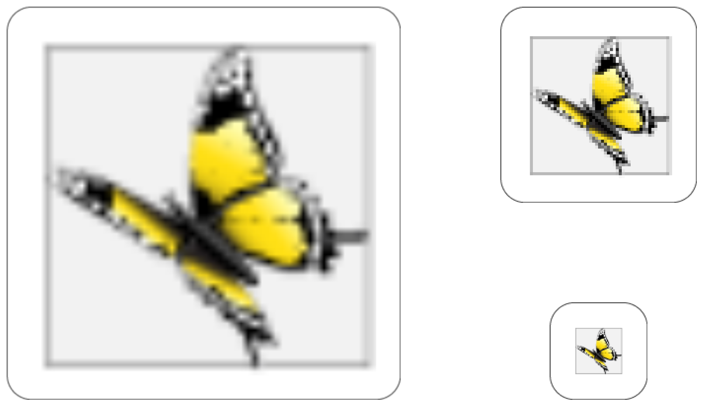
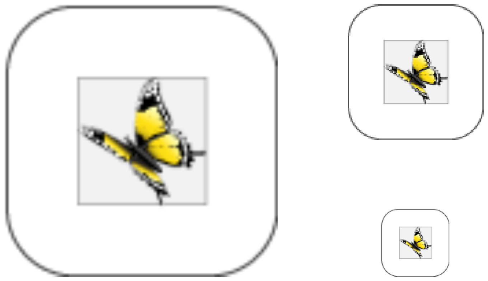

> Navigation: [Technologies](../../technologies.md) · [Core Animation](../../quartzcore.md) · [CALayer](../calayer.md)

# contentsCenter

<sub>Instance Property</sub>

The rectangle that defines how the layer contents are scaled if the layer’s contents are resized. Animatable.

<sub>iOS, iPadOS, Mac Catalyst, macOS, tvOS, visionOS</sub>

```swift
var contentsCenter: CGRect { get set }
```

## Discussion

You can use this property to subdivide the layer’s content into a 3x3 grid. The value in this property specifies the location and size of the center rectangle in that grid. If the layer’s [contentsGravity](contentsgravity.md) property is set to one of the resizing modes, resizing the layer causes scaling to occur differently in each rectangle of the grid. The center rectangle is stretched in both dimensions, the top-center and bottom-center rectangles are stretched only horizontally, the left-center and right-center rectangles are stretched only vertically, and the four corner rectangles are not stretched at all. Therefore, you can use this technique to implement stretchable backgrounds or images using a three-part or nine-part image.

The value in this property is set to the unit rectangle `(0.0,0.0) (1.0,1.0)` by default, which causes the entire image to scale in both dimensions. If you specify a rectangle that extends outside the unit rectangle, the result is undefined. The rectangle you specify is applied only after the [contentsRect](contentsrect.md) property has been applied to the image.

The following code shows how you can create a [CALayer](../calayer.md) with the button image shown in the following figure set as its contents. The corner radii of the button image are set to one quarter of the length of its side.



By setting the layer’s [contentsCenter](contentscenter.md) to `(0.25,0.25) (0.5,0.5)`, the button’s corner radius remains unchanged, whatever size the layer is set to.

```swift
let buttonImage = UIImage(named: "button.png")
let layer = CALayer()
     
layer.contents = buttonImage?.cgImage
layer.contentsCenter = CGRect(x: 0.25, y: 0.25, width: 0.5, height: 0.5);
```

The following figure shows the layer created in the previous code resized to 400 x 400, 200 x 200 and 100 x 100 points.



The following figure shows the layer at the same sizes but without explicitly setting the layer’s [contentsCenter](contentscenter.md): the entire button image is scaled, including the rounded corners.



> [!note] Note
> If the width or height of the rectangle in this property is very small or `0`, the value is implicitly changed to the width or height of a single source pixel centered at the specified location.

## See Also

### Related Documentation

- [contentsGravity](contentsgravity.md) — A constant that specifies how the layer’s contents are positioned or scaled within its bounds.

### Providing the layer’s content

- [contents](contents.md) — An object that provides the contents of the layer. Animatable.
- [contentsRect](contentsrect.md) — The rectangle, in the unit coordinate space, that defines the portion of the layer’s contents that should be used. Animatable.
- [- display](<display().md>) — Reloads the content of this layer.
- [- drawInContext:](<draw(in_).md>) — Draws the layer’s content using the specified graphics context.
