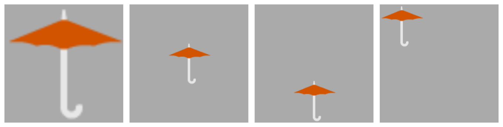

> Navigation: [Technologies](../../technologies.md) · [Core Animation](../../quartzcore.md) · [CALayer](../calayer.md)

# contentsGravity

<sub>Instance Property</sub>

A constant that specifies how the layer’s contents are positioned or scaled within its bounds.

<sub>iOS, iPadOS, Mac Catalyst, macOS, tvOS, visionOS</sub>

```swift
var contentsGravity: CALayerContentsGravity { get set }
```

## Discussion

The possible values for this property are listed in [Contents Gravity Values](../contents-gravity-values.md).

The default value of this property is [kCAGravityResize](../calayercontentsgravity/resize.md).

> [!important] Important
> The naming of contents gravity constants is based on the direction of the vertical axis.  If you are using gravity constants with a vertical component, e.g. [kCAGravityTop](../calayercontentsgravity/top.md), you should also check the layer’s [- contentsAreFlipped](<contentsareflipped().md>). When this is [true](../../swift/true.md), [kCAGravityTop](../calayercontentsgravity/top.md) aligns contents to the bottom of the layer and [kCAGravityBottom](../calayercontentsgravity/bottom.md) aligns content to the top of the layer.
>
> The default coordinate system for views in macOS and iOS differ in the orientation of the vertical axis: in macOS, the default coordinate system has its origin at the lower left of the drawing area and positive values extend up from it, and in iOS the default coordinate system has its origin at the upper left of the drawing area and positive values extend down from it.
>
> For more information, see [Coordinate system](https://developer.apple.com/library/content/documentation/General/Conceptual/Devpedia-CocoaApp/CoordinateSystem.html).

[Figure 1](/documentation/quartzcore/calayer/1410872-contentsgravity#2851774) shows four examples of the effect of setting different values for a layer’s [contentsGravity](contentsgravity.md) property.



1. Contents gravity is [kCAGravityResize](../calayercontentsgravity/resize.md) - the default
2. Contents gravity is [kCAGravityCenter](../calayercontentsgravity/center.md)
3. Contents gravity is [- contentsAreFlipped](<contentsareflipped().md>) `?` [kCAGravityTop](../calayercontentsgravity/top.md) : [kCAGravityBottom](../calayercontentsgravity/bottom.md)
4. Contents gravity is [- contentsAreFlipped](<contentsareflipped().md>) `?` [kCAGravityBottomLeft](../calayercontentsgravity/bottomleft.md) : [kCAGravityTopLeft](../calayercontentsgravity/topleft.md)

## See Also

### Modifying the layer’s appearance

- [Contents Gravity Values](../contents-gravity-values.md) — The contents gravity constants specify the position of the content object when the layer bounds is larger than the bounds of the content object. They are used by the [contentsGravity](contentsgravity.md) property.
- [opacity](opacity.md) — The opacity of the receiver. Animatable.
- [hidden](ishidden.md) — A Boolean indicating whether the layer is displayed. Animatable.
- [masksToBounds](maskstobounds.md) — A Boolean indicating whether sublayers are clipped to the layer’s bounds. Animatable.
- [mask](mask.md) — An optional layer whose alpha channel is used to mask the layer’s content.
- [doubleSided](isdoublesided.md) — A Boolean indicating whether the layer displays its content when facing away from the viewer. Animatable.
- [cornerRadius](cornerradius.md) — The radius to use when drawing rounded corners for the layer’s background. Animatable.
- [maskedCorners](maskedcorners.md)
- [CACornerMask](../cacornermask.md)
- [borderWidth](borderwidth.md) — The width of the layer’s border. Animatable.
- [borderColor](bordercolor.md) — The color of the layer’s border. Animatable.
- [backgroundColor](backgroundcolor.md) — The background color of the receiver. Animatable.
- [shadowOpacity](shadowopacity.md) — The opacity of the layer’s shadow. Animatable.
- [shadowRadius](shadowradius.md) — The blur radius (in points) used to render the layer’s shadow. Animatable.
- [shadowOffset](shadowoffset.md) — The offset (in points) of the layer’s shadow. Animatable.
