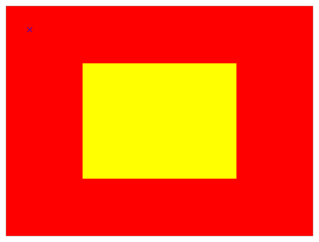

> Navigation: [Technologies](../../technologies.md) · [Core Animation](../../quartzcore.md) · [CALayer](../calayer.md)

# convert(_:to:)

<sub>Instance Method</sub>

Converts the point from the receiver’s coordinate system to the specified layer’s coordinate system.

<sub>iOS, iPadOS, Mac Catalyst, macOS, tvOS, visionOS</sub>

```swift
func convert(_ p: CGPoint, to l: CALayer?) -> CGPoint
```

## Parameters

- `p` — A point specifying a location in the coordinate system of `l`.

- `l` — The layer into whose coordinate system `p` is to be converted. The receiver and `l` must share a common parent layer. This parameter may be `nil`.

## Return Value

The point converted to the coordinate system of `layer`.

## Discussion

If you specify `nil` for the `l` parameter, this method returns the original point added to the layer’s frame’s origin.

The following example shows code that creates two layers, `redLayer` and `yellowLayer`. `yellowLayer` is scaled so that it is half of its original size.

```swift
let layerFrame = CGRect(x: 0, y: 0, width: 640, height: 480)
     
let redLayer = CALayer()
redLayer.frame = layerFrame
redLayer.backgroundColor = UIColor.red.cgColor
     
let yellowLayer = CALayer()
yellowLayer.frame = layerFrame
yellowLayer.backgroundColor = UIColor.yellow.cgColor
yellowLayer.transform = CATransform3DMakeScale(0.5, 0.5, 1)
```

The following figure shows the two layers and an overlaid point (rendered as a blue cross) with a position of `(50.0, 50.0)` in the red layer’s coordinate system.



The following code shows how you can find the coordinates of that point in the yellow layer’s coordinate system.

```swift
let position = CGPoint(x: 50, y: 50)
print(redLayer.convert(position, to: yellowLayer))
```

## See Also

### Mapping between coordinate and time spaces

- [- convertPoint:fromLayer:](<convert(__from_)-8kl76.md>) — Converts the point from the specified layer’s coordinate system to the receiver’s coordinate system.
- [- convertRect:fromLayer:](<convert(__from_)-4kx9l.md>) — Converts the rectangle from the specified layer’s coordinate system to the receiver’s coordinate system.
- [- convertRect:toLayer:](<convert(__to_)-tly5.md>) — Converts the rectangle from the receiver’s coordinate system to the specified layer’s coordinate system.
- [- convertTime:fromLayer:](<converttime(__from_).md>) — Converts the time interval from the specified layer’s time space to the receiver’s time space.
- [- convertTime:toLayer:](<converttime(__to_).md>) — Converts the time interval from the receiver’s time space to the specified layer’s time space
